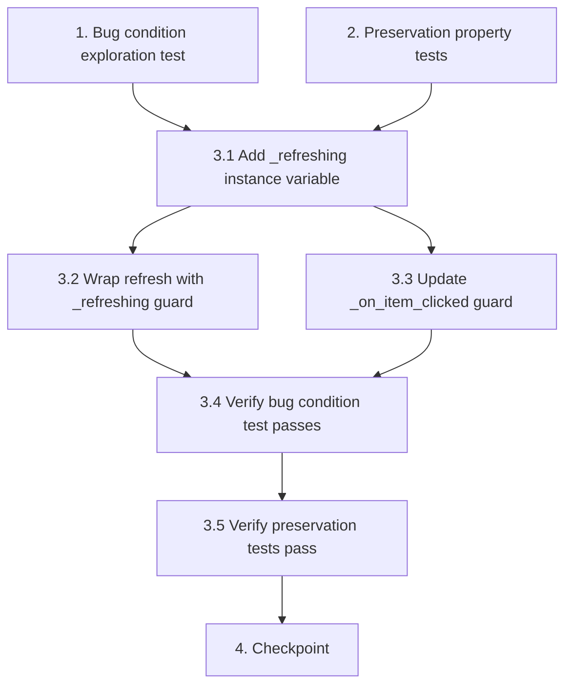

# Implementation Plan

## Overview

This plan fixes the bug where saving a person in the "Redigera Person" dialog unexpectedly changes the active person in the diagram to the first person in the person list. The root cause is that `PersonListPanel.refresh()` triggers Qt's `currentItemChanged` signal during tree widget rebuild, and `_on_item_clicked` emits `person_selected` without guarding against refresh-driven selection changes.

The fix introduces a `_refreshing` guard flag in `PersonListPanel` that suppresses `person_selected` emission during refresh cycles, analogous to the existing `_syncing_from_diagram` guard.

The approach follows the exploratory bugfix workflow: write bug condition tests first (expect failure on unfixed code), write preservation tests (expect pass on unfixed code), then implement the fix and verify both test sets pass.

## Tasks

- [x] 1. Write bug condition exploration test
  - **Property 1: Bug Condition** - Refresh Emits person_selected During Save
  - **CRITICAL**: This test MUST FAIL on unfixed code - failure confirms the bug exists
  - **DO NOT attempt to fix the test or the code when it fails**
  - **NOTE**: This test encodes the expected behavior - it will validate the fix when it passes after implementation
  - **GOAL**: Surface counterexamples that demonstrate the bug exists
  - **Scoped PBT Approach**: Scope the property to the concrete failing case: call `refresh()` on a `PersonListPanel` that has an active selection and verify `person_selected` is NOT emitted
  - Test that for all inputs satisfying isBugCondition(input):
    - Create a `PersonListPanel` with multiple persons loaded
    - Set person B as the current/active item in the tree widget
    - Connect a signal spy to `person_selected`
    - Call `refresh()` (simulating what happens after a save operation)
    - Assert `person_selected` was NOT emitted during refresh (from Bug Condition in design: `refresh()` triggers `currentItemChanged` → `_on_item_clicked` → `person_selected` emission)
    - Assert the diagram's active person remains unchanged (Expected Behavior: active person preserved)
  - Run test on UNFIXED code
  - **EXPECTED OUTCOME**: Test FAILS (this is correct - it proves the bug exists)
  - Document counterexamples found:
    - `person_selected` signal IS emitted during `refresh()` with an ID that differs from the previously active person
    - `_tree_widget.clear()` inside `_update_list_widget()` triggers `currentItemChanged` signal
    - No guard flag prevents `_on_item_clicked` from emitting during programmatic refresh
  - Mark task complete when test is written, run, and failure is documented
  - _Requirements: 1.1, 1.2, 2.1, 2.2_

- [x] 2. Write preservation property tests (BEFORE implementing fix)
  - **Property 2: Preservation** - Click-to-Select and Diagram Sync Behavior
  - **IMPORTANT**: Follow observation-first methodology
  - **Step 1 — Observe behavior on UNFIXED code for non-buggy inputs:**
    - Observe: Single-clicking a person in the person list emits `person_selected` with that person's ID
    - Observe: `select_person_from_diagram(person_id)` selects the person in the tree without emitting `person_selected` (guarded by `_syncing_from_diagram`)
    - Observe: Double-clicking a person in the list opens the person editor for that person
    - Observe: Context menu actions on persons work correctly
    - Observe: Keyboard navigation in the tree widget triggers selection changes normally
  - **Step 2 — Write property-based tests capturing observed behavior:**
    - Property: For all user-initiated single-clicks on a person item (outside of refresh and outside of diagram sync), `person_selected` is emitted with the clicked person's ID
    - Property: For all `select_person_from_diagram(person_id)` calls, the person is selected in the tree but `person_selected` is NOT emitted
    - Property: For all person lists of varying sizes, clicking any valid person item emits the correct person ID
    - Property: For all interleaving sequences of clicks and diagram syncs, each operation respects its respective guard behavior
  - **Step 3 — Verify tests PASS on unfixed code**
  - Run tests on UNFIXED code
  - **EXPECTED OUTCOME**: Tests PASS (this confirms baseline behavior to preserve)
  - Mark task complete when tests are written, run, and passing on unfixed code
  - _Requirements: 3.1, 3.2, 3.3, 3.4_

- [x] 3. Fix for active person change on save

  - [x] 3.1 Add `_refreshing` instance variable to `PersonListPanel.__init__`
    - In `slaktbusken/ui/person_list_panel.py`, in `__init__()`, add `self._refreshing = False` alongside the existing `self._syncing_from_diagram = False`
    - This flag will indicate when the panel is in a programmatic refresh cycle
    - _Bug_Condition: isBugCondition(input) where refresh() triggers currentItemChanged during programmatic list rebuild_
    - _Expected_Behavior: Guard flag available to suppress person_selected emission during refresh_
    - _Preservation: No behavioral change at this step — flag is just initialized_
    - _Requirements: 2.1, 2.2_

  - [x] 3.2 Wrap `refresh()` body with `_refreshing` guard (try/finally)
    - In `slaktbusken/ui/person_list_panel.py`, modify `refresh()` method
    - Set `self._refreshing = True` before the existing refresh logic
    - Wrap the body in try/finally to ensure `self._refreshing = False` is always restored
    - ```python
      def refresh(self) -> None:
          self._refreshing = True
          try:
              # existing refresh logic (calls _apply_current_view → _update_list_widget)
          finally:
              self._refreshing = False
      ```
    - _Bug_Condition: isBugCondition(input) where refresh() is called after person save_
    - _Expected_Behavior: _refreshing is True during entire refresh cycle, False after completion_
    - _Preservation: refresh() still rebuilds the list correctly; only signal emission is suppressed_
    - _Requirements: 2.1, 2.2, 3.3_

  - [x] 3.3 Update `_on_item_clicked` to check `_refreshing` guard
    - In `slaktbusken/ui/person_list_panel.py`, modify `_on_item_clicked()` method
    - Add `self._refreshing` check alongside the existing `self._syncing_from_diagram` check:
    - ```python
      def _on_item_clicked(self, current, previous):
          if self._syncing_from_diagram or self._refreshing:
              return
          # existing logic to emit person_selected
      ```
    - _Bug_Condition: isBugCondition(input) where _on_item_clicked is triggered by currentItemChanged during refresh_
    - _Expected_Behavior: person_selected NOT emitted when _refreshing is True_
    - _Preservation: person_selected still emitted for genuine user clicks (when _refreshing is False)_
    - _Requirements: 2.1, 2.2, 3.1_

  - [x] 3.4 Verify bug condition exploration test now passes
    - **Property 1: Expected Behavior** - Save Preserves Active Person
    - **IMPORTANT**: Re-run the SAME test from task 1 - do NOT write a new test
    - The test from task 1 encodes the expected behavior
    - When this test passes, it confirms:
      - `person_selected` is no longer emitted during `refresh()` calls
      - The active person in the diagram remains unchanged after save
      - The `_refreshing` guard correctly suppresses spurious signal emissions
    - Run bug condition exploration test from step 1
    - **EXPECTED OUTCOME**: Test PASSES (confirms bug is fixed)
    - _Requirements: 2.1, 2.2_

  - [x] 3.5 Verify preservation tests still pass
    - **Property 2: Preservation** - Click-to-Select and Diagram Sync Unchanged
    - **IMPORTANT**: Re-run the SAME tests from task 2 - do NOT write new tests
    - Run preservation property tests from step 2
    - **EXPECTED OUTCOME**: Tests PASS (confirms no regressions)
    - Confirm:
      - Single-clicking a person still emits `person_selected` with correct ID
      - `select_person_from_diagram()` still suppresses signal via `_syncing_from_diagram`
      - Double-click still opens person editor
      - Context menu actions still work
    - _Requirements: 3.1, 3.2, 3.3, 3.4_

- [~] 4. Checkpoint - Ensure all tests pass
  - Run full test suite to ensure no regressions
  - Verify bug condition exploration test passes (active person no longer changes on save)
  - Verify preservation tests pass (click-to-select and diagram sync behavior unchanged)
  - Verify `add_standalone_person` in `app.py` still correctly sets new unaffiliated person as active (it calls `set_active_person(saved.id)` after refresh, which is unaffected by the guard)
  - Ensure all tests pass, ask the user if questions arise.

## Task Dependency Graph

```json
{
  "waves": [
    {
      "wave": 1,
      "tasks": ["1", "2"],
      "description": "Write exploration and preservation tests before fix"
    },
    {
      "wave": 2,
      "tasks": ["3.1"],
      "description": "Add _refreshing instance variable"
    },
    {
      "wave": 3,
      "tasks": ["3.2", "3.3"],
      "description": "Implement refresh guard and update _on_item_clicked"
    },
    {
      "wave": 4,
      "tasks": ["3.4", "3.5"],
      "description": "Verify tests pass after fix"
    },
    {
      "wave": 5,
      "tasks": ["4"],
      "description": "Final checkpoint - all tests pass"
    }
  ]
}
```



## Notes

- The exploration test (task 1) is expected to FAIL on unfixed code — this confirms the bug exists. Do not treat failure as an error.
- Preservation tests (task 2) must PASS on unfixed code before any changes are made, establishing the behavioral baseline.
- The fix is minimal: only 3 lines of logic changes (flag init, try/finally wrapper, guard condition update) in a single file (`person_list_panel.py`).
- The existing `add_standalone_person` flow in `app.py` already calls `panel.set_active_person(saved.id)` AFTER `refresh()`, so it will continue to correctly activate new unaffiliated persons since that explicit call happens after the refresh guard is released.
- The `_refreshing` guard is analogous to the existing `_syncing_from_diagram` guard — same pattern, different trigger condition.
- Property-based testing with Hypothesis is used for preservation tests to generate varied person list states and click sequences, providing stronger guarantees than manual unit tests alone.
- Tasks 3.4 and 3.5 re-run existing tests from tasks 1 and 2 — no new tests should be written at that stage.
