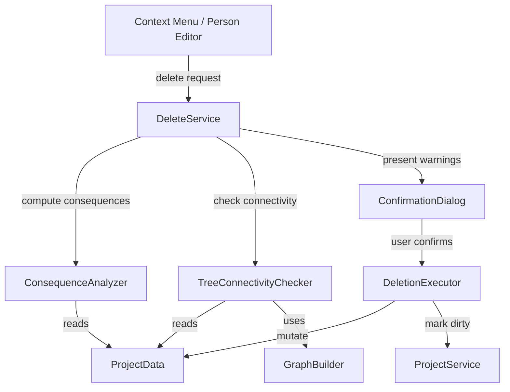
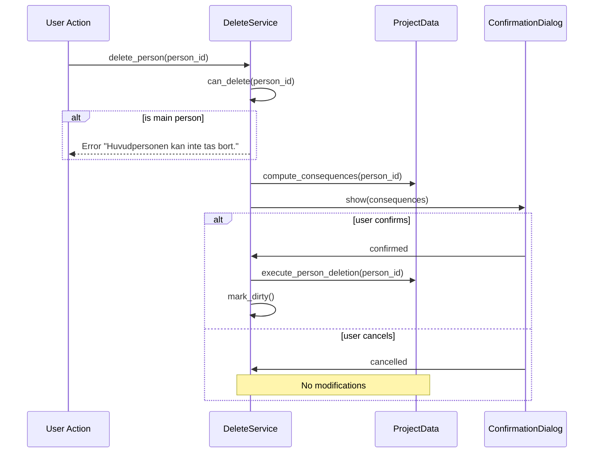

# Design Document: Delete Person

## Overview

This feature implements a complete person deletion operation in Släktbusken that cascades through all related data structures while preserving media items and maintaining data integrity. The Delete_Service provides both an analysis phase (computing deletion consequences and warnings) and an execution phase (performing the actual deletion with cascading cleanup).

The design separates concerns into:
- **Consequence analysis**: Pure function that computes what will happen if a person is deleted
- **Tree connectivity check**: Graph reachability analysis to detect potential disconnection
- **Deletion execution**: Stateful operation that modifies ProjectData in place
- **Confirmation UI**: Dialog presenting warnings and requiring explicit user consent

## Architecture



The architecture follows the existing service pattern in Släktbusken: a service class coordinates between pure computation functions and stateful project modification. The `DeleteService` orchestrates the flow, delegating computation to pure helper functions and UI interaction to the confirmation dialog.

### Design Decisions

1. **Pure analysis functions**: Event classification and consequence computation are implemented as pure functions operating on `ProjectData`. This makes them trivially testable with property-based tests.

2. **Single-pass deletion**: The execution phase performs all mutations in a single pass through the data structures to avoid intermediate inconsistent states.

3. **Graph reachability via BFS**: Tree connectivity uses breadth-first search from `main_person_id`, which scales well for the 50,000-person requirement (O(V+E) complexity).

4. **Reuse of existing `RelationshipGraph`**: The tree connectivity check leverages the existing `graph_builder.py` infrastructure rather than building a parallel graph representation.

## Components and Interfaces

### DeleteService

Location: `slaktbusken/services/delete_service.py`

```python
@dataclass
class DeletionConsequences:
    """Results of analyzing what a deletion would affect."""
    person_name: str
    exclusive_events: list[Event]
    family_events: list[Event]
    non_family_shared_events: list[Event]
    affected_families: list[Family]
    would_disconnect: bool
    disconnected_person_count: int


class DeleteService:
    """Service for deleting a person and cascading cleanup."""

    def __init__(self, project_service: ProjectService) -> None: ...

    def can_delete(self, person_id: str) -> tuple[bool, str]:
        """Check if a person can be deleted. Returns (allowed, error_message)."""
        ...

    def compute_consequences(self, person_id: str) -> DeletionConsequences:
        """Analyze what would happen if the person were deleted. Pure computation."""
        ...

    def execute_deletion(self, person_id: str) -> None:
        """Execute the deletion with all cascading cleanup. Marks project dirty."""
        ...
```

### Consequence Analysis (pure functions)

Location: `slaktbusken/services/delete_service.py` (module-level functions)

```python
def classify_events(
    person_id: str, data: ProjectData
) -> tuple[list[Event], list[Event], list[Event]]:
    """Classify events into (exclusive, family, non_family_shared).
    
    - Exclusive: all participants reference only person_id (or empty participants)
    - Family: event_id appears in any Family.event_ids AND person is participant
    - Non-family shared: person is one of 2+ participants, not in any family event_ids
    """
    ...


def find_affected_families(person_id: str, data: ProjectData) -> list[Family]:
    """Find all families where the person appears as partner, child, or in links."""
    ...


def compute_disconnection(
    person_id: str, data: ProjectData
) -> tuple[bool, int]:
    """Check if removing person_id would disconnect the tree.
    
    Returns (would_disconnect, disconnected_person_count).
    Skips check if main_person_id is None or equals person_id.
    """
    ...
```

### Deletion Executor (pure function on data)

```python
def execute_person_deletion(person_id: str, data: ProjectData) -> None:
    """Remove person and cascade through all data structures.
    
    Mutates data in place. Order of operations:
    1. Remove exclusive events from data.events
    2. Remove family events from data.events
    3. Remove deleted event IDs from all family.event_ids
    4. Remove person's Participant from remaining shared events
    5. Remove events left with zero participants
    6. Remove person from family partners lists
    7. Remove person from family children lists  
    8. Remove ParentChildLinks referencing person
    9. Remove empty families (zero partners AND zero children)
    10. Clean media: remove from mentioned_person_ids, linked_entities, annotations
    11. Remove person from data.persons
    """
    ...
```

### ConfirmationDialog

Location: `slaktbusken/ui/dialogs/delete_person_dialog.py`

```python
class DeletePersonDialog(QDialog):
    """Confirmation dialog for person deletion with warnings."""

    def __init__(
        self,
        parent: QWidget,
        consequences: DeletionConsequences,
    ) -> None: ...

    def _build_warning_text(self) -> str:
        """Build Swedish-language warning text from consequences.
        
        Shows at most 10 events, with overflow indicator for remaining count.
        """
        ...
```

### Warning Text Builder (pure function)

```python
def build_warning_lines(
    consequences: DeletionConsequences,
    max_events: int = 10,
) -> list[str]:
    """Build warning lines for the confirmation dialog.
    
    Returns Swedish-language warning lines. Caps event listing at max_events,
    appending "...och N till" when more exist.
    """
    ...
```

## Data Models

The feature operates on existing data models without introducing new persistent structures. The only new data structure is `DeletionConsequences`, which is transient (computed per deletion request).

### DeletionConsequences

```python
@dataclass
class DeletionConsequences:
    person_name: str                    # Primary display name of the person
    exclusive_events: list[Event]       # Events to be deleted (person is sole participant)
    family_events: list[Event]          # Family events to be deleted
    non_family_shared_events: list[Event]  # Events where participant entry is removed
    affected_families: list[Family]     # Families requiring cleanup
    would_disconnect: bool              # Whether deletion disconnects the tree
    disconnected_person_count: int      # Number of persons that would be disconnected
```

### Data Flow During Deletion



### Existing Models Referenced

| Model | Role in Deletion |
|-------|-----------------|
| `Person` | The entity being deleted |
| `Event` | Classified as exclusive/family/shared; deleted or cleaned |
| `Participant` | Removed from events referencing deleted person |
| `Family` | Partners, children, parent_child_links cleaned; removed if empty |
| `FamilyPartner` | Removed if person_id matches deleted person |
| `ParentChildLink` | Removed if child_id or parent_id matches deleted person |
| `MediaItem` | Preserved; person references cleaned from mentioned_person_ids, linked_entities, annotations |
| `ProjectMetadata` | Read for main_person_id check |

## Correctness Properties

*A property is a characteristic or behavior that should hold true across all valid executions of a system—essentially, a formal statement about what the system should do. Properties serve as the bridge between human-readable specifications and machine-verifiable correctness guarantees.*

### Property 1: No Dangling Person References After Deletion

*For any* valid ProjectData containing a deletable person (not main person), after executing deletion of that person, no Event in the resulting ProjectData shall contain a Participant with person_id equal to the deleted person's id, no Family shall contain a FamilyPartner with that person_id, no Family shall contain that id in its children list, and no ParentChildLink shall have child_id or parent_id equal to that id.

**Validates: Requirements 1.2, 2.1, 3.1, 3.3, 4.1, 4.2, 4.3, 8.1, 8.2, 8.3, 8.4**

### Property 2: Media Integrity After Deletion

*For any* valid ProjectData containing a deletable person, after executing deletion: the media list length shall be unchanged, no MediaItem shall contain the deleted person's id in mentioned_person_ids, no MediaItem shall contain a LinkedEntity with entity_type "person" and entity_id equal to the deleted person's id, no MediaItem shall contain an Annotation with entity_type "person" and entity_id equal to the deleted person's id, and all MediaItem.mentioned_names lists shall be identical to their pre-deletion state.

**Validates: Requirements 5.1, 5.2, 5.3, 5.4, 5.5**

### Property 3: No Empty Families After Deletion

*For any* valid ProjectData containing a deletable person, after executing deletion, no Family remaining in ProjectData shall have both an empty partners list and an empty children list.

**Validates: Requirements 1.5, 4.4**

### Property 4: Events From Removed Families Are Preserved

*For any* valid ProjectData where deleting a person causes a Family to be removed (due to becoming empty), the Event records that were referenced by that Family's event_ids shall still exist in ProjectData.events (unless those events were independently removed as exclusive or family events of the deleted person).

**Validates: Requirements 4.5**

### Property 5: Main Person Cannot Be Deleted

*For any* valid ProjectData where main_person_id is set and the target person's id equals main_person_id, the deletion operation shall be rejected without modifying ProjectData.

**Validates: Requirements 1.4**

### Property 6: Round-Trip Integrity After Deletion

*For any* valid ProjectData containing a deletable person, after executing deletion, serializing the resulting ProjectData to JSON and deserializing it back shall produce a ProjectData object equivalent to the post-deletion state.

**Validates: Requirements 8.6**

### Property 7: Event Classification Is Exhaustive and Correct

*For any* valid ProjectData and any person in it, the event classification function shall partition all events involving that person into exactly three mutually exclusive categories (exclusive, family, non-family shared), and: exclusive events have only the target person as participant (or empty participants), family events appear in at least one Family.event_ids, and non-family shared events have 2+ participants including the target and do not appear in any Family.event_ids.

**Validates: Requirements 1.1, 2.3, 2.4**

### Property 8: Tree Disconnection Detection Correctness

*For any* valid ProjectData with main_person_id set (and target ≠ main person), the disconnection computation shall return true if and only if removing the target person from the relationship graph makes at least one remaining person unreachable from main_person_id via family partner and parent-child links.

**Validates: Requirements 7.1**

### Property 9: Warning List Caps At 10 Events

*For any* DeletionConsequences with N total family + shared events, the warning text builder shall list at most 10 events and, if N > 10, shall indicate the count of remaining events not shown.

**Validates: Requirements 6.4**

### Property 10: Deleted Person Is Removed From Persons List

*For any* valid ProjectData containing a deletable person, after executing deletion, the person shall not appear in ProjectData.persons, and the persons list length shall be exactly one less than before deletion.

**Validates: Requirements 1.2**

## Error Handling

| Scenario | Handling |
|----------|----------|
| Delete main person | Return error immediately with message "Huvudpersonen kan inte tas bort." No dialog shown. |
| Person ID not found in ProjectData | Raise `ValueError` — indicates a programming error in the caller. |
| No project open | Raise `ProjectNotOpenError` (existing pattern from ProjectService). |
| Connectivity check on large project | Timeout safeguard: BFS with 50,000 nodes completes well within 2s on modern hardware. If somehow exceeded, skip warning and allow deletion. |
| Serialization failure after deletion | Should not occur if deletion preserves valid state. If it does, the dirty flag is already set — user can attempt to save and will see the standard save error. |

## Testing Strategy

### Property-Based Tests (Hypothesis)

The project already uses Hypothesis extensively with strategies defined in `tests/conftest.py`. The delete-person feature will follow the same pattern.

**Library**: Hypothesis (already in project dependencies)
**Configuration**: Minimum 100 iterations per property test (Hypothesis default is 100 examples)
**Location**: `tests/test_services/test_delete_service_properties.py`

Each property test will:
- Use a custom `@st.composite` strategy that generates valid ProjectData with a guaranteed deletable person (not main person, with various event/family configurations)
- Execute the deletion logic
- Assert the property holds

**Tag format**: Each test will be tagged with a comment referencing the design property:
```python
# Feature: delete-person, Property 1: No dangling person references after deletion
```

### Unit Tests (Example-Based)

**Location**: `tests/test_services/test_delete_service.py`

- Cancel dialog preserves state (Req 1.3, 6.6)
- Main person error message content (Req 1.4)
- Confirmation dialog content with specific scenarios (Req 1.6, 6.1, 6.2, 6.3)
- Warning text formatting (Req 6.1, 6.2, 6.5)
- Connectivity check skipped when no main person set (Req 7.5)
- Connectivity check skipped for main person (Req 7.6)
- Dirty flag set after successful deletion (Req 8.5)

### Integration Tests

**Location**: `tests/test_services/test_delete_service_integration.py`

- End-to-end deletion flow with realistic family tree data
- Deletion of a person with multiple family memberships
- Deletion that triggers empty family removal
- Deletion that disconnects tree section

### Test Strategy Summary

| Test Type | Focus | Count (est.) |
|-----------|-------|--------------|
| Property tests | Universal invariants (Properties 1-10) | 10 |
| Unit tests | Specific scenarios, error paths, UI logic | 12-15 |
| Integration tests | End-to-end flows with realistic data | 4-5 |
