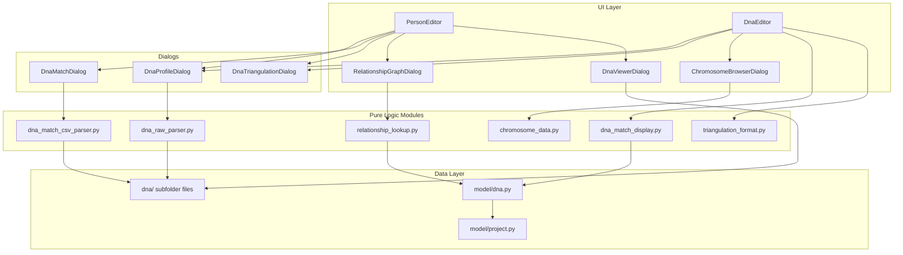

# Design Document: DNA Cluster Enhancements

## Overview

This design covers a set of enhancements to the DNA and cluster section of Släktbusken, a PySide6-based Swedish genealogy desktop application. The changes span data model extensions, UI redesigns, new dialogs, data import/export capabilities, and a relationship probability visualization feature.

The enhancements break down into these functional groups:

1. **Data model extensions** — Combined test type with haplogroups, URL field for companies, raw data file references, match segment file references, removal of admin_status
2. **DNA Editor UI changes** — Tab reordering (remove Segment, swap Kluster/Triangulering), triangulation list display, company logo/URL, profile form simplification, cluster panel redesign, triangulation detail view
3. **New dialogs and views** — Relationship probability graph, DNA data viewer (raw genotype table), chromosome browser
4. **Data import** — Raw DNA file import (AncestryDNA, MyHeritage), CSV match data paste import
5. **External data storage** — Raw DNA and match segment files stored in `dna/` subfolder separate from the main project JSON

### Design Rationale

The design prioritizes:
- **Separation of concerns**: Pure data logic (parsing, formatting, filtering, probability lookup) lives in dedicated modules testable without UI
- **Consistent editing patterns**: All entity editing uses modal dialogs (existing pattern in the codebase)
- **Flat data model**: Maintains existing dataclass-based flat lists in ProjectData
- **External file storage**: Large DNA files (raw data ~20 MB, segment data) stored outside the project JSON to keep it manageable

## Architecture



### Key Architectural Decisions

1. **Pure logic modules for testability**: Parsing (AncestryDNA, MyHeritage, CSV match data), relationship probability lookup, chromosome length data, and triangulation formatting are implemented as pure functions — no Qt dependencies — enabling property-based testing.

2. **External file storage via `dna/` subfolder**: Raw DNA data and match segment data are stored as JSON files in a `dna/` folder relative to the project file. The main project JSON holds only a file reference string. This keeps the project file small while supporting ~20 MB raw data files.

3. **Virtual scrolling for large datasets**: The DNA Viewer uses `QAbstractTableModel` with lazy data loading to handle up to 1,000,000 rows without blocking the UI thread.

4. **Static data for Shared cM Project**: Relationship probability data is embedded as a Python dictionary (static lookup table) rather than fetched from an external service, ensuring offline operation and deterministic behavior.

5. **GRCh37/hg19 chromosome lengths as constants**: Chromosome bar widths in the chromosome browser are calculated from well-known reference genome lengths stored as a constant dictionary.

## Components and Interfaces

### New Pure Logic Modules

#### `slaktbusken/services/relationship_lookup.py`

```python
"""Relationship probability lookup based on The Shared cM Project v4.0."""

@dataclass
class RelationshipProbability:
    """A single relationship type with its probability for a given cM value."""
    relationship: str  # e.g., "Parent/Child", "Half Sibling", "1C"
    probability: float  # 0.0–100.0 percentage

def get_relationship_probabilities(shared_cm: float) -> list[RelationshipProbability]:
    """Return relationship probabilities for a given shared cM value.
    
    Args:
        shared_cm: The shared centimorgan value (1–3500 range).
    
    Returns:
        List of relationships with probability > 0%, sorted by probability descending.
        Empty list if shared_cm is 0 or outside the dataset range.
    """
    ...
```

#### `slaktbusken/services/dna_raw_parser.py`

```python
"""Parsers for raw DNA genotype data files (AncestryDNA, MyHeritage)."""

@dataclass
class RawSnpRecord:
    """A single SNP genotype record."""
    rsid: str
    chromosome: str
    position: int
    alleles: str  # e.g., "AG", "CC", "--"

@dataclass
class ParseResult:
    """Result of parsing a raw DNA file."""
    records: list[RawSnpRecord]
    skipped_rows: int
    format_detected: str  # "ancestrydna" or "myheritage"

def detect_format(file_path: Path) -> str | None:
    """Detect the raw DNA file format. Returns format name or None if unrecognized."""
    ...

def parse_ancestrydna(file_path: Path) -> ParseResult:
    """Parse an AncestryDNA tab-delimited raw data file."""
    ...

def parse_myheritage(file_path: Path) -> ParseResult:
    """Parse a MyHeritage CSV raw data file."""
    ...

def parse_raw_dna_file(file_path: Path) -> ParseResult:
    """Auto-detect format and parse a raw DNA file. Raises ValueError if unrecognized."""
    ...
```

#### `slaktbusken/services/dna_match_csv_parser.py`

```python
"""Parser for pasted MyHeritage match CSV data."""

@dataclass
class MatchSegmentRecord:
    """A single match segment parsed from CSV data."""
    chromosome: str
    start_position: int
    end_position: int
    start_rsid: str
    end_rsid: str
    centimorgans: float
    snp_count: int

@dataclass
class MatchCsvParseResult:
    """Result of parsing pasted CSV match data."""
    segments: list[MatchSegmentRecord]
    match_name: str  # "Match Name" column value from first data row
    skipped_rows: int

def parse_match_csv(text: str) -> MatchCsvParseResult:
    """Parse MyHeritage match CSV text. Raises ValueError if format unrecognized."""
    ...
```

#### `slaktbusken/services/chromosome_data.py`

```python
"""GRCh37/hg19 chromosome length constants and segment position calculations."""

# Chromosome lengths in base pairs (GRCh37/hg19 reference)
CHROMOSOME_LENGTHS: dict[str, int] = {
    "1": 249250621, "2": 243199373, "3": 198022430, "4": 191154276,
    "5": 180915260, "6": 171115067, "7": 159138663, "8": 146364022,
    "9": 141213431, "10": 135534747, "11": 135006516, "12": 133851895,
    "13": 115169878, "14": 107349540, "15": 102531392, "16": 90354753,
    "17": 81195210, "18": 78077248, "19": 59128983, "20": 63025520,
    "21": 48129895, "22": 51304566, "X": 155270560,
}

def segment_relative_position(start: int, chrom: str) -> float:
    """Calculate relative horizontal position (0.0–1.0) of a segment start on a chromosome."""
    ...

def segment_relative_width(start: int, end: int, chrom: str) -> float:
    """Calculate relative width (0.0–1.0) of a segment on a chromosome."""
    ...
```

#### `slaktbusken/services/triangulation_format.py`

```python
"""Pure formatting functions for triangulation list display."""

def format_triangulation_entry(
    triangulation: DnaTriangulation,
    project_data: ProjectData,
) -> str:
    """Format a triangulation for list display.
    
    Format: "{company} ({x} profiler): {person1}, {person2}, ..."
    Uses "(okänd)" for unresolvable person names.
    """
    ...
```

### Modified Components

#### `slaktbusken/model/dna.py` — Data Model Changes

```python
@dataclass
class DnaCompany:
    id: str
    name: str
    logo_media_id: Optional[str] = None
    description: str = ""
    url: str = ""  # NEW: max 2048 characters

@dataclass
class DnaProfile:
    id: str
    person_id: str
    company_id: str
    test_type: str  # "autosomal", "y-dna", "mtdna", "combined" (NEW value)
    kit_name: str = ""
    kit_id: str = ""
    admin_person_id: Optional[str] = None
    # admin_status REMOVED
    y_haplogroup: str = ""  # NEW: max 50 characters
    mt_haplogroup: str = ""  # NEW: max 50 characters
    raw_data_file: Optional[str] = None  # NEW: filename in dna/ subfolder
    notes: str = ""

@dataclass
class DnaMatch:
    id: str
    profile1_id: str
    profile2_id: str
    shared_cm: float = 0.0
    shared_percentage: float = 0.0
    segment_count: int = 0
    largest_segment_cm: float = 0.0
    match_source: str = "internal"
    segment_file: Optional[str] = None  # NEW: filename in dna/ subfolder
    notes: str = ""
```

#### `slaktbusken/ui/editors/dna_editor.py` — Tab and Layout Changes

- Remove the "Segment" tab entirely from the UI (keep DnaSegment in data model)
- Reorder tabs: Företag → Profiler → Matchningar → Kluster → Triangulering (5 tabs)
- Replace triangulation detail form with a read-only view + "Redigera" button
- Replace cluster tab with split-panel layout (30% left list, 70% right content)
- Update triangulation list to use `format_triangulation_entry()`
- Add "combined" to TEST_TYPES list
- Add haplogroup fields to profile form (conditionally visible based on test type)
- Show person name as read-only label in profile form instead of editable person_id
- Add Person_Search_Widget for admin_person_id
- Remove admin_status combo from profile form
- Add URL field to company form
- Hide logo_media_id text field (keep logo chooser button + preview)

### New Dialogs

#### `slaktbusken/ui/dialogs/relationship_graph_dialog.py`

Modal dialog displaying a horizontal bar chart of relationship probabilities. Uses `matplotlib` embedded in a Qt widget (via `FigureCanvasQTAgg`) or pure QPainter drawing for the bar chart. Includes attribution text for The Shared cM Project.

#### `slaktbusken/ui/dialogs/dna_viewer_dialog.py`

Modal dialog with a `QTableView` backed by a custom `QAbstractTableModel` for lazy/virtual display of up to 1M rows. Includes a search field (max 100 chars) and chromosome filter dropdown.

#### `slaktbusken/ui/dialogs/chromosome_browser_dialog.py`

Modal dialog rendering chromosome bars using `QPainter` on a `QWidget`. Each chromosome is a horizontal bar scaled to its GRCh37 length. Match segments are drawn as colored rectangles with inline cM labels (when ≥40px wide) and tooltips.

### New Widgets

#### `slaktbusken/ui/widgets/person_search_widget.py`

A `QWidget` combining a `QLineEdit` with a `QCompleter` for searching persons by name. Emits a signal when a person is selected. Supports clearing the selection (sets value to None).

## Data Models

### Extended DnaCompany

| Field | Type | Constraints | Notes |
|-------|------|-------------|-------|
| id | str | UUID | Existing |
| name | str | Required | Existing |
| logo_media_id | Optional[str] | | Existing |
| description | str | | Existing |
| **url** | **str** | **Max 2048 chars** | **NEW** |

### Extended DnaProfile

| Field | Type | Constraints | Notes |
|-------|------|-------------|-------|
| id | str | UUID | Existing |
| person_id | str | FK→Person | Existing |
| company_id | str | FK→DnaCompany | Existing |
| test_type | str | "autosomal"\|"y-dna"\|"mtdna"\|**"combined"** | Extended |
| kit_name | str | Max 100 | Existing |
| kit_id | str | Max 50 | Existing |
| admin_person_id | Optional[str] | FK→Person | Existing |
| ~~admin_status~~ | ~~str~~ | | **REMOVED** |
| **y_haplogroup** | **str** | **Max 50 chars** | **NEW** |
| **mt_haplogroup** | **str** | **Max 50 chars** | **NEW** |
| **raw_data_file** | **Optional[str]** | **Filename in dna/ subfolder** | **NEW** |
| notes | str | Max 2000 | Existing |

### Extended DnaMatch

| Field | Type | Constraints | Notes |
|-------|------|-------------|-------|
| id | str | UUID | Existing |
| profile1_id | str | FK→DnaProfile | Existing |
| profile2_id | str | FK→DnaProfile | Existing |
| shared_cm | float | ≥0 | Existing |
| shared_percentage | float | 0–100 | Existing |
| segment_count | int | ≥0 | Existing |
| largest_segment_cm | float | ≥0 | Existing |
| match_source | str | | Existing |
| **segment_file** | **Optional[str]** | **Max 255 chars, filename** | **NEW** |
| notes | str | Max 2000 | Existing |

### Raw DNA Data File Format (JSON in `dna/` subfolder)

```json
{
  "format": "ancestrydna" | "myheritage",
  "record_count": 700000,
  "records": [
    {"rsid": "rs12345", "chromosome": "1", "position": 12345, "alleles": "AG"},
    ...
  ]
}
```

Filename convention: `raw_{profile_id}.json`

### Match Segment Data File Format (JSON in `dna/` subfolder)

```json
[
  {
    "chromosome": "1",
    "start_position": 1000000,
    "end_position": 5000000,
    "start_rsid": "rs100",
    "end_rsid": "rs500",
    "centimorgans": 12.5,
    "snp_count": 1200
  },
  ...
]
```

Filename convention: `match_segments_{match_id}.json`

### Shared cM Project Data Structure (Static Lookup)

The relationship probability data is stored as a Python dictionary mapping cM ranges (bins) to relationship probability distributions. Each bin covers a cM range and maps relationship type strings to probability percentages.

```python
# Simplified structure (actual data has ~50 relationship types across ~35 bins)
SHARED_CM_DATA: dict[tuple[int, int], dict[str, float]] = {
    (3461, 3720): {"Parent/Child": 100.0},
    (2312, 3460): {"Full Sibling": 100.0},
    (1741, 2311): {"Full Sibling": 76.0, "Grandparent/Grandchild": 19.0, ...},
    ...
    (1, 15): {"5C1R": 10.0, "6C": 8.0, "Half 5C": 7.0, ...},
}
```

Data source: The Shared cM Project version 4.0 (March 2020) by Blaine T. Bettinger, with probability statistics by Leah Larkin (The DNA Geek). [Reference: dnapainter.com/tools/sharedcmv4](https://dnapainter.com/tools/sharedcmv4)

### GRCh37/hg19 Chromosome Lengths

Standard reference genome lengths used for proportional chromosome bar rendering:

| Chr | Length (bp) | Chr | Length (bp) |
|-----|------------|-----|------------|
| 1 | 249,250,621 | 13 | 115,169,878 |
| 2 | 243,199,373 | 14 | 107,349,540 |
| 3 | 198,022,430 | 15 | 102,531,392 |
| 4 | 191,154,276 | 16 | 90,354,753 |
| 5 | 180,915,260 | 17 | 81,195,210 |
| 6 | 171,115,067 | 18 | 78,077,248 |
| 7 | 159,138,663 | 19 | 59,128,983 |
| 8 | 146,364,022 | 20 | 63,025,520 |
| 9 | 141,213,431 | 21 | 48,129,895 |
| 10 | 135,534,747 | 22 | 51,304,566 |
| 11 | 135,006,516 | X | 155,270,560 |
| 12 | 133,851,895 | | |


## Correctness Properties

*A property is a characteristic or behavior that should hold true across all valid executions of a system — essentially, a formal statement about what the system should do. Properties serve as the bridge between human-readable specifications and machine-verifiable correctness guarantees.*

### Property 1: Haplogroup preservation across test type changes

*For any* DnaProfile with non-empty y_haplogroup or mt_haplogroup values, changing the test_type to any other valid value SHALL preserve the haplogroup field values in the data model without clearing them.

**Validates: Requirements 1.7**

### Property 2: Haplogroup max length enforcement

*For any* string of length greater than 50 characters, the haplogroup input fields SHALL accept at most the first 50 characters, resulting in a stored value of exactly 50 characters.

**Validates: Requirements 1.8**

### Property 3: Triangulation format with unresolvable fallback

*For any* DnaTriangulation with a valid company_id and a list of profile_ids, the `format_triangulation_entry` function SHALL produce a string matching the pattern `"{company_name} ({n} profiler): {name1}, {name2}, ..."` where each name is either the resolved person name or "(okänd)" when the profile/person cannot be resolved.

**Validates: Requirements 2.1, 2.2**

### Property 4: Segment data preservation round-trip

*For any* list of DnaSegment records stored in ProjectData.dna_segments, loading the project into DnaEditor and saving it back SHALL preserve all segment records with identical field values.

**Validates: Requirements 5.3, 5.4**

### Property 5: Cluster DNA match filter correctness

*For any* cluster containing persons, and any person P within that cluster who has at least one DnaProfile, filtering the cluster's person list on P's DNA matches SHALL return only persons who have at least one DnaMatch linking one of their profiles to one of P's profiles.

**Validates: Requirements 9.3, 9.4**

### Property 6: Relationship probability consistency

*For any* shared_cm value in the range 1–3500, the `get_relationship_probabilities` function SHALL return a list where all probabilities are > 0% and the sum of all probabilities is approximately 100% (within ±1% rounding tolerance).

**Validates: Requirements 10.4, 10.6**

### Property 7: Raw DNA parsing produces valid records

*For any* valid raw DNA file content (AncestryDNA tab-delimited or MyHeritage CSV format), parsing SHALL produce a ParseResult where every record has a non-empty rsid, a chromosome value in {"1"–"22", "X", "Y", "MT"}, a non-negative position integer, and a non-empty alleles string.

**Validates: Requirements 11.2, 11.3**

### Property 8: Raw DNA parse completeness

*For any* raw DNA file content with N data rows (excluding headers and comments), the number of successfully parsed records plus the number of skipped rows SHALL equal N.

**Validates: Requirements 11.5**

### Property 9: DNA viewer combined filter correctness

*For any* set of SNP records, search text, and chromosome filter selection, every record in the filtered result SHALL satisfy both: (a) the rsID, chromosome, or position contains the search text as a case-insensitive substring, AND (b) the chromosome matches the selected filter (or filter is "Alla").

**Validates: Requirements 12.3, 12.5**

### Property 10: Match CSV parsing produces valid segments

*For any* valid MyHeritage match CSV text (with header row containing required columns), parsing SHALL produce MatchSegmentRecords where each record has a non-empty chromosome, start_position < end_position, centimorgans > 0, and snp_count ≥ 0.

**Validates: Requirements 13.2**

### Property 11: Match CSV parse completeness

*For any* match CSV text with N data rows (after header), the number of successfully parsed segments plus the number of skipped rows SHALL equal N.

**Validates: Requirements 13.9**

### Property 12: Match segment serialization round-trip

*For any* list of MatchSegmentRecords, serializing to JSON format and deserializing back SHALL produce an equivalent list with identical field values for all records.

**Validates: Requirements 14.3, 14.4**

### Property 13: Chromosome segment position and width calculation

*For any* valid segment where 0 ≤ start_position < end_position ≤ CHROMOSOME_LENGTHS[chromosome], `segment_relative_position(start, chrom)` SHALL equal `start_position / CHROMOSOME_LENGTHS[chrom]` and `segment_relative_width(start, end, chrom)` SHALL equal `(end_position - start_position) / CHROMOSOME_LENGTHS[chrom]`.

**Validates: Requirements 15.3, 15.5, 15.6**

### Property 14: Chromosome browser total cM equals segment sum

*For any* list of match segments with centimorgan values, the displayed total shared cM SHALL equal the sum of all individual segment centimorgan values (within floating-point precision of ±0.01).

**Validates: Requirements 15.11**

### Property 15: Person name matching for CSV match import

*For any* match name string from CSV data and set of persons in the project, suggested profiles SHALL belong to persons whose given name or surname contains the match name as a case-insensitive substring.

**Validates: Requirements 13.4**

## Error Handling

### File Operations

| Error Condition | Behavior |
|----------------|----------|
| Raw DNA file > 100 MB | Reject import, display "Filen är för stor. Maximal filstorlek är 100 MB." |
| Unrecognized file format | Display error: "Filformatet känns inte igen. Stödda format: AncestryDNA (tabbseparerad TXT), MyHeritage (CSV)." |
| Partial parse failures | Import valid rows, display warning: "{n} rader kunde inte tolkas." |
| Raw data file missing on viewer open | Display: "Datafilen saknas eller kan inte läsas." with no table |
| Segment file missing on project load | Log warning, load match without segments, show warning indicator on match |
| dna/ subfolder does not exist | Create it automatically before writing |
| File write failure | Display Qt error dialog with OS error message |

### Data Validation

| Error Condition | Behavior |
|----------------|----------|
| Haplogroup > 50 chars | Input field prevents typing beyond 50 (setMaxLength) |
| URL > 2048 chars | Input field prevents typing beyond 2048 (setMaxLength) |
| Match CSV invalid format | Display: "Formatet känns inte igen. Förväntade kolumner: Name, Match Name, Chromosome, Start Location, End Location, Start RSID, End RSID, Centimorgans, SNPs" |
| Person name cannot be resolved | Display "(okänd)" as fallback |
| Profile cannot be resolved | Display "(okänd)" in triangulation list |
| No relationship data for cM value | Display: "Inga relationsdata finns tillgängliga för detta cM-värde." |

### State Management

| Error Condition | Behavior |
|----------------|----------|
| Cancel dialog | No data changes, restore previous state |
| Existing segment data on new paste | Confirm dialog: "Ersätt befintlig segmentdata?" with Ja/Avbryt |
| Delete match with segment file | Delete segment file from dna/ subfolder |
| Switch cluster with unsaved notes | Auto-persist notes before switching |

## Testing Strategy

### Property-Based Testing

The project uses **Hypothesis** (Python) for property-based testing, with existing strategies in `tests/conftest.py`. Each property test runs a minimum of **100 iterations**.

Property tests target the pure logic modules:
- `slaktbusken/services/relationship_lookup.py` — Properties 6
- `slaktbusken/services/dna_raw_parser.py` — Properties 7, 8
- `slaktbusken/services/dna_match_csv_parser.py` — Properties 10, 11
- `slaktbusken/services/chromosome_data.py` — Property 13
- `slaktbusken/services/triangulation_format.py` — Property 3
- `slaktbusken/ui/dna_match_display.py` (extended) — Properties 9, 14, 15
- Cluster filter logic (pure function) — Property 5
- Segment serialization — Property 12
- Data model haplogroup preservation — Properties 1, 2
- Segment preservation round-trip — Property 4

Each property test file SHALL include a tag comment:
```python
# Feature: dna-cluster-enhancements, Property {N}: {property_text}
```

### Unit Tests (Example-Based)

Unit tests cover:
- UI element existence and visibility (tab order, button states, field visibility)
- Dialog pre-population in edit mode
- Specific format examples (known cM values → known relationship probabilities)
- Context menu behavior
- File dialog filter settings
- Logo preview dimensions

### Integration Tests

Integration tests cover:
- Full import workflow: file selection → parse → progress → store
- Full paste workflow: paste → parse → preview → confirm → store
- Cluster selection → person list update → notes persistence
- Triangulation edit via dialog → detail view refresh
- Project save/load with external files in dna/ subfolder
- Performance: DNA viewer with 1M rows responds within 200ms

### Test Organization

```
tests/
├── test_services/
│   ├── test_relationship_lookup_property.py      # Property 6
│   ├── test_dna_raw_parser_property.py           # Properties 7, 8
│   ├── test_dna_match_csv_parser_property.py     # Properties 10, 11
│   ├── test_chromosome_data_property.py          # Property 13
│   ├── test_triangulation_format_property.py     # Property 3
│   └── test_segment_serialization_property.py    # Property 12
├── test_ui/
│   ├── test_dna_cluster_filter_property.py       # Property 5
│   ├── test_dna_viewer_filter_property.py        # Property 9
│   ├── test_chromosome_browser_sum_property.py   # Property 14
│   ├── test_person_match_search_property.py      # Property 15
│   ├── test_haplogroup_preservation_property.py  # Properties 1, 2
│   ├── test_segment_preservation_property.py     # Property 4
│   ├── test_dna_editor_tabs.py                   # Unit: tab order, UI
│   ├── test_cluster_panel.py                     # Unit: layout, interactions
│   └── test_relationship_graph_dialog.py         # Unit: dialog, attribution
└── test_integration/
    ├── test_raw_dna_import_workflow.py
    ├── test_match_csv_paste_workflow.py
    ├── test_dna_file_storage.py
    └── test_dna_viewer_performance.py
```
