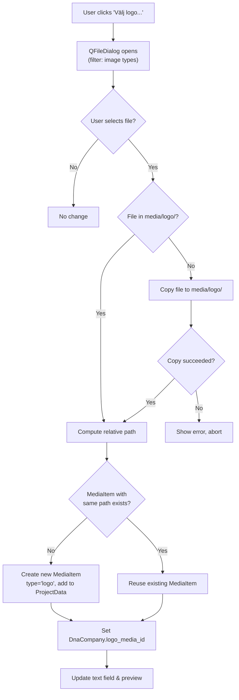
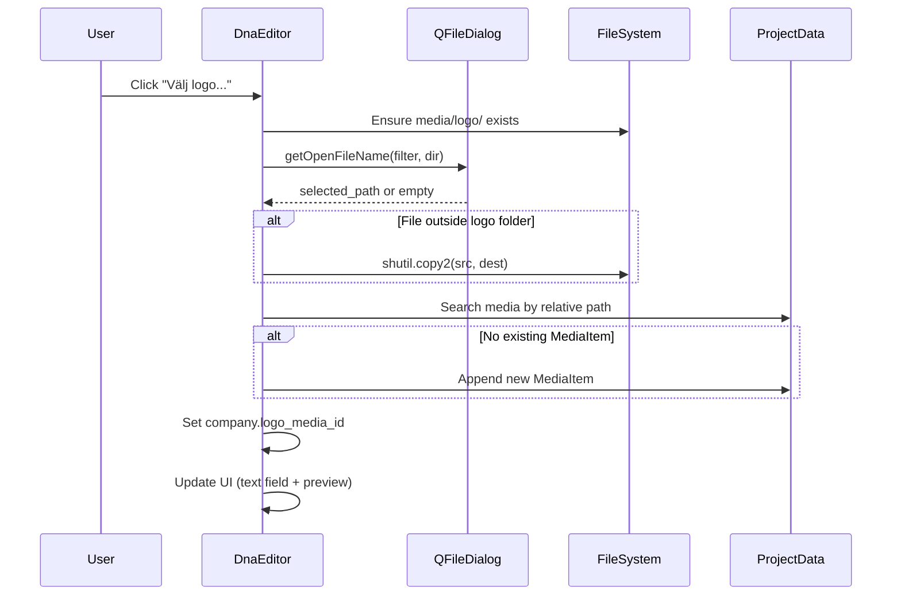
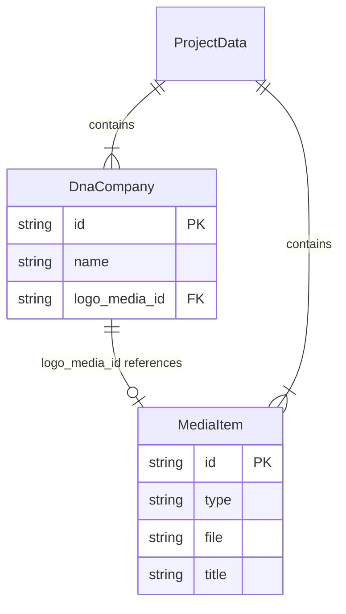

# Design Document: DNA Company Logo Chooser

## Overview

This feature replaces the manual media-ID text entry for DNA company logos with a visual image chooser workflow. The user clicks a "Välj logo..." button, selects an image file via a native file dialog, and the system handles copying (if needed), MediaItem creation, and association with the DnaCompany — all without requiring the user to know or type media IDs.

The design adds:
1. A "Välj logo..." button and 64×64 thumbnail preview to the companies tab in `DnaEditor`
2. Logic to copy external images into the project's `media/logo/` folder
3. Automatic `MediaItem` creation/reuse with deduplication by relative file path
4. A 24×24 logo icon column in the DNA match list view (`DnaMatchDialog`)

Key design decisions:
- **No new service class**: The logo-chooser logic lives in `DnaEditor` as a private method, following the existing pattern for company form handling.
- **project_path injection**: `DnaEditor.__init__` gains an optional `project_path: Path | None` parameter so it can resolve relative media paths. The app already has `project_service.project_path` available at the call site.
- **Forward-slash relative paths**: All `MediaItem.file` values use forward slashes relative to the project folder, consistent with the existing media editor.
- **Case-insensitive deduplication**: Media path matching uses `.lower()` comparison (Windows file system is case-insensitive).

## Architecture



### Component Interaction



## Components and Interfaces

### Modified: `DnaEditor` (ui/editors/dna_editor.py)

**Constructor change:**

```python
def __init__(
    self,
    project_data: ProjectData,
    project_path: Path | None = None,  # NEW
    parent: QWidget | None = None,
) -> None:
```

**New UI widgets (created programmatically in `__init__`, inserted into the generated form layout):**

| Widget | Type | Purpose |
|--------|------|---------|
| `_logo_choose_button` | `QPushButton` | "Välj logo..." button, disabled when no company selected |
| `_logo_preview_label` | `QLabel` | 64×64 thumbnail preview with fixed size policy |

**New private methods:**

| Method | Signature | Responsibility |
|--------|-----------|----------------|
| `_on_choose_logo` | `() -> None` | Orchestrates the full logo selection workflow |
| `_resolve_logo_path` | `(media_item: MediaItem) -> Path | None` | Resolves a MediaItem.file to an absolute path |
| `_update_logo_preview` | `() -> None` | Loads and displays the current company's logo or placeholder |
| `_find_media_by_path` | `(rel_path: str) -> MediaItem | None` | Case-insensitive search in project_data.media |
| `_copy_to_logo_folder` | `(source: Path) -> Path | None` | Copies file, handles name conflicts, returns dest or None on error |
| `_unique_filename` | `(folder: Path, name: str) -> Path` | Appends numeric suffix until filename is unused |

**Signal connections (additions):**

- `_logo_choose_button.clicked` → `_on_choose_logo`
- `companies_list.currentItemChanged` → also calls `_update_logo_preview` and enables/disables `_logo_choose_button`

### Modified: `app.py` — DnaEditor instantiation

```python
editor = DnaEditor(
    project_data=project_data,
    project_path=self.project_service.project_path,  # NEW
    parent=dialog,
)
```

### Modified: `DnaMatchDialog` (ui/dialogs/dna_match_dialog.py) — Requirement 6

The match dialog currently doesn't display company logos. For the list-view display of logos next to DNA matches, the matches list items in `DnaEditor._refresh_matches_list()` will be enhanced to include a logo icon. This uses `QIcon` from a resolved logo file path at 24×24.

**New helper function (module-level or in a shared utility):**

```python
def resolve_company_logo_icon(
    match: DnaMatch,
    project_data: ProjectData,
    project_folder: Path | None,
    size: int = 24,
) -> QIcon:
```

This resolves the chain: match → profile2 → company → logo_media_id → MediaItem → file → disk, returning a `QIcon` scaled to the requested size, or a default placeholder.

### Constants

```python
# Supported logo image file extensions
LOGO_EXTENSIONS = ("png", "jpg", "jpeg", "gif", "svg", "bmp", "webp")

# File dialog filter string
LOGO_FILE_FILTER = "Bildfiler (*.png *.jpg *.jpeg *.gif *.svg *.bmp *.webp)"

# Preview/icon dimensions
LOGO_PREVIEW_SIZE = 64  # company form preview
LOGO_ICON_SIZE = 24     # match list icon
```

## Data Models

No new dataclasses are needed. The feature uses existing models:

### `MediaItem` (unchanged)

```python
@dataclass
class MediaItem:
    id: str          # uuid4
    type: str        # "logo" for this feature
    file: str        # relative path with forward slashes, e.g. "media/logo/ancestry.png"
    title: str       # filename without extension, e.g. "ancestry"
    linked_entities: list[LinkedEntity] = field(default_factory=list)
    publication: Optional[dict] = None
    transcription: Optional[str] = None
    mentioned_person_ids: list[str] = field(default_factory=list)
```

### `DnaCompany` (unchanged)

```python
@dataclass
class DnaCompany:
    id: str
    name: str
    logo_media_id: Optional[str] = None  # references MediaItem.id
    description: str = ""
```

### Relationship diagram



### Path resolution logic

Given `project_path` pointing to e.g. `C:\Users\me\Projects\MyFamily\MyFamily.json.gz`:
- **Project folder** = `project_path.parent` → `C:\Users\me\Projects\MyFamily\`
- **Logo folder** = `project_folder / "media" / "logo"` → `C:\Users\me\Projects\MyFamily\media\logo\`
- **Relative path** for a file at `C:\Users\me\Projects\MyFamily\media\logo\ancestry.png` = `"media/logo/ancestry.png"`

The relative path is computed as `selected_path.relative_to(project_folder)` with separators replaced by forward slashes.


## Correctness Properties

*A property is a characteristic or behavior that should hold true across all valid executions of a system — essentially, a formal statement about what the system should do. Properties serve as the bridge between human-readable specifications and machine-verifiable correctness guarantees.*

### Property 1: Path classification correctness

*For any* absolute file path and any project logo folder path, the "is inside logo folder" check SHALL return True if and only if the file path starts with (is relative to) the logo folder path, regardless of case on Windows.

**Validates: Requirements 2.1, 3.1**

### Property 2: Relative path uses forward slashes

*For any* absolute file path located within the project folder, computing the relative path SHALL produce a string that contains no backslash characters and is equal to the OS-relative path with separators replaced by forward slashes.

**Validates: Requirements 2.1**

### Property 3: MediaItem field correctness

*For any* valid image filename (with a supported extension), creating a MediaItem for that file SHALL produce an item with `type == "logo"`, `file` equal to the forward-slash relative path from the project folder, and `title` equal to the filename stem (without the final extension).

**Validates: Requirements 2.2, 3.5**

### Property 4: Case-insensitive path deduplication

*For any* list of existing MediaItems and any new relative file path, if there exists a MediaItem whose `file` field matches the new path case-insensitively, then the deduplication function SHALL return that existing MediaItem (and no new item is added). If no match exists, a new MediaItem SHALL be created.

**Validates: Requirements 2.3, 3.6, 4.2**

### Property 5: Unique filename suffix generation

*For any* target folder containing N files with names matching the pattern `{stem}_{1..N}.{ext}` (and optionally `{stem}.{ext}`), the unique filename function SHALL return a path with suffix `_{N+1}` (or the original name if no conflict exists), and the returned path SHALL NOT exist in the folder.

**Validates: Requirements 3.4**

### Property 6: Aspect-ratio-preserving scale

*For any* image with positive width W and height H, scaling to fit within a 64×64 bounding box SHALL produce dimensions (w, h) such that: `w <= 64`, `h <= 64`, `max(w, h) == 64` (unless the original is smaller), and `w/h` is approximately equal to `W/H` (within rounding tolerance of ±1 pixel).

**Validates: Requirements 5.1**

### Property 7: Logo resolution chain

*For any* DnaMatch with a valid profile2_id referencing a DnaProfile with a valid company_id referencing a DnaCompany with a non-None logo_media_id referencing a MediaItem, the logo resolution function SHALL return that MediaItem's file path. If any link in the chain is missing or None, it SHALL return None.

**Validates: Requirements 6.1, 6.2, 6.3**

## Error Handling

| Scenario | Handling | User Feedback |
|----------|----------|---------------|
| File copy fails (OSError) | Catch exception, abort operation | Swedish error message via `QMessageBox.warning`: "Kunde inte kopiera filen: {reason}" |
| Logo folder creation fails | Catch OSError, abort dialog open | Swedish error message: "Kunde inte skapa logotypmappen: {reason}" |
| Logo image file missing on disk (preview) | Show "missing image" indicator (distinct from empty placeholder) | Red-bordered placeholder or broken-image icon |
| Logo image file missing on disk (match list) | Show default "missing" placeholder icon | Grey placeholder icon |
| Selected file has 0 bytes | Allow it (QPixmap will show blank; not a validation concern) | No explicit error |
| project_path is None | Disable "Välj logo..." button entirely | Button stays disabled (same as "no company selected") |
| QPixmap fails to load (unsupported format variant) | `isNull()` check → show missing indicator | Missing-image indicator shown |

### Error message patterns (Swedish)

All user-facing error messages follow existing patterns in the codebase:

```python
QMessageBox.warning(
    self,
    "Fel",
    f"Kunde inte kopiera filen: {e}",
)
```

Logging uses the existing `logger` instance:
```python
logger.error("Misslyckades kopiera logofil %s: %s", source, e)
```

## Testing Strategy

### Property-Based Tests (Hypothesis)

The project already uses Hypothesis extensively. Each correctness property maps to one property-based test with minimum 100 examples.

**Test file:** `tests/test_ui/test_dna_company_logo_properties.py`

| Test | Property | Key generators |
|------|----------|---------------|
| `test_path_classification` | Property 1 | Random path segments, random nesting depths |
| `test_relative_path_forward_slashes` | Property 2 | Random filenames with various characters |
| `test_media_item_field_correctness` | Property 3 | Random filenames with supported extensions |
| `test_case_insensitive_deduplication` | Property 4 | Random media lists, random case variations of paths |
| `test_unique_filename_suffix` | Property 5 | Random filenames, random sets of pre-existing conflicting files (0–20 conflicts) |
| `test_aspect_ratio_scaling` | Property 6 | Random (width, height) pairs from 1–5000 |
| `test_logo_resolution_chain` | Property 7 | Random project data with varying chain completeness |

**Configuration:**
- Each test decorated with `@settings(max_examples=100)`
- Each test tagged with comment: `# Feature: dna-company-logo, Property N: ...`
- Hypothesis database stored in `.hypothesis/` (already gitignored)

### Unit Tests (pytest)

**Test file:** `tests/test_ui/test_dna_company_logo.py`

| Test | Validates |
|------|-----------|
| `test_choose_button_exists_in_form` | Req 1.1 |
| `test_choose_button_disabled_no_selection` | Req 1.2 |
| `test_choose_button_enabled_with_selection` | Req 1.2 |
| `test_file_dialog_opens_on_click` | Req 1.3 |
| `test_file_dialog_filter_extensions` | Req 1.4 |
| `test_file_dialog_initial_directory` | Req 1.5 |
| `test_logo_folder_created_if_missing` | Req 1.6 |
| `test_no_copy_for_file_in_logo_folder` | Req 2.1 |
| `test_copy_triggered_for_external_file` | Req 3.1 |
| `test_copy_creates_logo_folder_if_missing` | Req 3.2 |
| `test_copy_error_shows_message` | Req 3.7 |
| `test_media_added_before_company_update` | Req 4.1 |
| `test_text_field_updated_after_association` | Req 4.3 |
| `test_overwrite_existing_logo` | Req 4.4 |
| `test_cancel_preserves_state` | Req 4.5 |
| `test_preview_shows_thumbnail` | Req 5.1 |
| `test_preview_updates_on_change` | Req 5.2 |
| `test_preview_placeholder_no_logo` | Req 5.3 |
| `test_preview_missing_file_indicator` | Req 5.4 |
| `test_match_list_shows_logo_icon` | Req 6.1 |
| `test_match_list_placeholder_no_logo` | Req 6.2 |
| `test_match_list_missing_file_placeholder` | Req 6.3 |

### Test Infrastructure

- Tests use `tmp_path` fixture for isolated filesystem operations
- QFileDialog mocked via `monkeypatch` on `QFileDialog.getOpenFileName`
- QApplication instance from shared `qapp` fixture (already exists in conftest)
- Image files created as minimal 1×1 pixel PNGs using `QImage` for disk-based tests
