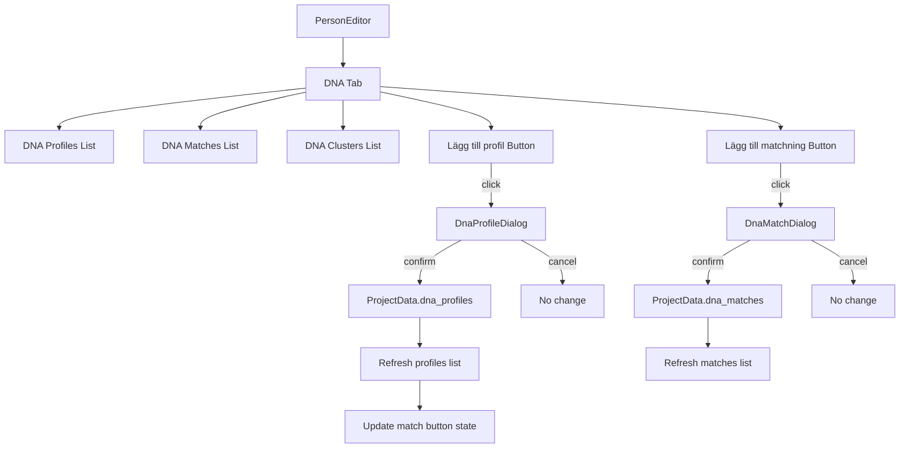

# Design Document: DNA Management from Person Editor

## Overview

This feature extends the existing "DNA & Kluster" tab in the `PersonEditor` to allow creating new DNA profiles and DNA matches directly from within the tab. Currently, profiles and matches can only be created through the dedicated `DnaEditor`. This feature adds "Lägg till profil" and "Lägg till matchning" buttons with associated modal dialogs, following the same pattern already used for cluster management (buttons below lists + dialog-based creation).

The implementation builds on:
- The existing `PersonEditor._setup_cluster_buttons()` pattern for adding buttons to the DNA tab
- The existing `PersonEditor._on_add_event()` pattern for opening modal dialogs from the person editor
- The existing `DnaEditor` form validation logic for DNA entity creation
- The `ProjectData` dataclass as the shared in-memory data store

## Architecture



The architecture follows the existing pattern in `PersonEditor`:
1. Buttons are added to the DNA tab layout programmatically in a setup method
2. Button clicks open `QDialog` wrappers containing form widgets
3. On confirm, entities are created and appended to `ProjectData` lists
4. Lists are refreshed via existing `_refresh_dna_profiles()` and `_refresh_dna_matches()` methods
5. Button state (enabled/disabled/visible/hidden) is synchronized with data state

## Components and Interfaces

### DnaProfileDialog

A `QDialog` subclass providing a form for creating a new DNA profile.

```python
class DnaProfileDialog(QDialog):
    """Modal dialog for creating a new DNA profile for the current person."""

    def __init__(
        self,
        project_data: ProjectData,
        person_id: str,
        parent: QWidget | None = None,
    ) -> None: ...

    @property
    def created_profile(self) -> DnaProfile | None:
        """The created DnaProfile, or None if dialog was cancelled."""
        ...

    def _validate(self) -> list[str]:
        """Validate form inputs. Returns list of error messages (empty = valid)."""
        ...
```

**Form fields:**
| Field | Widget | Required | Constraints |
|-------|--------|----------|-------------|
| Company | QComboBox (DnaCompany entries) | Yes | Must select one |
| Test type | QComboBox (autosomal, Y-DNA, mtDNA) | Yes | Must select one |
| Kit name | QLineEdit | No | Max 100 characters |
| Kit ID | QLineEdit | No | Max 50 characters |
| Notes | QPlainTextEdit | No | Max 2000 characters |

**Validation rules:**
- Company must be selected (not empty/placeholder)
- Test type must be selected
- If no companies exist in project, show info message and disable OK button

### DnaMatchDialog

A `QDialog` subclass providing a form for creating a new DNA match.

```python
class DnaMatchDialog(QDialog):
    """Modal dialog for creating a new DNA match."""

    def __init__(
        self,
        project_data: ProjectData,
        person_id: str,
        parent: QWidget | None = None,
    ) -> None: ...

    @property
    def created_match(self) -> DnaMatch | None:
        """The created DnaMatch, or None if dialog was cancelled."""
        ...

    def _validate(self) -> list[str]:
        """Validate form inputs. Returns list of error messages (empty = valid)."""
        ...
```

**Form fields:**
| Field | Widget | Required | Constraints |
|-------|--------|----------|-------------|
| Profile 1 | QComboBox (current person's profiles) | Yes | Pre-selected if only one |
| Profile 2 | QComboBox (all other profiles) | Yes | Must differ from Profile 1 |
| Shared cM | QDoubleSpinBox | Yes | Range 0.01–10000.00 |
| Shared % | QDoubleSpinBox | No | Range 0.01–100.00 |
| Segment count | QSpinBox | No | Range 1–100000 |
| Largest segment cM | QDoubleSpinBox | No | Range 0.01–10000.00 |
| Match source | QLineEdit | No | Max 200 chars, default "internal" |
| Notes | QPlainTextEdit | No | Max 2000 characters |

**Validation rules:**
- Both profiles must be selected
- Profile 1 and Profile 2 must be different
- Shared cM must be provided (> 0)
- If no other profiles exist, show info message and disable OK button

### PersonEditor Extensions

New methods added to `PersonEditor`:

```python
def _setup_dna_profile_button(self) -> None:
    """Add 'Lägg till profil' button below the DNA profiles list."""
    ...

def _setup_dna_match_button(self) -> None:
    """Add 'Lägg till matchning' button below the DNA matches list."""
    ...

def _on_add_dna_profile(self) -> None:
    """Open the DnaProfileDialog and handle the result."""
    ...

def _on_add_dna_match(self) -> None:
    """Open the DnaMatchDialog and handle the result."""
    ...

def _update_dna_button_states(self) -> None:
    """Sync button visibility/enabled state with current data."""
    ...
```

## Data Models

No new data models are required. The feature uses existing dataclasses:

- **`DnaProfile`** — created via `DnaProfileDialog`, stored in `ProjectData.dna_profiles`
- **`DnaMatch`** — created via `DnaMatchDialog`, stored in `ProjectData.dna_matches`
- **`DnaCompany`** — read from `ProjectData.dna_companies` to populate company dropdown
- **`ProjectData`** — the root container, mutated by appending new entities to lists

**ID Generation:** New entities use `str(uuid.uuid4())` for ID generation, consistent with the existing pattern in `PersonEditor._on_add_event()` and `DnaEditor._on_save_*()` methods.

**Data flow on confirm:**
1. Dialog validates form inputs
2. Dialog constructs `DnaProfile`/`DnaMatch` dataclass instance with `uuid4()` ID
3. `PersonEditor` appends instance to appropriate `ProjectData` list
4. `PersonEditor` calls existing `_refresh_dna_profiles()` / `_refresh_dna_matches()`
5. `PersonEditor` calls `_update_dna_button_states()` to sync button state

## Correctness Properties

*A property is a characteristic or behavior that should hold true across all valid executions of a system—essentially, a formal statement about what the system should do. Properties serve as the bridge between human-readable specifications and machine-verifiable correctness guarantees.*

### Property 1: Profile creation round-trip

*For any* valid combination of company ID, test type, kit name, kit ID, and notes, when the profile dialog is confirmed, the resulting `DnaProfile` in `ProjectData.dna_profiles` SHALL have `person_id` equal to the current person's ID, `company_id` matching the selected company, `test_type` matching the selection, and all optional fields matching the entered values.

**Validates: Requirements 2.3, 2.4**

### Property 2: Profile validation rejects incomplete forms

*For any* form state where company is not selected OR test type is not selected (regardless of values in optional fields), the profile dialog validation SHALL return at least one error and SHALL NOT produce a `DnaProfile`.

**Validates: Requirements 2.2**

### Property 3: Match creation round-trip

*For any* valid combination of two distinct profile IDs and a shared cM value (plus optional fields), when the match dialog is confirmed, the resulting `DnaMatch` in `ProjectData.dna_matches` SHALL have `profile1_id` and `profile2_id` matching the selections, `shared_cm` matching the entered value, and all other fields matching their entered or default values.

**Validates: Requirements 4.3, 4.4**

### Property 4: Match validation rejects invalid forms

*For any* form state where profile 1 is not selected, OR profile 2 is not selected, OR shared cM is zero/missing, OR profile 1 equals profile 2, the match dialog validation SHALL return at least one error and SHALL NOT produce a `DnaMatch`.

**Validates: Requirements 4.6, 4.7**

### Property 5: Cancel preserves project data

*For any* `ProjectData` state, opening and then canceling either the profile dialog or the match dialog SHALL result in `ProjectData` being unchanged (same number of profiles and matches, identical content).

**Validates: Requirements 2.7, 4.9**

### Property 6: UI list consistency after creation

*For any* successful profile or match creation, the DNA profiles list widget item count SHALL equal the number of `DnaProfile` entries in `ProjectData` whose `person_id` matches the current person, and the DNA matches list widget item count SHALL equal the number of `DnaMatch` entries referencing any of the current person's profile IDs.

**Validates: Requirements 2.5, 4.5, 5.1, 5.2**

### Property 7: Match button enabled invariant

*For any* person loaded in the editor, the "Lägg till matchning" button SHALL be enabled if and only if the person has at least one `DnaProfile` in `ProjectData.dna_profiles`. When enabled, its tooltip SHALL be empty; when disabled, its tooltip SHALL be "En DNA-profil krävs för att skapa matchningar".

**Validates: Requirements 3.4, 5.3**

## Error Handling

| Scenario | Handling |
|----------|----------|
| No companies exist in project | Profile dialog shows info message, OK button disabled |
| No other profiles exist for match | Match dialog shows info message, OK button disabled |
| Required fields missing on confirm | Validation error displayed in dialog status label, dialog stays open |
| Same profile selected for both sides | Validation error displayed, dialog stays open |
| Person not loaded (no person) | Both buttons hidden entirely |
| Person has no profiles | Match button disabled with explanatory tooltip |

Error messages are displayed in Swedish, consistent with the rest of the application. Validation occurs synchronously on the OK button click before the dialog accepts.

## Testing Strategy

**Testing framework:** pytest + pytest-qt + hypothesis (already configured in `pyproject.toml`)

### Unit Tests (example-based)

- Dialog opens with correct widget structure (fields, labels, buttons)
- Button visibility: hidden when no person loaded, visible when person loaded
- Pre-selection: single profile auto-selected and dropdown disabled in match dialog
- Edge case: no companies → info message + disabled OK
- Edge case: no other profiles → info message + disabled OK
- Cancel closes dialog without returning a profile/match

### Property-Based Tests (hypothesis)

Property-based testing is appropriate here because:
- Validation logic operates over a meaningful input space (random strings, numeric ranges, selection combinations)
- Creation logic must preserve data integrity for any valid input
- State invariants (button enabled ↔ profile exists) must hold across all possible data states

**Library:** `hypothesis` (already a dev dependency)

**Configuration:** Minimum 100 examples per property test (`@settings(max_examples=100)`)

**Tag format:** Each test is tagged with a docstring reference:
```
Feature: dna-management-from-person-editor, Property {N}: {title}
```

**Properties to implement:**
1. Profile creation round-trip — generate random valid form inputs, verify resulting DnaProfile fields
2. Profile validation rejects incomplete forms — generate random optional fields with missing required, verify rejection
3. Match creation round-trip — generate random valid match inputs, verify resulting DnaMatch fields
4. Match validation rejects invalid forms — generate random invalid states, verify rejection
5. Cancel preserves project data — generate random ProjectData, simulate cancel, verify unchanged
6. UI list consistency — generate random creation inputs, verify list counts match data
7. Match button enabled invariant — generate random person/profile combinations, verify button state matches profile existence
