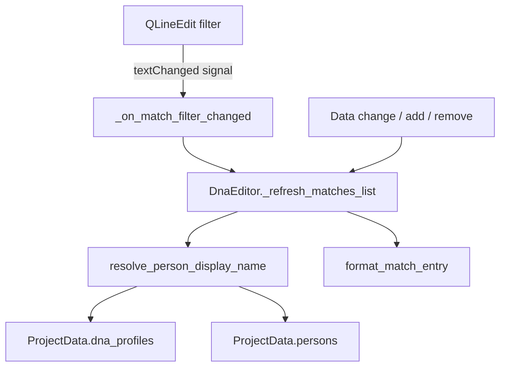

# Design Document: DNA Match List Enhancement

## Overview

This feature enhances the DNA match list in the `DnaEditor` matches tab to display both persons' names in each match entry (resolved via the chain DnaMatch → DnaProfile → Person) and adds a text-based filter control so users can narrow the list by person name. The filter stays consistent when data changes.

The current implementation displays only `"{shared_cm} cM ({segment_count} segment)"` per match entry. This enhancement prepends both persons' resolved names, separated by an en-dash, and introduces a `QLineEdit` filter above the list that performs case-insensitive substring matching against resolved person names.

## Architecture

The enhancement follows the existing `DnaEditor` architecture pattern — a tabbed editor with list + form panels per tab. Changes are localised to:

1. **Pure logic layer** — A new module `slaktbusken/ui/dna_match_display.py` containing pure functions for name resolution and match formatting. This keeps testable logic outside the Qt widget.
2. **UI layer** — Modifications to `DnaEditor` to wire the filter widget and use the new formatting functions.



### Design Decisions

1. **Pure function extraction** — Name resolution and formatting are extracted into standalone pure functions so they can be property-tested without instantiating Qt widgets. This follows the project's existing pattern (e.g., `resolve_company_logo_icon` is already a standalone function in `dna_editor.py`).

2. **Filter on resolved display names** — The filter matches against the fully resolved display string (including fallbacks like profile IDs or "(okänd)"), which means users can also filter by IDs when names can't be resolved.

3. **Re-apply filter on every refresh** — Rather than tracking which items to add/remove incrementally, the list is fully rebuilt on every data change. This is simple, correct, and acceptable for the expected data volumes (tens to hundreds of matches).

## Components and Interfaces

### New Module: `slaktbusken/ui/dna_match_display.py`

```python
def resolve_person_display_name(
    profile_id: str,
    project_data: ProjectData,
) -> str:
    """Resolve a profile_id to a person display name.

    Resolution chain:
      profile_id → DnaProfile → person_id → Person → names[0] → "given surname"

    Fallbacks:
      - Profile not found → return profile_id
      - Person not found → return person_id
      - Names list empty or first entry has empty given+surname → return "(okänd)"

    Returns:
        The resolved display name string.
    """


def format_match_entry(
    match: DnaMatch,
    project_data: ProjectData,
) -> str:
    """Format a DnaMatch into a display string.

    Format: "{Person1} \u2013 {Person2}: {shared_cm} cM ({segment_count} segment)"

    shared_cm formatting: up to 1 decimal place (e.g., "15.3", "7.0", "100.0").
    The en-dash (U+2013) is surrounded by spaces.
    """


def matches_filter(
    matches: list[DnaMatch],
    filter_text: str,
    project_data: ProjectData,
) -> list[DnaMatch]:
    """Filter matches by person name substring (case-insensitive).

    Returns only those matches where filter_text is a substring
    of either resolved person display name (from profile1 or profile2).

    If filter_text is empty, returns all matches unchanged.
    """
```

### Modified: `DnaEditor` class

- Add a `QLineEdit` (`self._match_filter_input`) above `self._ui.matches_list` in the matches tab left panel.
- Connect `textChanged` signal to `self._on_match_filter_changed`.
- Modify `_refresh_matches_list` to apply the current filter text using `matches_filter`.
- Ensure `_refresh_matches_list` preserves the filter text (reads it before rebuilding, doesn't clear it).

### Modified: `Ui_DnaEditor` (generated UI)

- Add `self.match_filter_input = QLineEdit(self.matches_left)` with placeholder text "Filtrera på person…" inserted into `matches_left_layout` before the list widget.

## Data Models

No new data models are introduced. The feature uses existing models:

| Model | Role |
|-------|------|
| `DnaMatch` | Source record with `profile1_id`, `profile2_id`, `shared_cm`, `segment_count` |
| `DnaProfile` | Links profile to person via `person_id` |
| `Person` | Contains `names: list[Name]` |
| `Name` | Has `given: str` and `surname: str` fields |
| `ProjectData` | Container holding all entities; source of truth for lookups |

### Resolution Chain

```
DnaMatch.profile1_id ──► DnaProfile.person_id ──► Person.names[0] ──► "{given} {surname}".strip()
DnaMatch.profile2_id ──► DnaProfile.person_id ──► Person.names[0] ──► "{given} {surname}".strip()
```

### Fallback Rules

| Condition | Display Value |
|-----------|--------------|
| DnaProfile not found in `project_data.dna_profiles` | The raw `profile_id` string |
| Person not found in `project_data.persons` | The raw `person_id` string |
| Person's `names` list is empty | `"(okänd)"` |
| First Name entry has both `given==""` and `surname==""` | `"(okänd)"` |

## Correctness Properties

*A property is a characteristic or behavior that should hold true across all valid executions of a system — essentially, a formal statement about what the system should do. Properties serve as the bridge between human-readable specifications and machine-verifiable correctness guarantees.*

### Property 1: Name Resolution and Format Correctness

*For any* DnaMatch with two profile IDs, and *for any* ProjectData containing (or not containing) the referenced DnaProfiles and Persons, the output of `format_match_entry` SHALL:
- Contain the en-dash separator ` \u2013 ` between two resolved names
- End with `: {shared_cm} cM ({segment_count} segment)` where shared_cm is formatted to one decimal place
- Have Person1 name equal to `resolve_person_display_name(match.profile1_id, project_data)` and Person2 name equal to `resolve_person_display_name(match.profile2_id, project_data)`
- Where `resolve_person_display_name` returns:
  - `"given surname".strip()` when the full chain resolves
  - The profile_id when no DnaProfile is found
  - The person_id when no Person is found
  - `"(okänd)"` when names list is empty or first entry has both fields empty

**Validates: Requirements 1.1, 1.2, 1.3, 1.4, 1.5**

### Property 2: Filter Correctness

*For any* list of DnaMatch entries and *for any* filter string, the result of `matches_filter(matches, filter_text, project_data)` SHALL contain exactly those matches where `filter_text.lower()` is a substring of either `resolve_person_display_name(match.profile1_id, project_data).lower()` or `resolve_person_display_name(match.profile2_id, project_data).lower()`. When `filter_text` is empty, all matches SHALL be returned.

**Validates: Requirements 2.3, 2.4, 2.5, 2.6**

### Property 3: Filter Consistency After Data Change

*For any* set of DnaMatch entries, *for any* active filter text, and *for any* data mutation (add, remove, or modify a match), after the mutation and refresh, the displayed list SHALL equal `matches_filter(current_matches, filter_text, project_data)` — i.e., the result is always a fresh application of the filter to the current data state.

**Validates: Requirements 3.1, 3.2, 3.4, 3.5**

### Property 4: Filter Text Preservation on Refresh

*For any* filter text currently in the Match_Filter input, when a data-change refresh occurs, the Match_Filter text SHALL remain unchanged after the refresh completes.

**Validates: Requirements 3.3**

## Error Handling

| Scenario | Handling |
|----------|----------|
| Profile ID not found during resolution | Return the raw `profile_id` string as fallback display |
| Person ID not found during resolution | Return the raw `person_id` string as fallback display |
| Person has empty names list | Return `"(okänd)"` |
| Person's first Name has empty given + surname | Return `"(okänd)"` |
| Filter text with special regex characters | No regex used — plain `str.lower()` + `in` substring check, so no escaping needed |
| Very large match lists (performance) | Full list rebuild is O(n) in number of matches; acceptable for genealogy data volumes |

## Testing Strategy

### Property-Based Tests (Hypothesis)

The project already uses Hypothesis extensively (see `.hypothesis/` directory and existing property tests in `tests/test_ui/`). The following property tests will be added:

- **Library**: `hypothesis` (already in dev dependencies)
- **Minimum iterations**: 100 per property
- **Tag format**: `Feature: dna-match-list-enhancement, Property {N}: {title}`

| Property | Test Module | What It Tests |
|----------|-------------|---------------|
| Property 1 | `tests/test_ui/test_dna_match_display_property.py` | `resolve_person_display_name` and `format_match_entry` produce correct output for all generated inputs |
| Property 2 | `tests/test_ui/test_dna_match_display_property.py` | `matches_filter` returns exactly the correct subset |
| Property 3 | `tests/test_ui/test_dna_match_display_property.py` | After add/remove/modify, displayed list equals fresh filter application |
| Property 4 | `tests/test_ui/test_dna_match_display_property.py` | Filter text input value unchanged after refresh |

### Unit Tests (Example-Based)

- Verify placeholder text is "Filtrera på person…"
- Verify `QLineEdit` is positioned above the list widget in the layout
- Verify shared_cm decimal formatting edge cases: `7.0` → `"7.0"`, `15.333` → `"15.3"`, `100.0` → `"100.0"`

### Test Strategies for Generators

The existing `dna_match_strategy`, `dna_profile_strategy`, and `person_strategy` from `tests/conftest.py` will be reused. Additional composite strategies will cover:
- Matches with profiles that reference existing persons (happy path)
- Matches with profile IDs not in `project_data.dna_profiles` (fallback to profile_id)
- Profiles with person IDs not in `project_data.persons` (fallback to person_id)
- Persons with empty `names` list or first Name with empty given+surname (fallback to "(okänd)")
