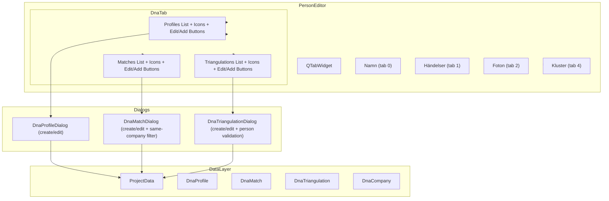

# Design Document: DNA Tab Enhancements

## Overview

This design describes the enhancements to the DNA tab in the Person Editor ("Redigera Person") dialog of Släktbusken. The changes add company logo icons to profiles/matches/triangulations, introduce edit capabilities for profiles and matches, enforce same-company constraints on match creation/editing, add a triangulation section with person validation logic, and relocate the cluster section to its own tab.

The implementation builds on the existing architecture: `PersonEditor` (the tabbed dialog), `DnaProfileDialog` and `DnaMatchDialog` (modal forms), and the icon resolution utilities in `dna_editor.py`. The main structural change is splitting the combined "DNA & Kluster" tab into separate "DNA" and "Kluster" tabs and adding a triangulation UI section within the DNA tab.

## Architecture



### Key Design Decisions

1. **Reuse existing icon resolution functions** — `resolve_profile_logo_icon` and `resolve_company_logo_icon` already handle the full chain (entity → company → media → file → QIcon with fallbacks). No new resolution logic needed.

2. **Dialog mode pattern (create vs edit)** — Extend `DnaProfileDialog` and `DnaMatchDialog` with an optional `existing_profile`/`existing_match` parameter. When provided, the dialog operates in edit mode: pre-populates fields, preserves ID on save, and updates in-place rather than creating a new record.

3. **Same-company filtering via signal/slot** — Connect `Profile 1` combobox's `currentIndexChanged` signal to a filter method that rebuilds Profile 2's items. This is a reactive pattern already used elsewhere in the application.

4. **Triangulation person validation as a filtering function** — Extract the mutual-match-checking logic into a pure function `get_eligible_triangulation_persons(active_person_id, selected_person_ids, company_id, project_data)` that returns the list of eligible persons. This makes it testable independently of the UI.

5. **Cluster tab extraction** — Move cluster widgets from `dna_tab` to a new `cluster_tab` in the `.ui` form file (or construct programmatically). Preserve all existing cluster functionality unchanged.

## Components and Interfaces

### Modified Components

#### `PersonEditor` (slaktbusken/ui/editors/person_editor.py)

**New responsibilities:**
- Set `iconSize` on profiles, matches, and triangulations list widgets to `QSize(24, 24)`
- Add icons to list items via `resolve_profile_logo_icon` (profiles) and `resolve_company_logo_icon` (matches)
- Add "Redigera" buttons for profiles, matches, and triangulations sections
- Wire double-click signals to edit handlers
- Manage button enabled states based on list selection
- Populate and manage the triangulation list
- Set up the new Cluster tab with moved widgets

**New methods:**
```python
def _setup_dna_edit_buttons(self) -> None: ...
def _setup_triangulation_section(self) -> None: ...
def _setup_cluster_tab(self) -> None: ...
def _on_edit_dna_profile(self) -> None: ...
def _on_edit_dna_match(self) -> None: ...
def _on_add_triangulation(self) -> None: ...
def _on_edit_triangulation(self) -> None: ...
def _refresh_triangulations(self) -> None: ...
def _update_edit_button_states(self) -> None: ...
```

#### `DnaProfileDialog` (slaktbusken/ui/dialogs/dna_profile_dialog.py)

**New parameter:**
```python
def __init__(self, project_data, person_id, existing_profile=None, parent=None):
```

When `existing_profile` is provided:
- Window title: "Redigera DNA-profil" instead of "Ny DNA-profil"
- Pre-populate all fields from `existing_profile`
- On accept: update `existing_profile` in-place, expose via `edited_profile` property
- Preserve `existing_profile.id` and `existing_profile.person_id`

#### `DnaMatchDialog` (slaktbusken/ui/dialogs/dna_match_dialog.py)

**New parameter:**
```python
def __init__(self, project_data, person_id, existing_match=None, parent=None):
```

**Same-company filtering:**
- Connect `_combo_profile1.currentIndexChanged` to `_on_profile1_changed`
- `_on_profile1_changed`: get selected profile's `company_id`, filter `_combo_profile2` to show only profiles with matching `company_id` (excluding profile 1)
- Disable `_combo_profile2` when no profile 1 selected
- Show info label and disable OK when filter yields zero profile 2 options

When `existing_match` is provided:
- Window title: "Redigera DNA-matchning"
- Pre-populate all fields
- On accept: update in-place, preserve `existing_match.id`

### New Components

#### `DnaTriangulationDialog` (slaktbusken/ui/dialogs/dna_triangulation_dialog.py)

A new modal dialog for creating/editing triangulations.

```python
class DnaTriangulationDialog(QDialog):
    def __init__(
        self,
        project_data: ProjectData,
        person_id: str,
        existing_triangulation: Optional[DnaTriangulation] = None,
        parent: Optional[QWidget] = None,
    ) -> None: ...

    @property
    def created_triangulation(self) -> Optional[DnaTriangulation]: ...

    @property
    def edited_triangulation(self) -> Optional[DnaTriangulation]: ...
```

**UI fields:**
- Company dropdown (QComboBox)
- Chromosome dropdown/input (QComboBox with values "1"–"22", "X", "Y", "MT")
- Overlap start (QSpinBox, range 0–300,000,000)
- Overlap end (QSpinBox, range 0–300,000,000)
- Person selection list (QListWidget, multi-select with validation)

**Validation:**
- Company required
- Chromosome required
- `overlap_start < overlap_end`
- At least 2 eligible persons selected (beyond the active person)

**Person validation logic:**

```python
def get_eligible_triangulation_persons(
    active_person_id: str,
    selected_person_ids: list[str],
    company_id: Optional[str],
    project_data: ProjectData,
) -> list[Person]:
    """Return persons eligible to be added to a triangulation.
    
    A person is eligible if:
    1. A DNA match exists between the active person and the candidate
    2. For each already-selected person, a DNA match exists between
       that selected person and the candidate
    3. If company_id is set, the candidate has at least one DnaProfile
       with that company_id
       
    Match existence is bidirectional (profile1_id/profile2_id order doesn't matter).
    """
```

```python
def has_dna_match(person_a_id: str, person_b_id: str, project_data: ProjectData) -> bool:
    """Check if any DNA match links profiles of person A with profiles of person B.
    
    Checks both directions: profile1_id belonging to A and profile2_id to B,
    or profile1_id belonging to B and profile2_id to A.
    """
```

## Data Models

No changes to the existing data models. The `DnaTriangulation` dataclass already has all needed fields:

```python
@dataclass
class DnaTriangulation:
    id: str
    company_id: str
    chromosome: str
    overlap_start: int
    overlap_end: int
    segment_ids: list[str]
    profile_ids: list[str]
    cluster_id: Optional[str] = None
    notes: str = ""
```

The `DnaProfile`, `DnaMatch`, `DnaCompany`, and `DnaCluster` dataclasses remain unchanged.

### Data Flow

**Icon resolution chain:**
```
DnaProfile → company_id → DnaCompany → logo_media_id → MediaItem → file_path → disk → QIcon
DnaMatch → profile2_id → DnaProfile → company_id → DnaCompany → ... → QIcon
DnaTriangulation → company_id → DnaCompany → ... → QIcon
```

**Same-company filtering:**
```
Profile 1 selected → get company_id → filter all profiles where profile.company_id == company_id AND profile.id != profile1.id
```

**Triangulation person validation:**
```
Active person → get profile_ids → find all matches involving those profiles → extract other person_ids → 
for each candidate: verify match with active person AND every already-selected person → 
optionally filter by company → return eligible persons
```

## Correctness Properties

*A property is a characteristic or behavior that should hold true across all valid executions of a system — essentially, a formal statement about what the system should do. Properties serve as the bridge between human-readable specifications and machine-verifiable correctness guarantees.*

### Property 1: Profile icon resolution correctness

*For any* DnaProfile and project data state, calling `resolve_profile_logo_icon` SHALL return: a scaled QIcon when the company has a valid logo file on disk, an empty QIcon when the company has no `logo_media_id` or cannot be resolved, and a distinct non-empty "missing file" QIcon when the path resolves but the file is absent — and the function SHALL never raise an exception.

**Validates: Requirements 1.1, 1.2, 1.3, 1.4**

### Property 2: Match icon resolution correctness

*For any* DnaMatch and project data state, calling `resolve_company_logo_icon` SHALL return: a scaled QIcon when the profile2 → company → logo chain resolves to an existing file, an empty QIcon when any link is missing or the image cannot be loaded, and a distinct "missing file" QIcon when the path resolves but the file is absent — and the function SHALL never raise an exception.

**Validates: Requirements 2.1, 2.2, 2.3, 2.4, 2.5**

### Property 3: Edit button enabled state tracks selection

*For any* of the three DNA lists (profiles, matches, triangulations), the associated "Redigera" button's enabled state SHALL equal `True` if and only if the list has a current selected item, at all times after any selection change event.

**Validates: Requirements 3.1, 4.1, 8.1**

### Property 4: Cancel preserves original data

*For any* DNA entity (profile, match, or triangulation) being edited, if the user cancels the edit dialog, the entity in ProjectData SHALL remain byte-for-byte identical to its state before the dialog was opened.

**Validates: Requirements 3.7, 4.6, 7.6, 8.5**

### Property 5: Edit preserves identity and updates fields

*For any* DNA entity (profile, match, or triangulation) and any set of valid field modifications, saving an edit SHALL preserve the entity's `id` (and `person_id` for profiles) unchanged while updating all other fields to match the dialog's values.

**Validates: Requirements 3.4, 4.4, 8.4**

### Property 6: Edit dialog pre-population matches entity data

*For any* DnaProfile, DnaMatch, or DnaTriangulation opened in edit mode, every field in the dialog SHALL display the exact current value of the corresponding entity attribute.

**Validates: Requirements 3.2, 4.2, 8.2**

### Property 7: Invalid edits are rejected without data modification

*For any* edit operation where validation fails (missing required fields, notes > 2000 chars, shared_cm ≤ 0, same profile selected twice, or overlap_start ≥ overlap_end), the dialog SHALL remain open, display errors, and the original entity data in ProjectData SHALL be unchanged.

**Validates: Requirements 3.5, 4.7**

### Property 8: Same-company profile filtering invariant

*For any* Profile 1 selection in the Match_Dialog, every item in the Profile 2 dropdown SHALL have a `company_id` equal to Profile 1's `company_id`, and Profile 1 itself SHALL not appear in the Profile 2 dropdown.

**Validates: Requirements 5.1, 5.2, 5.3**

### Property 9: Triangulation list contains exactly relevant triangulations

*For any* active person and project data, the triangulation list SHALL contain a DnaTriangulation if and only if the triangulation's `profile_ids` list intersects with the set of DnaProfile IDs belonging to the active person.

**Validates: Requirements 6.2**

### Property 10: Triangulation display format correctness

*For any* DnaTriangulation, its display text SHALL be exactly `"Kromosom {chromosome}: {overlap_start}–{overlap_end} ({N} profiler)"` where N equals `len(triangulation.profile_ids)`.

**Validates: Requirements 6.3**

### Property 11: Triangulation overlap validation

*For any* pair of integers (start, end), the triangulation dialog SHALL accept save if and only if start < end.

**Validates: Requirements 7.4**

### Property 12: Triangulation person mutual-match filtering

*For any* active person, set of already-selected persons, and project data, a candidate person SHALL appear in the eligible list if and only if: (a) a DnaMatch exists linking a profile of the active person with a profile of the candidate, AND (b) for every already-selected person, a DnaMatch exists linking a profile of that selected person with a profile of the candidate.

**Validates: Requirements 9.1, 9.2, 9.5**

### Property 13: Match existence is bidirectional

*For any* two persons A and B, `has_dna_match(A, B, project_data)` SHALL return `True` if and only if `has_dna_match(B, A, project_data)` returns `True`.

**Validates: Requirements 9.4**

### Property 14: Triangulation company-restricted person filtering

*For any* selected company and candidate person, the candidate SHALL only be eligible for triangulation selection if they have at least one DnaProfile whose `company_id` matches the selected company.

**Validates: Requirements 9.6**

## Error Handling

| Scenario | Handling |
|----------|----------|
| Icon file missing on disk | Display distinct "missing file" indicator (red X pixmap) |
| Icon file cannot be loaded (corrupt/unsupported) | Display empty placeholder QIcon |
| Company cannot be resolved from profile | Display empty placeholder QIcon |
| MediaItem not found for logo_media_id | Display empty placeholder QIcon |
| Profile dialog validation fails | Show Swedish error messages, keep dialog open |
| Match dialog validation fails | Show Swedish error messages, keep dialog open |
| Triangulation dialog validation fails | Show Swedish error messages, keep dialog open |
| No matchable profiles for selected company | Show info label, disable OK button |
| Fewer than 2 eligible persons for triangulation | Show info message, disable save button |
| No clusters in project (cluster tab) | Show "Inga kluster finns i projektet" message |
| Double-click with no item selected | No-op (no dialog opened) |
| Edit button clicked with no selection | Button is disabled, cannot be clicked |

All error messages are displayed in Swedish to match the application locale. Validation errors appear in a red-styled QLabel within the dialog. The dialogs never modify data until validation passes and user confirms.

## Testing Strategy

### Testing Framework

- **Unit tests**: pytest with PySide6 widget testing
- **Property-based tests**: Hypothesis (already configured in the project with custom strategies in `tests/conftest.py`)
- **Existing strategies**: `dna_profile_strategy`, `dna_match_strategy`, `dna_triangulation_strategy`, `dna_company_strategy`, `project_data_strategy`

### Property-Based Tests

Each correctness property from the design will be implemented as a Hypothesis property test with a minimum of 100 iterations. Tests will be tagged with the property reference.

**Tag format:** `Feature: dna-tab-enhancements, Property {number}: {property_text}`

Key property tests:
- **Icon resolution** (Properties 1, 2): Generate random profiles/matches with various company/media states, verify correct QIcon type returned
- **Button state invariant** (Property 3): Generate selection change sequences, verify enabled state
- **Cancel preserves data** (Property 4): Generate entities, open edit, cancel, verify equality
- **Edit identity preservation** (Property 5): Generate entities with valid edits, verify ID unchanged
- **Pre-population** (Property 6): Generate entities, open edit mode, verify field values
- **Validation rejection** (Property 7): Generate invalid inputs, verify rejection and data preservation
- **Same-company filter** (Property 8): Generate multi-company project data, verify filter correctness
- **Triangulation list population** (Property 9): Generate project data, verify correct filtering
- **Display formatting** (Property 10): Generate triangulations, verify string format
- **Overlap validation** (Property 11): Generate start/end pairs, verify validation
- **Person mutual-match filtering** (Property 12): Generate match networks, verify eligibility
- **Bidirectional match** (Property 13): Generate matches, verify symmetry
- **Company person filtering** (Property 14): Generate multi-company data, verify restriction

### Unit Tests (Example-Based)

- Tab structure: verify tab order (Namn, Händelser, Foton, DNA, Kluster), tab texts
- Icon size: verify `iconSize()` returns `QSize(24, 24)` on list widgets
- Double-click: verify it triggers the same edit logic as the button
- UI layout: verify triangulation section exists below matches
- Cluster tab: verify cluster widgets moved correctly, functionality preserved
- Dialog opening: verify correct dialog type opens on button click

### Integration Tests

- Full edit workflow: open person editor → select profile → click edit → change values → save → verify list updated
- Cluster tab functionality: add cluster, remove cluster in new tab location
- Triangulation creation end-to-end: add triangulation with valid persons → verify appears in list
