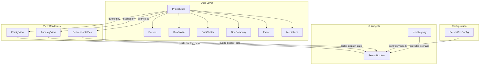
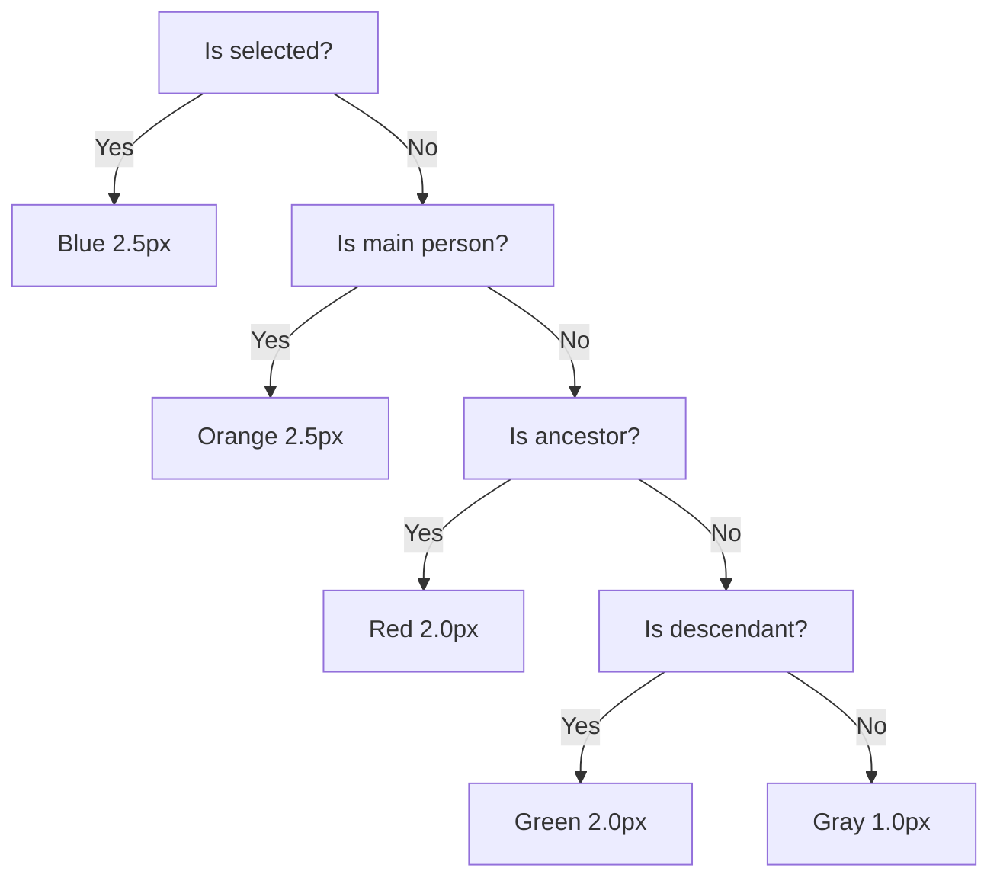

# Design Document: Enhanced Name Cards

## Overview

This design extends the existing `PersonBoxItem` QGraphicsItem to display richer information and improve visual identification in the diagram views. The enhancements include: a multiple-names indicator icon, DNA company logos, an orange border for the main person, a profile photo thumbnail, birth/death place fields, cause of death, DNA cluster names, and a wider card (240px).

All changes are confined to the rendering layer (`person_box.py`) and the configuration/data-preparation layer. The data model already supports all required fields (`Person.names`, `Person.profile_media_id`, `DnaProfile`, `DnaCluster`, `DnaCompany`, `Event.cause_of_death`). The `PersonBoxConfig` dataclass will receive two new boolean fields (`cause_of_death`, `clusters`).

### Design Rationale

- **Single-class approach**: All rendering remains in `PersonBoxItem.paint()` to keep the widget self-contained and avoid complex delegation hierarchies.
- **Data preparation in view renderers**: The view renderers (FamilyView, AncestryView, DescendantsView) already build the `display_data` dict passed to `PersonBoxItem`. They will be extended to resolve DNA profiles, clusters, and photo paths before handing data to the widget.
- **Existing icon infrastructure**: The `IconRegistry` singleton will be extended with methods for the multiple-names icon and DNA company logos.

## Architecture



### Border Color Priority Chain



## Components and Interfaces

### PersonBoxItem (Modified)

**File**: `slaktbusken/ui/widgets/person_box.py`

**Changes**:
- `_BOX_WIDTH` constant: 180.0 → 240.0
- New constant `_MAIN_PERSON_BORDER_COLOR = QColor(0xF3, 0x9C, 0x12)`
- New constant `_PHOTO_SIZE = 40.0`
- New constant `_PHOTO_GAP = 8.0`
- New constant `_DNA_LOGO_SIZE = 16.0`
- New constant `_MULTIPLE_NAMES_ICON_SIZE = 14.0`
- New constant `_MAX_DNA_LOGOS = 5`
- New constant `_MAX_CLUSTERS = 5`
- New constant `_CAUSE_OF_DEATH_MAX_LEN = 50`

**Extended `__init__` parameters in `display_data`**:
```python
display_data = {
    # Existing fields...
    "name": str,
    "sex": str,
    "is_ancestor": bool,
    "is_descendant": bool,
    "is_main_person": bool,          # NEW
    "has_multiple_names": bool,       # NEW
    "profile_photo": QPixmap | None,  # NEW — pre-loaded, scaled pixmap
    "dna_companies": list[dict],      # NEW — [{"name": str, "logo": QPixmap|None}]
    "cause_of_death": str | None,     # NEW
    "clusters": list[dict],           # NEW — [{"name": str, "color": str|None}]
    "birth_place": str | None,        # existing key, now used
    "death_place": str | None,        # existing key, now used
}
```

**New `paint()` sub-methods**:
- `_paint_multiple_names_icon(painter)`: Draws the indicator at (PADDING/2, PADDING/2) when `has_multiple_names` is True.
- `_paint_profile_photo(painter)`: Draws the 40×40 thumbnail on the left side.
- `_paint_dna_logos(painter, box_height)`: Draws up to 5 company logos (16×16) in the bottom-right corner.
- `_paint_cluster_lines(painter, y) -> float`: Draws cluster names with per-cluster text color, returns updated y.

### PersonBoxConfig (Modified)

**File**: `slaktbusken/persistence/settings_io.py`

**New fields**:
```python
@dataclass
class PersonBoxConfig:
    # ... existing fields ...
    cause_of_death: bool = False
    clusters: bool = False
```

### IconRegistry (Extended)

**File**: `slaktbusken/ui/icons/icon_registry.py`

**New methods**:
- `get_multiple_names_icon() -> QPixmap`: Returns a 14×14 pixmap for the multiple-names indicator (new SVG at `icons/misc/multiple_names.svg`).
- `get_dna_company_logo(media_id: str, media_loader) -> QPixmap | None`: Loads a company logo from media, scaled to 16×16.

### View Renderers (Modified)

**Files**: `slaktbusken/ui/views/family_view.py`, `ancestry_view.py`, `descendants_view.py`

**Changes to display_data construction**:
- Look up `Person.names` length to set `has_multiple_names`.
- Resolve `project.project.main_person_id` comparison to set `is_main_person`.
- Load `Person.profile_media_id` media as a QPixmap (via media loader), scale to 40×40 preserving aspect ratio.
- Look up `DnaProfile` records for the person, resolve each `company_id` to `DnaCompany`, build logo list sorted alphabetically.
- Look up `DnaCluster` records where `person_id` is in `cluster.person_ids`, sorted alphabetically, capped at 5 with overflow indicator.
- Look up death `Event` for the person and extract `cause_of_death`.

### Media Loader (Existing Utility)

Used to load images from `MediaItem.file` paths. If loading fails, returns `None` and the PersonBoxItem gracefully skips the photo.

## Data Models

### Existing Models (No Changes Required)

| Model | Key Fields Used |
|-------|----------------|
| `Person` | `id`, `names: list[Name]`, `profile_media_id`, `sex` |
| `Name` | `type`, `given`, `surname` |
| `DnaProfile` | `id`, `person_id`, `company_id` |
| `DnaCompany` | `id`, `name`, `logo_media_id` |
| `DnaCluster` | `id`, `name`, `color`, `person_ids: list[str]` |
| `Event` | `id`, `type`, `cause_of_death`, `participants`, `place` |
| `MediaItem` | `id`, `type`, `file` |
| `ProjectMetadata` | `main_person_id` |

### Modified Model

| Model | Change |
|-------|--------|
| `PersonBoxConfig` | Add `cause_of_death: bool = False`, `clusters: bool = False` |

### display_data Dictionary Schema

```python
{
    "name": str,                         # Display name string
    "name_parsed": ParsedGivenName | None,
    "sex": str,                          # "M", "F", "X", "U"
    "is_ancestor": bool,
    "is_descendant": bool,
    "is_main_person": bool,              # NEW
    "has_multiple_names": bool,          # NEW
    "profile_photo": QPixmap | None,     # NEW — pre-scaled 40×40
    "dna_companies": list[dict],         # NEW — sorted by name
    "birth_date": str | None,
    "birth_place": str | None,
    "death_date": str | None,
    "death_place": str | None,
    "cause_of_death": str | None,        # NEW — raw string (truncation in paint)
    "clusters": list[dict],              # NEW — sorted, max 5 + overflow
    "marriage_date": str | None,
    "marriage_place": str | None,
    "occupation": str | None,
    "dna_info": str | None,
    "notes": str | None,
}
```

## Correctness Properties

*A property is a characteristic or behavior that should hold true across all valid executions of a system — essentially, a formal statement about what the system should do. Properties serve as the bridge between human-readable specifications and machine-verifiable correctness guarantees.*

### Property 1: Multiple names indicator biconditional

*For any* Person, the multiple names indicator is drawn if and only if `len(person.names) > 1`. When `len(names) == 1`, no indicator is drawn; when `len(names) > 1`, the indicator is always drawn.

**Validates: Requirements 1.1, 1.3**

### Property 2: Multiple names indicator is config-independent

*For any* PersonBoxConfig toggle combination and any Person with multiple names, the multiple names indicator is always rendered regardless of which config fields are enabled or disabled.

**Validates: Requirements 1.4**

### Property 3: DNA logo count matches profile count gated by config

*For any* Person with N DNA profiles (N ≥ 0) and any dna_info toggle value: when dna_info is True, the number of logos rendered equals min(N, 5); when dna_info is False, zero logos are rendered.

**Validates: Requirements 2.1, 2.5, 2.6**

### Property 4: DNA logos are ordered alphabetically

*For any* set of DNA companies associated with a Person, the logos are rendered left-to-right in alphabetical order by company name.

**Validates: Requirements 2.2**

### Property 5: DNA company text placeholder uses first 2 characters

*For any* DNA company with no `logo_media_id`, the text placeholder rendered is exactly the first 2 characters of the company name.

**Validates: Requirements 2.4**

### Property 6: Border color precedence chain

*For any* combination of (is_selected, is_main_person, is_ancestor, is_descendant), the border color follows strict priority: selected (blue, 2.5px) > main person (orange, 2.5px) > ancestor (red, 2.0px) > descendant (green, 2.0px) > default (gray, 1.0px).

**Validates: Requirements 3.1, 3.2, 3.3, 3.4**

### Property 7: Photo presence determines text x-offset

*For any* Person and PersonBoxConfig: when photo is enabled AND `profile_photo` is not None, text content starts at x = _PADDING + 48; otherwise text content starts at x = _PADDING.

**Validates: Requirements 4.1, 4.2, 4.3**

### Property 8: Photo scaling preserves aspect ratio within bounds

*For any* source image with dimensions (w, h) where w > 0 and h > 0, the scaled dimensions (sw, sh) satisfy: sw ≤ 40, sh ≤ 40, and sw/sh ≈ w/h (within floating-point tolerance).

**Validates: Requirements 4.6**

### Property 9: Place lines appear in correct order relative to date lines

*For any* Person with birth/death place data and corresponding config enabled, the birth_place line appears immediately after the birth_date line, and the death_place line appears immediately after the death_date line. When place data is empty/None, no line is inserted.

**Validates: Requirements 5.1, 5.2, 5.3**

### Property 10: Place text truncation at available width

*For any* place text string and available content width, if the text exceeds the width then the rendered text ends with "…" and fits within the content area.

**Validates: Requirements 5.5**

### Property 11: Cause of death display and truncation

*For any* cause_of_death string and config toggle: when config is enabled and string is non-empty, the displayed text is the original if len ≤ 50, or first 50 characters + "…" if len > 50. When config is disabled or string is empty/None, no line is rendered.

**Validates: Requirements 6.1, 6.2, 6.4**

### Property 12: Cluster display sorted and capped

*For any* Person belonging to N clusters with config enabled: clusters are displayed in alphabetical order by name, showing min(N, 5) entries. When N = 0, nothing is rendered.

**Validates: Requirements 7.1, 7.4**

### Property 13: Cluster text color matches cluster color property

*For any* displayed cluster, the text color is the cluster's `color` value when set, or the default label color when `color` is None.

**Validates: Requirements 7.2, 7.3**

### Property 14: Cluster overflow indicator

*For any* Person belonging to more than 5 clusters with config enabled, exactly 5 cluster names are displayed plus an indicator showing the count of remaining clusters (N - 5).

**Validates: Requirements 7.6**

## Error Handling

| Scenario | Handling |
|----------|----------|
| `profile_media_id` references a file that cannot be loaded | `profile_photo` set to `None` in display_data; PersonBoxItem renders without photo, no space reserved |
| `DnaCompany.logo_media_id` references a missing file | Logo loading returns `None`; text placeholder (first 2 chars) is used instead |
| Empty `person.names` list | Should not occur (model validation ensures ≥1 name); fallback: no indicator drawn |
| Invalid/non-parseable `DnaCluster.color` string | Fallback to default `_LABEL_COLOR` for that cluster's text |
| `cause_of_death` is an extremely long string | Truncated to 50 characters + "…" per requirement |
| Place text exceeds content width | Truncated with ellipsis via `QFontMetrics.elidedText()` |
| No `main_person_id` set in project | No person gets the orange border; all follow existing ancestor/descendant/default rules |

## Testing Strategy

### Property-Based Testing (Hypothesis)

This feature is well-suited for property-based testing because:
- The rendering logic has clear input/output contracts (data in → visual elements out)
- Behavior varies meaningfully with input (number of names, DNA profiles, cluster counts, string lengths, boolean flags)
- Properties can be verified by inspecting QPainter calls via mocking (existing pattern in the project)

**Library**: [Hypothesis](https://hypothesis.readthedocs.io/) (already in use in this project)

**Configuration**: Minimum 100 examples per property (`@settings(max_examples=100)`)

**Tag format**: `Feature: enhanced-name-cards, Property {N}: {title}`

Each correctness property (1–14) will be implemented as a single `@given`-decorated test function that generates random inputs and verifies the property holds.

### Unit Tests (pytest)

Example-based tests for:
- Exact pixel coordinates of the multiple-names icon (14×14 at PADDING/2, PADDING/2)
- DNA logo size is exactly 16×16
- `_BOX_WIDTH` constant is 240.0
- `PersonBoxConfig` new fields exist with correct defaults
- Width applies across all diagram view types (same constant used)

### Integration Tests

- Full render cycle: create a `PersonBoxItem` with complete display_data including photo, DNA logos, clusters, and verify `boundingRect()` dimensions are correct.
- View renderer builds correct `display_data` from `ProjectData` containing DNA profiles, clusters, and events.

### Edge Case Coverage (via generators)

The Hypothesis generators should include:
- Persons with 0, 1, 2, 10+ names
- Persons with 0, 1, 5, 6, 10 DNA profiles
- Persons with 0, 1, 5, 6, 20 clusters
- Empty strings, whitespace-only strings, and very long strings (>500 chars) for place/cause_of_death
- All boolean combinations of config toggles
- All boolean combinations of is_selected, is_main_person, is_ancestor, is_descendant
