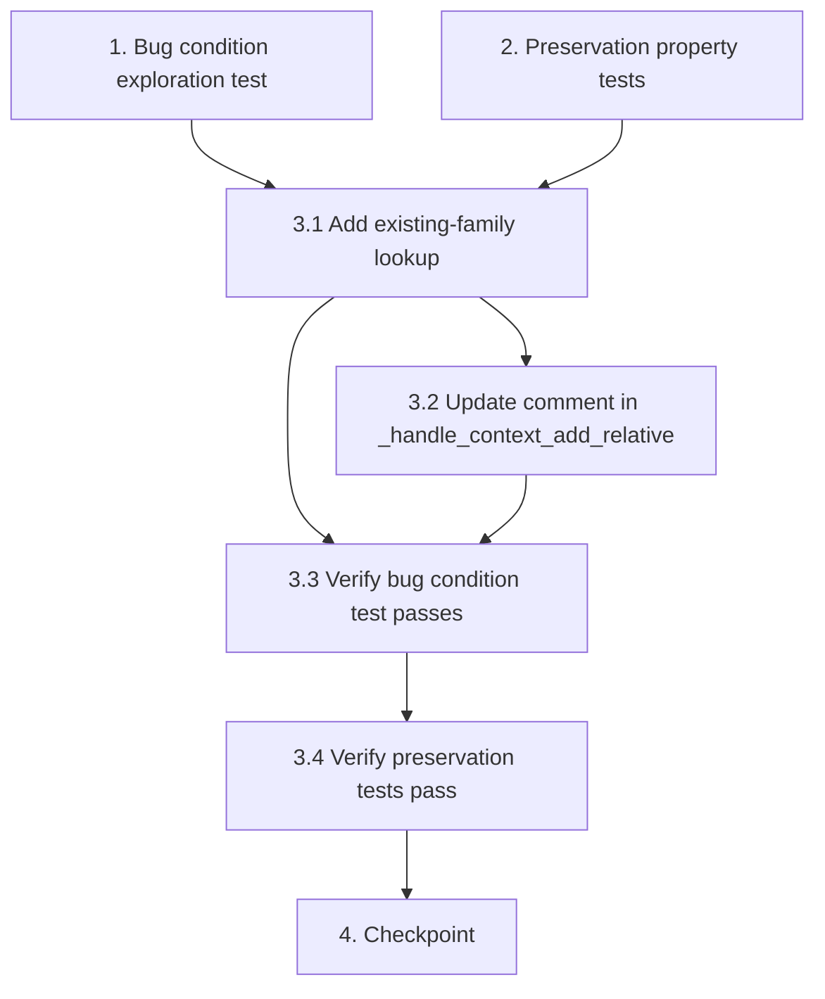

# Implementation Plan

## Overview

This plan fixes the bug where adding parents sequentially to a child (e.g., first a father, then a mother) via the context menu or diagram placeholder creates separate single-parent families instead of placing both parents in the same family. The root cause is that `handle_placeholder_click` in `app.py` unconditionally creates a new family when `family_id` is empty, without first searching for an existing family where the child is already a member.

The fix adds a family lookup (mirroring `ParentService.add_parent`) so that when `family_id` is empty and the role is "father"/"mother", it first searches for an existing family containing the child before falling back to creating a new one.

The approach follows the exploratory bugfix workflow: write bug condition tests first (expect failure on unfixed code), write preservation tests (expect pass on unfixed code), then implement the fix and verify both test sets pass.

## Tasks

- [x] 1. Write bug condition exploration test
  - **Property 1: Bug Condition** - Sequential Parent Addition Creates Duplicate Families
  - **CRITICAL**: This test MUST FAIL on unfixed code - failure confirms the bug exists
  - **DO NOT attempt to fix the test or the code when it fails**
  - **NOTE**: This test encodes the expected behavior - it will validate the fix when it passes after implementation
  - **GOAL**: Surface counterexamples that demonstrate the bug exists
  - **Scoped PBT Approach**: Scope the property to the concrete failing case: call `handle_placeholder_click` with role="father"/"mother", `family_id=""`, where the child already exists in an existing family
  - Test that for all inputs satisfying isBugCondition(input):
    - Set up project data with a child (P1) already in a family (family_1) with one parent (P2)
    - Call `handle_placeholder_click` with role="mother" (or "father"), `family_id=""`, `active_id=P1`
    - Assert that after the operation, the child P1 exists in exactly ONE family as a child (from Expected Behavior in design: the new parent is added to the existing family)
    - Assert that the existing family now has both parents as partners
    - Assert that `parent_child_links` for both parents exist in the same family
  - Run test on UNFIXED code
  - **EXPECTED OUTCOME**: Test FAILS (this is correct - it proves the bug exists)
  - Document counterexamples found:
    - Two separate families created: family_1 with father+child, family_2 with mother+child
    - The `else` branch in `handle_placeholder_click` unconditionally creates a new family without searching existing families
    - Context menu always passes `family_id=""`, triggering the bug every time a second parent is added
  - Mark task complete when test is written, run, and failure is documented
  - _Requirements: 1.1, 1.2, 2.1, 2.2_

- [x] 2. Write preservation property tests (BEFORE implementing fix)
  - **Property 2: Preservation** - Non-Bug-Condition Operations Unchanged
  - **IMPORTANT**: Follow observation-first methodology
  - **Step 1 — Observe behavior on UNFIXED code for non-buggy inputs:**
    - Observe: Adding a parent (role="father"/"mother") when child has NO existing family → new family created with parent as partner and child in children list
    - Observe: Adding a parent with a valid non-empty `family_id` → parent added to that specified family
    - Observe: Adding a child (role="child") → child added to the specified or new family correctly
    - Observe: Adding a partner (role="partner") → new partner family created correctly
  - **Step 2 — Write property-based tests capturing observed behavior:**
    - Property: For all first-parent additions (no existing family contains the child), a new family is created with the parent as partner, the child in children list, and a parent_child_link
    - Property: For all parent additions with non-empty `family_id`, the parent is added as a partner to the specified family (regardless of whether child is already in another family)
    - Property: For all child role additions, the child is added to the family correctly
    - Property: For all partner role additions, a new family is created with the new person as partner
  - **Step 3 — Verify tests PASS on unfixed code**
  - Run tests on UNFIXED code
  - **EXPECTED OUTCOME**: Tests PASS (this confirms baseline behavior to preserve)
  - Mark task complete when tests are written, run, and passing on unfixed code
  - _Requirements: 3.1, 3.2, 3.3, 3.4, 3.5_

- [x] 3. Fix for duplicate family creation on sequential parent addition

  - [x] 3.1 Add existing-family lookup in `handle_placeholder_click` for parent roles with empty `family_id`
    - In `slaktbusken/app.py`, in the `handle_placeholder_click` method, in the `else` branch (when `family_id` is empty) for role "father"/"mother":
    - Before creating a new family, search `data.families` for an existing family where `active_id` is in `family.children`
    - If an existing family is found:
      - Append a `FamilyPartner(person_id=saved.id, role=partner_role)` to the existing family's `partners` list
      - Append a `ParentChildLink(child_id=active_id, parent_id=saved.id, parentage_type="biological")` to the existing family's `parent_child_links`
    - If no existing family is found (first parent addition):
      - Keep the current new-family creation logic as fallback
    - ```python
      # Search for existing family where child is already a member
      existing_family = None
      for f in data.families:
          if active_id in f.children:
              existing_family = f
              break
      
      if existing_family:
          existing_family.partners.append(
              FamilyPartner(person_id=saved.id, role=partner_role)
          )
          existing_family.parent_child_links.append(
              ParentChildLink(child_id=active_id, parent_id=saved.id, parentage_type="biological")
          )
      else:
          # Existing new-family creation logic (first parent)
          ...
      ```
    - _Bug_Condition: isBugCondition(input) where role IN ['father', 'mother'] AND family_id == '' AND active_id exists as child in an existing family_
    - _Expected_Behavior: New parent added as partner to existing family; parent_child_link created in same family_
    - _Preservation: When no existing family contains the child, new family is still created (first parent addition)_
    - _Requirements: 2.1, 2.2, 3.1_

  - [x] 3.2 Update comment in `_handle_context_add_relative`
    - In `slaktbusken/app.py`, update the comment in `_handle_context_add_relative` that says "handle_placeholder_click will create a new family" to reflect the new search-first behavior
    - New comment should indicate that `handle_placeholder_click` will first search for an existing family containing the child before creating a new one
    - _Requirements: 2.1_

  - [x] 3.3 Verify bug condition exploration test now passes
    - **Property 1: Expected Behavior** - Sequential Parent Addition Uses Existing Family
    - **IMPORTANT**: Re-run the SAME test from task 1 - do NOT write a new test
    - The test from task 1 encodes the expected behavior
    - When this test passes, it confirms:
      - Adding a second parent via context menu (empty `family_id`) now finds and uses the existing family
      - The child exists in exactly one family with both parents as partners
      - Both parent_child_links exist in the same family
    - Run bug condition exploration test from step 1
    - **EXPECTED OUTCOME**: Test PASSES (confirms bug is fixed)
    - _Requirements: 2.1, 2.2_

  - [x] 3.4 Verify preservation tests still pass
    - **Property 2: Preservation** - Non-Bug-Condition Operations Unchanged
    - **IMPORTANT**: Re-run the SAME tests from task 2 - do NOT write new tests
    - Run preservation property tests from step 2
    - **EXPECTED OUTCOME**: Tests PASS (confirms no regressions)
    - Confirm:
      - First parent addition (no existing family) still creates new family correctly
      - Valid `family_id` parent additions still add to specified family
      - Child role additions still work correctly
      - Partner role additions still create new partner family
      - Person editor `ParentService.add_parent` flow unaffected
    - _Requirements: 3.1, 3.2, 3.3, 3.4, 3.5_

- [~] 4. Checkpoint - Ensure all tests pass
  - Run full test suite to ensure no regressions
  - Verify bug condition exploration test passes (sequential parent addition no longer creates duplicate families)
  - Verify preservation tests pass (first-parent creation, valid family_id additions, child additions, and partner additions all unchanged)
  - Verify `ParentService.add_parent` in person editor still works correctly (independent path, should be unaffected)
  - Ensure all tests pass, ask the user if questions arise.

## Task Dependency Graph

```json
{
  "waves": [
    {
      "wave": 1,
      "tasks": ["1", "2"],
      "description": "Write exploration and preservation tests before fix"
    },
    {
      "wave": 2,
      "tasks": ["3.1", "3.2"],
      "description": "Implement family lookup and update comment"
    },
    {
      "wave": 3,
      "tasks": ["3.3", "3.4"],
      "description": "Verify tests pass after fix"
    },
    {
      "wave": 4,
      "tasks": ["4"],
      "description": "Final checkpoint - all tests pass"
    }
  ]
}
```



## Notes

- The exploration test (task 1) is expected to FAIL on unfixed code — this confirms the bug exists. Do not treat failure as an error.
- Preservation tests (task 2) must PASS on unfixed code before any changes are made, establishing the behavioral baseline.
- The fix is minimal: add a family lookup loop (matching `ParentService.add_parent` pattern) in the `else` branch of `handle_placeholder_click` when role is "father"/"mother" and `family_id` is empty.
- The existing `ParentService.add_parent` (person editor path) already has correct behavior and should remain unchanged — this fix only affects the `handle_placeholder_click` code path used by context menu and diagram placeholder clicks.
- The context menu (`_handle_context_add_relative`) always passes `family_id=""`, which is the primary trigger for this bug when adding a second parent.
- Property-based testing with Hypothesis is used for preservation tests to generate varied family configurations and role inputs, providing stronger guarantees than manual unit tests alone.
- Tasks 3.3 and 3.4 re-run existing tests from tasks 1 and 2 — no new tests should be written at that stage.
