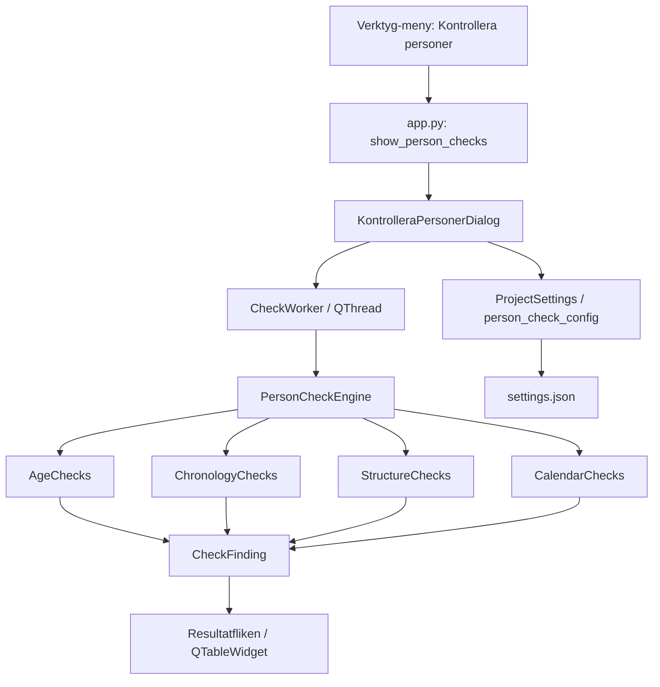
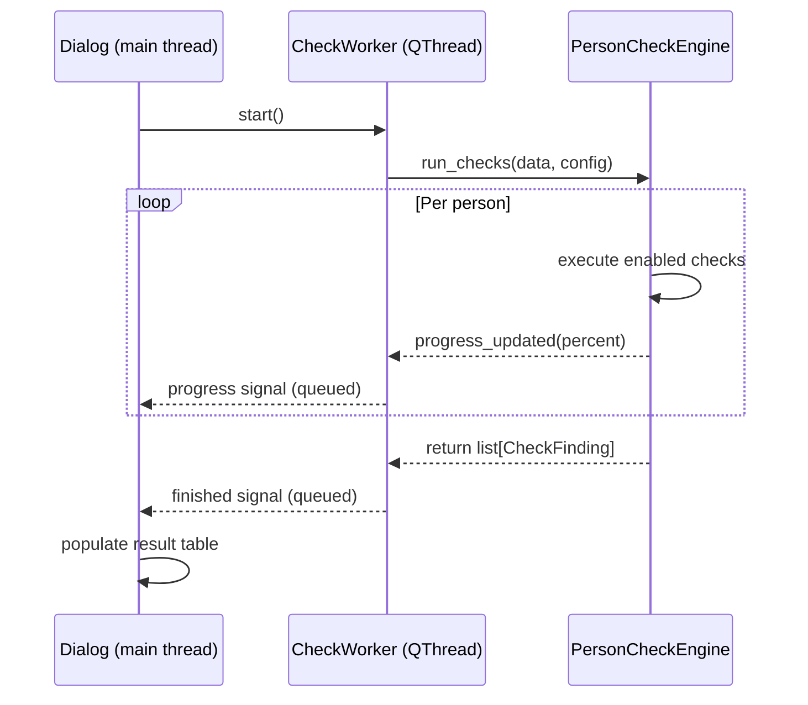

# Design Document: Kontrollera Personer

## Overview

Funktionen "Kontrollera personer" lägger till en komplett personvalideringsmotor i Släktbusken som identifierar datakvalitetsproblem genom konfigurerbar åldersvalidering, kronologiska kontroller, strukturella grafinspektioner och svenska kalendervalideringar. Arkitekturen bygger på en pluggbar kontrollmotor (`PersonCheckEngine`) som körs i en `QThread`-worker för att hålla UI:t responsivt, med resultat som presenteras i en treflikad modal dialog.

Designen följer befintliga mönster: ny `QAction` i Verktyg-menyn, modal dialog i `ui/dialogs/`, ren affärslogik i `services/`, och inställningsbeständighet via utökning av `ProjectSettings`.

## Architecture

### Dataflödesdiagram



### Trådningsmodell



## Components and Interfaces

### Nya moduler

| Modul | Sökväg | Ansvar |
|-------|--------|--------|
| `PersonCheckEngine` | `services/person_check_engine.py` | Orkestrera kontroller, iterera personer |
| `AgeChecks` | `services/checks/age_checks.py` | Alla åldersrelaterade kontroller |
| `ChronologyChecks` | `services/checks/chronology_checks.py` | Kronologiska datumkontroller |
| `StructureChecks` | `services/checks/structure_checks.py` | Incest, isolering, cykler, koppling |
| `CalendarChecks` | `services/checks/calendar_checks.py` | Svensk kalender, filändelsevalidering |
| `DateUtils` | `services/checks/date_utils.py` | Datumparsning, jämförelse, åldersberäkning |
| `CheckWorker` | `ui/workers/check_worker.py` | QThread-wrapper för bakgrundsexekvering |
| `KontrolleraPersonerDialog` | `ui/dialogs/kontrollera_personer_dialog.py` | Treflikad dialog med resultat/konfiguration |
| `PersonCheckConfig` | `persistence/settings_io.py` (tillägg) | Dataclass för kontrollkonfiguration |

### Gränssnitt: PersonCheckEngine

```python
@dataclass
class CheckFinding:
    """Ett identifierat dataproblem."""
    person_id: str
    person_display: str  # "Förnamn Efternamn (YYYY–YYYY)"
    person_sex: str      # "M", "F", "U"
    message: str         # Påpekandetext

class PersonCheckEngine:
    """Kontrollmotor som kör alla aktiverade kontroller."""

    def __init__(self, data: ProjectData, config: PersonCheckConfig) -> None: ...

    def run_checks(
        self, progress_callback: Callable[[int], None] | None = None
    ) -> list[CheckFinding]:
        """Kör alla aktiverade kontroller och returnera fynd."""
        ...
```

### Gränssnitt: Individuella kontrollmoduler

Varje kontrollmodul exponerar en funktion med signaturen:

```python
def check_<name>(
    person: Person,
    events: list[Event],    # personens händelser
    families: list[Family], # familjer personen ingår i
    config: PersonCheckConfig,
    context: CheckContext,  # lookup-tabeller, alla personer, etc.
) -> list[CheckFinding]:
    ...
```

`CheckContext` är en hjälpklass som byggs en gång per körning:

```python
@dataclass
class CheckContext:
    """Förberäknade lookup-tabeller för effektiv kontrollexekvering."""
    persons_by_id: dict[str, Person]
    events_by_id: dict[str, Event]
    events_by_person: dict[str, list[Event]]  # person_id -> events
    families_by_person: dict[str, list[Family]]  # person_id -> families
    parents_of: dict[str, list[str]]  # child_id -> parent_ids
    children_of: dict[str, list[str]]  # parent_id -> child_ids
    siblings_of: dict[str, set[str]]  # person_id -> sibling_ids
    project_folder: Path | None
    main_person_id: str | None
    current_year: int
```

### Gränssnitt: CheckWorker

```python
class CheckWorker(QThread):
    """Bakgrundstråd som kör PersonCheckEngine."""
    progress_updated = Signal(int)   # 0-100
    finished = Signal(list)          # list[CheckFinding]

    def __init__(self, data: ProjectData, config: PersonCheckConfig,
                 project_folder: Path | None) -> None: ...
    def run(self) -> None: ...
```

### Integration med befintlig arkitektur

**app.py** — Ny metod:
```python
def show_person_checks(self) -> None:
    """Öppna Kontrollera personer-dialogen."""
    from slaktbusken.ui.dialogs.kontrollera_personer_dialog import (
        KontrolleraPersonerDialog,
    )
    config = self.project_service.settings.person_check_config
    dialog = KontrolleraPersonerDialog(
        data=self.project_service.data,
        config=config,
        project_folder=(
            self.project_service.project_path.parent
            if self.project_service.project_path else None
        ),
        parent=self.main_window,
    )
    dialog.exec()
    # Spara uppdaterad konfiguration
    self.project_service.settings.person_check_config = dialog.config
    self.project_service.save_settings()
```

**main_window.py** — Nya tillägg:
- `action_person_checks` QAction i `_setup_actions()` med text "Kontrollera &personer..."
- Tillagd i `menu_tools` efter `action_relationship`
- Aktiveras/inaktiveras i `_update_project_actions()`

**Navigering vid dubbelklick:** Dialog anropar `self._app.main_window.diagram_panel.set_active_person(person_id)` och stänger sig själv via `self.accept()`.

## Data Models

### PersonCheckConfig

Tillägg till `ProjectSettings` i `persistence/settings_io.py`:

```python
@dataclass
class AgeCheckThreshold:
    """Tröskelvärden för en ålderskontroll, separerade per kön."""
    enabled: bool = True
    male: int = 0
    female: int = 0

@dataclass
class AgeCheckConfig:
    """Konfiguration för alla ålderskontroller."""
    master_enabled: bool = True
    max_age: AgeCheckThreshold = field(
        default_factory=lambda: AgeCheckThreshold(True, 130, 130)
    )
    max_age_at_baptism: AgeCheckThreshold = field(
        default_factory=lambda: AgeCheckThreshold(True, 1, 1)
    )
    min_age_at_marriage: AgeCheckThreshold = field(
        default_factory=lambda: AgeCheckThreshold(True, 12, 12)
    )
    max_age_at_marriage: AgeCheckThreshold = field(
        default_factory=lambda: AgeCheckThreshold(True, 110, 110)
    )
    max_partner_age_diff: int = 50
    max_partner_age_diff_enabled: bool = True
    min_age_at_childbirth: AgeCheckThreshold = field(
        default_factory=lambda: AgeCheckThreshold(True, 12, 12)
    )
    max_age_at_childbirth: AgeCheckThreshold = field(
        default_factory=lambda: AgeCheckThreshold(True, 80, 60)
    )
    min_days_between_births: int = 240
    min_days_between_births_enabled: bool = True
    max_days_death_to_burial: AgeCheckThreshold = field(
        default_factory=lambda: AgeCheckThreshold(True, 365, 365)
    )
```

```python
@dataclass
class LogicCheckConfig:
    """Konfiguration för logiska/strukturella kontroller."""
    reasonable_dates: bool = True
    no_event_before_birth: bool = True
    burial_not_before_death: bool = True
    only_burial_after_death: bool = True
    no_own_events_after_death: bool = True
    birth_not_after_parent_death: bool = True
    no_event_before_parent_birth: bool = True
    no_incest: bool = True
    must_have_relations: bool = True
    no_ancestor_cycle: bool = True
    media_files_exist: bool = True
    valid_swedish_calendar: bool = True
    connected_to_main_person: bool = True

@dataclass
class PersonCheckConfig:
    """Samlad konfiguration för alla personkontroller."""
    age_checks: AgeCheckConfig = field(default_factory=AgeCheckConfig)
    logic_checks: LogicCheckConfig = field(default_factory=LogicCheckConfig)
```

Fältet läggs till i `ProjectSettings`:
```python
@dataclass
class ProjectSettings:
    # ... befintliga fält ...
    person_check_config: PersonCheckConfig = field(
        default_factory=PersonCheckConfig
    )
```

Deserialiseringen i `_deserialize_settings()` utökas med samma mönster som övriga fält: `data.get("person_check_config", {})` med fallback till defaults för saknade nycklar. Detta garanterar framåtkompatibilitet (Req 10.4).

### CheckFinding

```python
@dataclass
class CheckFinding:
    """Ett påpekande om ett identifierat dataproblem."""
    person_id: str
    person_display: str  # "Förnamn Efternamn (YYYY–YYYY)"
    person_sex: str      # "M" | "F" | "U"
    message: str         # Beskrivande text på svenska
```

### DateUtils — Datumparsning och jämförelse

```python
@dataclass
class ParsedDate:
    """Parserat datum med precisionsinformation."""
    year: int
    month: int | None = None  # 1-12
    day: int | None = None    # 1-31
    precision: str = "exact"  # "exact", "about", "before", "after"

def parse_date_value(dv: DateValue) -> ParsedDate | None:
    """Parsa en DateValue till ett ParsedDate, eller None om oparsbart."""
    ...

def age_in_years(birth: ParsedDate, event: ParsedDate) -> int | None:
    """Beräkna ålder i hela år. None om precision ej tillräcklig."""
    ...

def days_between(d1: ParsedDate, d2: ParsedDate) -> int | None:
    """Beräkna antal dagar mellan två datum. None om dag saknas."""
    ...

def compare_dates(d1: ParsedDate, d2: ParsedDate) -> int | None:
    """Jämför datum på gemensam precision.
    Returnerar <0 om d1 före d2, 0 om lika, >0 om d1 efter d2.
    None om precision ej tillåter jämförelse."""
    ...

def is_valid_swedish_calendar(d: ParsedDate) -> bool:
    """Validera mot svenska kalendern.
    Julianisk t.o.m. 1753-02-17, gregoriansk fr.o.m. 1753-03-01.
    Datum 1753-02-18 till 1753-02-28 existerar inte."""
    ...
```

### Svensk kalendervalidering — detaljerad logik

Sverige övergick från juliansk till gregoriansk kalender 1753. Den sista juliska dagen var 17 februari 1753 och den första gregorianska var 1 mars 1753 (11 dagar hoppades över).

Valideringsregler:
1. Datum med år < 1753: validera som julianiskt (februaridagar max 29 på skottår, skottår = delbart med 4)
2. Datum 1753-02-18 till 1753-02-28: **ogiltiga** (existerar inte)
3. Datum med år > 1753, eller 1753 med månad >= 3: validera som gregorianskt
4. Skottårsberäkning (gregorianskt): delbart med 4, ej delbart med 100, undantag delbart med 400

### Grafalgoritmer

**Ancestor cycle detection (Req 9.3):**
BFS uppåt från varje person genom `parents_of`-tabellen. Om personen själv påträffas i den besökta mängden finns en cykel. Tack vare `visited`-set som förhindrar oändlig loop terminerar algoritmen alltid.

```python
def has_ancestor_cycle(person_id: str, parents_of: dict[str, list[str]]) -> bool:
    visited: set[str] = set()
    queue = deque(parents_of.get(person_id, []))
    while queue:
        current = queue.popleft()
        if current == person_id:
            return True
        if current in visited:
            continue
        visited.add(current)
        queue.extend(parents_of.get(current, []))
    return False
```

**Connectivity to main person (Req 9.6):**
BFS från huvudpersonen genom alla familjerelationer (partner, barn, föräldrar) bilateralt. Alla person-ID:n som **inte** besöks saknar koppling.

```python
def find_disconnected_persons(
    main_person_id: str,
    all_person_ids: set[str],
    families: list[Family],
) -> set[str]:
    # Bygg adjacency: person_id -> set[person_id] (alla familjemedlemmar)
    adjacency: dict[str, set[str]] = defaultdict(set)
    for fam in families:
        members = {p.person_id for p in fam.partners} | set(fam.children)
        for m in members:
            adjacency[m].update(members - {m})

    # BFS
    visited: set[str] = set()
    queue = deque([main_person_id])
    visited.add(main_person_id)
    while queue:
        current = queue.popleft()
        for neighbor in adjacency.get(current, set()):
            if neighbor not in visited:
                visited.add(neighbor)
                queue.append(neighbor)

    return all_person_ids - visited
```

**Incest detection (Req 9.1):**
För varje familj med partners: kontrollera om partners delar en förälder (halv-/helsyskon) eller om den ene är förälder till den andre. Använder `parents_of` och `siblings_of` lookup-tabeller.

### Dialogstruktur (UI)

```mermaid
graph TD
    D[KontrolleraPersonerDialog] --> T[QTabWidget]
    T --> R[Resultatfliken]
    T --> A[Åldersfliken]
    T --> F[Fler kontroller-fliken]
    R --> RT[QTableWidget: Person, Påpekande]
    R --> RS[QLabel: Antal påpekanden: X]
    A --> AM[QCheckBox: Utför kontroller]
    A --> AC[QScrollArea med individuella kontroller]
    AC --> AC1[Kryssruta + QSpinBox Män + QSpinBox Kvinnor per kontroll]
    F --> FC[QScrollArea med 13 kryssrutor]
    D --> B[QHBoxLayout: Stäng | Kontrollera | Hjälp]
    D --> P[QProgressBar: dold tills körning]
```

**Resultatfliken:**
- `QTableWidget` med kolumner "Person" (ikon + namn) och "Påpekande"
- `QLabel` statusrad "Antal påpekanden: X"
- Dubbelklick-signal kopplad till navigering

**Åldersfliken:**
- Master `QCheckBox` "Utför kontroller" styr `.setEnabled()` på alla barn
- `QFormLayout` med varje kontroll som en rad: kryssruta, label, spinboxar
- `QSpinBox` med `setRange(0, 999)` respektive `setRange(0, 9999)` för dagar

**Fler kontroller-fliken:**
- `QVBoxLayout` med 13 `QCheckBox` i specificerad ordning

### Personvisningsformat

Funktionen `format_person_display(person, events)` genererar strängen:
```
"Förnamn Efternamn (YYYY–YYYY)"
```
- Födelseår från BIRTH-event, dödsår från DEATH-event
- Saknat år ersätts med "?"
- Ikonen bestäms av `person.sex`: "M" → man-ikon, "F" → kvinna-ikon, annat → neutral

## Correctness Properties

*A property is a characteristic or behavior that should hold true across all valid executions of a system — essentially, a formal statement about what the system should do. Properties serve as the bridge between human-readable specifications and machine-verifiable correctness guarantees.*

### Property 1: Settings serialization round-trip

*For any* valid `PersonCheckConfig` instance (with thresholds in range 0–999/0–9999 and boolean flags), serializing to dict and deserializing back SHALL produce an equivalent configuration. Additionally, for any partial dict missing some keys, deserialization SHALL fill missing keys with defaults while preserving existing values.

**Validates: Requirements 4.6, 5.6, 7.2, 10.1, 10.2, 10.4**

### Property 2: Person display format

*For any* person with zero or more names and zero or more birth/death events, `format_person_display()` SHALL produce a string matching the pattern `"<given> <surname> (<birth_year>–<death_year>)"` where missing years are replaced with "?" and the name is taken from the first name entry (or empty string if no names).

**Validates: Requirements 3.2**

### Property 3: Results grouped per person

*For any* list of `CheckFinding` results produced by `PersonCheckEngine`, all findings for the same `person_id` SHALL appear as a contiguous group in the output list.

**Validates: Requirements 3.7**

### Property 4: Age check threshold comparison

*For any* person with the required dates present and *for any* age check type with a configured threshold, the check SHALL produce a finding if and only if the computed value (age in years, or interval in days) violates the threshold for that person's sex. If the computed value does not violate the threshold, no finding SHALL be produced.

**Validates: Requirements 6.1, 6.2, 6.3, 6.4, 6.5, 6.6, 6.7, 6.8, 6.9**

### Property 5: Disabled or inapplicable checks produce no findings

*For any* project data and configuration where a check is disabled (either via individual checkbox or master toggle), or where required dates are missing for a specific person, that check SHALL produce zero findings for that person/check combination.

**Validates: Requirements 4.2, 6.10, 7.4**

### Property 6: Reasonable date range

*For any* event with a date, if the year is less than 1000 or greater than the current year, and the "Rimliga datum" check is enabled, the engine SHALL produce a finding. If the year is in range [1000, current_year], no finding SHALL be produced by this check.

**Validates: Requirements 8.1**

### Property 7: Chronological order violations

*For any* person with a birth date and one or more other events, if an event's date precedes birth (and the relevant check is enabled), a finding SHALL be produced. Similarly, for any person with a death date, events after death that are not Begravning/Bouppteckning/Testamente SHALL produce findings. For parent-child pairs, a child's birth more than 270 days after a parent's death SHALL produce a finding, and a person's event before a parent's birth SHALL produce a finding.

**Validates: Requirements 8.2, 8.3, 8.4, 8.5, 8.6, 8.7**

### Property 8: Date precision comparison

*For any* two `DateValue` instances where one or both lack day or month components, date comparison SHALL be performed at the most specific common precision (year-only or year-month). A chronological violation SHALL only be flagged if it is unambiguously impossible at the available precision level.

**Validates: Requirements 8.8**

### Property 9: Incest detection

*For any* family where two partners share at least one parent (siblings/half-siblings) or where one partner is the parent of the other, and the incest check is enabled, a finding SHALL be produced. For families where partners have no such relationship, no incest finding SHALL be produced.

**Validates: Requirements 9.1**

### Property 10: Isolated person detection

*For any* person who does not appear in any `Family` (not as partner, child, or via parent_child_links), and the "must have relations" check is enabled, a finding SHALL be produced. For persons appearing in at least one family, no isolation finding SHALL be produced.

**Validates: Requirements 9.2**

### Property 11: Ancestor cycle detection

*For any* family graph containing a cycle (a person is their own ancestor through parent-child links), and the cycle check is enabled, a finding SHALL be produced for that person. For acyclic graphs, no cycle finding SHALL be produced.

**Validates: Requirements 9.3**

### Property 12: Swedish calendar validation

*For any* date, if it falls in the non-existent range 1753-02-18 to 1753-02-28, or is an invalid day-of-month for the applicable calendar system (Julian for dates ≤ 1753-02-17, Gregorian for dates ≥ 1753-03-01), and the Swedish calendar check is enabled, a finding SHALL be produced. For valid dates according to the Swedish calendar, no finding SHALL be produced by this check.

**Validates: Requirements 9.5**

### Property 13: Connectivity to main person

*For any* project with a defined main person, all persons not reachable via BFS through family relationships from the main person SHALL produce a finding when the connectivity check is enabled. All reachable persons SHALL produce no such finding.

**Validates: Requirements 9.6**

### Property 14: Input validation rejects out-of-range values

*For any* integer value outside the allowed range (0–999 for age thresholds, 0–9999 for day thresholds), the configuration input SHALL reject the value and retain the previous valid value. For values within range, the input SHALL be accepted.

**Validates: Requirements 5.8**

## Error Handling

| Scenario | Hantering |
|----------|-----------|
| Oparsbart datum (DateValue.value kan ej tolkas) | Hoppa över kontrollen för den personen; logga varning |
| Saknad fil (media_files_exist check) | Skapa `CheckFinding` med filnamn i meddelande |
| Ingen huvudperson definierad + kopplingscheck aktiv | Hoppa över kopplingscheck utan fynd (Req 9.7) |
| Sparning av inställningar misslyckas (IOError) | Visa `QMessageBox.warning`, stäng dialogen ändå (Req 10.5) |
| Tom person-lista (inga personer i projektet) | Returnera tom lista utan fel |
| Cirkulär familjegraf (oändlig loop-risk) | `visited`-set i alla BFS-funktioner förhindrar oändlig loop |
| QThread avbryts (dialog stängs under körning) | Worker kontrollerar `isInterruptionRequested()` i loopen, returnerar partiella resultat |

## Testing Strategy

### Property-Based Testing (Hypothesis)

Projektet använder redan Hypothesis (`.hypothesis/`-mappen existerar). Property-tester ska skrivas med `hypothesis` och konfigureras med minst 100 exempel per property (`@settings(max_examples=200)`).

**Testbibliotek:** `hypothesis` (redan installerat)

**Taggformat:** Varje property-test ska inleda med en kommentar:
```python
# Feature: kontrollera-personer, Property N: <property_text>
```

**Property-tester som ska implementeras:**

| Property | Modul under test | Generator-strategi |
|----------|-----------------|-------------------|
| 1: Settings round-trip | `settings_io.py` | Generera slumpmässig `PersonCheckConfig` med giltiga värden |
| 2: Person display format | `person_check_engine.py` | Generera `Person` + events med varierade namn/datum |
| 3: Results grouped per person | `person_check_engine.py` | Generera projektdata med kända problem, verifiera gruppering |
| 4: Age threshold comparison | `checks/age_checks.py` | Generera person + event-par med kända åldrar vs tröskelvärden |
| 5: Disabled checks no findings | `person_check_engine.py` | Generera data + config med slumpmässigt avaktiverade checks |
| 6: Reasonable date range | `checks/chronology_checks.py` | Generera `DateValue` med år i och utanför intervallet |
| 7: Chronological violations | `checks/chronology_checks.py` | Generera person + events med kända kronologiska relationer |
| 8: Date precision | `checks/date_utils.py` | Generera `ParsedDate`-par med varierande precision |
| 9: Incest detection | `checks/structure_checks.py` | Generera familjegraf med/utan syskon-/förälderrelation bland partners |
| 10: Isolated person | `checks/structure_checks.py` | Generera person + familjer med/utan kopplingar |
| 11: Ancestor cycle | `checks/structure_checks.py` | Generera riktad graf med/utan cykler |
| 12: Swedish calendar | `checks/calendar_checks.py` | Generera datum kring 1753-övergången + ogiltiga dag-i-månad |
| 13: Connectivity | `checks/structure_checks.py` | Generera familjegraf + huvudperson, verifiera nåbarhet |
| 14: Input validation | Dialog/config-nivå | Generera heltal utanför/innanför tillåtna intervall |

### Enhetstester (pytest)

Specifika exempel och edge cases:

- Standardvärden vid första användning (Req 5.5, 10.3)
- Dialogen öppnar rätt flik (Req 2.2)
- Menu item disabled/enabled med projektstatus (Req 1.2, 1.3)
- Hjälp-knappen visar information (Req 2.7)
- Dubbelklick navigerar till person (Req 3.6)
- Tom resultatlista vid inga aktiverade kontroller (Req 2.6)
- Kontroll hoppas över vid saknad huvudperson (Req 9.7)
- Framstegsindikator visas/döljs korrekt (Req 11.1, 11.4)

### Integrationstester

- Fullständig kontrollkörning mot en projektfil med kända problem
- Prestanda-test: 10 000 personer under 30 sekunder (Req 11.5)
- UI-responsivitet: worker-thread frigör main thread under exekvering (Req 11.2)
