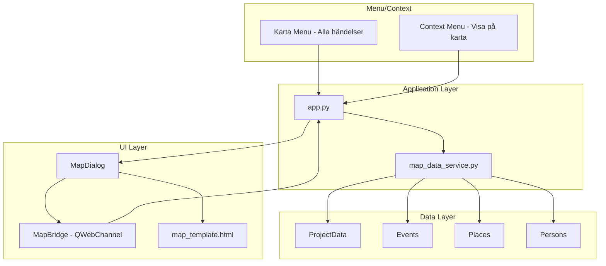

# Design Document: Map View

## Overview

This design covers a map view feature for Släktbusken that visualizes events geographically. The implementation uses Leaflet.js rendered inside a PySide6 QWebEngineView with QWebChannel for bidirectional Python↔JavaScript communication. The feature has two entry points: a person-specific map (from the right-click context menu) and a project-wide map (from a new "Karta" top-level menu).

The core principle is **one marker per place** — clicking a marker reveals all events at that location with their participants, and participant names are clickable links that navigate back to the person in the application.

### Design Rationale

- **Leaflet.js + QWebEngineView** over Folium: Folium generates display-only maps. The requirement for interactive callbacks (click person → navigate in app) needs QWebChannel, which requires direct control of the JavaScript. Leaflet.js is lightweight (BSD-2), no API key needed.
- **QWebChannel for navigation**: Allows JavaScript click handlers to call Python methods, enabling the "click person name → close dialog → navigate" flow without polling or fragile URL interception.
- **One marker per place with event grouping**: Keeps the map readable for projects with many events at the same location (typical in genealogy — births, deaths, marriages at the same church).
- **Modal dialog**: Consistent with existing editor dialogs in the application (place editor, DNA editor, relationship dialog).

## Architecture



### Key Architectural Decisions

1. **Pure data service for marker building**: A `map_data_service.py` module in `slaktbusken/services/` handles the logic of gathering events, grouping by place, resolving participant names — all without Qt dependencies. This makes it independently testable.

2. **HTML template with injected data**: The map is rendered from an HTML template where marker data is injected as a JSON variable before loading into QWebEngineView. No server needed.

3. **QWebChannel bridge**: A `MapBridge` QObject is registered with the web channel so JavaScript can call `bridge.navigateToPerson(personId)` when a user clicks a participant name.

4. **Separation of entry points**: Both entry points (person map, project map) use the same `MapDialog` class — they differ only in the marker data passed to it (filtered vs. full).

## Components and Interfaces

### New Pure Logic Module

#### `slaktbusken/services/map_data_service.py`

```python
"""Service for building map marker data from project events and places."""

from __future__ import annotations

from dataclasses import dataclass, field
from typing import Optional

from slaktbusken.model.event import Event
from slaktbusken.model.project import ProjectData


@dataclass
class MapParticipant:
    """A participant to display in a map event card."""
    person_id: str
    display_name: str  # "given surname" or "(okänd)"


@dataclass
class MapEvent:
    """An event to display in a map marker popup."""
    event_id: str
    event_type: str
    event_type_display: str  # Swedish display name
    date_display: Optional[str]  # Formatted date string or None
    participants: list[MapParticipant]


@dataclass
class MapMarker:
    """A single map marker representing one place with its events."""
    place_id: str
    place_name: str
    latitude: float
    longitude: float
    events: list[MapEvent] = field(default_factory=list)


def build_markers_for_person(data: ProjectData, person_id: str) -> list[MapMarker]:
    """Build map markers for all places where a person has events.

    Filters events to those where person_id is a participant,
    then groups by place, resolving place coordinates and participant names.
    Only includes places with non-null latitude and longitude.

    Args:
        data: The full project data.
        person_id: The person to filter events for.

    Returns:
        List of MapMarker objects, one per qualifying place.
    """
    ...


def build_markers_all_events(data: ProjectData) -> list[MapMarker]:
    """Build map markers for all places in the project that have events.

    Groups all events by place, resolving coordinates and participant names.
    Only includes places with non-null latitude and longitude.

    Args:
        data: The full project data.

    Returns:
        List of MapMarker objects, one per qualifying place.
    """
    ...


def markers_to_json(markers: list[MapMarker]) -> str:
    """Serialize markers to JSON string for injection into the HTML template.

    Returns a JSON array suitable for use in JavaScript.
    """
    ...
```

### New UI Components

#### `slaktbusken/ui/dialogs/map_dialog.py`

```python
"""Map dialog for displaying events on an interactive Leaflet map."""

from __future__ import annotations

from PySide6.QtCore import QObject, Signal, Slot
from PySide6.QtWebChannel import QWebChannel
from PySide6.QtWebEngineWidgets import QWebEngineView
from PySide6.QtWidgets import QDialog, QVBoxLayout

from slaktbusken.services.map_data_service import MapMarker


class MapBridge(QObject):
    """Bridge object exposed to JavaScript via QWebChannel.

    Allows the Leaflet map to call back into Python when
    a user clicks a participant name in a marker popup.
    """

    navigate_to_person = Signal(str)  # Emits person_id

    @Slot(str)
    def navigateToPerson(self, person_id: str) -> None:
        """Called from JavaScript when a participant link is clicked."""
        self.navigate_to_person.emit(person_id)


class MapDialog(QDialog):
    """Modal dialog displaying an interactive map with event markers.

    Args:
        markers: List of MapMarker objects to display.
        title: Dialog window title.
        parent: Parent widget.
    """

    person_navigation_requested = Signal(str)  # Emits person_id

    def __init__(
        self,
        markers: list[MapMarker],
        title: str,
        parent=None,
    ) -> None:
        ...
```

#### `slaktbusken/ui/map_template.html` (static asset)

An HTML file containing:
- Leaflet.js and CSS loaded from CDN (with integrity hashes)
- A `<div id="map">` element
- JavaScript that:
  - Reads marker data from a `window.MARKER_DATA` variable (injected by Python)
  - Creates one Leaflet marker per place
  - Binds popups with event cards (type, date, clickable participant names)
  - Calls `bridge.navigateToPerson(id)` on participant click via QWebChannel
  - Fits map bounds to markers
  - Shows OpenStreetMap attribution

### Modified Components

#### `slaktbusken/ui/editors/place_editor.py` — Place Editor Changes

Add "Visa på karta" button beside the coordinates checkbox:

```python
# In the coordinate section setup (after coordinates_check):
self._btn_show_on_map = QPushButton("Visa på karta")
self._btn_show_on_map.setEnabled(False)
# Add to the layout beside coordinates_check
coordinates_layout.addWidget(self._btn_show_on_map)

# Connect enabled state to checkbox:
self._ui.coordinates_check.toggled.connect(self._btn_show_on_map.setEnabled)

# Connect click:
self._btn_show_on_map.clicked.connect(self._on_show_place_on_map)
```

Handler method:

```python
def _on_show_place_on_map(self) -> None:
    """Open a map dialog showing the current place's coordinates."""
    from slaktbusken.services.map_data_service import MapMarker
    from slaktbusken.ui.dialogs.map_dialog import MapDialog

    lat = self._ui.latitude_spin.value()
    lng = self._ui.longitude_spin.value()
    name = self._ui.name_input.text() or "(namnlös plats)"

    marker = MapMarker(
        place_id="preview",
        place_name=name,
        latitude=lat,
        longitude=lng,
        events=[],
    )
    dialog = MapDialog([marker], f"Karta — {name}", parent=self)
    dialog.exec()
```

### Coordinate Paste Handling

The latitude/longitude `QDoubleSpinBox` widgets use 6 decimal places and the Swedish locale (comma as decimal separator). To support pasting values from Arkiv Digital (period separator, arbitrary decimal places), a custom `QDoubleSpinBox` subclass or an event filter intercepts paste events:

```python
class CoordinateSpinBox(QDoubleSpinBox):
    """QDoubleSpinBox that accepts paste with period decimal separator."""

    def keyPressEvent(self, event):
        if event.matches(QKeySequence.StandardKey.Paste):
            clipboard = QApplication.clipboard()
            text = clipboard.text().strip()
            # Replace period with comma for locale compatibility,
            # then attempt to set the value
            normalized = text.replace(",", ".")
            try:
                value = float(normalized)
                # Round to spin box decimal precision
                value = round(value, self.decimals())
                if self.minimum() <= value <= self.maximum():
                    self.setValue(value)
            except ValueError:
                pass  # Reject invalid paste, retain current value
            return
        super().keyPressEvent(event)
```

This subclass replaces the default `QDoubleSpinBox` for both `latitude_spin` and `longitude_spin` in the place editor. It can be applied either by promoting the widgets in the .ui file or by replacing them programmatically at runtime.

#### `slaktbusken/ui/context_menu_builder.py`

Add "Visa på karta" action after "Filtrera på DNA-träffar":

```python
# After action_dna_filter:
action_show_map = menu.addAction("Visa på karta")
action_show_map.setData(("show_on_map", person_id))
```

#### `slaktbusken/ui/main_window.py` — `_setup_menu_bar()`

Add a new `&Karta` menu between "Verktyg" and "Rapporter":

```python
# After menu_tools setup, before ReportMenuBuilder:
self.menu_map = menu_bar.addMenu("&Karta")
self.menu_map.addAction(self.action_map_all_events)
```

Add action setup in `_setup_actions()`:

```python
self.action_map_all_events = QAction("Alla händelser", self)
self.action_map_all_events.triggered.connect(self._app.show_all_events_map)
```

#### `slaktbusken/app.py`

Add handler methods:

```python
def show_person_map(self, person_id: str) -> None:
    """Open map dialog showing places for a person's events."""
    from slaktbusken.services.map_data_service import build_markers_for_person
    from slaktbusken.ui.dialogs.map_dialog import MapDialog

    markers = build_markers_for_person(self.project_service.data, person_id)
    if not markers:
        QMessageBox.information(
            self.main_window,
            "Karta",
            "Personen har inga händelser kopplade till platser med koordinater.",
        )
        return

    person = next((p for p in self.project_service.data.persons if p.id == person_id), None)
    name = f"{person.names[0].given} {person.names[0].surname}" if person and person.names else person_id
    dialog = MapDialog(markers, f"Karta — {name}", parent=self.main_window)
    dialog.person_navigation_requested.connect(self._handle_map_navigation)
    dialog.exec()


def show_all_events_map(self) -> None:
    """Open map dialog showing all project events."""
    from slaktbusken.services.map_data_service import build_markers_all_events
    from slaktbusken.ui.dialogs.map_dialog import MapDialog

    markers = build_markers_all_events(self.project_service.data)
    if not markers:
        QMessageBox.information(
            self.main_window,
            "Karta",
            "Inga platser med koordinater och händelser hittades i projektet.",
        )
        return

    dialog = MapDialog(markers, "Karta — Alla händelser", parent=self.main_window)
    dialog.person_navigation_requested.connect(self._handle_map_navigation)
    dialog.exec()


def _handle_map_navigation(self, person_id: str) -> None:
    """Navigate to a person triggered from the map dialog."""
    person = next((p for p in self.project_service.data.persons if p.id == person_id), None)
    if person is None:
        QMessageBox.warning(self.main_window, "Karta", "Personen kunde inte hittas.")
        return
    self.main_window.diagram_panel.set_active_person(person_id)
```

Handle the new context menu action type in the existing `_handle_context_menu_action`:

```python
elif action_type == "show_on_map":
    self.show_person_map(person_id)
```

## Data Flow

### Person Map Flow

1. User right-clicks person → selects "Visa på karta"
2. `context_menu_action` signal emits `("show_on_map", person_id)`
3. `app._handle_context_menu_action()` calls `app.show_person_map(person_id)`
4. `build_markers_for_person(data, person_id)` filters events → groups by place → resolves names
5. `MapDialog` receives markers, generates HTML with injected JSON data
6. QWebEngineView renders Leaflet map with markers
7. User clicks marker → popup shows events with participant links
8. User clicks participant name → JS calls `bridge.navigateToPerson(id)`
9. `MapBridge.navigate_to_person` signal emits → `app._handle_map_navigation(id)`
10. Dialog closes, person becomes active in diagram panel

### Project Map Flow

1. User clicks Karta → Alla händelser
2. `app.show_all_events_map()` calls `build_markers_all_events(data)`
3. Same steps 5–10 as above

## Event Type Display Names

Swedish display names for event types used in Event_Cards:

| Internal type | Display name |
|--------------|-------------|
| birth | Födelse |
| death | Död |
| marriage | Vigsel |
| divorce | Skilsmässa |
| baptism | Dop |
| burial | Begravning |
| immigration | Invandring |
| emigration | Utvandring |
| residence | Bosättning |
| occupation | Yrke |
| education | Utbildning |
| name_change | Namnbyte |
| confirmation | Konfirmation |
| custom | (uses custom_type_name) |

## Correctness Properties

### Property 1: One marker per place invariant

*For any* ProjectData with events linking to places, `build_markers_all_events` and `build_markers_for_person` SHALL produce a result where no two MapMarker objects share the same `place_id`.

**Validates: Requirements 5.1**

### Property 2: All qualifying events are represented

*For any* ProjectData with events that have a PlaceRef pointing to a place with non-null coordinates, every such event SHALL appear in exactly one MapMarker's events list (in the all-events view).

**Validates: Requirements 3.1**

### Property 3: Person filter correctness

*For any* person_id and ProjectData, every event in the result of `build_markers_for_person` SHALL have at least one participant with `person_id` matching the filter person.

**Validates: Requirements 2.2**

### Property 4: Markers only include places with coordinates

*For any* result from `build_markers_for_person` or `build_markers_all_events`, every MapMarker SHALL have non-null latitude and non-null longitude values.

**Validates: Requirements 2.3, 3.1**

### Property 5: Event chronological ordering

*For any* MapMarker with multiple events, the events list SHALL be ordered such that events with dates come first (sorted chronologically by date value) and events without dates come last.

**Validates: Requirements 5.6**

## Error Handling

| Error Condition | Behavior |
|----------------|----------|
| No qualifying places for person | Show info message, don't open dialog |
| No qualifying places in project | Show info message, don't open dialog |
| Person not found on navigation click | Show warning, keep dialog open |
| Place has null latitude or longitude | Exclude from markers silently |
| Event has no PlaceRef | Exclude from map (not an error) |
| Participant person_id not found | Display "(okänd)" as name |
| QWebEngineView fails to load | Show fallback error message in dialog |
| No internet (CDN unreachable) | Map tiles won't load — consider bundling Leaflet.js locally as fallback |

## Testing Strategy

### Property-Based Testing

Property tests target `slaktbusken/services/map_data_service.py`:

- **Property 1**: Generate random ProjectData with events/places, verify unique place_ids in markers
- **Property 2**: Verify all qualifying events appear in markers
- **Property 3**: Verify person filter produces only events with that person as participant
- **Property 4**: Verify all markers have coordinates
- **Property 5**: Verify event ordering within each marker

### Unit Tests (Example-Based)

- Context menu includes "Visa på karta" at correct position
- Karta menu exists with "Alla händelser" action
- MapDialog renders without error given valid markers
- MapBridge signal emission on navigateToPerson call
- Empty markers → info message shown, dialog not opened
- Event type display name mapping correctness
- HTML template generates valid Leaflet code with injected data

### Test Organization

```
tests/
├── test_services/
│   └── test_map_data_service.py          # Properties 1–5, unit tests
└── test_ui/
    ├── test_map_dialog.py                # Dialog creation, bridge signals
    ├── test_map_context_menu.py          # Context menu action presence
    └── test_map_menu.py                  # Karta menu existence and action
```

## Dependencies

### New dependency

```toml
dependencies = [
    "PySide6>=6.6.0",
    "PySide6-WebEngine>=6.6.0",  # NEW
]
```

### Static assets

- `slaktbusken/ui/static/map_template.html` — Leaflet HTML template
- `slaktbusken/ui/icons/misc/map_marker.svg` — Map marker icon (14×14/16×16 legible pin shape)
- Leaflet.js and CSS loaded from CDN: `https://unpkg.com/leaflet@1.9.4/dist/`
- OpenStreetMap tiles: `https://{s}.tile.openstreetmap.org/{z}/{x}/{y}.png`

## Map Icon and Person Editor Events

### Icon: `slaktbusken/ui/icons/misc/map_marker.svg`

A simple map pin SVG icon that is clear at small sizes. Added to `IconRegistry` via a new `get_map_icon()` method:

```python
def get_map_icon(self) -> QPixmap:
    """Return a 14×14 QPixmap of the map marker icon."""
    path = _MISC_DIR / "map_marker.svg"
    return self._load_pixmap_sized(path, 14)
```

### Person Editor — `_refresh_events_list()` Enhancement

The existing event list display format:
```
{type} ({role}) — {date}
```

Changes to remove the role and include place name and map icon:
```
{type} — {date} — {place_name}  [map_icon if place has coords]
```

The place is resolved from `event.place.place_id` → `Place` record. If the place has `latitude` and `longitude` both non-null, the map icon is shown as decoration on the list item (using `QListWidgetItem.setData` with a custom decoration role or a composite icon approach).

Implementation approach in `_refresh_events_list()`:

```python
# After building the display string, resolve place:
place_name = ""
has_coords = False
if event.place:
    place = places_by_id.get(event.place.place_id)
    if place:
        place_name = place.name
        has_coords = place.latitude is not None and place.longitude is not None

# Append place to display:
if place_name:
    display += f" — {place_name}"

# After creating the QListWidgetItem, add map icon if has_coords:
if has_coords:
    # Set a secondary trailing icon or use a custom widget approach
    item.setData(Qt.ItemDataRole.UserRole + 1, True)  # flag for delegate
```

For the map icon display, a lightweight approach is to use a custom `QStyledItemDelegate` that draws the map icon after the text when the flag is set, or alternatively create a composite icon. The simplest approach consistent with the existing code is to append a small map icon QPixmap as a trailing decoration using a custom item delegate on the events list.

