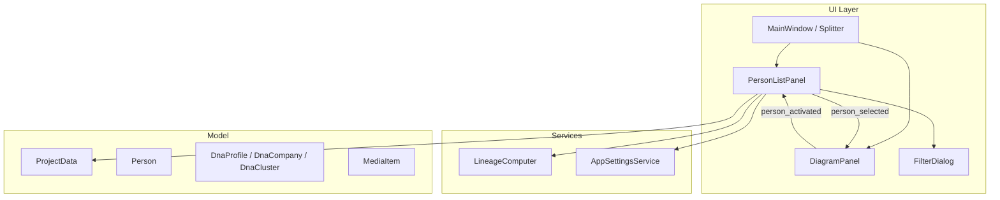
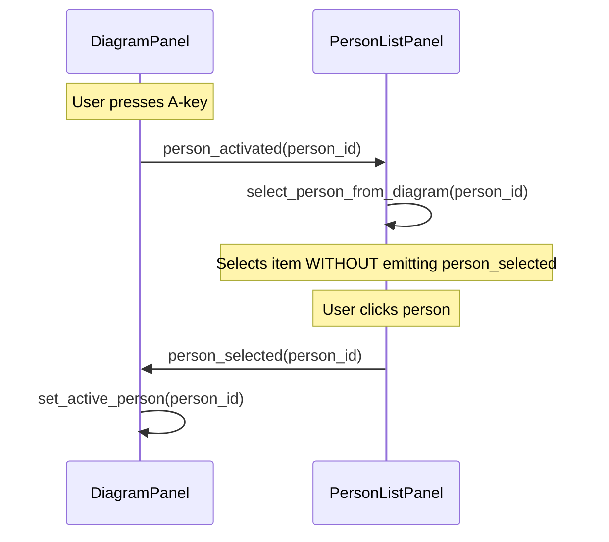

# Design Document: Personlista Enhancements

## Overview

This design enhances the existing `PersonListPanel` to display additional data columns (Titel, Yrke, Kluster, DNA company), ancestry/descendancy dot indicators, a multiple-names indicator, improved filtering across all name versions, configurable column visibility, reduced default width, and bidirectional selection synchronization with the `DiagramPanel`.

The implementation extends the current widget-per-row approach (using `QListWidget` with custom `QWidget` item widgets) to include new visual elements. Pure logic (filtering, display data construction, lineage computation) remains separated from Qt rendering, enabling thorough testing without a running GUI.

## Architecture



### Key Design Decisions

1. **Extend `PersonDisplayInfo`** with new fields (`occupation`, `cluster_names_display`, `dna_company_ids`, `name_count`, `all_names`, `is_ancestor`, `is_descendant`) rather than creating a separate data class. This keeps the single-pass build function and avoids duplicating person iteration.

2. **Column visibility via `AppSettingsService`** — reuse the existing JSON-based persistence mechanism by adding a `column_visibility` dict to `AppSettings`. This avoids introducing new persistence infrastructure.

3. **Bidirectional sync with signal blocking** — when the `PersonListPanel` selects a person in response to `person_activated`, it temporarily blocks the `person_selected` signal to prevent circular loops. This uses Qt's `blockSignals()` or a guard flag.

4. **Lineage sets cached on panel** — ancestor/descendant sets are computed once per `main_person_id` change and stored on the panel instance. Individual row rendering reads from these cached sets.

5. **PySide6 (not PyQt6)** — the project uses PySide6 as confirmed by `pyproject.toml`.

## Components and Interfaces

### Modified: `PersonDisplayInfo` (dataclass)

Extended with additional fields for the new columns and indicators:

```python
@dataclass
class PersonDisplayInfo:
    person_id: str
    given: str
    surname: str
    title: str              # Person.title or ""
    occupation: str         # NEW: Person.occupation or ""
    birth_year: str
    death_year: str
    marriage_year: str
    event_types: set[str]
    parish_names: set[str]
    cluster_names: set[str]
    cluster_names_display: str   # NEW: comma-separated cluster names
    dna_company_ids: list[str]   # NEW: company IDs with profiles for this person
    name_count: int              # NEW: number of Name records
    all_names: list[tuple[str, str, str]]  # NEW: [(type, given, surname), ...]
    is_ancestor: bool            # NEW: ancestor of main person
    is_descendant: bool          # NEW: descendant of main person
    tilltalsnamn_index: int | None = None
    sex: str = ""
```

### Modified: `build_person_display_list()`

Signature extended with additional parameters:

```python
def build_person_display_list(
    persons: list[Person],
    events: list[Event],
    places: list[Place],
    families: list[Family],
    dna_clusters: list[DnaCluster],
    dna_profiles: list[DnaProfile],      # NEW
    dna_companies: list[DnaCompany],     # NEW
    ancestor_ids: set[str],              # NEW
    descendant_ids: set[str],            # NEW
) -> list[PersonDisplayInfo]:
```

### Modified: `filter_persons()`

Updated to support multi-name filtering:

```python
def filter_persons(
    persons: list[PersonDisplayInfo],
    criteria: FilterCriteria,
    all_persons_names: dict[str, list[Name]],  # NEW: person_id -> all Name records
) -> list[PersonDisplayInfo]:
```

The given/surname filters will check against all name versions (not just the primary name stored in `PersonDisplayInfo.given`/`surname`).

### Modified: `FilterCriteria`

No structural change needed — the existing `cluster` field already supports cluster filtering. The filter logic change is internal to `filter_persons()`.

### New: `ColumnVisibility` (dataclass)

```python
@dataclass
class ColumnVisibility:
    titel: bool = True
    yrke: bool = True
    kluster: bool = True
    dna_company: bool = True
```

### Modified: `AppSettings`

Extended with column visibility:

```python
@dataclass
class AppSettings:
    recent_projects: list[str] = field(default_factory=list)
    default_project_path: Optional[str] = None
    column_visibility: ColumnVisibility = field(default_factory=ColumnVisibility)  # NEW
```

### Modified: `PersonListPanel`

New public method for diagram synchronization:

```python
def select_person_from_diagram(self, person_id: str) -> None:
    """Select and scroll to person without emitting person_selected signal."""
```

New internal methods:

```python
def _build_column_header(self) -> QWidget:
    """Build the column header row widget."""

def _show_column_visibility_menu(self, pos: QPoint) -> None:
    """Show context menu on column header for toggling column visibility."""

def _on_column_visibility_changed(self, column: str, visible: bool) -> None:
    """Handle column visibility toggle and persist."""

def _resolve_dna_icon(self, company_id: str) -> QPixmap:
    """Resolve DNA company icon from media or return placeholder."""

def _compute_lineage_sets(self) -> None:
    """Recompute ancestor/descendant sets from main_person_id."""
```

### Modified: `MainWindow._setup_central_widget()`

- Set initial splitter sizes to `[250, remaining]`
- Set minimum width of `PersonListPanel` to 250px
- Connect `diagram_panel.person_activated` to `person_list_panel.select_person_from_diagram`

### Signal Flow for Bidirectional Sync



## Data Models

### Column Layout (left to right)

| Column | Width | Content | Configurable |
|--------|-------|---------|:---:|
| Gender icon | 16px fixed | Male/Female/Unknown icon | No |
| Ancestry/Descendancy dot | 16px fixed | 0–2 filled circles (8px each) | No |
| Name | flexible | "Surname, Given (birth–death)" + multiple-names indicator | No |
| Titel | 60px min | Person.title text | Yes |
| Yrke | 80px min | Person.occupation text | Yes |
| Kluster | 80px min | Comma-separated cluster names | Yes |
| DNA company | 90px min | Side-by-side 16×16 icons (max 5) | Yes |

### Dot Indicator Colours

- **Ancestor_Dot**: `_ANCESTOR_BORDER_COLOR` (#C0392B, red) — filled circle 8px diameter
- **Descendant_Dot**: `_DESCENDANT_BORDER_COLOR` (#27AE60, green) — filled circle 8px diameter

These match the existing `PersonBoxItem` border colours used in the diagram panels, ensuring consistent visual language across the application. Positional order (ancestor left, descendant right) provides a secondary non-colour differentiation.

### Multiple Names Indicator

A superscript-style character (e.g., "²" or a small "…" badge) displayed immediately after the name text. Distinct from dots (no circle shape) and from DNA icons (no square/image shape).

### DNA Icon Resolution

```
For each DnaProfile where profile.person_id == person.id:
    company = find DnaCompany by profile.company_id
    if company.logo_media_id:
        media = find MediaItem by company.logo_media_id
        icon_path = project_folder / media.file
        if icon_path exists:
            pixmap = QPixmap(icon_path).scaled(16, 16)
        else:
            pixmap = placeholder_icon(16, 16)
    else:
        pixmap = placeholder_icon(16, 16)
```

### Compact Layout Threshold

- Width < 350px → compact mode: column headers truncated to 4 chars + "…", cell padding = 2px
- Width ≥ 350px → normal mode: full column headers, cell padding = 6px

### Settings Persistence Schema

```json
{
  "recent_projects": [...],
  "default_project_path": "...",
  "column_visibility": {
    "titel": true,
    "yrke": true,
    "kluster": true,
    "dna_company": true
  }
}
```

## Correctness Properties

*A property is a characteristic or behavior that should hold true across all valid executions of a system — essentially, a formal statement about what the system should do. Properties serve as the bridge between human-readable specifications and machine-verifiable correctness guarantees.*

### Property 1: Person field propagation to display info

*For any* person with optional `title` and `occupation` fields, `build_person_display_list` SHALL produce a `PersonDisplayInfo` where `title` equals `Person.title` (or empty string when None) and `occupation` equals `Person.occupation` (or empty string when None).

**Validates: Requirements 1.3, 1.4**

### Property 2: Cluster names display construction

*For any* person and set of `DnaCluster` objects, the `cluster_names_display` field in `PersonDisplayInfo` SHALL be a comma-separated string of the names of all clusters whose `person_ids` list contains the person's ID, sorted alphabetically. If the person belongs to no clusters, it SHALL be an empty string.

**Validates: Requirements 1.5**

### Property 3: DNA company ID collection

*For any* person and set of `DnaProfile` objects, the `dna_company_ids` field in `PersonDisplayInfo` SHALL contain exactly the distinct `company_id` values from profiles where `profile.person_id == person.id`, sorted alphabetically by company name and capped at 5 entries.

**Validates: Requirements 1.6, 3.1, 3.2**

### Property 4: Lineage flag correctness

*For any* person and a computed ancestor set and descendant set derived from a main person, the `is_ancestor` flag SHALL be True if and only if the person's ID is in the ancestor set, and the `is_descendant` flag SHALL be True if and only if the person's ID is in the descendant set. The main person itself SHALL have both flags as False.

**Validates: Requirements 4.1, 4.2, 4.8**

### Property 5: Column visibility round-trip persistence

*For any* `ColumnVisibility` configuration (arbitrary combination of True/False for each column), serializing to JSON and deserializing back SHALL produce an identical `ColumnVisibility` instance.

**Validates: Requirements 2.4**

### Property 6: Multi-name given name filter

*For any* person with one or more `Name` records and a non-empty given name filter string, the person SHALL be included in the filtered results if and only if at least one of the person's `Name` records has a `given` field (with asterisk markers stripped) that contains the filter string as a case-insensitive substring.

**Validates: Requirements 6.1, 6.3, 6.4**

### Property 7: Multi-name surname filter

*For any* person with one or more `Name` records and a non-empty surname filter string, the person SHALL be included in the filtered results if and only if at least one of the person's `Name` records has a `surname` field that contains the filter string as a case-insensitive substring.

**Validates: Requirements 6.2, 6.3, 6.4**

### Property 8: Combined given and surname filter independence

*For any* person with multiple `Name` records and both a non-empty given name filter and a non-empty surname filter active, the person SHALL be included if and only if (any Name record satisfies the given name filter) AND (any Name record satisfies the surname filter) — evaluated independently across all name records.

**Validates: Requirements 6.5**

### Property 9: Cluster filter AND logic

*For any* set of persons with cluster memberships and a non-empty cluster filter string, `filter_persons` SHALL return exactly those persons who have at least one cluster whose name contains the filter string as a case-insensitive substring, intersected with persons matching all other active criteria.

**Validates: Requirements 5.2, 5.3**

### Property 10: Name count and all_names accuracy

*For any* person with N name records (N ≥ 1), `PersonDisplayInfo.name_count` SHALL equal N and `all_names` SHALL contain exactly those N name records as (type, given, surname) tuples in stored order.

**Validates: Requirements 7.1, 7.2**

### Property 11: Multiple names tooltip format

*For any* person with more than one Name record, the tooltip text SHALL contain one line per Name in format "type: given surname" (omitting empty components), with lines in stored order.

**Validates: Requirements 7.2**

### Property 12: Compact mode threshold

*For any* panel width value, compact column layout (headers truncated to 4 chars + ellipsis, padding 2px) SHALL be active if and only if the width is less than 350 pixels.

**Validates: Requirements 8.4, 8.5**

### Property 13: Diagram sync does not emit person_selected

*For any* valid person_id, calling `select_person_from_diagram(person_id)` SHALL select the person in the list without causing the `person_selected` signal to be emitted.

**Validates: Requirements 9.2**

### Property 14: Diagram sync switches to unfiltered view when person not in filter

*For any* person that exists in the full display list but not in the currently filtered list, calling `select_person_from_diagram(person_id)` SHALL switch the panel to unfiltered view and select that person.

**Validates: Requirements 9.3**

## Error Handling

| Scenario | Handling |
|----------|----------|
| `Person.title` or `Person.occupation` is None | Display empty string in cell |
| `DnaCompany.logo_media_id` is None | Display generic placeholder icon (16×16) |
| Logo media file not found on disk | Display generic placeholder icon (16×16), log warning |
| `main_person_id` is None (not set) | All `is_ancestor`/`is_descendant` flags set to False; no dots rendered |
| Cycle detected in lineage traversal | Terminate BFS gracefully (already handled by `LineageComputer`), log warning |
| Column visibility settings file corrupt/missing | Fall back to all-visible defaults |
| `person_activated` with unknown person_id | Clear selection, do not change view |
| DNA company icons exceed 5 | Display only first 5 alphabetically, no overflow indicator |
| Empty project (no persons) | Display empty list with "Inga personer" message |
| Tooltip text for names with empty given/surname | Omit the empty component from the formatted line |

## Testing Strategy

### Property-Based Tests (Hypothesis)

The project already uses `hypothesis` (≥6.90.0) for property-based testing. Each correctness property above maps to one Hypothesis test function with a minimum of 100 examples (`@settings(max_examples=100)`).

**Test structure:**
- All property tests target pure functions (`build_person_display_list`, `filter_persons`, `format_names_tooltip`, `ColumnVisibility` serialization) without Qt dependency
- Generators produce random `Person`, `Name`, `DnaProfile`, `DnaCluster`, `DnaCompany` instances
- Each test is tagged with a comment: `# Feature: personlista-enhancements, Property N: <title>`

**Property test file:** `tests/test_ui/test_personlista_enhancements_properties.py`

### Unit Tests (pytest)

Example-based tests for:
- Column header structure and labels
- Context menu items for column visibility
- Default `ColumnVisibility` state
- Splitter initial sizes and minimum width
- Signal emission on single-click (existing behavior preserved)
- DNA icon resolution with mock filesystem
- Placeholder icon fallback
- Compact mode header truncation rendering

**Unit test file:** `tests/test_ui/test_personlista_enhancements_unit.py`

### Integration Tests

- Signal wiring: `person_activated` → `select_person_from_diagram` → selection changes without `person_selected`
- Settings persistence: save column visibility, restart, verify restoration
- Lineage recomputation on `main_person_id` change (with `pytest-qt`)
- View switching on sync with filtered-out person

**Integration test file:** `tests/test_ui/test_personlista_sync_integration.py`

### Performance Validation

- Lineage computation for 50,000 persons completes within 2 seconds (benchmark test, not part of CI)

### Test Configuration

```python
from hypothesis import settings

# All property tests use at least 100 examples
@settings(max_examples=100)
```

Each property test includes a tag comment referencing the design property:
```python
# Feature: personlista-enhancements, Property 1: Person field propagation to display info
```

