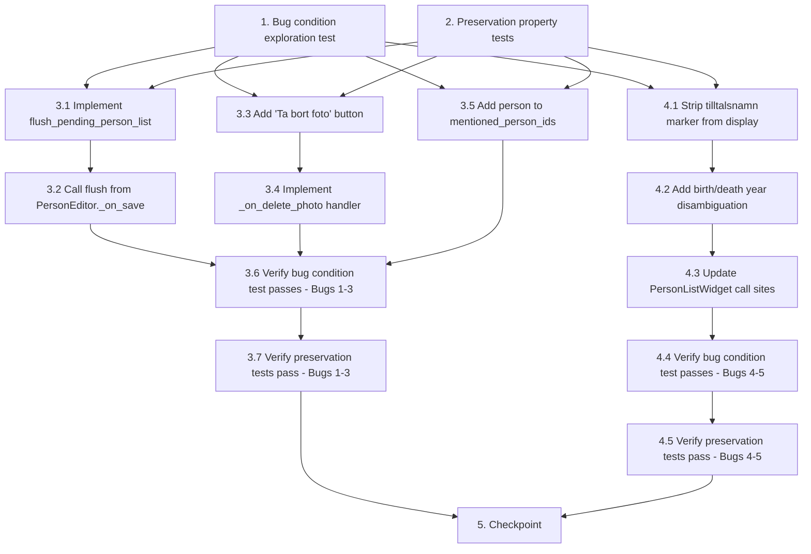

# Implementation Plan

## Overview

This plan fixes five bugs in the photo editor ("FotoTab") and person list widget of the "Redigera Person" dialog:
1. Person list not persisted on save — `_on_save()` doesn't flush pending FotoTab changes
2. No way to delete/unlink a photo — missing "Ta bort foto" button
3. Person not auto-added to `mentioned_person_ids` on photo add
4. Cannot distinguish persons with same name — `_person_display_name()` shows no birth/death years
5. Tilltalsnamn marker (`*`) breaks person search — `*` included in display/search text

The approach follows the exploratory bugfix workflow: write bug condition tests first (expect failure), write preservation tests (expect pass), then implement the fix and verify both test sets pass.

## Tasks

- [x] 1. Write bug condition exploration test
  - **Property 1: Bug Condition** - Photo Editor Save/Add/Delete/Display Bugs
  - **CRITICAL**: This test MUST FAIL on unfixed code - failure confirms the bugs exist
  - **DO NOT attempt to fix the test or the code when it fails**
  - **NOTE**: This test encodes the expected behavior - it will validate the fix when it passes after implementation
  - **GOAL**: Surface counterexamples that demonstrate all five bugs exist
  - **Scoped PBT Approach**: Scope the property to the concrete failing cases:
    - Bug 1: Modify person list in FotoTab, call PersonEditor._on_save(), assert mentioned_person_ids was updated (will FAIL on unfixed code because _on_save does not flush pending changes)
    - Bug 2: Assert that FotoTab contains a "Ta bort foto" button (will FAIL because no such button exists)
    - Bug 3: Call _on_add_photo flow, assert person.id is in new MediaItem.mentioned_person_ids (will FAIL because _on_add_photo does not set mentioned_person_ids)
    - Bug 4: Create two persons with same name but different birth years, call _person_display_name() for both, assert they produce DIFFERENT display strings (will FAIL because years are not included)
    - Bug 5: Create a person with given name "Karl Erik*", call _person_display_name(), assert result does NOT contain "*" (will FAIL because * is not stripped)
  - Test that for all inputs satisfying isBugCondition(input):
    - If action == "save_person" AND pending person-list changes exist: mentioned_person_ids is updated after save
    - If action == "wants_to_unlink_photo" AND photo selected: a delete button exists
    - If action == "add_photo_to_person": person.id IN new_media_item.mentioned_person_ids
    - If action == "search_person_in_combo" AND duplicate names exist: display texts are distinguishable
    - If action == "search_person_in_combo" AND given name contains "*": display text does NOT contain "*"
  - Run test on UNFIXED code
  - **EXPECTED OUTCOME**: Test FAILS (this is correct - it proves the bugs exist)
  - Document counterexamples found:
    - PersonEditor._on_save() does not call any FotoTab flush method
    - No QPushButton with text "Ta bort foto" in FotoTab widget hierarchy
    - New MediaItem's mentioned_person_ids == [] after _on_add_photo
    - _person_display_name(person_a) == _person_display_name(person_b) for two "Erik Andersson" with different birth years
    - _person_display_name(person_with_star) returns "Karl Erik* Andersson" instead of "Karl Erik Andersson (...)"
  - Mark task complete when test is written, run, and failure is documented
  - _Requirements: 2.1, 2.2, 2.3, 2.4, 2.5_

- [x] 2. Write preservation property tests (BEFORE implementing fix)
  - **Property 2: Preservation** - Existing Photo and Person Display Behaviors Unchanged
  - **IMPORTANT**: Follow observation-first methodology
  - **Step 1 — Observe behavior on UNFIXED code for non-buggy inputs:**
    - Observe: Adding a photo copies file to Foto_Mapp, creates MediaItem with LinkedEntity, displays in table
    - Observe: Editing metadata and clicking "Spara ändringar" formats title as [Foto_Typ] title
    - Observe: Clicking "Spara personlista" explicitly persists mentioned_person_ids and syncs linked_entities
    - Observe: Selecting a photo populates editing panel and shows image preview
    - Observe: "Välj som profilbild" sets profile_media_id on Person
    - Observe: Persons without "*" in their name display correctly in combo box
    - Observe: Persons with no birth/death year data display without parentheses
    - Observe: Selecting a person from combo and clicking "Lägg till" adds them to list and emits persons_changed
  - **Step 2 — Write property-based tests capturing observed behavior:**
    - Property: For all valid photo file inputs, _on_add_photo creates a MediaItem with a LinkedEntity(entity_type="person", entity_id=person.id) and appends to project_data.media
    - Property: For all metadata edits with valid title/foto_typ, _on_save_metadata produces title in format "[Foto_Typ] title"
    - Property: For all explicit _on_save_persons calls with pending changes, mentioned_person_ids and linked_entities are synced correctly
    - Property: For all photo selections, the editing panel is populated with the selected MediaItem data
    - Property: For all "Välj som profilbild" invocations, profile_media_id is set to the selected media.id
    - Property: For all persons whose names do NOT contain "*", _person_display_name returns "given surname" (stripped)
    - Property: For all persons with no birth AND no death year, display text contains no parentheses
    - Property: For all combo box selections via "Lägg till", person is added to list and persons_changed emitted
  - **Step 3 — Verify tests PASS on unfixed code**
  - Run tests on UNFIXED code
  - **EXPECTED OUTCOME**: Tests PASS (this confirms baseline behavior to preserve)
  - Mark task complete when tests are written, run, and passing on unfixed code
  - _Requirements: 3.1, 3.2, 3.3, 3.4, 3.5, 3.6, 3.7, 3.8, 3.9_

- [x] 3. Fix for photo editor save/add/delete bugs (Bugs 1–3)

  - [x] 3.1 Implement flush_pending_person_list in FotoTab
    - Add public method `flush_pending_person_list()` to `slaktbusken/ui/widgets/foto_tab.py`
    - Method checks if `_save_persons_btn.isEnabled()` (indicates pending changes)
    - If pending changes exist, calls `_on_save_persons()` to persist them
    - Provides clean API for PersonEditor to call without reaching into private state
    - _Bug_Condition: isBugCondition(input) where action == "save_person" AND pending changes exist_
    - _Expected_Behavior: flush pending mentioned_person_ids, mentioned_names, and linked_entities to MediaItem_
    - _Preservation: Explicit "Spara personlista" behavior unchanged_
    - _Requirements: 2.1, 3.3_

  - [x] 3.2 Call flush_pending_person_list from PersonEditor._on_save
    - In `slaktbusken/ui/editors/person_editor.py`, modify `_on_save()` method
    - Before building the Person object and emitting `save_requested`, call `self._foto_tab.flush_pending_person_list()`
    - Guard with check that `self._foto_tab` exists
    - _Bug_Condition: isBugCondition(input) where action == "save_person" AND fotoTab._save_persons_btn.isEnabled()_
    - _Expected_Behavior: pending person-list changes are persisted to MediaItem before save completes_
    - _Preservation: Save behavior for all other tabs unchanged_
    - _Requirements: 2.1_

  - [x] 3.3 Add "Ta bort foto" button to FotoTab UI
    - In `slaktbusken/ui/widgets/foto_tab.py`, in `_setup_ui()`, add a QPushButton "Ta bort foto" next to "Lägg till foto"
    - Button initially disabled
    - Enable button when a photo is selected (in `_on_photo_selected` or equivalent)
    - Disable button when no photo is selected
    - _Bug_Condition: isBugCondition(input) where action == "wants_to_unlink_photo" AND photo_is_selected_
    - _Expected_Behavior: UI affordance exists for unlinking/deleting a photo_
    - _Preservation: Existing button layout and "Lägg till foto" behavior unchanged_
    - _Requirements: 2.2_

  - [x] 3.4 Implement _on_delete_photo handler in FotoTab
    - Add method `_on_delete_photo()` to `slaktbusken/ui/widgets/foto_tab.py`
    - Show confirmation dialog (QMessageBox) before proceeding
    - Remove the LinkedEntity with entity_id == self._person.id from the selected MediaItem
    - Remove person from mentioned_person_ids if present
    - If no linked_entities remain on the MediaItem, remove the entire MediaItem from project_data.media
    - Refresh the photo table after deletion
    - Connect button clicked signal to this handler
    - _Bug_Condition: isBugCondition(input) where action == "wants_to_unlink_photo"_
    - _Expected_Behavior: LinkedEntity removed, MediaItem removed if no links remain_
    - _Preservation: Other linked entities on the same MediaItem preserved_
    - _Requirements: 2.2_

  - [x] 3.5 Add person to mentioned_person_ids in _on_add_photo
    - In `slaktbusken/ui/widgets/foto_tab.py`, in `_on_add_photo()`, after creating the MediaItem
    - Set `mentioned_person_ids=[self._person.id]` on the new MediaItem (before appending to project_data.media)
    - _Bug_Condition: isBugCondition(input) where action == "add_photo_to_person" AND person.id NOT IN mentioned_person_ids_
    - _Expected_Behavior: person.id IN new_media_item.mentioned_person_ids after add_
    - _Preservation: File copy to Foto_Mapp, LinkedEntity creation, table display all unchanged_
    - _Requirements: 2.3, 3.1_

  - [x] 3.6 Verify bug condition exploration test passes for Bugs 1–3
    - **Property 1: Expected Behavior** - Photo Editor Save/Add/Delete Fixed
    - **IMPORTANT**: Re-run the SAME test from task 1 (Bug 1–3 assertions) - do NOT write a new test
    - The test from task 1 encodes the expected behavior
    - When these assertions pass, it confirms:
      - Bug 1: PersonEditor._on_save() now flushes pending person-list changes
      - Bug 2: FotoTab now has a "Ta bort foto" button
      - Bug 3: _on_add_photo() now includes person in mentioned_person_ids
    - Run bug condition exploration test from step 1
    - **EXPECTED OUTCOME**: Bug 1–3 assertions PASS (confirms these bugs are fixed)
    - _Requirements: 2.1, 2.2, 2.3_

  - [x] 3.7 Verify preservation tests still pass
    - **Property 2: Preservation** - Existing Photo Behaviors Unchanged
    - **IMPORTANT**: Re-run the SAME tests from task 2 - do NOT write new tests
    - Run preservation property tests from step 2
    - **EXPECTED OUTCOME**: Tests PASS (confirms no regressions)
    - Confirm all preservation tests still pass after fix (no regressions introduced)
    - _Requirements: 3.1, 3.2, 3.3, 3.4, 3.5, 3.6_

- [x] 4. Fix for person display name bugs (Bugs 4–5)

  - [x] 4.1 Strip tilltalsnamn marker (*) from _person_display_name
    - In `slaktbusken/ui/widgets/person_list_widget.py`, modify `_person_display_name()`
    - Replace `name.given` with `name.given.replace("*", "")` before building the display string
    - Ensures the `*` character (metadata marker) is never included in display or search text
    - _Bug_Condition: isBugCondition(input) where person.names[0].given CONTAINS "*"_
    - _Expected_Behavior: "*" NOT IN display text, QCompleter matches name without star_
    - _Preservation: Persons without "*" in name display unchanged_
    - _Requirements: 2.5, 3.7_

  - [x] 4.2 Add birth/death year disambiguation to _person_display_name
    - In `slaktbusken/ui/widgets/person_list_widget.py`, update `_person_display_name()` to accept events parameter
    - Use `get_person_birth_death_years(person, events)` or equivalent logic to extract birth/death years from person's events
    - If at least one year is available, append ` (birth_year–death_year)` to display text, using `"?"` for unknown years
    - If neither year is available, display name only (no empty parentheses)
    - Format examples: "Erik Andersson (1845–1901)", "Erik Andersson (?–1901)", "Erik Andersson (1845–?)", "Erik Andersson"
    - _Bug_Condition: isBugCondition(input) where duplicate names exist without year disambiguation_
    - _Expected_Behavior: display text includes "(birth–death)" when years available, distinguishing duplicate names_
    - _Preservation: Persons with no birth/death data display without parentheses_
    - _Requirements: 2.4, 3.9_

  - [x] 4.3 Update PersonListWidget call sites to pass events
    - Update `_populate_person_combo()` to pass `self._project_data.events` to `_person_display_name()`
    - Update `_refresh_list()` to pass `self._project_data.events` to `_person_display_name()`
    - Update QCompleter initialization to use the updated display strings (with years, without `*`)
    - Verify QCompleter `MatchContains` + `CaseInsensitive` still works correctly with the new format
    - _Bug_Condition: All call sites must use the updated signature_
    - _Expected_Behavior: Combo box and list show year-disambiguated, star-free names_
    - _Preservation: Selecting a person and adding them to the list still works, persons_changed still emitted_
    - _Requirements: 2.4, 2.5, 3.8_

  - [x] 4.4 Verify bug condition exploration test passes for Bugs 4–5
    - **Property 1: Expected Behavior** - Person Display Name Fixed
    - **IMPORTANT**: Re-run the SAME test from task 1 (Bug 4–5 assertions) - do NOT write a new test
    - When these assertions pass, it confirms:
      - Bug 4: Duplicate names now distinguishable via birth/death years
      - Bug 5: `*` marker stripped from display/search text
    - Run bug condition exploration test from step 1
    - **EXPECTED OUTCOME**: Bug 4–5 assertions PASS (confirms these bugs are fixed)
    - _Requirements: 2.4, 2.5_

  - [x] 4.5 Verify preservation tests still pass
    - **Property 2: Preservation** - Person Display Behaviors Unchanged
    - **IMPORTANT**: Re-run the SAME tests from task 2 - do NOT write new tests
    - Run preservation property tests from step 2
    - **EXPECTED OUTCOME**: Tests PASS (confirms no regressions)
    - Confirm non-starred name display, no-year-no-parentheses, and combo box add behavior all unchanged
    - _Requirements: 3.7, 3.8, 3.9_

- [x] 5. Checkpoint - Ensure all tests pass
  - Run full test suite to ensure no regressions
  - Verify ALL bug condition tests pass (all 5 bugs are fixed)
  - Verify ALL preservation tests pass (existing behavior unchanged)
  - Ensure all tests pass, ask the user if questions arise.

## Task Dependency Graph

```json
{
  "waves": [
    {
      "wave": 1,
      "tasks": ["1", "2"],
      "description": "Write exploration and preservation tests before fix"
    },
    {
      "wave": 2,
      "tasks": ["3.1", "3.3", "3.5", "4.1"],
      "description": "Implement independent fix components (flush method, delete button, auto-add person, strip star)"
    },
    {
      "wave": 3,
      "tasks": ["3.2", "3.4", "4.2"],
      "description": "Implement dependent fix components (wire flush to save, delete handler, add year disambiguation)"
    },
    {
      "wave": 4,
      "tasks": ["4.3"],
      "description": "Update call sites to use new _person_display_name signature"
    },
    {
      "wave": 5,
      "tasks": ["3.6", "3.7", "4.4", "4.5"],
      "description": "Verify tests pass after all fixes"
    },
    {
      "wave": 6,
      "tasks": ["5"],
      "description": "Final checkpoint - all tests pass"
    }
  ]
}
```



## Notes

- The exploration test (task 1) is expected to FAIL on unfixed code — this confirms all five bugs exist. Do not treat failure as an error.
- Preservation tests (task 2) must PASS on unfixed code before any changes are made, establishing the behavioral baseline.
- The fix is split into two logical groups: Bugs 1–3 (task 3, affecting `foto_tab.py` and `person_editor.py`) and Bugs 4–5 (task 4, affecting `person_list_widget.py`).
- Tasks 3.6/3.7 and 4.4/4.5 re-run existing tests from tasks 1 and 2 — no new tests should be written at that stage.
- The "Ta bort foto" button should show a confirmation dialog before deleting to prevent accidental data loss.
- The `_person_display_name()` function changes (stripping `*`, adding years) affect both the combo box display and the QCompleter search text, which is intentional.
- The `get_person_birth_death_years()` utility already exists in `slaktbusken/ui/person_list_panel.py` and can be reused/imported.
- Persons with no birth AND no death year must display without parentheses — no empty "(–)" or "(?–?)" should appear.
