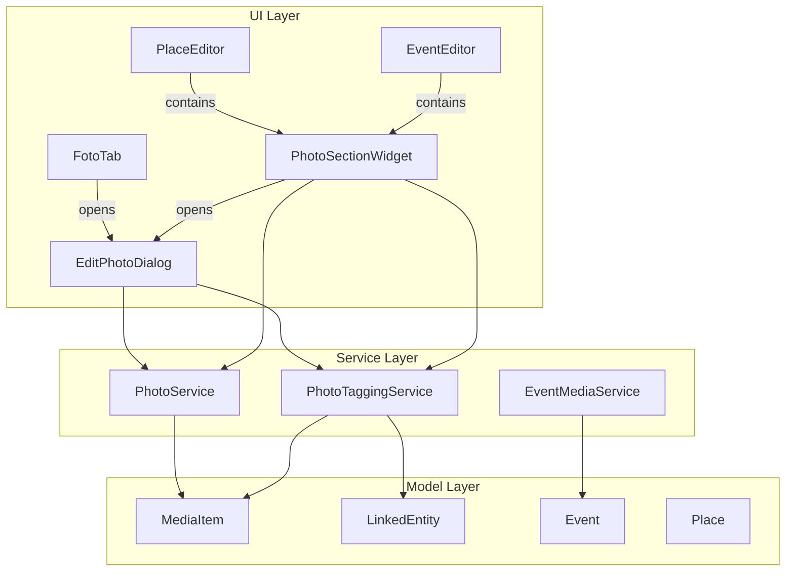

# Design Document: Photo Management Rework

## Overview

This design covers the rework of photo management in Släktbusken. The current inline editing approach in `FotoTab` (title/type editing group box + save button, person list + save button) is replaced by a single dedicated modal dialog ("Fotofönstret") that consolidates all photo metadata editing. Additionally, the Place editor and Event editor gain their own photo sections using shared logic.

**Key architectural changes:**

1. A new `EditPhotoDialog` (QDialog) replaces inline editing in FotoTab
2. FotoTab is simplified to a photo list with "Lägg till foto", "Redigera foto", "Ta bort foto" buttons
3. A reusable `PhotoSectionWidget` provides photo listing + actions for PlaceEditor and EventEditor
4. EventEditor's single "Händelsemedia" section is split into "Foton" and "Annan media"
5. New `PhotoDateValidator` handles flexible date precision validation
6. New `PhotoTaggingService` manages event and place tagging via LinkedEntity

## Architecture



The architecture follows the existing patterns: UI widgets delegate business logic to service classes, which operate on dataclass model objects. The `EditPhotoDialog` is the central new component, while `PhotoSectionWidget` encapsulates the reusable photo list pattern for Place and Event editors.

## Components and Interfaces

### EditPhotoDialog (New)

**Module:** `slaktbusken/ui/dialogs/edit_photo_dialog.py`

A modal QDialog that consolidates all photo editing into one window. Sections are arranged vertically in a QScrollArea.

```python
class EditPhotoDialog(QDialog):
    """Modal dialog for editing all metadata of a single photo."""

    def __init__(
        self,
        media_item: MediaItem,
        project_data: ProjectData,
        photo_service: PhotoService,
        parent: QWidget | None = None,
    ) -> None: ...

    def get_updated_media_item(self) -> MediaItem | None:
        """Return the updated MediaItem if saved, or None if cancelled."""
        ...
```

**Internal sections (top to bottom):**
1. Title & Type – QLineEdit + QComboBox (existing `PhotoService.FOTO_TYPES`)
2. Photo Date – Year/Month/Day fields with `PhotoDateValidator`
3. Persons – Reuses existing `PersonListWidget`
4. Events – QListWidget + Add/Remove with filtered event selection
5. Places – QListWidget + Add/Remove with place selection
6. Notes – QPlainTextEdit (max 2000 chars, min 3 rows visible)

**Footer:** "Spara" and "Avbryt" buttons.

### PhotoSectionWidget (New)

**Module:** `slaktbusken/ui/widgets/photo_section_widget.py`

Reusable widget providing a photo list with action buttons. Used by PlaceEditor and EventEditor.

```python
class PhotoSectionWidget(QWidget):
    """Reusable photo list section for editors.

    Provides a list of linked photos and buttons for view, edit, add.
    """

    photo_added = Signal(str)  # Emits new media_item.id
    photo_edited = Signal(str)  # Emits edited media_item.id

    def __init__(
        self,
        project_data: ProjectData,
        photo_service: PhotoService,
        entity_type: str,       # "place" or "event"
        entity_id: str,
        parent: QWidget | None = None,
    ) -> None: ...

    def refresh(self) -> None:
        """Reload photos from project data."""
        ...
```

**Buttons (configurable per context):**
- PlaceEditor mode: "Visa foto", "Redigera foto", "Lägg till foto"
- EventEditor photo mode: "Lägg till foto", "Redigera foto", "Ta bort foto"

### PhotoTaggingService (New)

**Module:** `slaktbusken/services/photo_tagging_service.py`

Service handling event and place tagging on MediaItem via LinkedEntity records.

```python
class PhotoTaggingService:
    """Manages event and place tag associations on MediaItems."""

    def __init__(self, project_data: ProjectData) -> None: ...

    def get_available_events(
        self, media_item: MediaItem, person_ids: list[str]
    ) -> list[Event]:
        """Return events where any person_id is a participant, excluding already linked."""
        ...

    def get_available_places(self, media_item: MediaItem) -> list[Place]:
        """Return all places not already linked to this media item."""
        ...

    def add_event_tag(self, media_item: MediaItem, event_id: str) -> None:
        """Create LinkedEntity(entity_type='event', entity_id=event_id)."""
        ...

    def remove_event_tag(self, media_item: MediaItem, event_id: str) -> None:
        """Remove the event LinkedEntity from the media item."""
        ...

    def add_place_tag(self, media_item: MediaItem, place_id: str) -> None:
        """Create LinkedEntity(entity_type='place', entity_id=place_id)."""
        ...

    def remove_place_tag(self, media_item: MediaItem, place_id: str) -> None:
        """Remove the place LinkedEntity from the media item."""
        ...

    def get_event_tags(self, media_item: MediaItem) -> list[str]:
        """Return list of event_ids currently tagged."""
        ...

    def get_place_tags(self, media_item: MediaItem) -> list[str]:
        """Return list of place_ids currently tagged."""
        ...

    def get_photos_for_place(self, place_id: str) -> list[MediaItem]:
        """Return all photo MediaItems linked to the given place."""
        ...

    def get_photos_for_event(self, event_id: str) -> list[MediaItem]:
        """Return all photo MediaItems linked to the given event."""
        ...
```

### PhotoDateValidator (New)

**Module:** `slaktbusken/services/photo_date_validator.py`

Pure validation logic for the flexible-precision photo date fields.

```python
@dataclass
class PhotoDate:
    """A date with flexible precision for photo metadata."""
    year: int | None = None
    month: int | None = None
    day: int | None = None


class PhotoDateValidator:
    """Validates photo dates with flexible precision rules."""

    @staticmethod
    def validate(year: int | None, month: int | None, day: int | None) -> list[str]:
        """Validate a photo date. Returns list of error messages (empty = valid).

        Rules:
        - All empty: valid (no date)
        - Year only: valid
        - Year + month: valid if month 1-12
        - Year + month + day: valid if day valid for month/year
        - Month without year: invalid
        - Day without month or year: invalid
        """
        ...

    @staticmethod
    def to_storage_format(year: int | None, month: int | None, day: int | None) -> dict | None:
        """Convert to storage format. Returns None if no date, or dict with precision info."""
        ...

    @staticmethod
    def from_storage_format(stored: dict | None) -> PhotoDate:
        """Parse stored date back into PhotoDate."""
        ...
```

### Modified FotoTab

The existing `FotoTab` widget is simplified:

**Removed:**
- `_edit_group` (QGroupBox "Redigera foto" with title/type fields and "Spara ändringar" button)
- `_person_list_group` (QGroupBox "Personer i bilden" with PersonListWidget and "Spara personlista" button)
- `_on_save_metadata()`, `_on_save_persons()`, `flush_pending_person_list()`

**Added:**
- `_edit_button` ("Redigera foto") between "Lägg till foto" and "Ta bort foto"
- Double-click on table row opens EditPhotoDialog
- `_on_edit_photo()` method that opens EditPhotoDialog

**Button order:** "Lägg till foto" | "Redigera foto" | "Ta bort foto"

**Enable/disable logic:**
- "Lägg till foto": always enabled
- "Redigera foto": enabled when a photo is selected
- "Ta bort foto": enabled when a photo is selected

### Modified PlaceEditor

**Added:** A "Foton" section using `PhotoSectionWidget(entity_type="place", entity_id=place.id)`.

Button order: "Visa foto", "Redigera foto", "Lägg till foto"

### Modified EventEditor

**Replaced:** The single "Händelsemedia" group box is split into two sections:

1. **"Foton" section** – Uses `PhotoSectionWidget(entity_type="event", entity_id=event.id)` with buttons "Lägg till foto", "Redigera foto", "Ta bort foto"
2. **"Annan media" section** – Retains current event media logic for non-photo types (dödruna, dödsannons, etc.) with buttons "Lägg till media", "Ta bort media"

## Data Models

### MediaItem Extensions

The existing `MediaItem` dataclass gains no new fields. Photo dates, notes, and tags are stored as follows:

| Data | Storage |
|------|---------|
| Title + Type | `MediaItem.title` as `"[Fototyp] Titel"` (existing format) |
| Photo date | New optional field on MediaItem (see below) |
| Persons | `MediaItem.mentioned_person_ids` + `mentioned_names` + `LinkedEntity(entity_type="person")` |
| Event tags | `MediaItem.linked_entities` with `entity_type="event"` |
| Place tags | `MediaItem.linked_entities` with `entity_type="place"` |
| Notes | New field on MediaItem (see below) |

**New fields on MediaItem:**

```python
@dataclass
class MediaItem:
    # ... existing fields ...
    photo_date: Optional[dict] = None       # {"year": int, "month": int|None, "day": int|None}
    notes: str = ""                          # max 2000 characters
```

The `photo_date` dictionary stores:
- `{"year": 1920}` – year-only precision
- `{"year": 1920, "month": 6}` – year+month precision
- `{"year": 1920, "month": 6, "day": 15}` – full date
- `None` – no date specified

### LinkedEntity Usage

The existing `LinkedEntity` model is used unchanged for all tagging:

```python
# Person link (existing pattern)
LinkedEntity(entity_type="person", entity_id="person_42")

# Event tag (new usage in this feature)
LinkedEntity(entity_type="event", entity_id="event_7")

# Place tag (new usage in this feature)
LinkedEntity(entity_type="place", entity_id="place_3")
```

## Correctness Properties

*A property is a characteristic or behavior that should hold true across all valid executions of a system—essentially, a formal statement about what the system should do. Properties serve as the bridge between human-readable specifications and machine-verifiable correctness guarantees.*

### Property 1: Title validation accepts valid lengths and rejects invalid

*For any* string of length 1–200 (inclusive) that is not purely whitespace, the title validator SHALL accept it; and *for any* empty string, whitespace-only string, or string longer than 200 characters, the title validator SHALL reject it.

**Validates: Requirements 3.4**

### Property 2: Photo date validation correctness

*For any* combination of year (1–9999 or None), month (1–12 or None), and day (1–31 or None), the date validator SHALL accept the combination if and only if: (a) all fields are None, (b) only year is provided, (c) year and valid month are provided, or (d) year, month, and a day valid for that month/year are provided. It SHALL reject month-without-year and day-without-month cases, as well as invalid day values for the given month/year (e.g., Feb 30).

**Validates: Requirements 4.2, 4.3, 4.4, 4.5, 4.6, 4.7, 4.8**

### Property 3: Photo date storage round-trip

*For any* valid photo date (all-None, year-only, year+month, or full date), converting to storage format and back SHALL produce the original date values with no loss of precision.

**Validates: Requirements 4.9, 4.10**

### Property 4: Event filtering by linked persons

*For any* set of person IDs linked to a photo, any set of events in the project, and any set of event tags already on the photo, the available-events filter SHALL return exactly those events where at least one of the photo's persons is a Participant AND the event is not already tagged on the photo. When the person set is empty, the result SHALL be empty.

**Validates: Requirements 7.4, 7.5**

### Property 5: Tag add/remove preserves non-target linked entities

*For any* MediaItem with existing linked entities, adding an event tag (or place tag) SHALL append exactly one new LinkedEntity with the correct entity_type and entity_id, leaving all pre-existing linked entities unchanged. Removing a tag SHALL remove exactly the matching LinkedEntity, leaving all others unchanged.

**Validates: Requirements 7.6, 7.7, 8.4, 8.5**

### Property 6: Place availability filtering excludes already linked

*For any* set of places in the project and any set of place tags already on a MediaItem, the available-places filter SHALL return exactly those places whose ID is not already present as a LinkedEntity with entity_type "place" on the MediaItem.

**Validates: Requirements 8.3**

### Property 7: Photos-for-entity filtering

*For any* set of MediaItems in a project and a given entity (place or event), querying photos for that entity SHALL return exactly those MediaItems where type is "photo" AND a LinkedEntity with the matching entity_type and entity_id exists.

**Validates: Requirements 9.1**

### Property 8: New photo creation produces correct MediaItem and LinkedEntity

*For any* valid entity_type ("place" or "event") and entity_id, creating a new photo linked to that entity SHALL produce a MediaItem with type "photo" and a linked_entities list containing at least one LinkedEntity with the specified entity_type and entity_id.

**Validates: Requirements 9.6, 10.4**

### Property 9: Non-photo media type invariant

*For any* media item created via the "Annan media" section, the resulting MediaItem's type SHALL NOT be "photo", and it SHALL have a LinkedEntity with entity_type "event" and the correct event_id.

**Validates: Requirements 10.7**

## Error Handling

### Validation Errors

| Context | Error | Behavior |
|---------|-------|----------|
| Title empty or >200 chars | "Titel måste vara 1–200 tecken." | Shown next to title field, save blocked |
| Month without year | "År krävs om månad anges." | Shown next to date fields, save blocked |
| Day without month/year | "År och månad krävs om dag anges." | Shown next to date fields, save blocked |
| Invalid day for month/year | "Ogiltigt datum." | Shown next to date fields, save blocked |
| Duplicate person | "Denna person finns redan kopplad till fotot." | QMessageBox info, no list change |
| Notes >2000 chars | Character limit enforced by `QPlainTextEdit.setMaxLength` equivalent (document char limit) |

### File Operations

| Context | Error | Behavior |
|---------|-------|----------|
| File dialog cancelled | No action taken, dialog closes | Existing pattern preserved |
| Invalid file extension | File dialog filter prevents selection | Only image formats shown |
| File copy failure | QMessageBox.warning with error details | MediaItem not created |

### Dialog Lifecycle

- **Cancel/Close (X):** No changes saved. MediaItem remains in its original state.
- **Save with errors:** Dialog stays open. First validation error section is highlighted. Error message displayed inline.
- **Save success:** MediaItem updated, dialog closes, parent widget refreshes.

## Testing Strategy

### Property-Based Tests (Hypothesis)

The project already uses `hypothesis` for property-based testing (see existing `test_photo_service_properties.py`, `test_event_media_service_properties.py`). New property tests follow the same conventions:

- **Library:** Hypothesis (`hypothesis>=6.90.0`)
- **Minimum iterations:** 100 per property (`@settings(max_examples=100, deadline=None)`)
- **Tag format:** `Feature: photo-management-rework, Property {N}: {title}`
- **File location:** `tests/test_services/test_photo_management_rework_properties.py`

**Properties to implement:**

1. `TestTitleValidation` – Property 1
2. `TestPhotoDateValidationCorrectness` – Property 2
3. `TestPhotoDateStorageRoundTrip` – Property 3
4. `TestEventFilteringByLinkedPersons` – Property 4
5. `TestTagAddRemovePreservesOtherEntities` – Property 5
6. `TestPlaceAvailabilityFiltering` – Property 6
7. `TestPhotosForEntityFiltering` – Property 7
8. `TestNewPhotoCreationLinkedEntity` – Property 8
9. `TestNonPhotoMediaTypeInvariant` – Property 9

### Unit Tests (Example-Based)

- **File location:** `tests/test_services/test_photo_management_rework.py` and `tests/test_ui/test_edit_photo_dialog.py`
- **Framework:** pytest + pytest-qt

**Coverage areas:**
- UI layout verification (button order, section order, widget presence/absence)
- Button enable/disable state transitions
- Dialog open/close lifecycle
- PersonListWidget integration within EditPhotoDialog
- Cancel preserves original state
- Double-click opens dialog

### Integration Tests

- **File location:** `tests/test_integration/test_photo_management_integration.py`

**Coverage areas:**
- Full save flow: open dialog → edit all sections → save → verify MediaItem in ProjectData
- PlaceEditor photo section: add photo → verify in project data → open edit dialog
- EventEditor split sections: add photo vs add non-photo media → verify correct types
- FotoTab button states after add/edit/delete operations

