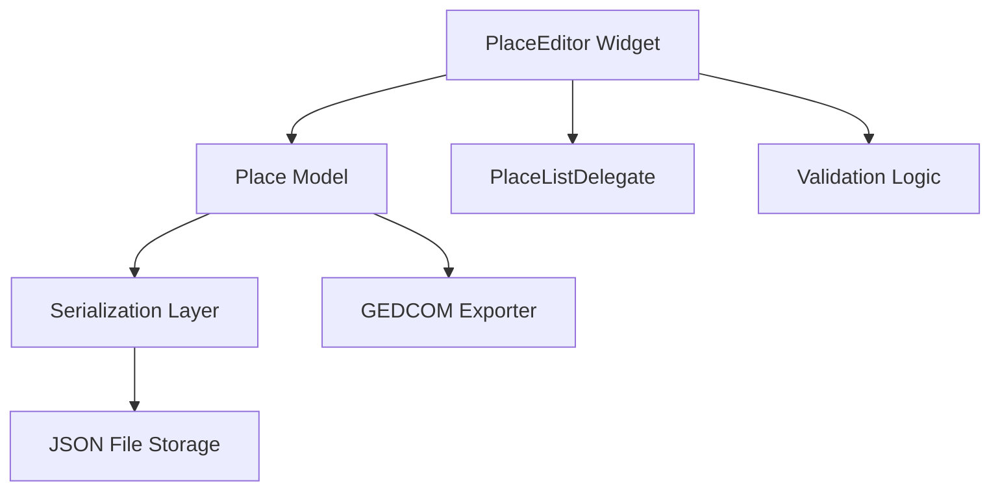
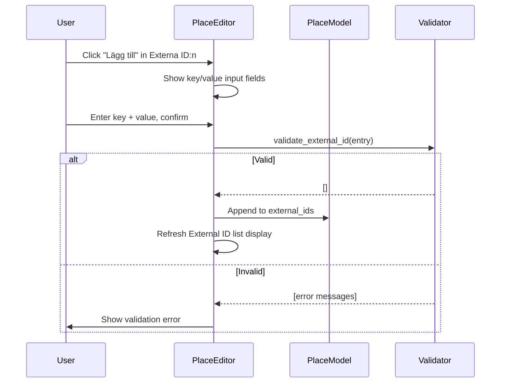

# Design Document: Place Editor Enhancements

## Overview

This design extends the Place Editor (Platsredigerare) in Släktbusken with four capabilities:

1. **External IDs** — A key-value store on each `Place` for identifiers used in GEDCOM exports (e.g. `_PARISH_AID` for Arkiv Digital).
2. **Alternative Names** — An ordered list of additional name strings per place for informal names, county letters, or aliases.
3. **Red Dot Indicator** — A visual marker in the place list showing which non-country places are missing a parent assignment.
4. **Type Filter** — A combo box filter allowing the user to restrict the place list to a single place type.

All four features integrate with the existing `Place` dataclass, the `PlaceEditor` widget, and the JSON serialization layer. The approach preserves backward compatibility by using optional fields with default empty values.

## Architecture

The system follows the existing layered architecture:



**Key design decisions:**

1. **Model-first approach** — New data fields are added to the `Place` dataclass. The serialization layer handles them automatically via the existing `_serialize_dataclass` recursive serializer (which omits empty lists by default).
2. **No new dataclass for ExternalID** — Use a simple `@dataclass` named `ExternalId` with `key` and `value` fields, stored as a `list[ExternalId]` on `Place`. This follows the existing pattern (e.g., `Name` entries on `Person`).
3. **Alternative names as plain strings** — Stored as `list[str]` directly on `Place`, keeping the model simple.
4. **Custom QStyledItemDelegate** — The red dot indicator is rendered via a delegate on the `QListWidget`, avoiding modification of item text data.
5. **Type filter as QComboBox** — Inserted between the existing text filter and the place list in the left panel layout.

## Components and Interfaces

### 1. Model Layer (`slaktbusken/model/place.py`)

```python
@dataclass
class ExternalId:
    """A key-value pair linking a place to an external system identifier."""
    key: str
    value: str

@dataclass
class Place:
    """A place, optionally nested within a parent place hierarchy."""
    id: str
    type: str
    name: str
    parent_place_id: Optional[str] = None
    latitude: Optional[float] = None
    longitude: Optional[float] = None
    notes: str = ""
    external_ids: list[ExternalId] = field(default_factory=list)
    alternative_names: list[str] = field(default_factory=list)
```

### 2. Validation Layer (`slaktbusken/model/validators.py`)

New validation functions:

```python
def validate_external_id(ext_id: ExternalId) -> list[str]:
    """Validate a single ExternalId entry (key 1-100 chars, value 1-500 chars, no whitespace-only)."""

def validate_alternative_name(name: str) -> list[str]:
    """Validate a single alternative name (1-200 chars, not whitespace-only)."""

def validate_place_external_ids(place: Place) -> list[str]:
    """Validate all external IDs on a place (no duplicate keys, each entry valid)."""

def validate_place_alternative_names(place: Place) -> list[str]:
    """Validate all alternative names on a place (no duplicates, each valid)."""
```

These are called from the existing `validate_place()` function as additional checks.

### 3. UI Components (`slaktbusken/ui/editors/place_editor.py`)

**New UI sections added to the right panel (detail form):**

- **"Externa ID:n" section** — A `QGroupBox` containing a `QListWidget` displaying key-value pairs, with Add/Edit/Remove buttons.
- **"Alternativnamn:" section** — A `QGroupBox` containing a `QListWidget` of name strings, with Add/Remove buttons.

**New UI component in the left panel:**

- **Type filter (`QComboBox`)** — Placed between `filter_input` and `place_list`. Options: "Alla", "Land", "Län", "Socken", "Kyrka", "Kyrkogård", "By", "Gård", "Skola".

**New delegate:**

- **`PlaceListItemDelegate`** — A `QStyledItemDelegate` that renders a red dot (≤8px solid circle, 4px after text) when the item's place has no parent and is not a country.

### 4. Interaction Flow



### 5. Filter Combination Logic

The place list applies two filters in conjunction:

```python
def _matches_filters(place: Place, text_filter: str, type_filter: str) -> bool:
    """Return True if the place passes both filters."""
    # Text filter (existing behavior)
    if text_filter and text_filter not in format_place_display(place).lower():
        return False
    # Type filter (new)
    if type_filter != "all" and place.type != type_filter:
        return False
    return True
```

## Data Models

### ExternalId Dataclass

| Field | Type | Constraints |
|-------|------|------------|
| `key` | `str` | 1–100 characters, not whitespace-only |
| `value` | `str` | 1–500 characters, not whitespace-only |

### Updated Place Dataclass

| Field | Type | Default | Notes |
|-------|------|---------|-------|
| `id` | `str` | (required) | UUID |
| `type` | `str` | (required) | One of: country, county, parish, church, cemetery, village, farm, school |
| `name` | `str` | (required) | 1–200 characters |
| `parent_place_id` | `Optional[str]` | `None` | Reference to parent place |
| `latitude` | `Optional[float]` | `None` | -90 to 90 |
| `longitude` | `Optional[float]` | `None` | -180 to 180 |
| `notes` | `str` | `""` | Free text |
| `external_ids` | `list[ExternalId]` | `[]` | Zero or more key-value pairs, unique keys |
| `alternative_names` | `list[str]` | `[]` | Zero or more distinct name strings, 1–200 chars each |

### Serialization Format (JSON)

```json
{
  "id": "place_1",
  "type": "parish",
  "name": "Ljusdal",
  "parent_place_id": "place_2",
  "external_ids": [
    {"key": "_PARISH_AID", "value": "12345"}
  ],
  "alternative_names": ["Ljusdals församling"]
}
```

Empty `external_ids` and `alternative_names` lists are omitted from the JSON output (existing serializer behavior for `default_factory=list` fields).

### Red Dot Indicator Logic

```python
def needs_red_dot(place: Place) -> bool:
    """Determine if a place should show the red dot indicator."""
    return place.type != "country" and place.parent_place_id is None
```

## Correctness Properties

*A property is a characteristic or behavior that should hold true across all valid executions of a system — essentially, a formal statement about what the system should do. Properties serve as the bridge between human-readable specifications and machine-verifiable correctness guarantees.*

### Property 1: External ID round-trip preservation

*For any* valid key string (1–100 non-whitespace-only characters) and valid value string (1–500 non-whitespace-only characters), adding an External_ID to a place and then reading the place's external_ids list back SHALL yield an entry with the exact same key and value strings.

**Validates: Requirements 1.2, 1.3, 2.3, 2.5**

### Property 2: External ID duplicate key rejection

*For any* place with an existing External_ID with key K, attempting to add another External_ID with the same key K SHALL be rejected, and the place's external_ids list SHALL remain unchanged.

**Validates: Requirements 1.4**

### Property 3: External ID whitespace-only rejection

*For any* string composed entirely of whitespace characters (or the empty string), attempting to add an External_ID using that string as either the key or the value SHALL be rejected, and the place's external_ids list SHALL remain unchanged.

**Validates: Requirements 1.5, 2.6**

### Property 4: External ID removal preserves remaining entries

*For any* place with N External_ID entries (N ≥ 1), removing one entry by key SHALL result in exactly N-1 entries remaining, and all non-removed entries SHALL be preserved with their original key and value.

**Validates: Requirements 1.6, 2.4**

### Property 5: External ID edit updates entry

*For any* existing External_ID entry on a place, editing it with a new valid key and value SHALL result in the entry being updated to the new values, with all other entries remaining unchanged.

**Validates: Requirements 2.7**

### Property 6: Alternative Name round-trip with trimming

*For any* string of 1–200 characters that contains at least one non-whitespace character, adding it as an Alternative_Name and then reading the place's alternative_names list SHALL yield an entry equal to the trimmed version of the original input string.

**Validates: Requirements 3.1, 3.2, 4.3, 4.5**

### Property 7: Alternative Name duplicate rejection

*For any* place with an existing Alternative_Name string S, attempting to add the same string S again SHALL be rejected, and the place's alternative_names list SHALL remain unchanged.

**Validates: Requirements 3.3**

### Property 8: Alternative Name invalid input rejection

*For any* string that is empty, contains only whitespace characters, or exceeds 200 characters in length, attempting to add it as an Alternative_Name SHALL be rejected, and the place's alternative_names list SHALL remain unchanged.

**Validates: Requirements 3.4, 4.6**

### Property 9: Alternative Name removal preserves order

*For any* place with N Alternative_Names (N ≥ 2) and any valid index I to remove, removing the entry at index I SHALL result in N-1 entries remaining in the same relative order as the original list (with only the removed entry absent).

**Validates: Requirements 3.5, 4.4**

### Property 10: Red dot indicator correctness

*For any* place, the red dot indicator SHALL be displayed if and only if the place's type is not "country" AND the place has no parent_place_id assigned. After any change to parent_place_id and a list refresh, this rule SHALL hold.

**Validates: Requirements 5.1, 5.2, 5.3, 5.4, 5.5**

### Property 11: Type filter displays correct sorted subset

*For any* collection of places, any type filter selection T, and any text filter string F, the displayed place list SHALL contain exactly those places where (T is "Alla" OR place.type matches T) AND the formatted display text contains F (case-insensitive), sorted alphabetically by place name.

**Validates: Requirements 6.3, 6.4**

## Error Handling

| Scenario | Behavior |
|----------|----------|
| Adding External_ID with duplicate key | Validation error displayed: "Nyckeln '{key}' finns redan." Entry not added. |
| Adding External_ID with whitespace-only key | Validation error: "Nyckel krävs." Entry not added. |
| Adding External_ID with whitespace-only value | Validation error: "Värde krävs." Entry not added. |
| Adding Alternative_Name that is duplicate | Validation error: "Alternativnamnet finns redan." Entry not added. |
| Adding Alternative_Name that is whitespace-only | Validation error: "Alternativnamnet måste innehålla minst ett tecken." Entry not added. |
| Adding Alternative_Name exceeding 200 chars | Validation error: "Alternativnamnet får vara högst 200 tecken." Entry not added. |
| Editing External_ID to a key that already exists on another entry | Validation error: "Nyckeln '{key}' finns redan." Edit not applied. |
| Serialization of empty external_ids / alternative_names | Omitted from JSON (existing behavior for empty default-factory lists). |
| Deserialization of old JSON without external_ids/alternative_names | Fields default to empty lists — full backward compatibility. |

All validation errors are displayed inline in the form's status label (existing `_update_status` pattern). Input fields are retained for correction on validation failure.

## Testing Strategy

### Property-Based Testing

**Library:** [Hypothesis](https://hypothesis.readthedocs.io/) (already used in the project's test suite)

**Configuration:**
- Minimum 100 examples per property test (`@settings(max_examples=100)`)
- Each test tagged with a comment referencing the design property

**Properties to implement:**

| Property | Test Focus | Key Generators |
|----------|-----------|----------------|
| 1 | External ID preservation | `st.text(min_size=1, max_size=100)` for keys, `st.text(min_size=1, max_size=500)` for values |
| 2 | Duplicate key rejection | Reuse key from existing entry |
| 3 | Whitespace-only rejection | `st.text(alphabet=st.characters(whitespace_categories=...))` |
| 4 | Removal preserves others | `st.lists(external_id_strategy)` + `st.integers` for index |
| 5 | Edit updates correctly | Existing entry + new valid key/value |
| 6 | Alt name trimming round-trip | `st.text(min_size=1, max_size=200)` with leading/trailing whitespace |
| 7 | Alt name duplicate rejection | Same string added twice |
| 8 | Alt name invalid rejection | Whitespace-only or >200 chars |
| 9 | Alt name removal order | `st.lists(st.text(...), unique=True)` + remove index |
| 10 | Red dot logic | `place_strategy()` with varied type/parent combinations |
| 11 | Type filter correctness | `st.lists(place_strategy())` + type selection + text filter |

**Tag format:** `# Feature: place-editor-enhancements, Property {N}: {title}`

### Unit Tests (Example-Based)

- UI section labels exist ("Externa ID:n", "Alternativnamn:")
- Type filter control positioned correctly in left panel
- Type filter contains all 9 options (8 types + "Alla")
- Type filter defaults to "Alla" on editor open
- Red dot visual rendering (delegate paints circle with correct color/size)
- Add button shows input fields for key/value
- Filter updates within 200ms (performance assertion)
- Empty filter results show empty list without error

### Integration Tests

- Serialization round-trip: Place with external_ids and alternative_names serializes to JSON and deserializes back identically
- Backward compatibility: Old JSON without new fields deserializes to Place with empty lists
- GEDCOM export uses external_ids for `_PARISH_AID` tags
