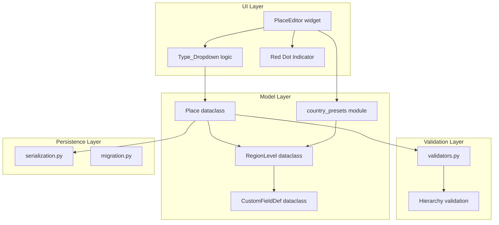
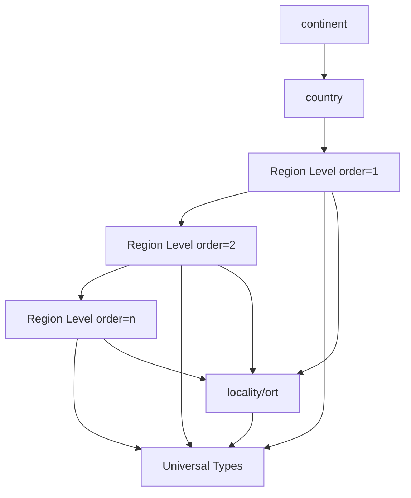

# Design Document: Place Hierarchy Levels

## Overview

This feature extends the Släktbusken place hierarchy by introducing **continent** as a universal root-level place type and **country-specific region levels** as configurable administrative subdivisions. The current rigid hierarchy (country → county → parish → leaf types) is replaced with a flexible model where each country defines its own ordered region levels (e.g., Sverige: Län → Socken, USA: State → County → City).

The Place Editor's Type_Dropdown adapts dynamically, showing only continent, country, universal place types, and region labels derived from countries present in the project. This eliminates clutter from irrelevant region types while supporting multi-country genealogical research.

### Key Design Decisions

1. **Region levels stored on the country Place itself** — Each country place carries its own `region_levels` list, avoiding a separate global registry. This keeps the data model self-contained and serializable without schema changes to ProjectData.

2. **Dynamic type resolution** — Place types for region-level places use the region level key from their parent country. The Type_Dropdown collects all region labels from countries in the project at render time.

3. **Universal place types remain unscoped** — Church, cemetery, farm, school, and locality (ort) can be children of any region level, preserving researcher flexibility.

4. **Backward-compatible validation** — The existing `_VALID_PLACE_TYPES` set is extended; old projects without continents remain valid through migration.

## Architecture



### Component Interactions

1. **Place model** defines the `RegionLevel` and `CustomFieldDef` dataclasses, and adds `region_levels` and `custom_field_values` fields to `Place`.
2. **Validators** are extended to handle continent rules, region level validation, and the new dynamic hierarchy.
3. **Serialization** handles nested `RegionLevel` and `CustomFieldDef` objects via the existing `_NESTED_LIST_TYPES` registry.
4. **Place Editor** reads region levels from country places in the project to build the Type_Dropdown dynamically, and shows custom field inputs when applicable.
5. **Country presets** module provides bundled region definitions for common countries.

## Components and Interfaces

### 1. `RegionLevel` Dataclass (`model/place.py`)

```python
@dataclass
class CustomFieldDef:
    """Definition of a custom metadata field on a region level."""
    key: str          # 1-50 characters
    label: str        # 1-100 characters

@dataclass
class RegionLevel:
    """An administrative subdivision level defined by a country."""
    key: str          # 1-50 characters, unique within country
    label: str        # 1-100 characters, display name
    order: int        # Positive integer, consecutive from 1
    custom_fields: list[CustomFieldDef] = field(default_factory=list)
```

### 2. Extended `Place` Dataclass (`model/place.py`)

```python
@dataclass
class Place:
    """A place, optionally nested within a parent place hierarchy."""
    id: str
    type: str
    name: str
    parent_place_id: Optional[str] = None
    latitude: Optional[float] = None
    longitude: Optional[float] = None
    notes: str = ""
    external_ids: list[ExternalId] = field(default_factory=list)
    alternative_names: list[str] = field(default_factory=list)
    region_levels: list[RegionLevel] = field(default_factory=list)
    custom_field_values: dict[str, str] = field(default_factory=dict)
```

### 3. `country_presets` Module (`data/country_presets.py`)

```python
def get_preset(country_name: str) -> list[RegionLevel]:
    """Return predefined region levels for a known country."""
    ...

def available_presets() -> list[str]:
    """Return list of country names with available presets."""
    ...
```

### 4. Validation Functions (`model/validators.py`)

New/updated functions:
- `validate_place()` — Extended to handle "continent" type, region level validation on countries, and dynamic hierarchy checks.
- `validate_region_levels(levels: list[RegionLevel]) -> list[str]` — Validates region level structure (key/label lengths, order consecutive, keys unique).
- `validate_custom_field_values(place, country_place) -> list[str]` — Validates custom field values against definitions.

### 5. `needs_red_dot()` Update (`model/place.py`)

```python
def needs_red_dot(place: Place) -> bool:
    """Determine if a place should show the red dot indicator."""
    return place.type != "continent" and place.parent_place_id is None
```

### 6. Type Dropdown Builder (`ui/editors/place_editor.py`)

```python
def build_type_options(project_data: ProjectData) -> list[str]:
    """Build the list of available place type labels for the dropdown.
    
    Always includes: Kontinent, Land, + Universal types.
    Adds region level labels from all countries in the project.
    """
    ...
```

### 7. Serialization Registry Updates (`persistence/serialization.py`)

Add to `_NESTED_LIST_TYPES`:
```python
(Place, "region_levels"): RegionLevel,
(RegionLevel, "custom_fields"): CustomFieldDef,
```

## Data Models

### RegionLevel

| Field | Type | Constraints |
|-------|------|-------------|
| key | str | 1-50 chars, unique within parent country |
| label | str | 1-100 chars |
| order | int | Positive integer, consecutive from 1 |
| custom_fields | list[CustomFieldDef] | Optional, each with key (1-50) and label (1-100) |

### Place (extended fields)

| Field | Type | Constraints |
|-------|------|-------------|
| region_levels | list[RegionLevel] | Only meaningful when type="country", max 10 entries |
| custom_field_values | dict[str, str] | Values 1-20 chars, keys must match a CustomFieldDef key |

### Valid Place Types (extended)

| Type | Parent Requirement | Notes |
|------|-------------------|-------|
| continent | None (root) | Must NOT have a parent |
| country | continent | Must reference a continent |
| *region_level_key* | country or higher region level (by order) | Dynamic, defined per country |
| church | any region level or locality | Universal |
| cemetery | any region level or locality | Universal |
| farm | any region level or locality | Universal |
| school | any region level or locality | Universal |
| locality (ort) | any region level | Universal, general-purpose settlement |

### Country Presets Data

| Country | Level 1 | Level 2 | Custom Fields |
|---------|---------|---------|---------------|
| Sverige | Län (key: "lan") | Socken (key: "socken") | Län: code/Länsbokstav |
| USA | Delstat (key: "delstat") | County (key: "county") | — |
| Tyskland | Förbundsland (key: "forbundsland") | Kreis (key: "kreis") | — |
| Norge | Fylke (key: "fylke") | Kommune (key: "kommune") | — |
| Danmark | Region (key: "region") | Kommune (key: "kommune") | — |
| Finland | Landskap (key: "landskap") | Kommun (key: "kommun") | — |
| England | County (key: "county") | Parish (key: "parish") | — |

### Hierarchy Validation Rules



A place of a region-level type must have a parent that is either:
- The country itself (if order = 1), or
- A place of the preceding region level (order - 1) within the same country lineage.

Universal place types (church, cemetery, farm, school) can be children of any region level or locality. Locality can be a child of any region level.

## Correctness Properties

*A property is a characteristic or behavior that should hold true across all valid executions of a system — essentially, a formal statement about what the system should do. Properties serve as the bridge between human-readable specifications and machine-verifiable correctness guarantees.*

### Property 1: Red dot indicator equivalence

*For any* place of any type with any parent_place_id value, `needs_red_dot(place)` returns True if and only if `place.type != "continent"` and `place.parent_place_id is None`.

**Validates: Requirements 5.1, 5.2, 5.3, 5.4**

### Property 2: Continent hierarchy enforcement

*For any* place with type "continent", validation SHALL reject the place if and only if `parent_place_id` is not None. Conversely, a continent with `parent_place_id = None` SHALL pass hierarchy validation.

**Validates: Requirements 1.2, 1.3**

### Property 3: Country parent must be continent

*For any* place with type "country", validation SHALL reject the place if `parent_place_id` is None or if it references a place whose type is not "continent". Validation SHALL accept the place when its parent is of type "continent".

**Validates: Requirements 1.4, 1.5, 1.6**

### Property 4: Region level validation

*For any* list of `RegionLevel` entries on a country place, validation SHALL pass if and only if: all keys are 1-50 characters, all labels are 1-100 characters, all keys are unique, order values are consecutive integers starting at 1, and there are at most 10 entries. Any violation SHALL produce a validation error.

**Validates: Requirements 2.2, 2.3, 2.4, 2.6**

### Property 5: Region levels ignored on non-country places

*For any* place whose type is not "country", the `region_levels` field SHALL not produce validation errors regardless of its content (treated as empty/ignored).

**Validates: Requirements 2.5**

### Property 6: Type dropdown contains all active region labels

*For any* project containing a set of countries with region levels, the Type_Dropdown SHALL contain exactly: "continent", "country", all universal place types, plus all unique region level labels from countries in the project — no more, no less.

**Validates: Requirements 3.3, 3.4**

### Property 7: Removing a country removes exclusive labels from dropdown

*For any* project with multiple countries, removing a country SHALL remove from the Type_Dropdown all region level labels that are not shared by any remaining country.

**Validates: Requirements 3.5**

### Property 8: Universal types and locality valid as children of any region level

*For any* place of a universal type (church, cemetery, farm, school) or locality (ort), and *for any* valid region level type as its parent, hierarchy validation SHALL accept the assignment.

**Validates: Requirements 3.6, 3.7**

### Property 9: Coordinates may be None for any place type

*For any* place of any type (including "continent" and "country") with latitude and longitude set to None, validation SHALL not produce errors about missing coordinates.

**Validates: Requirements 4.2**

### Property 10: Custom field value length validation

*For any* custom field value of 1 to 20 characters, validation SHALL accept. *For any* custom field value exceeding 20 characters, validation SHALL reject. Empty values SHALL be accepted (optional fields).

**Validates: Requirements 8.5, 8.6**

### Property 11: Serialization round-trip preserves Place data

*For any* valid Place object (including places of type "country" with region_levels and custom_fields, and places with custom_field_values), serializing then deserializing SHALL produce an equivalent object.

**Validates: Requirements 9.1, 9.2, 9.3**

## Error Handling

### Validation Errors

All validation functions return `list[str]` with Swedish-language error messages, consistent with the existing pattern in `validators.py`.

| Scenario | Error Message (Swedish) |
|----------|------------------------|
| Continent with parent | "En kontinent får inte ha en överordnad plats." |
| Country without parent | "Ett land måste ha en kontinent som överordnad plats." |
| Country with non-continent parent | "Ett lands överordnade plats måste vara av typen 'kontinent'." |
| Region level key empty/too long | "Regionnivåns nyckel måste vara 1–50 tecken." |
| Region level label empty/too long | "Regionnivåns etikett måste vara 1–100 tecken." |
| Duplicate region level key | "Regionnivåns nyckel '{key}' finns redan." |
| Non-consecutive order | "Regionnivåernas ordning måste vara löpande heltal från 1." |
| Too many region levels (>10) | "Högst 10 regionnivåer tillåtna." |
| Custom field value too long | "Anpassat fältvärde får vara högst 20 tecken." |
| Invalid place type | Extended message including "kontinent" in valid types |

### Migration Errors

- If an existing project file contains no continents, migration is **not** required — existing places remain valid. The extended validator accepts the old types.
- If a user manually adds "continent" type in an old format, a migration step increments the format version.

### UI Error Display

The Place_Editor uses the existing `status_label` pattern to show validation errors inline. Region level validation errors appear when the user attempts to save a country with invalid definitions.

## Testing Strategy

### Property-Based Tests (Hypothesis)

The project already uses Hypothesis extensively. Property tests will:
- Use `@settings(max_examples=100)` minimum per property
- Tag each test with a comment referencing the design property
- Use existing `conftest.py` strategy infrastructure, extended with new strategies:
  - `region_level_strategy()` — generates valid RegionLevel instances
  - `custom_field_def_strategy()` — generates valid CustomFieldDef instances
  - `place_with_region_levels_strategy()` — generates country places with region levels
  - `continent_place_strategy()` — generates continent places

### Unit Tests (pytest)

Example-based tests for:
- Dropdown ordering (continent first)
- Preset data correctness (exact values for each country)
- UI interactions (preset selection populating form)
- Red dot transitions (parent change → refresh → dot appears/disappears)
- PlaceRef with continent/country (no type restriction)

### Integration Tests

- End-to-end save/load cycle with a project containing continents, countries with region levels, and places using custom fields
- Place_Editor form interaction: select preset → modify → save → verify in model

### Test Organization

```
tests/
  test_model/
    test_place_hierarchy_levels.py      # Property tests for validation (Properties 1-5, 9-10)
    test_place_type_dropdown.py         # Property tests for dropdown (Properties 6-8)
    test_place_serialization_roundtrip.py  # Property test for round-trip (Property 11)
  test_model/
    test_country_presets.py             # Example-based tests for presets
    test_place_hierarchy_examples.py    # Example-based validation tests
```

