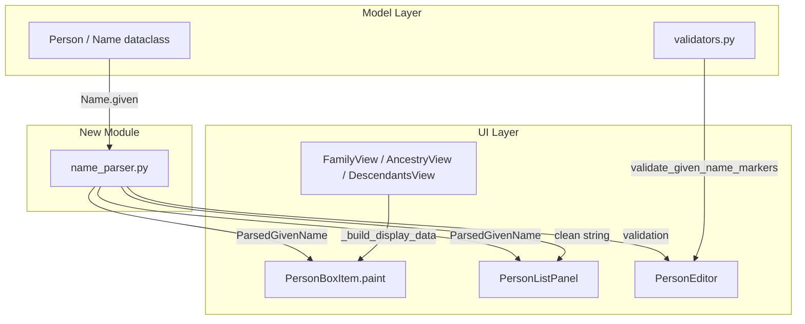

# Design Document: Primary Name Asterisk (Tilltalsnamn)

## Overview

This feature adds support for the Swedish genealogy convention of marking a person's tilltalsnamn (primary given name) with an asterisk in the stored given-name string. The implementation spans four layers: a pure parsing module, rendering logic in both the Person Box (diagram) and Person List Panel, transparent search/filter behaviour, and editor validation.

The asterisk convention (e.g., "Kent Torbjörn*") is widely used in Swedish genealogy software (Genline, Disgen) to indicate which given name a person goes by. This feature parses the marker, displays the tilltalsnamn with an underline instead of showing the raw asterisk, and ensures all search/sort operations work on the clean (marker-free) name.

### Key Design Decisions

1. **Pure parsing module separate from UI**: The name parsing logic lives in `slaktbusken/model/name_parser.py` as a set of pure functions with no Qt dependency. This enables easy property-based testing and reuse across all UI components.

2. **Structured parse result over inline logic**: Rather than having each rendering site strip asterisks ad hoc, a single `ParsedGivenName` dataclass carries the tilltalsnamn index, clean parts list, and display string. All consumers operate on this structured result.

3. **Rich text (HTML) in QListWidget items**: The Person List Panel uses `QLabel` as item widget (via `setItemWidget`) with inline HTML to render selective underlines — consistent with how Qt handles mixed text decorations in list items.

4. **Custom paint in PersonBoxItem**: The Person Box already uses custom `paint()` with QPainter. We extend it to draw underlined segments for the tilltalsnamn part using `QFont` with underline decoration on only the relevant substring.

5. **Validation at editor level, not model level**: Asterisk validation (at most one marker, must be immediately after a name part) is enforced in the Person Editor before saving. The model's `Name.given` field continues to store the raw string including the asterisk — no schema change required.

## Architecture



### Data Flow

1. **Storage** → `Name.given` stores the raw string (e.g., "Kent Torbjörn*")
2. **Parsing** → `parse_given_name(raw)` returns a `ParsedGivenName` with:
   - `parts`: list of clean name parts (no asterisks)
   - `tilltalsnamn_index`: index of the marked part (or `None`)
   - `display_string`: clean joined string for display/search
3. **Rendering** → Person Box and Person List use the parsed result to apply underline only to `parts[tilltalsnamn_index]`
4. **Search/Sort** → The filter operates on `display_string` (asterisk removed)
5. **Editor** → Shows raw string; validates on save via `validate_given_name_markers()`

## Components and Interfaces

### 1. `slaktbusken/model/name_parser.py`

```python
@dataclass(frozen=True)
class ParsedGivenName:
    """Result of parsing a given-name string for tilltalsnamn marker.

    Attributes:
        parts: Ordered list of name parts with asterisks removed.
        tilltalsnamn_index: Zero-based index of the marked part, or None.
        display_string: Clean display string (parts joined by spaces).
        raw: The original input string.
    """
    parts: list[str]
    tilltalsnamn_index: int | None
    display_string: str
    raw: str


def parse_given_name(given: str) -> ParsedGivenName:
    """Parse a given-name string, extracting tilltalsnamn marker.

    A name part is considered marked if it ends with exactly '*'.
    A '*' embedded within a name part (not at the end) is treated
    as a literal character.

    Args:
        given: The raw given-name string (may contain one '*' marker).

    Returns:
        ParsedGivenName with extracted information.

    Raises:
        ValueError: If more than one marker is found.
    """
    ...


def format_given_name(parsed: ParsedGivenName) -> str:
    """Re-format a ParsedGivenName back to the raw marker string.

    Reconstructs the original given-name string by appending '*'
    after parts[tilltalsnamn_index].

    Args:
        parsed: A previously parsed given-name result.

    Returns:
        The reconstructed raw string equal to parsed.raw.
    """
    ...


def validate_given_name_markers(given: str) -> list[str]:
    """Validate asterisk marker placement in a given-name string.

    Checks:
    - At most one '*' marker is present.
    - The '*' is placed immediately after a name part (not standalone,
      not leading, not preceded by whitespace).

    Args:
        given: The raw given-name string to validate.

    Returns:
        List of error messages (empty if valid).
    """
    ...
```

### 2. PersonBoxItem Changes (`slaktbusken/ui/widgets/person_box.py`)

The `_build_lines` method and `paint()` method will be extended:

- `display_data` gains a new key `"name_parsed"` containing a `ParsedGivenName` (or `None` if parsing fails/no given name).
- `paint()` checks for `name_parsed` and, if a `tilltalsnamn_index` is present, draws the name line with selective underline using two font states.

### 3. PersonListPanel Changes (`slaktbusken/ui/person_list_panel.py`)

- `PersonDisplayInfo.given` stores the **clean** given name (asterisk removed) for sorting and filtering.
- A new field `PersonDisplayInfo.tilltalsnamn_index` (optional int) is added.
- `_format_person_display` uses HTML with `<u>` tags around the tilltalsnamn part.
- The `QListWidget` uses `QLabel` item widgets to render the HTML.
- `filter_persons` already matches on `person.given.lower()` — this now operates on the clean string.

### 4. PersonEditor Validation

- On save, call `validate_given_name_markers()` on the given-name input.
- Display validation errors via the existing `_update_status()` mechanism.
- Block save if validation fails (same pattern as existing "Minst ett namn krävs" check).

### 5. View Layer (`_build_display_data`)

Each view's `_build_display_data` function is updated to also call `parse_given_name()` and store the result under `"name_parsed"` key in the display_data dictionary, alongside the existing `"name"` key (which becomes the clean display string).

## Data Models

### ParsedGivenName (new dataclass)

| Field | Type | Description |
|-------|------|-------------|
| `parts` | `list[str]` | Ordered name parts, asterisks stripped |
| `tilltalsnamn_index` | `int \| None` | Index of tilltalsnamn part, or None |
| `display_string` | `str` | Parts joined by single spaces |
| `raw` | `str` | Original input string |

### PersonDisplayInfo (extended)

| New Field | Type | Description |
|-----------|------|-------------|
| `tilltalsnamn_index` | `int \| None` | Index of tilltalsnamn in the given-name parts |

### Name dataclass (unchanged)

The existing `Name.given: str` field continues to store the raw string including any asterisk marker. No schema migration is needed.


## Correctness Properties

*A property is a characteristic or behavior that should hold true across all valid executions of a system — essentially, a formal statement about what the system should do. Properties serve as the bridge between human-readable specifications and machine-verifiable correctness guarantees.*

### Property 1: Correct Tilltalsnamn Identification

*For any* given-name string containing multiple whitespace-separated name parts with exactly one part ending in `*`, `parse_given_name` SHALL return that part (without the asterisk) as the tilltalsnamn and its correct zero-based index in the parts list, regardless of whether the marker appears at the first, middle, or last position.

**Validates: Requirements 1.1, 1.3**

### Property 2: No-Marker Returns None

*For any* given-name string containing no `*` character at the end of any name part, `parse_given_name` SHALL return a result with `tilltalsnamn_index` equal to `None` and `parts` equal to the whitespace-split name parts.

**Validates: Requirements 1.2**

### Property 3: Embedded Asterisks Are Literal

*For any* given-name string where `*` characters appear only within name parts (not at the trailing position of any part), `parse_given_name` SHALL treat them as literal characters, returning `tilltalsnamn_index` as `None` and preserving the `*` characters within the parts.

**Validates: Requirements 1.4**

### Property 4: Parse-Format Round Trip

*For any* valid given-name string containing zero or one asterisk marker (trailing `*` on a name part), parsing with `parse_given_name` then formatting with `format_given_name` SHALL produce a string equal to the original input.

**Validates: Requirements 1.6**

### Property 5: Multiple Markers Rejected

*For any* given-name string containing two or more name parts each ending in `*`, `parse_given_name` SHALL raise a `ValueError` (and equivalently `validate_given_name_markers` SHALL return a non-empty error list).

**Validates: Requirements 1.7, 5.4**

### Property 6: Malformed Markers Rejected

*For any* given-name string where `*` appears as a standalone token, a leading character, or is preceded by whitespace (i.e., not immediately after a non-whitespace name part), `validate_given_name_markers` SHALL return a non-empty error list.

**Validates: Requirements 5.5**

### Property 7: Filter Matches on Clean Name

*For any* person with a given-name string containing an asterisk marker and *for any* search substring, filtering SHALL produce the same result as filtering against the clean name (asterisk removed), using case-insensitive substring matching.

**Validates: Requirements 4.1**

### Property 8: Sort Uses Clean Name

*For any* list of persons where some have asterisk markers in their given names, sorting alphabetically SHALL produce the same ordering as sorting by the clean given name (asterisk removed).

**Validates: Requirements 4.4**

## Error Handling

### Parsing Errors

| Condition | Behaviour |
|-----------|-----------|
| Multiple `*` markers in one given-name string | `parse_given_name` raises `ValueError`; `validate_given_name_markers` returns error message |
| Malformed marker (standalone `*`, leading `*`, whitespace-preceded `*`) | `validate_given_name_markers` returns error message |
| Empty given-name string | `parse_given_name` returns empty parts list, `tilltalsnamn_index = None`, `display_string = ""` |

### Editor Validation Flow

1. User modifies the given-name field and clicks Save.
2. Editor calls `validate_given_name_markers(given_text)`.
3. If errors are returned:
   - Display the first error via `_update_status()`.
   - Switch to the Names tab.
   - Abort save (do not emit `save_requested`).
4. If valid, proceed with normal save flow.

### Rendering Graceful Degradation

- If `parse_given_name` raises (shouldn't happen for stored data, but defensively): fall back to displaying the raw given-name string without underline, stripping any `*` characters.
- If `tilltalsnamn_index` is out of bounds for the parts list: render without underline.

## Testing Strategy

### Property-Based Tests (Hypothesis)

The project already uses Hypothesis (version ≥6.90.0) for property-based testing. Each correctness property above maps to a single Hypothesis test with a minimum of 100 examples.

**Library**: `hypothesis` (already in dev dependencies)
**Configuration**: `@settings(max_examples=200)` per property test
**Tag format**: Comment `# Feature: primary-name-asterisk, Property N: <title>`

**Test file**: `tests/test_model/test_name_parser.py`

**Hypothesis strategies needed**:
- `valid_given_name_with_marker()`: generates 1–5 name parts (letters + common Swedish characters), places a trailing `*` on one random part.
- `valid_given_name_without_marker()`: generates 1–5 name parts with no trailing `*` on any part.
- `given_name_with_embedded_asterisks()`: generates name parts where `*` appears mid-part (e.g., "O*Brien").
- `given_name_with_multiple_markers()`: generates strings with 2+ parts ending in `*`.
- `malformed_marker_string()`: generates strings with standalone `*`, leading `*`, or whitespace-preceded `*`.

### Unit Tests (Example-Based)

**Test file**: `tests/test_model/test_name_parser_examples.py`

- Concrete examples for parsing: `"Kent Torbjörn*"` → tilltalsnamn="Torbjörn", index=1
- Edge cases: single name `"Anna*"`, name with no marker `"Erik Johan"`, empty string
- Rendering verification: PersonBoxItem with marked name renders correctly
- PersonListPanel HTML formatting verification
- Editor validation error display

**Test file**: `tests/test_ui/test_person_list_filter.py`

- Concrete filter examples matching requirements 4.2 and 4.3
- Literal asterisk in search term (requirement 4.5)

### Integration Tests

- End-to-end: load project with marked names → verify person list displays correctly
- Save/load cycle: mark a name in editor → save → reload → verify marker preserved

### Test Coverage Mapping

| Property | Requirements | Test Type |
|----------|-------------|-----------|
| 1: Correct identification | 1.1, 1.3 | Property (Hypothesis) |
| 2: No-marker returns None | 1.2 | Property (Hypothesis) |
| 3: Embedded asterisks literal | 1.4 | Property (Hypothesis) |
| 4: Round trip | 1.6 | Property (Hypothesis) |
| 5: Multiple markers rejected | 1.7, 5.4 | Property (Hypothesis) |
| 6: Malformed markers rejected | 5.5 | Property (Hypothesis) |
| 7: Filter on clean name | 4.1 | Property (Hypothesis) |
| 8: Sort uses clean name | 4.4 | Property (Hypothesis) |
| Rendering (Person Box) | 2.1–2.5 | Example (pytest) |
| Rendering (List Panel) | 3.1–3.4 | Example (pytest) |
| Search examples | 4.2, 4.3, 4.5 | Example (pytest) |
| Editor display/save | 5.1–5.3 | Example (pytest) |
