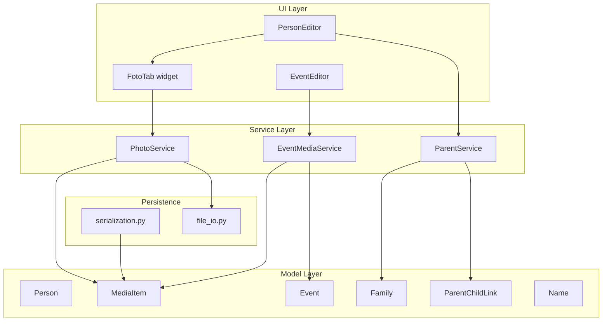

# Design Document: Redigera Person Media

## Overview

This feature extends the existing `PersonEditor` in Släktbusken with parent relationship management, name-event linking, a dedicated photo tab with type categorization and person lists, file management for photos, event-specific media for death/funeral events, and preparation for future image annotation.

The implementation builds on the existing PySide6/Qt architecture with dataclass-based models, JSON serialization via `serialization.py`, and the established editor widget pattern (tabbed UI, `save_requested`/`cancel_requested` signals, validation before save).

### Key Design Decisions

1. **Foto_Typ stored as title prefix**: The photo type is encoded in the `MediaItem.title` field using the format `[Foto_Typ] title`. This avoids adding a new field to MediaItem while still allowing categorization. A utility module provides parsing/formatting functions.

2. **`mentioned_names` as new field on MediaItem**: Free-text person names (non-database persons) are stored in a new `mentioned_names: list[str]` field on MediaItem, separate from `mentioned_person_ids`.

3. **`annotations` field on MediaItem**: An optional `annotations` list prepares the data model for future coordinate-based image tagging without requiring schema migration later.

4. **Shared event media logic**: Death and funeral event media sections share a common pattern in EventEditor, differentiated only by allowed media type options per event type.

5. **Service-layer parent logic**: Parent relationship management logic (Family lookup, creation, validation) is encapsulated in a new `ParentService` to keep the editor thin and testable.

6. **`donation` parentage type**: The requirements specify "donation" as a parentage type. The existing `_VALID_PARENTAGE_TYPES` set in validators already includes related types. We add `"donation"` to this set.

## Architecture



### Component Responsibilities

- **PersonEditor**: Orchestrates the tabbed editor. Adds a parent relationship section to the existing Names/Events tabs and integrates the new FotoTab.
- **FotoTab**: A new `QWidget` tab managing photo listing, addition, metadata editing, and person tagging for a single person.
- **ParentService**: Pure logic for validating and managing parent-child relationships (Family lookup, creation, duplicate detection, max-parent enforcement).
- **PhotoService**: Handles file copy/path logic, Foto_Typ formatting, file extension validation, and mentioned-person synchronization.
- **EventMediaService**: Handles media linking/unlinking for events, with type-specific options per event type.

## Components and Interfaces

### ParentService

```python
class ParentService:
    """Business logic for managing parent-child relationships."""

    def __init__(self, project_data: ProjectData) -> None: ...

    def get_parents_for_person(self, person_id: str) -> list[ParentInfo]:
        """Return all parents linked to person_id with their display info."""
        ...

    def add_parent(
        self, child_id: str, parent_id: str, parentage_type: str
    ) -> ParentChildLink:
        """Add a parent relationship. Creates/updates Family as needed.
        
        Raises:
            ValidationError: If duplicate or max-parent constraint violated.
        """
        ...

    def update_parentage_type(
        self, child_id: str, parent_id: str, old_type: str, new_type: str
    ) -> None:
        """Change the parentage_type of an existing link."""
        ...

    def remove_parent(self, child_id: str, parent_id: str, parentage_type: str) -> None:
        """Remove a parent-child link from the containing Family."""
        ...

    def validate_add(
        self, child_id: str, parent_id: str, parentage_type: str
    ) -> list[str]:
        """Return validation errors (empty list = valid)."""
        ...


@dataclass
class ParentInfo:
    """Display information for a parent relationship."""
    parent_id: str
    parent_name: str
    parentage_type: str
    family_id: str
```

### PhotoService

```python
class PhotoService:
    """Business logic for photo management in the Foto_Tab."""

    ALLOWED_EXTENSIONS: set[str] = {
        ".jpg", ".jpeg", ".png", ".tif", ".tiff", ".bmp", ".gif", ".webp"
    }

    FOTO_TYPES: list[str] = [
        "Porträtt", "Gruppfoto", "Familjefoto", "Bröllopsfoto",
        "Konfirmationsfoto", "Dopfoto", "Skolfoto", "Militärfoto",
        "Arbetsfoto", "Begravningsfoto", "Gravfoto", "Övrigt foto",
    ]

    def __init__(self, project_data: ProjectData, foto_mapp: Path) -> None: ...

    def get_photos_for_person(self, person_id: str) -> list[MediaItem]:
        """Return all photo MediaItems linked to person, ordered by title."""
        ...

    def validate_file_extension(self, file_path: str) -> bool:
        """Check if file extension is in ALLOWED_EXTENSIONS."""
        ...

    def compute_target_path(self, source_path: Path) -> tuple[Path, bool]:
        """Determine target path in foto_mapp. Returns (target, needs_copy)."""
        ...

    def resolve_filename_conflict(self, target_path: Path) -> Path:
        """Generate unique filename with numeric suffix if conflict exists."""
        ...

    def format_title(self, foto_typ: str, title: str) -> str:
        """Format as '[Foto_Typ] title'."""
        ...

    def parse_title(self, raw_title: str) -> tuple[str, str]:
        """Parse '[Foto_Typ] title' into (foto_typ, title). 
        Returns ('Övrigt foto', raw_title) if no bracket prefix found."""
        ...

    def sync_linked_entities(
        self, media_item: MediaItem, new_person_ids: list[str]
    ) -> None:
        """Synchronize Linked_Entity records with mentioned_person_ids."""
        ...
```

### EventMediaService

```python
class EventMediaService:
    """Business logic for linking media to events."""

    DEATH_MEDIA_TYPES: list[str] = [
        "dödruna", "dödsannons", "bouppteckning", "dödsbevis"
    ]

    FUNERAL_MEDIA_TYPES: list[str] = [
        "begravningsprogram", "minnesord"
    ]

    def __init__(self, project_data: ProjectData) -> None: ...

    def get_media_types_for_event(self, event_type: str) -> list[str]:
        """Return allowed media types for the given event type."""
        ...

    def add_media_to_event(
        self, event: Event, media_item: MediaItem
    ) -> None:
        """Link media_item to event: adds to media_ids and creates Linked_Entity."""
        ...

    def remove_media_from_event(
        self, event: Event, media_id: str
    ) -> None:
        """Unlink media from event. Does NOT delete the MediaItem."""
        ...
```

### FotoTab (UI Widget)

```python
class FotoTab(QWidget):
    """Dedicated photo management tab for PersonEditor."""

    def __init__(
        self, project_data: ProjectData, person: Person,
        photo_service: PhotoService, parent: QWidget | None = None
    ) -> None: ...

    # Lists photos, handles add/edit/remove, person tagging UI
```

### Updated PersonEditor

The existing `PersonEditor` gains:
- A new "Föräldrar" (Parents) section in the first tab showing parent relationships with add/edit/remove controls.
- Integration of the name-event linking UI in the names table (event_id dropdown for non-birth names).
- A new "Foton" tab using `FotoTab`.

### Updated EventEditor

The existing `EventEditor` gains:
- A conditional media section (visible when event type is "death" or "funeral") with type-specific media type options and file/title input.

## Data Models

### Updated MediaItem

```python
@dataclass
class MediaItem:
    """A media item such as an image, document, or recording."""
    id: str
    type: str
    file: str
    title: str
    linked_entities: list[LinkedEntity] = field(default_factory=list)
    publication: Optional[dict] = None
    transcription: Optional[str] = None
    mentioned_person_ids: list[str] = field(default_factory=list)
    mentioned_names: list[str] = field(default_factory=list)          # NEW
    annotations: list[Annotation] = field(default_factory=list)       # NEW
```

### New Annotation dataclass

```python
@dataclass
class Annotation:
    """A coordinate-based annotation on a media item (for future use)."""
    x: float        # 0.0–1.0, fraction of image width
    y: float        # 0.0–1.0, fraction of image height
    width: float    # 0.0–1.0
    height: float   # 0.0–1.0
    entity_type: str
    entity_id: str
```

### Updated validators constants

```python
_VALID_PARENTAGE_TYPES = {
    "biological", "legal", "adoptive", "foster", "step",
    "unknown_donor", "donation",  # "donation" added
}

_VALID_MEDIA_TYPES = {
    "photo", "source_image", "death_notice", "obituary",
    "funeral_program", "grave_photo", "map", "logo", "document",
    "dödruna", "dödsannons", "bouppteckning", "dödsbevis",  # death event media
    "begravningsprogram", "minnesord",                       # funeral event media
}
```

### Serialization updates

The `_NESTED_LIST_TYPES` registry gains:
```python
(MediaItem, "annotations"): Annotation,
```

The serialization of `mentioned_names` is handled automatically by the existing `_serialize_value` logic (list of strings). The `annotations` field uses the "omit when empty/default" pattern already present for optional fields — but since it's a list with `default_factory=list`, the serializer should explicitly omit it when empty (matching Requirement 6.4).

## Correctness Properties

*A property is a characteristic or behavior that should hold true across all valid executions of a system — essentially, a formal statement about what the system should do. Properties serve as the bridge between human-readable specifications and machine-verifiable correctness guarantees.*

### Property 1: Parent relationship creation produces correct structures

*For any* valid child person, parent person, and parentage_type, when `add_parent` is called successfully, the project data SHALL contain a Family where the child is in the children list, the parent is a partner, and a ParentChildLink exists with matching child_id, parent_id, and parentage_type.

**Validates: Requirements 1.4, 1.5, 1.6**

### Property 2: Parentage type update changes only the type field

*For any* existing ParentChildLink, when `update_parentage_type` is called with a new valid type, the resulting link SHALL have the new parentage_type while child_id and parent_id remain unchanged.

**Validates: Requirements 1.7**

### Property 3: Parent relationship removal preserves other links

*For any* Family with multiple ParentChildLink records, when one link is removed, the remaining links in the Family SHALL be unchanged and the removed link SHALL no longer appear in the Family's parent_child_links list.

**Validates: Requirements 1.8**

### Property 4: Maximum two parents per parentage type validation

*For any* person who already has two parents (one of each sex) for a given parentage_type, attempting to add a third parent of the same parentage_type SHALL be rejected with a validation error.

**Validates: Requirements 1.9**

### Property 5: Duplicate parent relationship detection

*For any* existing ParentChildLink between a child and parent with a specific parentage_type, attempting to add the same combination again SHALL be rejected.

**Validates: Requirements 1.11**

### Property 6: Event filter returns only events with person as participant

*For any* set of events and a person_id, filtering events for name-event association SHALL return exactly those events where the person_id appears in the event's participants list.

**Validates: Requirements 2.5**

### Property 7: Name event_id association round-trip

*For any* Name record and valid event_id, setting the event_id and then reading it back SHALL return the same event_id. Clearing the event_id SHALL result in None.

**Validates: Requirements 2.2, 2.4**

### Property 8: Photo list filtering and ordering

*For any* set of MediaItems in a project and a person_id, the photo list for that person SHALL contain exactly those MediaItems where type is "photo" and a LinkedEntity with entity_type "person" and matching entity_id exists, ordered alphabetically by title.

**Validates: Requirements 3.2**

### Property 9: Foto_Typ title format round-trip

*For any* valid Foto_Typ and title string (1–200 characters), formatting as `[Foto_Typ] title` and then parsing SHALL recover the original Foto_Typ and title exactly.

**Validates: Requirements 3.4, 3.5, 3.6, 9.2, 9.3**

### Property 10: File extension validation

*For any* file path, the extension validator SHALL accept the path if and only if its lowercase extension is in the set {.jpg, .jpeg, .png, .tif, .tiff, .bmp, .gif, .webp}.

**Validates: Requirements 3.8**

### Property 11: Relative path computation

*For any* source file path and foto_mapp path, if the source is inside foto_mapp then needs_copy is False and the result is the relative path within foto_mapp; if outside, needs_copy is True and the target is foto_mapp / filename.

**Validates: Requirements 4.1, 4.2**

### Property 12: Filename deduplication produces unique names

*For any* target filename and set of existing filenames in the directory, the deduplication function SHALL return a filename that does not exist in the set, follows the pattern `name_N.ext` where N is the smallest positive integer producing uniqueness, and preserves the original extension.

**Validates: Requirements 4.5**

### Property 13: Mentioned persons synchronization with Linked_Entity

*For any* MediaItem and a new set of mentioned_person_ids, after synchronization the MediaItem's linked_entities with entity_type "person" SHALL contain exactly one entry per person_id in the new set, and no entries for person_ids not in the new set. Other linked_entities (entity_type != "person") SHALL be unchanged.

**Validates: Requirements 5.2, 5.4, 5.5, 5.6, 9.4, 9.5**

### Property 14: Annotation serialization round-trip

*For any* MediaItem with 0 to 100 annotations (each having valid coordinate floats 0.0–1.0 and non-empty entity_type/entity_id), serializing and then deserializing SHALL produce a MediaItem whose annotations list has the same length and identical field values. When annotations is empty, the serialized JSON SHALL NOT contain an "annotations" key.

**Validates: Requirements 6.3, 6.4**

### Property 15: Annotation count validation

*For any* MediaItem, validation SHALL pass when annotations contains 0 to 100 records and SHALL fail when it exceeds 100.

**Validates: Requirements 6.5**

### Property 16: Event media linking creates correct structures

*For any* event of type "death" or "funeral" and a valid MediaItem, after linking the event's media_ids SHALL contain the MediaItem's id and the MediaItem's linked_entities SHALL contain a LinkedEntity with entity_type "event" and entity_id matching the event's id.

**Validates: Requirements 7.3, 8.3**

### Property 17: Event media unlinking preserves MediaItem

*For any* event with linked media, after unlinking a media_id, the event's media_ids SHALL not contain that id, the MediaItem's linked_entities SHALL not contain a LinkedEntity for that event, but the MediaItem record itself SHALL still exist in project_data.media.

**Validates: Requirements 7.4, 8.4**

### Property 18: Title length validation

*For any* string, title validation SHALL pass if and only if the string length is between 1 and 200 characters inclusive.

**Validates: Requirements 9.7**

## Error Handling

| Error Condition | Handling | User Feedback |
|---|---|---|
| Duplicate parent relationship | `ParentService.validate_add` returns error | Status bar message: "Denna föräldrarelation finns redan." |
| Max parents exceeded | `ParentService.validate_add` returns error | Status bar message: "Maximalt två föräldrar per föräldratyp (en far, en mor)." |
| Unsupported file extension | `PhotoService.validate_file_extension` returns False | Status bar message listing accepted formats |
| File copy I/O error | Exception caught in FotoTab | Error dialog with OS error message; no MediaItem created |
| File name conflict | Detected before copy | Confirmation dialog: overwrite / rename / cancel |
| Empty/too-long title | Validation before save | Status bar message: "Titel måste vara 1–200 tecken." |
| Save persistence failure | Exception caught in save handler | Error dialog; form retains unsaved edits |
| Orphaned event_id on Name | Detected during display | Show Name without event info; allow clearing |
| No available events for name linking | Detected during UI setup | Disable event combo; show info text |
| Annotations exceeding 100 | `validate_media_item` check | Validation error during save |

## Testing Strategy

### Property-Based Tests (Hypothesis)

The project already uses Hypothesis for property-based testing. Each correctness property above maps to one property-based test, configured with `@settings(max_examples=100)`.

**Library**: `hypothesis` (already in dev dependencies)

**Test structure**: Tests live in `tests/test_services/` for service-layer properties and `tests/test_persistence/` for serialization properties.

**Tag format**: Each test docstring includes:
```
Feature: redigera-person-media, Property {N}: {property_text}
```

**Properties suitable for PBT** (18 properties total):
- Properties 1–5: ParentService logic (pure business rules)
- Properties 6–7: Event filtering and name-event association
- Properties 8–9: Photo filtering/ordering and title format parsing
- Properties 10–12: File validation and path computation (pure functions)
- Properties 13: Mentioned person synchronization
- Properties 14–15: Annotation serialization and validation
- Properties 16–17: Event media linking/unlinking
- Property 18: Title length validation

### Unit Tests (pytest)

Example-based tests for:
- UI display correctness (parentage type Swedish labels)
- Specific edge cases (orphaned event_id, empty photo list, no available events)
- Event type → media type mapping
- Default Foto_Typ selection

### Integration Tests

- File copy operations (actual filesystem)
- Directory creation for Foto_Mapp
- Full save/load cycle with new fields via serialization

### Test Configuration

```python
# Minimum 100 iterations for all property tests
@settings(max_examples=100)
```

All property tests validate pure service logic with no external I/O dependencies, making them fast and deterministic.
