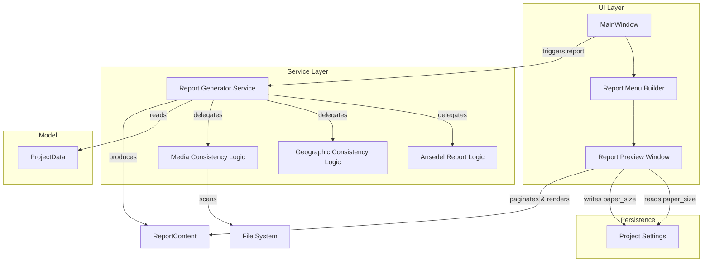

# Design Document: Report Menu (Rapporter)

## Overview

This design adds a "Rapporter" top-level menu to Släktbusken with five report categories and three fully implemented reports. The system follows the existing architecture: a service layer produces report data, and a new Report_Preview window renders paginated output using Qt's painting and printing APIs.

The three implemented reports are:

1. **Ansedel** — A person/family summary report for the active person in the Diagram_Panel.
2. **Geografisk konsistens** — A data-quality report checking the Place hierarchy and coordinate completeness.
3. **Mediakonsistens** — A data-quality report checking orphaned, missing, and duplicate media file references.

All remaining report entries appear as disabled menu items (placeholders) with a Swedish tooltip explaining they are not yet implemented.

A Report_Preview window provides paper size selection (A4, A3, A5), pagination (including proper line-breaking, section-keep-together, and image page-fit logic), page numbering, printing, and PDF export.

## Architecture



**Key architectural decisions:**

- **Separation of report logic from rendering.** Each report produces a structured `ReportContent` (a list of `ReportBlock` items — headings, paragraphs, images, lists). The `ReportPaginator` then lays out these blocks into pages. This keeps report logic testable without Qt dependencies.
- **Report Generator as orchestrator.** A single `ReportGeneratorService` dispatches to per-report modules (ansedel, geographic, media). This mirrors the existing pattern where `Application` wires services to UI callbacks.
- **Paper size persisted in project settings.** The `ProjectSettings` dataclass gets a new `report_paper_size: str` field (default `"A4"`), serialized alongside existing settings.

## Components and Interfaces

### 1. Report Menu Builder (`slaktbusken/ui/report_menu.py`)

Builds the "Rapporter" menu with five submenus. Each item is either connected to a generation callback or disabled with a tooltip.

```python
class ReportMenuBuilder:
    def build(self, menu_bar: QMenuBar, app: Application) -> QMenu:
        """Build and return the Rapporter top-level menu."""
        ...
```

### 2. Report Content Model (`slaktbusken/reports/content.py`)

Platform-independent data structures representing report output.

```python
@dataclass
class ReportBlock:
    """Base class for all report content blocks."""
    pass

@dataclass
class HeadingBlock(ReportBlock):
    text: str
    level: int  # 1=report title, 2=section, 3=subsection

@dataclass
class ParagraphBlock(ReportBlock):
    text: str

@dataclass
class ListBlock(ReportBlock):
    items: list[str]

@dataclass
class ImageBlock(ReportBlock):
    path: Path
    caption: str | None = None

@dataclass
class EmptyStateBlock(ReportBlock):
    """Swedish-language 'no data' message."""
    text: str

@dataclass
class ReportContent:
    title: str
    blocks: list[ReportBlock]
```

### 3. Report Generator Service (`slaktbusken/reports/generator.py`)

Orchestrates report generation. Delegates to per-report modules.

```python
class ReportGeneratorService:
    def generate_ansedel(self, data: ProjectData, person_id: str,
                         project_folder: Path | None) -> ReportContent: ...
    def generate_geographic_consistency(self, data: ProjectData) -> ReportContent: ...
    def generate_media_consistency(self, data: ProjectData,
                                   project_folder: Path) -> ReportContent: ...
```

### 4. Ansedel Report Module (`slaktbusken/reports/ansedel.py`)

Pure function producing `ReportContent` for one person.

```python
def generate_ansedel(data: ProjectData, person_id: str,
                     project_folder: Path | None) -> ReportContent: ...
```

### 5. Geographic Consistency Module (`slaktbusken/reports/geographic.py`)

Pure function checking Place hierarchy rules.

```python
@dataclass
class GeoIssue:
    place_id: str
    place_name: str
    check_type: str  # "county_no_country", "parish_no_county", "sub_no_parish", "missing_coords"

def check_geographic_consistency(places: list[Place]) -> list[GeoIssue]: ...
def generate_geographic_report(data: ProjectData) -> ReportContent: ...
```

### 6. Media Consistency Module (`slaktbusken/reports/media_consistency.py`)

Pure function checking media file references.

```python
@dataclass
class MediaIssue:
    issue_type: str  # "orphaned", "unlinked_file", "missing_file", "duplicate"
    media_id: str | None
    file_path: str
    title: str | None = None

def check_media_consistency(data: ProjectData, project_folder: Path) -> list[MediaIssue]: ...
def generate_media_report(data: ProjectData, project_folder: Path) -> ReportContent: ...
```

### 7. Report Paginator (`slaktbusken/reports/paginator.py`)

Lays out `ReportContent` blocks into pages respecting the selected paper size, line-breaking rules, section-keep-together, and image placement.

```python
@dataclass
class PageLayout:
    width_mm: float
    height_mm: float
    margin_mm: float = 15.0

@dataclass
class RenderedPage:
    page_number: int
    total_pages: int  # filled after full pagination
    elements: list[RenderedElement]

class ReportPaginator:
    def paginate(self, content: ReportContent, paper_size: str) -> list[RenderedPage]: ...
```

### 8. Report Preview Window (`slaktbusken/ui/dialogs/report_preview.py`)

A `QDialog` displaying the paginated report with paper size selection, print, and export controls.

```python
class ReportPreviewDialog(QDialog):
    def __init__(self, content: ReportContent, settings: ProjectSettings,
                 parent: QWidget | None = None) -> None: ...
    def _on_paper_size_changed(self, paper_size: str) -> None: ...
    def _print_report(self) -> None: ...
    def _export_pdf(self) -> None: ...
```

## Data Models

### Paper Size Configuration

```python
PAPER_SIZES: dict[str, PageLayout] = {
    "A4": PageLayout(width_mm=210.0, height_mm=297.0),
    "A3": PageLayout(width_mm=297.0, height_mm=420.0),
    "A5": PageLayout(width_mm=148.0, height_mm=210.0),
}
```

### Project Settings Extension

Add a `report_paper_size` field to the existing `ProjectSettings`:

```python
@dataclass
class ProjectSettings:
    person_box_config: PersonBoxConfig = field(default_factory=PersonBoxConfig)
    diagram_settings: DiagramSettings = field(default_factory=DiagramSettings)
    ui_state: UiState = field(default_factory=UiState)
    report_paper_size: str = "A4"  # NEW — persisted paper size
```

### Geographic Consistency Check Model

The hierarchy validation uses these rules mapped to Place types:

| Place type | Required ancestor type in parent chain |
|---|---|
| county | country |
| parish | county |
| church, cemetery, village, farm, school | parish |

### Media Consistency Check Model

Four checks against `ProjectData` and the file system:

1. **Orphaned media records** — `MediaItem` with no `linked_entities`, not referenced by any `Person.profile_media_id`, `Event.media_ids`, `Source.media_ids`, or `DnaCompany.logo_media_id`.
2. **Unlinked files** — Files in `Project_Folder/media/**` not matching any `MediaItem.file`.
3. **Missing files** — `MediaItem.file` values that don't exist on disk.
4. **Duplicate references** — Two or more `MediaItem` records sharing the same `file` value.


## Correctness Properties

*A property is a characteristic or behavior that should hold true across all valid executions of a system — essentially, a formal statement about what the system should do. Properties serve as the bridge between human-readable specifications and machine-verifiable correctness guarantees.*

### Property 1: Ansedel content completeness

*For any* Person with populated fields (names, sex, title, occupation, profile_media_id), linked events (with type, date, place), and family relationships (parents, partners, children), the generated Ansedel report content SHALL contain all populated person fields, all linked event details, and all related persons with their names and relationship roles.

**Validates: Requirements 2.2, 2.3, 2.4**

### Property 2: Geographic hierarchy violation detection

*For any* set of Place records, the geographic consistency check SHALL return exactly the set of places whose type requires an ancestor of a specific type (county→country, parish→county, church/cemetery/village/farm/school→parish) but whose parent_place_id ancestor chain does not include that required type. No place meeting the ancestor requirement shall be included, and no place violating it shall be excluded.

**Validates: Requirements 3.2, 3.3, 3.4**

### Property 3: Parish missing coordinates detection

*For any* set of Place records, the geographic consistency check SHALL return exactly the set of places of type "parish" that have latitude unset, longitude unset, or both unset. No parish with both coordinates set shall be included.

**Validates: Requirements 3.5**

### Property 4: Orphaned media detection

*For any* ProjectData, the media consistency check SHALL return exactly the set of MediaItem records that have no linked_entities, are not referenced by any Person's profile_media_id, are not referenced in any Event's media_ids, are not referenced in any Source's media_ids, and are not referenced by any DnaCompany's logo_media_id. No referenced MediaItem shall be included, and no unreferenced MediaItem shall be excluded.

**Validates: Requirements 4.2**

### Property 5: Unlinked file detection

*For any* set of file paths present in the media subfolders and any set of MediaItem records, the media consistency check SHALL return exactly the file paths not matching any MediaItem.file value.

**Validates: Requirements 4.3**

### Property 6: Missing file detection

*For any* set of MediaItem records and any set of existing file paths, the media consistency check SHALL return exactly the MediaItem records whose file field does not correspond to any existing file path.

**Validates: Requirements 4.4**

### Property 7: Duplicate media file detection

*For any* list of MediaItem records, the media consistency check SHALL return exactly the groups of two or more MediaItem records that share an identical file field value. Every MediaItem with a non-unique file value shall appear in exactly one group.

**Validates: Requirements 4.5**

### Property 8: Report section structure

*For any* generated Geographic_Consistency_Report or Media_Consistency_Report, the output SHALL contain exactly four labeled section headings corresponding to the four defined checks for that report type.

**Validates: Requirements 3.6, 4.6**

### Property 9: Paper size persistence round-trip

*For any* valid paper size string from the set {"A4", "A3", "A5"}, writing it to project settings and reading it back SHALL yield the identical string.

**Validates: Requirements 5.6**

### Property 10: Line breaking at word boundaries

*For any* paragraph text, when the Report_Paginator breaks it into lines, every line break SHALL occur at a whitespace or hyphen boundary. No line shall contain a word fragment split at any other character.

**Validates: Requirements 6.1**

### Property 11: Block ordering preserved across pages

*For any* sequence of ReportBlocks, after pagination the order in which blocks appear across all pages SHALL match the original input order.

**Validates: Requirements 6.3**

### Property 12: Section heading never orphaned

*For any* paginated report, no page SHALL end with a section heading as its last element unless the heading's content starts on the same page. Equivalently: every heading block must be followed by at least one content line on the same page.

**Validates: Requirements 6.4**

### Property 13: Page numbering correctness

*For any* paginated report producing N pages, every RenderedPage SHALL have page_number in [1, N] and total_pages equal to N, with page numbers forming a consecutive sequence from 1 to N.

**Validates: Requirements 6.5**

### Property 14: Image fits single page

*For any* image block in a paginated report, the image (including any scaling) SHALL be rendered entirely within the bounds of a single page. No image shall span two pages.

**Validates: Requirements 7.1, 7.2**

### Property 15: Image scaling preserves aspect ratio

*For any* image whose original dimensions exceed the printable area of the selected Paper_Size, the scaled dimensions SHALL fit within the printable area AND the ratio width/height SHALL equal the original aspect ratio (within floating-point tolerance).

**Validates: Requirements 7.3**

### Property 16: Caption on same page as image

*For any* image block with a caption, the caption and the image SHALL appear on the same RenderedPage.

**Validates: Requirements 7.4**

## Error Handling

| Scenario | Handling |
|---|---|
| No project open, user triggers any report | All report menu items are disabled; no action possible |
| No active person, user triggers Ansedel | Swedish message dialog: "En person måste vara vald i diagrammet"; generation cancelled |
| Profile photo file missing from disk | Ansedel renders without image; log a warning |
| Media subfolder inaccessible (permissions) | Media consistency report logs warning and reports the folder as inaccessible in results |
| Image file corrupt or unreadable | Paginator skips image, inserts placeholder text: "Bilden kunde inte laddas" |
| Paper size string in settings unrecognized | Fall back to "A4" default |
| PDF export write fails (disk full, permissions) | Show Swedish error dialog with OS error details |
| Print dialog cancelled by user | No action taken |
| Place has circular parent reference | Geographic check treats the cycle as "ancestor not found" and reports the place |

## Testing Strategy

### Unit Tests (example-based)

- **Menu structure tests**: Verify all 5 categories, all items in correct submenus, correct labels, correct disabled/enabled states, tooltip text on placeholders.
- **Menu state tests**: Verify all items disabled when no project open; implemented items enabled when project open.
- **Ansedel edge cases**: Person with no events, no family, no photo — verify explicit "inga uppgifter" messages appear.
- **Geographic edge cases**: Empty places list → message; all places valid → "inga problem" per section.
- **Media edge cases**: No media items → message; no issues found → "inga problem" per section.
- **Paper size default**: Verify A4 is default on new project.
- **PDF export**: Integration test writing to temp file, verifying file is created and non-empty.

### Property-Based Tests (Hypothesis)

The project already uses **Hypothesis** with comprehensive strategies defined in `tests/conftest.py`. Property tests will reuse existing strategies (person_strategy, place_strategy, media_item_strategy, project_data_strategy, etc.).

**Configuration**: Each property test runs a minimum of 100 iterations.

**Tag format**: Each test is tagged with a comment: `# Feature: report-menu, Property {N}: {title}`

Properties to implement:

1. **Ansedel content completeness** — Generate random persons with events/families, verify output completeness.
2. **Geographic hierarchy violation detection** — Generate random place hierarchies, verify correct detection.
3. **Parish missing coordinates** — Generate random places, verify correct coordinate check.
4. **Orphaned media detection** — Generate random project data, verify orphan identification.
5. **Unlinked file detection** — Generate random file paths and media items, verify set difference.
6. **Missing file detection** — Generate random media items and file sets, verify missing identification.
7. **Duplicate media file detection** — Generate random media items with shared paths, verify grouping.
8. **Report section structure** — Generate random data, verify four sections in output.
9. **Paper size round-trip** — Generate random valid paper sizes, verify persistence round-trip.
10. **Line breaking at word boundaries** — Generate random text, verify line breaks only at whitespace/hyphen.
11. **Block ordering preserved** — Generate random block sequences, verify order after pagination.
12. **Section heading never orphaned** — Generate sections near page boundaries, verify heading rule.
13. **Page numbering correctness** — Generate reports of varying sizes, verify consecutive numbering.
14. **Image fits single page** — Generate reports with images at various positions, verify single-page containment.
15. **Image scaling preserves aspect ratio** — Generate oversized dimensions, verify scaling math.
16. **Caption on same page as image** — Generate captioned images near boundaries, verify co-location.

### Integration Tests

- **Print flow**: Verify QPrintDialog integration (mocked printer).
- **PDF export**: Write to temp file, verify it's a valid PDF.
- **Paper size re-pagination timing**: Verify re-pagination completes within 2 seconds for a representative report size.
- **File system scanning**: Verify media consistency correctly scans actual directory structures (using temp directories).
