# Design Document: Residence Periods (Boende)

## Overview

This feature adds a new first-class entity, **Residence_Fact** ("Boende"), that states one person was
resident at one place over one interval whose endpoints are *ranges* rather than points. Evidence
attaches as **Observations** — one per church book volume/page — each keeping its own attested
sub-period. There is deliberately no household entity: "who lived at Farm X in 1875" is a query over
residence facts.

The workflow is **period first**. The user hand-enters the period as their own conclusion, then
attaches ten to fifteen volumes under it one at a time. Observations may only tighten the
*documented core* (`start.latest` earlier, `end.earliest` later) and may never touch the outer bounds
`start.earliest` and `end.latest`.

The feature also adds the individual event type `flytt` ("Flytt") carrying a destination in the
existing `Event.place` and an origin in a new optional `Event.from_place`, so that a single event can
fix the end of one Boende and the start of the next.

### Key Design Decisions

1. **A separate pure day-span algebra module.** Requirement 2.15 defines a comparison semantics that
   the existing `services/checks/date_utils.compare_dates` does not implement: `date_utils` compares
   at the *coarser common precision* (so "1840" equals "1840-06"), while residence endpoints must
   expand each ISO value to the closed day interval it denotes and treat A as earlier than B only
   when `A.last < B.first`. Rather than change `date_utils` and disturb the person checks that depend
   on it, this design introduces `slaktbusken/model/date_span.py` with a `DaySpan` value type. It is
   pure, has no dependency on the model, and is the single source of truth for every bound
   comparison, core/span derivation, and overlap test in the feature.

2. **Errors in `model/validators.py`, warnings in `services/residence_validation.py`.** The project
   convention is that `validate_*` functions return `list[str]` of Swedish error messages, and
   `ValidationService` wraps them into `ValidationError` records. Residence requirements additionally
   demand *warning-level findings* with a severity distinction (Requirements 2.17, 4.13, 6.4–6.5,
   7.12, 16.9, 18.7, 18.10). Splitting them keeps the existing convention intact:
   `validate_residence()` returns errors only; `services/residence_validation.py` (mirroring the
   existing `services/source_validation.py`) returns `ResidenceFinding` records carrying severity,
   including all cross-fact pair analysis.

3. **Provenance of the documented core is derived, not stored.** Requirement 16.7 requires knowing
   whether `start.latest`/`end.earliest` was set by observation aggregation (criterion 16.4) or
   hand-entered, so a removal recomputes only the former. Requirement 13.2 fixes the persisted field
   set, so no provenance flag is stored. Instead the rule is derived: a bound counts as
   observation-derived exactly when its stored value equals the aggregate over the pre-removal
   observation set (`min(observed_from)` for `start.latest`, `max(observed_to)` for `end.earliest`).
   Criterion 16.4 always sets that exact value, so the derivation is sound; a hand-entered value that
   happens to coincide with the aggregate is indistinguishable and is treated as derived, which is
   the harmless direction.

4. **UI actions are thin wrappers over pure operations.** Split, merge, attach, remove, bulk-plan and
   prefill are pure functions in `services/residence_edit_ops.py` operating on copies. The
   `Residence_Editor` only collects input, calls one pure function, and commits its result. This makes
   the split/merge inverse relation (Requirement 17.12) and bulk atomicity (Requirement 9.9)
   testable without a Qt event loop: atomicity is achieved by building the whole result in staging
   copies and swapping them into the Project in a single step.

5. **`Endpoint` bounds are `Optional[str]`, `role_in_household` is `str`.** This is what makes
   Requirement 13.2's absent-vs-empty distinction fall out of the existing serializer: a field typed
   `Optional[str] = None` has `None` omitted (restored as absent) while `""` is written verbatim
   (restored as `""`); a field typed `str = ""` has `""` omitted and restored as `""` by the
   dataclass default.

6. **Place deletion becomes blocking for residences.** Requirement 1.9 requires refusal, while the
   existing Place_Editor only warns for referencing events. A new
   `find_residence_dependencies()` in `services/delete_service.py` returns one blocking entry per
   referencing Residence_Fact and the Place_Editor refuses before it reaches the existing event
   warning.

7. **Format version bumps to 0.2.** Requirement 13.4 requires a registered migration whose target is
   the current format version. `MigrationManager.CURRENT_VERSION` and `file_io.CURRENT_VERSION`
   become `"0.2"` and a `0.1 → 0.2` migration adds an empty `residences` collection idempotently.

## Architecture

```mermaid
graph TD
    subgraph Model["Model layer (pure)"]
        DateSpan["date_span.py<br/>DaySpan, expand_iso, ordering"]
        Residence["residence.py<br/>ResidenceFact, Endpoint, Observation<br/>classify, certain_core, possible_span, coverage_union"]
        Validators["validators.py<br/>validate_residence (errors)"]
        EventModel["event.py<br/>Event.from_place, type 'flytt'"]
    end

    subgraph Services["Service layer (pure functions)"]
        RVal["residence_validation.py<br/>warning findings, overlap pairs"]
        Coverage["residence_coverage.py<br/>gaps, open endpoints, timeline gaps, suggestions"]
        Inference["residence_inference.py<br/>derived bounds"]
        Query["residence_query.py<br/>residents of place, person timeline"]
        EditOps["residence_edit_ops.py<br/>attach, remove, split, merge, bulk plan, prefill"]
        Checks["checks/residence_checks.py"]
        Aspects["source_aspects.py<br/>residence + flytt aspects"]
        Delete["delete_service.py<br/>cascade + blocking"]
    end

    subgraph Persistence
        Serialization["serialization.py<br/>residences registries"]
        Migration["migration.py<br/>0.1 → 0.2"]
    end

    subgraph Gedcom["GEDCOM"]
        Exporter["exporter.py<br/>RESI, EVEN TYPE Flytt"]
        Importer["importer.py<br/>RESI, EVEN TYPE Flytt"]
    end

    subgraph UI
        Formatter["swedish_locale.py<br/>Residence_Formatter"]
        Editor["editors/residence_editor.py"]
        Residents["dialogs/residents_dialog.py"]
        Tighten["dialogs/tighten_bounds_dialog.py"]
        Reports["ansedel, kallrapport, geographic"]
        MapSvc["map_data_service.py"]
    end

    DateSpan --> Residence
    Residence --> Validators
    Residence --> RVal
    Residence --> Coverage
    Residence --> Inference
    Residence --> Query
    Residence --> EditOps
    Coverage --> Checks
    Residence --> Serialization
    Serialization --> Migration
    Residence --> Exporter
    Importer --> Residence
    Residence --> Formatter
    Formatter --> Editor
    Formatter --> Residents
    Formatter --> Reports
    Formatter --> MapSvc
    EditOps --> Editor
    Inference --> Tighten
    Query --> Residents
    Aspects --> Editor
    Delete --> Editor
```



### Layering rules

- `model/date_span.py` and `model/residence.py` hold **no I/O and no Qt**. Every derivation
  (classification, Certain_Core, Possible_Span, coverage union) is a pure function that returns a new
  value and leaves its input unchanged (Requirements 2.13, 2.16, 5.4, 7.2).
- The service modules are pure functions over `ProjectData` plus explicit arguments. They never
  mutate the Project. `residence_edit_ops.py` returns new/copied entities; only the Residence_Editor
  writes into `ProjectData`.
- The UI reads every residence display string from the Residence_Formatter in
  `ui/swedish_locale.py`. No channel formats an interval itself (Requirement 11.7).

## Components and Interfaces

### 1. `model/date_span.py` — day-interval algebra

```python
_ISO_DATE_RE = re.compile(r"^\d{4}(?:-(?:0[1-9]|1[0-2])(?:-(?:0[1-9]|[12]\d|3[01]))?)?$")

@dataclass(frozen=True)
class DaySpan:
    """The closed day interval an ISO 8601 value denotes."""
    first: date
    last: date

def is_valid_iso(value: str) -> bool: ...
def expand_iso(value: str | None) -> DaySpan | None:
    """ÅÅÅÅ → 1 Jan..31 Dec; ÅÅÅÅ-MM → first..last day of month; ÅÅÅÅ-MM-DD → that day.
    Returns None for absent (None, empty, whitespace-only) or malformed values."""

def strictly_earlier(a: str, b: str) -> bool:
    """True only when expand_iso(a).last < expand_iso(b).first (Requirement 2.15)."""

def year_of(value: str) -> int | None
def precision_of(value: str) -> str        # "year" | "month" | "day"
def overlaps(a: DaySpan, b: DaySpan) -> bool
def intersect(a: DaySpan, b: DaySpan) -> DaySpan | None
def year_span(year: int) -> DaySpan
```

`OpenSpan(first: date | None, last: date | None)` models a Possible_Span whose absent bound means
unbounded in that direction; `contains_year`, `overlaps_year` and `is_unbounded_both` are its
methods.

A whitespace-only value counts as absent throughout (Requirement 2.1), so every reader funnels
through `expand_iso`, which trims first.

### 2. `model/residence.py` — entity and pure derivations

```python
class EndpointKind(Enum):
    EXACT = auto()          # earliest and latest present, same day interval
    OPEN_LATEST = auto()    # only latest  → "present by …, arrived unknown earlier"
    OPEN_EARLIEST = auto()  # only earliest → "present on …, left unknown later"
    WINDOW = auto()         # both present, different day intervals
    UNKNOWN = auto()        # both absent

def classify_endpoint(ep: Endpoint) -> EndpointKind
def certain_core(fact: ResidenceFact) -> DaySpan | None     # None == empty
def possible_span(fact: ResidenceFact) -> OpenSpan
def coverage_union(fact: ResidenceFact) -> set[int]
def observation_span_years(obs: Observation) -> tuple[int, int] | None
def core_aggregate(observations: Sequence[Observation]) -> tuple[str | None, str | None]
```

- `certain_core` returns the interval from `expand_iso(start.latest).last` through
  `expand_iso(end.earliest).first`, and `None` when either bound is absent or the first day falls
  after the last (Requirement 2.13).
- `possible_span` returns `expand_iso(start.earliest).first` through `expand_iso(end.latest).last`,
  with `None` on a side whose bound is absent (Requirement 2.16).
- `precision` never participates in any of these (Requirement 2.3).
- `coverage_union` expands every Observation to its inclusive year range, so identical, overlapping
  and adjacent Observations contribute each year once (Requirement 5.1). An Observation with exactly
  one of `observed_from`/`observed_to` present covers that single year (Requirement 4.6).
- `core_aggregate` returns `(min observed_from, max observed_to)` over the given Observations and is
  the single definition used by attach (16.4), removal (16.7), split (5.12) and merge (17.11).

### 3. `model/validators.py` — `validate_residence` (errors only)

```python
def validate_residence(
    residence: ResidenceFact,
    valid_person_ids: Optional[set[str]] = None,
    valid_place_ids: Optional[set[str]] = None,
    valid_source_ids: Optional[set[str]] = None,
    valid_event_ids: Optional[set[str]] = None,
) -> list[str]
```

Error messages, exactly as required:

| Condition | Message | Req |
|---|---|---|
| `person_id` or `place_id` blank | `Boendet måste ange både person och plats.` | 1.7 |
| `person_id` non-blank, unknown | `Boendet refererar till en person som inte finns.` | 1.5 |
| `place_id` non-blank, unknown | `Boendet refererar till en plats som inte finns.` | 1.6 |
| `notes` > 5000 | `Anteckningen får vara högst 5000 tecken.` | 1.11 |
| `role_in_household` > 100 after trim | `Roll i hushållet får vara högst 100 tecken.` | 10.6 |
| Endpoint bound present, malformed | `Datumvärdet är inte ett giltigt ISO 8601-datum (förväntat ÅÅÅÅ, ÅÅÅÅ-MM eller ÅÅÅÅ-MM-DD).` (one per offending value) | 2.11 |
| `latest` strictly earlier than `earliest` on one Endpoint | `Tidigaste datum får inte vara senare än senaste datum.` | 2.9 |
| `end.latest` strictly earlier than `start.earliest` | `Boendets slut kan inte ligga före dess början.` | 2.10 |
| Endpoint `note` > 1000 | `Endpunktens anteckning får vara högst 1000 tecken.` | 2.14 |
| `event_id` present, unknown | `Endpunkten refererar till en händelse som inte finns.` | 2.12 |
| > 100 Observations | `Ett boende får ha högst 100 observationer.` | 4.2 |
| Observation year malformed or outside 1500–2100 | `Observationens årtal måste anges som fyra siffror (ÅÅÅÅ) mellan 1500 och 2100.` | 4.12 |
| `observed_from` later than `observed_to` | `Observationens startår får inte vara senare än dess slutår.` | 4.4 |
| Observation source unknown | `Observationen refererar till en källa som inte finns.` | 4.5 |

Blank `person_id`/`place_id` suppresses the missing-reference message for that same field
(Requirement 1.7). Place type never yields an error (Requirement 1.3); duplicate
`person_id`+`place_id` combinations never yield an error (Requirement 1.4); an unknown `precision`
value yields no error because Requirement 2.3 makes the field descriptive and defines no message.
`ValidationService._validate_residence` wraps the list into `ValidationError` records with
`entity_type="Boende"` and iterates `project_data.residences` in `validate_project`.

### 4. `services/residence_validation.py` — warning-level findings

```python
@dataclass
class ResidenceFinding:
    residence_id: str
    person_id: str
    severity: str          # "warning"
    message: str
    other_residence_id: str | None = None

def residence_findings(fact: ResidenceFact, data: ProjectData) -> list[ResidenceFinding]
def overlap_findings(person_id: str, data: ProjectData) -> list[ResidenceFinding]
def flytt_link_findings(data: ProjectData) -> list[ResidenceFinding]
```

Single-fact findings: start/end window overlap (2.17), duplicate source on one fact (4.13), evidence
outside the recorded period (16.9).

`overlap_findings` evaluates only unordered pairs with equal `person_id` and never pairs a fact with
itself (6.3). Two Certain_Cores overlap only when the later core's start is **strictly earlier** than
the earlier core's end, compared at the coarser of the two core precisions, so cores sharing exactly
one boundary value are touching (6.2, 14.4). A pair where either core is empty, or which overlaps only
in Possible_Spans, yields nothing (6.6). Same place → `Två boenden på samma plats överlappar {period}
– överväg att slå samman dem.`; different place → `Överlappande boenden: {plats A} och {plats B}
överlappar {period}.` with {period} the core intersection rendered by the Residence_Formatter. {plats A}
is the earlier-starting core, ties broken by Swedish place-name order then ascending `id` (6.7);
findings are ordered by earlier core start then by the pair's ascending ids, one per pair, with no
suppression for split-produced pairs (6.8).

`flytt_link_findings` reports `Flyttens platser stämmer inte med de kopplade boendena.` (18.10) and
the event validator reports `Flytten har samma plats som både från och till – kontrollera
uppgifterna.` (18.7).

### 5. `services/residence_coverage.py` — Coverage_Analyzer

```python
@dataclass
class CoverageGap:
    residence_id: str
    first_year: int
    last_year: int
    suggestion: str
    splittable: bool

@dataclass
class OpenEndpointSuggestion:
    residence_id: str
    side: str        # "start" | "end"
    suggestion: str  # names "början" or "slutet"

@dataclass
class TimelineGap:
    person_id: str
    first_year: int
    last_year: int

def coverage_gaps(fact: ResidenceFact, data: ProjectData) -> list[CoverageGap]
def open_endpoint_suggestions(fact: ResidenceFact) -> list[OpenEndpointSuggestion]
def timeline_gaps(person_id: str, data: ProjectData) -> list[TimelineGap]
def analyze_person(person_id: str, data: ProjectData) -> PersonCoverageResult
```

- Gaps are the maximal runs of years absent from `coverage_union` between the lowest
  `observed_from` year and the highest `observed_to` year, ordered by first uncovered year (5.2).
  Zero or one Observation, or a complete union, yields no gap (5.3, 16.13). Nothing is mutated (5.4).
- Suggestion text: multi-year `"{parish} {series}: period 1876–1880 saknar källa"`, single year
  `"{parish} {series}: år 1876 saknar källa"` (5.5, 5.14). Parish and series come from the
  `church_book` fields of the Source cited by the Observation whose covered years end immediately
  before the gap; an absent value is omitted together with its separating space. Candidate volumes
  are appended as `" – kontrollera AI:18"` — at most five Sources with the same parish and series
  whose `years` contains an uncovered year, ordered by first year ascending, joined with `", "` (5.6).
- `splittable` is true when at least one Observation ends before the gap and at least one begins
  after it (5.10).
- Timeline gaps are the maximal runs of years, between the lowest and highest bounded Possible_Span
  year of the person, contained in no Possible_Span; a span unbounded in a direction contains every
  year in that direction (5.8). Years before a dated birth and after a dated death are excluded
  (5.15). Facts touching at a boundary year leave no gap (14.3).
- Performance: `analyze_person` receives prebuilt indexes (residences by person, sources by
  parish+series, events by person) built once per run, giving one linear pass over the residences and
  a set operation per fact. This is what carries the 10 000-fact / 5-second budget (5.9).

`services/checks/residence_checks.py` turns these into `CheckFinding` records for the
Person_Check_Engine, ordered by first uncovered year ascending with open-endpoint findings last
(5.9), gated by three new `LogicCheckConfig` flags: `residence_coverage_gaps`,
`residence_open_endpoints`, `residence_timeline_gaps` (all default `True`).

### 6. `services/residence_inference.py` — Residence_Inference

```python
@dataclass
class DerivedBound:
    residence_id: str
    endpoint: str      # "start" | "end"
    bound: str         # "earliest" | "latest"
    value: str         # ISO form as stored on the origin
    origin_kind: str   # "residence" | "event"
    origin_id: str
    origin_label: str  # neighbouring place name or Swedish event label

@dataclass
class InferenceResult:
    derived: list[DerivedBound]
    findings: list[ResidenceFinding]

def infer_bounds(fact: ResidenceFact, data: ProjectData) -> InferenceResult
```

One pass over the person's other Residence_Facts and their birth/death Events, using stored values
only; a derived bound is never an input to another derivation, and nothing is mutated or persisted
(7.1, 7.2). Candidates: the neighbour candidate for an absent `start.earliest` is the latest stored
`end.earliest` among facts at a different place whose value is earlier than this fact's `start.latest`
(falling back to its `end.earliest`, and forming nothing when both are absent) (7.3); a birth
candidate for an absent `start.earliest` and a death candidate for an absent `end.latest` come from
the earliest birth date and latest death date of the person (7.4, 7.5). Competing candidates are
resolved by widest-interval comparison — `earliest` bounds take the latest candidate compared as
first days, `latest` bounds the earliest candidate compared as last days — and the winner is returned
in its stored ISO form (7.6). A candidate contradicting a stored bound of the same fact is dropped
and reported as `Härlett värde motsäger inmatat värde.` (7.12). Because no candidate is formed for a
bound that is already present, a second invocation after a confirmed write is a no-op (7.10).

### 7. `services/residence_query.py` — Residence_Query_Service

```python
@dataclass
class ResidentEntry:
    person_id: str
    person_display: str
    residence_id: str
    place_id: str
    place_display: str
    interval_display: str
    label: str                 # "säker" | "möjlig"
    role_in_household: str     # "" when empty, never omitted
    undated: bool              # the "odaterat" marker
    place_chain: list[str]     # queried place down to the matching place

def residents_of_place(data: ProjectData, place_id: str, year: int) -> list[ResidentEntry]
def residents_grouped_by_role(entries: list[ResidentEntry]) -> list[tuple[str, list[ResidentEntry]]]
def residence_timeline(data: ProjectData, person_id: str) -> list[ResidenceFact]
```

- One entry per matching Residence_Fact whose Possible_Span contains the queried year; entries for the
  same person are never merged (8.1). `säker` when the year overlaps the Certain_Core by at least one
  day, `möjlig` when it overlaps only the Possible_Span, and `möjlig` whenever the core is empty
  (8.2–8.4). A both-sides-unbounded Possible_Span always matches, is labelled `möjlig` with
  `undated=True`, and sorts after every bounded entry (8.9). No lifespan clamping is applied (15.9).
- Ordering: label (`säker` first), then place display name in Swedish order, then person display name
  in the existing Swedish sort order, then ascending `id` (8.1).
- Descendant places are walked breadth-first to 10 levels with a visited set, so a circular
  `parent_place_id` chain terminates, and each entry carries its `place_chain` (8.6).
- `residence_timeline` sorts by `start.earliest`, `start.latest`, `end.earliest`, `end.latest`
  (absent sorting before any present value), then place name, then `id`, giving a total order that is
  stable across runs (8.7, 14.9).
- Role grouping keys on the exact stored text (case- and whitespace-sensitive) with empty roles in a
  final `Roll saknas` group (8.10).
- Performance: `residents_of_place` builds a `place_id → list[ResidenceFact]` index and a place
  children index once per call, then touches only the residences of the matched place subtree, which
  keeps a 50 000-fact project inside the 1-second budget (8.11).

### 8. `services/residence_edit_ops.py` — pure edit operations

```python
def prefill_span_from_years(years: str | None) -> tuple[str, str] | None
def attach_observations(fact, new_obs) -> ResidenceFact
def remove_observation(fact, index) -> ResidenceFact
def use_as_exact_start(fact, obs) -> ResidenceFact
def use_as_exact_end(fact, obs) -> ResidenceFact
def split_at_gap(fact, gap, new_ids: tuple[str, str]) -> tuple[ResidenceFact, ResidenceFact]
def merge(first, second, new_id) -> ResidenceFact
def plan_bulk_attach(request: BulkRequest, data: ProjectData) -> BulkPlan
```

- `prefill_span_from_years` accepts a single four-digit year in 1500–2100 (→ both bounds) or two such
  years in ascending order separated by a hyphen or en dash with any surrounding spaces, and returns
  `None` for everything else, which is what drives the `Kunde inte läsa årtal från källan – ange
  period manuellt.` message (4.7–4.9). The Source `years` value is never overwritten (4.1) and a
  narrower Observation span produces no warning (4.10).
- `attach_observations` appends in order (4.3) and tightens only: `start.latest` becomes
  `min(observed_from)` when the stored value is absent or later, `end.earliest` becomes
  `max(observed_to)` when absent or earlier; `start.earliest` and `end.latest` are never touched
  (16.3, 16.4). Presence outside the outer bounds attaches and warns (16.9).
- `remove_observation` keeps the remaining Observations byte-identical and in relative order, and
  recomputes a core bound only when its stored value equals the pre-removal aggregate (design
  decision 3); a hand-entered bound survives and the difference surfaces as a coverage suggestion
  (16.7, 16.8).
- `use_as_exact_start` / `use_as_exact_end` are the only routes from an Observation to an outer bound
  and are never invoked automatically (16.10, 16.11).
- `split_at_gap` assigns Observations ending before the gap to the first fact and those beginning
  after it to the second, gives both new ids, copies `person_id`, `place_id`, `role_in_household`,
  `notes`, keeps the original `start` on the first and `end` on the second, sets the first
  `end.earliest` to its highest `observed_to` and the second `start.latest` to its lowest
  `observed_from`, and leaves the first `end.latest` and second `start.earliest` absent
  (5.11–5.13). It raises `ResidenceSplitError` when the gap has no Observation on one side (5.16).
- `merge` takes the `start` of the timeline-earlier fact and the `end` of the other unchanged, unions
  the Observations ordered by `observed_from` with none discarded, keeps the earlier
  `role_in_household` while appending `Tidigare roll i hushållet vid sammanslagning: ` plus the other
  value to `notes`, retains both notes texts, assigns a new id, and re-derives only the core bounds
  (17.2–17.6, 17.11). Different place or person raises with the required message (17.7, 17.8).
- `plan_bulk_attach` parses pasted text with `parse_multi_line`, matches parsed references against
  existing Sources on `source_type` plus the six `structured_reference` values compared
  case-insensitively and whitespace-trimmed with absent equal to empty (9.7), enforces the 50-line /
  20 000-character / 20-person limits before doing anything (9.8), and returns a plan of
  Sources to create, Observations to attach, facts to create and facts to extend plus the
  unparsed lines and a Swedish summary (9.1–9.6, 9.10). The Residence_Editor applies a plan by
  mutating deep copies and swapping them in as one step, so a failure leaves the Project untouched
  (9.9).

### 9. `ui/swedish_locale.py` — Residence_Formatter

```python
def format_residence_endpoint(ep: Endpoint) -> str
def format_residence_interval(start: Endpoint, end: Endpoint) -> str
def format_residence_line(place_display: str, start: Endpoint, end: Endpoint, role: str) -> str
def format_observation_span(observed_from: str, observed_to: str) -> str
```

Endpoint wording: exact → the bare stored value; only `latest` → `senast {latest}`; only `earliest`
→ `tidigast {earliest}`; window → `mellan {earliest} och {latest}`; unknown → `okänt` (11.1–11.5).
Both unknown → the whole interval is `okänd period` (11.12). Otherwise the two rendered endpoints are
joined by exactly one en dash U+2013 with no surrounding space — deliberately *not*
`format_date_range`, which spaces its dash and renders a missing side as `?` (11.11). Month and day
precision values render in their stored ÅÅÅÅ-MM and ÅÅÅÅ-MM-DD forms (11.13). A non-empty role is
appended after the interval as `, {role}`; an empty role adds no separator and no trailing whitespace
(10.8). Observation spans render as `1866–1870`, or `1866` when the two years are equal (11.9).

Because the marker word at each position is determined by that position's classification, the
rendered interval determines the classification pair, which is what makes the 16 ordered pairs
mutually distinguishable (11.6).

### 10. UI components

- **`ui/editors/residence_editor.py`** — `ResidenceEditor(QWidget)`, added as a "Boenden" tab to the
  Person editor following the `FotoTab` pattern (a widget inserted programmatically, since the Person
  editor form is generated from `.ui` files) and reachable from a Boende list. It presents the four
  bound fields `Tidigast början`, `Senast början`, `Tidigast slut`, `Senast slut`, each accepting the
  three ISO forms or being left empty (16.2); a `Roll i hushållet` free-text field with non-binding
  suggestions collected from the Project (10.3, 10.7); the Observation table ordered by
  `observed_from` then `observed_to` showing source title, span and `page_note`, sized for at least 15
  untruncated rows (16.12); per-Endpoint Event selectors (Requirement 3) whose first item is the
  empty choice and whose entries are the person's Events ordered by date with undated last, labelled
  `{Swedish event label} ({formatted date})`; and the actions `Dela boendet här`,
  `Slå samman boenden`, `Snäva in från grannar`, `Använd som exakt början`,
  `Använd som exakt slut`, `Skapa flytt mellan boendena`, plus the bulk paste field.
- **`ui/dialogs/residents_dialog.py`** — place/year query UI over `residents_of_place`, with the
  role grouping view.
- **`ui/dialogs/tighten_bounds_dialog.py`** — the `Snäva in från grannar` confirmation listing one
  preselected, individually deselectable row per derived bound showing endpoint, bound name, the
  stored value or `okänt`, the proposed value and its origin; nothing is written until confirmation,
  and only selected rows are written, leaving `precision`, `event_id`, `note` and Observations alone
  (7.8, 7.9). Zero derived bounds shows `Inga härledda värden att föreslå.` and no dialog (7.11).
- Derived bounds shown in the editor for absent stored bounds appear read-only with the suffix
  `härlett` and are not saved (7.7).

### 11. Persistence

- `ProjectData.residences: list[ResidenceFact] = field(default_factory=list)` added after `events`.
- `serialize()` gains `"residences"` in `entity_fields`, writing the collection in stored order (13.1).
- Registries: `_ENTITY_MAP["residences"] = ResidenceFact`;
  `_NESTED_LIST_TYPES[(ResidenceFact, "observations")] = Observation`;
  `_NESTED_OPTIONAL_TYPES[(ResidenceFact, "start")] = Endpoint`, `(ResidenceFact, "end") = Endpoint`,
  `(Observation, "source_ref") = SourceRef`.
- `deserialize(json_str, log: list[str] | None = None)` gains an optional load log. A `residences`
  key that is absent or `null` yields zero elements with no error (13.3); a present non-list aborts
  the load with `Filens boendeavsnitt har ett ogiltigt format och kunde inte läsas.`, leaving the file
  and the in-memory Project untouched (13.6); unknown fields on a serialized Residence_Fact are
  ignored and logged with the fact's `id` (13.5); unresolved `person_id`, `place_id`,
  `source_ref.source_id` and `event_id` values are kept, logged, and left to the validator (13.7).
- `MigrationManager.CURRENT_VERSION` and `file_io.CURRENT_VERSION` become `"0.2"`, with a registered
  `0.1 → 0.2` migration that adds `residences: []` when the key is missing, leaves an existing
  collection untouched, and is a no-op on already-current data (13.4).
- The `UnsupportedVersionError` message begins with the required sentence `Filen skapades med en
  nyare version av Släktbusken och kan inte öppnas.` and keeps its existing version detail and
  `Uppdatera …` guidance, so the file is never written back by an older version (13.8).

### 12. GEDCOM

Export (`gedcom/exporter.py`): one `1 RESI` structure per Residence_Fact under its person's `INDI`,
with at most one `DATE` line — `FROM x TO y` for a non-empty core, `FROM x` or `TO y` when only one
core bound is present, and omitted otherwise — plus a `PLAC` line from the existing
`_resolve_place_hierarchy` (12.1–12.4). `start.earliest`, `end.latest`, a non-empty
`role_in_household` and a non-empty `notes` become one labelled `NOTE` line each (12.5). One `SOUR`
line per Observation whose source resolves to an exported `SOUR` record, in Observation order, each
with a `NOTE` carrying `observed_from`/`observed_to` (12.6); when at least one such line was written,
the export log records `Observationernas delperioder exporteras som anteckningar.` exactly once
(12.10). ISO→GEDCOM date conversion yields `15 MAY 1875`, `MAY 1875`, `1875`, prefixed `ABT ` when the
Endpoint precision is approximate (12.11). A Flytt_Event exports as `EVEN` with `TYPE Flytt`, `DATE`
and destination `PLAC`, the origin as a labelled `NOTE` with the structure loss recorded in the
export log (18.14, 18.15).

Import (`gedcom/importer.py`): a `RESI` structure creates exactly one Residence_Fact and no Event,
regardless of the header version. `FROM x TO y` sets `start.latest`/`end.earliest` and leaves the
outer bounds absent (12.7); `BET x AND y` becomes a start window with an unknown end (12.8); a plain
`DATE` sets both core bounds to that date (12.12); a missing or uninterpretable `DATE` yields two
unknown Endpoints, keeps the place and the `SOUR`-derived Observations, and logs
`Kunde inte tolka datumraden för RESI – boendet importerades utan period.` (12.13). `EVEN` with
`TYPE Flytt` (case-insensitive) becomes a `flytt` Event with `place` resolved and `from_place` absent
(18.16).

### 13. Flytt event and cross-cutting registrations

- `Event.from_place: Optional[PlaceRef] = None`, following the `cause_of_death` pattern, with
  `_NESTED_OPTIONAL_TYPES[(Event, "from_place")] = PlaceRef` for persistence (18.2). Each `PlaceRef`
  carries its own `source_refs`, so origin and destination are cited independently (18.4).
- `INDIVIDUAL_EVENT_TYPE_LABELS["flytt"] = "Flytt"` (18.1); absent `place`, absent `from_place` or
  both absent are error-free (18.3).
- `source_aspects.py`: `ENTITY_SOURCE_ASPECTS["residence"] = ["place", "period", "household_role",
  "household_members"]` with labels `Plats`, `Period`, `Hushållsroll`, `Hushållsmedlemmar` (4.14),
  and `EVENT_SOURCE_ASPECTS["flytt"] = ["date", "from_place", "to_place"]` with labels `Datum`,
  `Från`, `Till` (18.5).
- `IDGenerator._PREFIXES["residence"] = "residence_"`, so ids are unique across the Project and never
  reused (1.12).
- `delete_service.py`: person deletion also removes that person's Residence_Facts with their
  Observations, leaving all others untouched (1.8); Event deletion clears `event_id` on every
  referencing Endpoint while keeping its bounds and deleting no fact (3.11);
  `find_residence_dependencies(place_id, data)` returns one blocking entry per referencing fact so
  the Place_Editor refuses the deletion (1.9), and a place referenced by a Flytt_Event `from_place`
  blocks exactly as one referenced by `place` (18.17).
- Reports and map: Ansedel lists a person's facts with place, interval and role in timeline order
  (11.8); Källrapport lists Observations under their fact with source title and own span ordered by
  `observed_from`, `observed_to`, then list position (11.9); the Geographic report and
  `map_data_service` include residence places labelled with the formatter's interval string (11.10).

## Data Models

```python
# slaktbusken/model/residence.py

@dataclass
class Endpoint:
    """One boundary of a residence interval, expressed as a range.

    An absent bound means the transition happened at an unknown time in that
    direction. `precision` is descriptive only and never affects classification,
    validation, or derivation.
    """

    earliest: Optional[str] = None      # ÅÅÅÅ | ÅÅÅÅ-MM | ÅÅÅÅ-MM-DD
    latest: Optional[str] = None
    precision: Optional[str] = None     # day | month | year | approximate
    event_id: Optional[str] = None
    note: Optional[str] = None          # max 1000 characters


@dataclass
class Observation:
    """One evidence entry: the period a Source attests for this person.

    `observed_from`/`observed_to` may be narrower than the volume's coverage
    period, which stays on the Source as structured_reference["years"].
    """

    source_ref: SourceRef
    observed_from: str = ""             # "" or ÅÅÅÅ in 1500..2100
    observed_to: str = ""
    page_note: str = ""                # max 1000 characters


@dataclass
class ResidenceFact:
    """One person, resident at one place, over one interval ("Boende")."""

    id: str
    person_id: str
    place_id: str
    start: Endpoint = field(default_factory=Endpoint)
    end: Endpoint = field(default_factory=Endpoint)
    role_in_household: str = ""        # free text, max 100 chars after trim
    observations: list[Observation] = field(default_factory=list)
    notes: str = ""                    # max 5000 chars
```

`start` and `end` are always present on the dataclass; a serialized fact lacking either restores an
unknown Endpoint, which Requirement 2.8 defines as valid and finding-free.

```python
# slaktbusken/model/event.py  (addition)

@dataclass
class Event:
    ...
    cause_of_death: Optional[str] = None
    from_place: Optional[PlaceRef] = None   # Flytt origin; `place` is the destination
```

```python
# slaktbusken/model/project.py  (addition)

@dataclass
class ProjectData:
    ...
    events: list[Event] = field(default_factory=list)
    residences: list[ResidenceFact] = field(default_factory=list)
    ...
```

### Derived values (never stored)

| Value | Definition |
|---|---|
| `EndpointKind` | exact / open-latest / open-earliest / window / unknown, from bound presence and day-interval equality |
| `Certain_Core` | `expand_iso(start.latest).last` … `expand_iso(end.earliest).first`, empty when either bound is absent or the interval inverts |
| `Possible_Span` | `expand_iso(start.earliest).first` … `expand_iso(end.latest).last`, unbounded where a bound is absent |
| `coverage_union` | the set of whole years contributed by the Observations |
| `DerivedBound` | inferred bound value plus its origin, returned separately and excluded from the project file |

## Correctness Properties

*A property is a characteristic or behavior that should hold true across all valid executions of a
system — essentially, a formal statement about what the system should do. Properties serve as the
bridge between human-readable specifications and machine-verifiable correctness guarantees.*

### Property 1: A well-formed Residence_Fact validates clean

*For any* Residence_Fact whose person, place, sources and linked events all exist in the Project,
whose bound values are valid ISO 8601 forms, whose observation years lie in 1500–2100, whose
`notes` is at most 5000 characters, whose `role_in_household` is at most 100 characters after
trimming, and which carries at most 100 Observations, the Residence_Validator returns an empty list
of error messages — including facts whose place is of any type, whose person/place combination is
shared with other facts, whose Endpoints are both unknown while Observations are attached, whose
Possible_Span overlaps another fact's, whose Observations share a Source with other facts, and whose
Endpoints link the same Flytt_Event from two different facts.

**Validates: Requirements 1.3, 1.4, 1.10, 1.13, 2.2, 2.8, 4.6, 4.11, 6.1, 10.2, 16.1, 18.3, 18.8, 18.13**

### Property 2: Every violation yields its exact Swedish message with the required multiplicity

*For any* Residence_Fact violating one or more stated rules, the Residence_Validator returns for each
violation exactly the specified Swedish message, once per offending value where the requirement says
so, and returns no missing-reference message for a `person_id` or `place_id` that is blank.

**Validates: Requirements 1.5, 1.6, 1.7, 1.11, 2.9, 2.10, 2.11, 2.12, 2.14, 4.2, 4.4, 4.5, 4.12, 10.6**

### Property 3: Endpoint classification is total, absence-driven and precision-independent

*For any* Endpoint, classification returns exactly one of exact date, open (only `latest`), open
(only `earliest`), transition window, or unknown, determined solely by which bounds are present —
treating an empty or whitespace-only value as absent — and by whether the two present values denote
the same day interval; varying `precision` over its four permitted values changes neither the
classification, nor the error list, nor any derived interval.

**Validates: Requirements 2.1, 2.3, 2.4, 2.5, 2.6, 2.7, 2.8**

### Property 4: Day-interval derivations match their definitions and mutate nothing

*For any* ISO 8601 value, expansion yields exactly the closed day interval it denotes (ÅÅÅÅ → 1 Jan
through 31 Dec, ÅÅÅÅ-MM → first through last day of the month, ÅÅÅÅ-MM-DD → that day), and value A
counts as earlier than value B only when the last day of A precedes the first day of B; *for any*
Residence_Fact, the derived Certain_Core equals the interval from the last day of `start.latest`
through the first day of `end.earliest` and is empty when either bound is absent or the interval
inverts, the derived Possible_Span equals the first day of `start.earliest` through the last day of
`end.latest` and is unbounded where a bound is absent, and the Residence_Fact is unchanged after both
derivations.

**Validates: Requirements 2.13, 2.15, 2.16**

### Property 5: Single-fact warning findings appear exactly when their condition holds

*For any* Residence_Fact, a warning-level finding with the required message is returned exactly when
its condition holds — overlapping start and end windows, the same Source attached more than once,
an Observation attesting presence outside the recorded outer bounds — with zero errors in each case,
and the Residence_Editor saves such a fact retaining every value the user entered.

**Validates: Requirements 2.17, 4.13, 6.9, 16.9**

### Property 6: Project order is preserved and identifiers are unique and never reused

*For any* sequence of Residence_Fact additions and deletions, the `residences` collection lists the
surviving facts in the order they were added, every assigned `id` is unique among all identifiers in
the Project, and no identifier assigned before a deletion is ever assigned again.

**Validates: Requirements 1.2, 1.12**

### Property 7: Deletion cascades, clears and blocks as specified

*For any* Project, deleting a person removes exactly that person's Residence_Facts together with
their Observations and leaves every other Residence_Fact unchanged; deleting an Event sets `event_id`
to absent on every referencing Endpoint while leaving `earliest`, `latest` and `precision` unchanged
and deleting no fact; requesting deletion of a place referenced by one or more Residence_Facts, or by
a Flytt_Event `from_place`, is refused with one blocking dependency entry per referencing entity and
leaves the place and the `residences` collection unchanged.

**Validates: Requirements 1.8, 1.9, 3.11, 18.17**

### Property 8: Linking an Endpoint to an Event writes exactly the specified fields

*For any* Endpoint and any Event of the fact's person, selecting a dated Event sets that Endpoint's
`event_id`, `earliest`, `latest` and `precision` from the Event, selecting an undated Event sets only
`event_id`, selecting the empty choice clears `event_id` while keeping the displayed bounds, and
typing new bound values leaves `event_id` unchanged; a dated Flytt_Event linked to the end Endpoint of
one fact and the start Endpoint of another makes both Endpoints exact dates, while an undated one
leaves both unchanged.

**Validates: Requirements 3.3, 3.4, 3.6, 3.8, 18.9, 18.11**

### Property 9: The Endpoint Event selector lists, labels and advises correctly

*For any* person and any set of Events, the Endpoint selector holds an empty first choice followed by
exactly the Events in which that person participates, ordered by date ascending with undated Events
last, each labelled with its Swedish event type label plus the formatted date in parentheses or with
the label alone when undated; the date-mismatch message appears exactly when a linked Event's date
value differs from the Endpoint `earliest` or `latest` and never when only `precision` differs; and
the wrong-side advisory appears for a death Event on a start Endpoint and a birth Event on an end
Endpoint but never for a Flytt_Event.

**Validates: Requirements 3.1, 3.2, 3.7, 3.9**

### Property 10: Observation order is preserved through every list operation

*For any* Residence_Fact and any sequence of Observation additions and removals, each newly added
Observation appears after those already present, removal leaves the relative order of the remaining
Observations unchanged, and the editor lists them ordered by `observed_from` ascending then
`observed_to` ascending.

**Validates: Requirements 4.3, 16.12**

### Property 11: Year prefill parses the Source years value and never overwrites user input

*For any* Source `years` value, prefill yields both years when the value holds two four-digit years in
1500–2100 in ascending order separated by a hyphen or an en dash with any surrounding spaces, yields
that year twice when it holds a single such year, and yields nothing together with the message
"Kunde inte läsa årtal från källan – ange period manuellt." otherwise; *for any* Observation whose
span the user has typed, no later prefill replaces it, the Source `years` value is left unchanged, and
a span narrower than the Source `years` value produces zero warnings and zero findings.

**Validates: Requirements 4.1, 4.7, 4.8, 4.9, 4.10, 9.2**

### Property 12: Coverage union and coverage gaps are exact, maximal and non-mutating

*For any* Residence_Fact, the coverage union contains each whole year contributed by its Observations
exactly once regardless of identical, overlapping or adjacent spans; the reported coverage gaps are
exactly the maximal runs of years absent from that union between the lowest `observed_from` year and
the highest `observed_to` year, pairwise disjoint and ordered by first uncovered year ascending; zero
gaps are reported when the fact carries zero or one Observation or when the union is complete; and
every field of the Project is unchanged after the analysis.

**Validates: Requirements 5.1, 5.2, 5.3, 5.4, 16.13**

### Property 13: Gap suggestions are phrased and sourced as specified

*For any* reported coverage gap, the suggestion reads "{parish} {series}: period {first}–{last} saknar
källa" for a multi-year gap and "{parish} {series}: år {year} saknar källa" for a single-year gap,
with parish and series taken from the `church_book` fields of the Source cited by the Observation
whose covered years end immediately before the gap and an absent value omitted together with its
separating space, and at most five candidate Sources with matching parish and series whose `years`
covers an uncovered year are appended in ascending first-year order.

**Validates: Requirements 5.5, 5.6, 5.14**

### Property 14: Open-endpoint, timeline-gap and person-check reporting is complete and ordered

*For any* Residence_Fact, one open-endpoint suggestion is reported per open bound — naming "början"
for an absent `start.earliest` and "slutet" for an absent `end.latest` — and never more than two per
fact; *for any* person with two or more Residence_Facts, the reported timeline gaps are exactly the
maximal runs of years, between the lowest and highest bounded Possible_Span year, contained in no
Possible_Span, treating an absent outward bound as covering every year in that direction and excluding
years before a dated birth and after a dated death; and the Person_Check_Engine presents all findings
ordered by first uncovered year ascending with open-endpoint findings last.

**Validates: Requirements 5.7, 5.8, 5.9, 5.15**

### Property 15: Splitting partitions, re-bounds and conserves

*For any* Residence_Fact and any reported coverage gap having at least one Observation ending before it
and one beginning after it, splitting yields exactly two Residence_Facts with new unique ids and copied
`person_id`, `place_id`, `role_in_household` and `notes`; the original `start` stays on the first and
the original `end` on the second, the first `end.earliest` equals the highest `observed_to` assigned to
it and the second `start.latest` the lowest `observed_from` assigned to it, the first `end.latest` and
second `start.earliest` are absent, and the combined Observation set equals the original with each
Observation appearing once, unchanged, in its original relative order within each side; the split
action is offered exactly for gaps meeting the two-sided condition and refused with an error otherwise,
leaving the fact unchanged.

**Validates: Requirements 5.10, 5.11, 5.12, 5.13, 5.16**

### Property 16: Overlap findings pair, message and order deterministically

*For any* pair of Residence_Facts, an overlap finding is returned exactly when the two facts have equal
`person_id`, both have a non-empty Certain_Core, and the later core's start is strictly earlier than the
earlier core's end at the coarser of the two core precisions — so cores sharing exactly one boundary
value yield none, as does an overlap confined to the Possible_Spans; the message is the same-place or
different-place form with {period} the formatted core intersection, {plats A} is the earlier-starting
core with ties broken by Swedish place-name order then ascending `id`, no fact is paired with itself,
exactly one finding is returned per unordered pair, and two runs over unchanged data return identical
messages in identical order.

**Validates: Requirements 6.2, 6.3, 6.4, 6.5, 6.6, 6.7, 6.8**

### Property 17: Inference derives from stored data only, idempotently, and never contradicts

*For any* Residence_Fact, the derived bounds are computed in a single pass from the stored bounds of the
person's other Residence_Facts and the stored dates of that person's birth and death Events, each
derived bound naming the endpoint, the bound, the value in its stored ISO form and the entity it came
from; no derived bound is used as input to another; every stored field of every Residence_Fact,
Endpoint and Observation is unchanged and no derived value is written to the project file; competing
candidates resolve to the latest for an `earliest` bound and the earliest for a `latest` bound compared
as widest intervals; a candidate contradicting a stored bound of the same fact is omitted and reported
as "Härlett värde motsäger inmatat värde."; and because no candidate is formed for a bound already
present, a second run after a confirmed write leaves every bound equal to its value after the first.

**Validates: Requirements 7.1, 7.2, 7.3, 7.4, 7.5, 7.6, 7.10, 7.12**

### Property 18: Derived bounds reach storage only through confirmed, selected rows

*For any* Residence_Fact with derived bounds, the editor displays each derived value for an absent
stored bound read-only with the label "härlett" and saving does not store it; the "Snäva in från
grannar" dialog lists one preselected, individually deselectable row per derived bound showing the
endpoint, the bound name, the stored value or "okänt", the proposed value and its origin, and writes
nothing until confirmed; on confirmation exactly the selected proposed values are written, every
deselected bound stays absent, and `precision`, `event_id`, `note` and every Observation are unchanged.

**Validates: Requirements 7.7, 7.8, 7.9**

### Property 19: The residents query returns, labels and orders entries correctly

*For any* place, any year in 1000–2999 and any Project, the query returns one entry per Residence_Fact
in the place subtree whose Possible_Span contains that year — never merging two entries of the same
person — each carrying the person identifier and display name, the Residence_Fact `id`, the place
identifier and display name, the rendered interval, the label, the `role_in_household` value as an
empty value when empty, and the chain of place names from the queried place down; the label is "säker"
when the year overlaps the Certain_Core by at least one day and "möjlig" when it overlaps only the
Possible_Span or when the Certain_Core is empty; a Possible_Span unbounded in both directions matches
every year, is labelled "möjlig" with the marker "odaterat" and sorts after every bounded entry; no
clamping to the person's lifespan is applied; descendant places are visited to at most 10 levels with
each place visited at most once so a circular parent chain terminates; entries are ordered by label
with "säker" first, then place display name, then person display name, then ascending `id`; and role
grouping keys on the exact stored text with empty roles in a final "Roll saknas" group.

**Validates: Requirements 8.1, 8.2, 8.3, 8.4, 8.5, 8.6, 8.9, 8.10**

### Property 20: The person residence timeline is a total, stable order

*For any* person, the residence timeline orders that person's Residence_Facts by `start.earliest`,
then `start.latest`, then `end.earliest`, then `end.latest` — treating an absent bound as earlier than
any present bound — then by place display name in Swedish alphabetical order, then by ascending `id`,
so that two runs over the same facts presented in any input order return an identical sequence.

**Validates: Requirements 8.7**

### Property 21: Bulk entry applies wholly or not at all

*For any* pasted text and selection within the limits, bulk entry presents one candidate Observation
per successfully parsed line in line order, lists each unparseable line unchanged and truncated at 200
characters under "Kunde inte tolkas" while continuing with the remaining lines, attaches the identical
selected candidate set to one Residence_Fact per selected person at the selected place with the single
entered `role_in_household`, preselects for each person independently the existing matching fact whose
Possible_Span overlaps the selected span by the most whole years with the collection-order tie-break,
reuses the first existing Source whose type and six structured reference values match the parsed values
after trimming and case-insensitive comparison with absent equal to empty, and reports the five
required counts; *for any* text exceeding 50 non-empty lines or 20000 characters, or any selection
exceeding 20 persons, the action is refused with the exceeded limit named and nothing changed; and *for
any* failure after confirmation, the Project equals its pre-confirmation state exactly.

**Validates: Requirements 9.1, 9.3, 9.4, 9.6, 9.7, 9.8, 9.9, 9.10**

### Property 22: role_in_household is stored trimmed and otherwise byte-exact

*For any* entered text, the stored `role_in_household` equals the text with leading and trailing
whitespace removed and every remaining character preserved — internal whitespace, letter case and
å/ä/ö unchanged, with no capitalization, case folding, spelling substitution or normalization — a text
of exactly 100 code points after trimming is accepted, a text consisting only of whitespace or no
characters is stored as an empty value, and a typed value matching no suggestion is stored unchanged
apart from that trimming.

**Validates: Requirements 10.1, 10.4, 10.5, 10.7**

### Property 23: The Residence_Formatter renders each classification pair distinguishably

*For any* pair of Endpoints, the rendered interval carries at each position exactly the marker that
position's classification requires — no marker for an exact date, "senast" for an Endpoint holding only
`latest`, "tidigast" for one holding only `earliest`, "mellan … och" for a transition window, "okänt"
for an unknown Endpoint — with the same wording used at the start and end positions alike; the two
rendered Endpoints are joined by exactly one en dash U+2013 with no space before or after it and no "?"
placeholder; two Endpoints that are both unknown render as "okänd period" with no separator; month and
day precision values render in their stored ÅÅÅÅ-MM and ÅÅÅÅ-MM-DD forms without truncation to the
year; a non-empty `role_in_household` is appended after the interval as a comma and one space followed
by the stored value, and an empty one adds no separator and no trailing whitespace; consequently the
marker pair recovered from any rendered interval identifies its classification pair, so two ordered
pairs whose classifications differ render differently.

**Validates: Requirements 10.8, 11.1, 11.2, 11.3, 11.4, 11.5, 11.6, 11.11, 11.12, 11.13**

### Property 24: Every channel renders through the formatter and orders identically

*For any* Residence_Fact, the interval string shown by the person list, the Residence_Editor, the
Ansedel report, the Källrapport report, the Geographic report and the Map_Data_Service equals the
Residence_Formatter output character for character with no channel-local wording, abbreviation or
truncation; Ansedel, the Geographic report and the map order a person's facts by `start.earliest`,
then `start.latest` with an absent bound sorting earlier, then place display name; and Källrapport
lists each Observation under its fact with the source title and its own span rendered as
"{from}–{to}" or "{year}" when the two years are equal, ordered by `observed_from`, then
`observed_to`, then list position.

**Validates: Requirements 11.7, 11.8, 11.9, 11.10**

### Property 25: GEDCOM export writes the specified RESI and Flytt structures

*For any* Residence_Fact, export writes one level 1 RESI structure under its person's INDI record with
at most one DATE line — "FROM x TO y" for a non-empty Certain_Core, "FROM x" when only `start.latest`
is present, "TO y" when only `end.earliest` is present, and none otherwise — a PLAC line holding the
comma-separated place hierarchy produced by the existing resolution, one labelled NOTE line per present
`start.earliest`, `end.latest`, non-empty `role_in_household` and non-empty `notes`, and one SOUR line
per Observation whose Source resolves to an exported SOUR record in Observation order each carrying a
NOTE with its `observed_from` and `observed_to`; every written date uses "15 MAY 1875", "MAY 1875" or
"1875" form according to its precision, prefixed "ABT " when the Endpoint precision is approximate; the
export log holds exactly one "Observationernas delperioder exporteras som anteckningar." entry when at
least one RESI carried a SOUR line; and *for any* Flytt_Event, export writes an EVEN structure with a
TYPE line holding "Flytt", a DATE line when the date is present, a destination PLAC line when `place`
is present, and a labelled NOTE plus a logged structure loss when `from_place` is present.

**Validates: Requirements 12.1, 12.2, 12.3, 12.4, 12.5, 12.6, 12.10, 12.11, 18.14, 18.15**

### Property 26: GEDCOM import maps every DATE line form to the specified Endpoints

*For any* RESI structure and any header version, import creates exactly one Residence_Fact and no
Event, with the place resolved through the existing hierarchy mapping: a "FROM x TO y" line sets
`start.latest` and `end.earliest` with `precision` derived from the converted form and leaves the outer
bounds absent, a "BET x AND y" line yields a start transition window with an unknown end, a plain DATE
line sets both `start.latest` and `end.earliest` to that date with the outer bounds absent, and a
missing or uninterpretable DATE line yields two unknown Endpoints while retaining the place and every
SOUR-derived Observation and logging "Kunde inte tolka datumraden för RESI – boendet importerades utan
period."; *for any* EVEN structure whose TYPE equals "Flytt" ignoring case, import creates one `flytt`
Event with the converted date, the resolved `place` and an absent `from_place`.

**Validates: Requirements 12.7, 12.8, 12.12, 12.13, 18.16**

### Property 27: A Residence_Fact survives a GEDCOM round trip

*For any* Residence_Fact, exporting and then importing it yields a Residence_Fact whose PLAC-derived
place string equals the exported place string character for character, whose Certain_Core equals the
original Certain_Core, and whose set of `source_ref.source_id` values equals the set of those original
Observations that produced an exported SOUR record.

**Validates: Requirements 12.9**

### Property 28: A Residence_Fact survives a serialization round trip

*For any* Residence_Fact, serializing and then deserializing yields a fact equal to the original field
by field on `id`, `person_id`, `place_id`, `start`, `end`, `role_in_household`, `observations` and
`notes`, where an absent Endpoint `earliest`, `latest`, `precision`, `event_id` or `note` returns absent
and never an empty string, an empty string in any of those fields returns an empty string and never
absent, an empty `role_in_household` returns an empty string, and every Observation returns with its own
`source_ref`, `observed_from`, `observed_to` and `page_note` in the same list position; *for any*
Project, the `residences` collection is written in its stored order.

**Validates: Requirements 13.1, 13.2**

### Property 29: Loading tolerates every malformed or dangling residence section

*For any* project file, a missing or null `residences` key loads as zero elements with zero errors, a
present non-list value aborts the load with "Filens boendeavsnitt har ett ogiltigt format och kunde inte
läsas." leaving the file on disk and the previously open Project in memory unchanged, an unknown field on
a serialized fact is ignored while every defined field is restored and the ignored field name is logged
with the fact `id`, and a `person_id`, `place_id`, Observation `source_ref.source_id` or Endpoint
`event_id` resolving to no entity is kept unchanged, discards no fact, completes with zero errors and is
recorded in the load log.

**Validates: Requirements 13.3, 13.5, 13.6, 13.7**

### Property 30: The residences migration is idempotent

*For any* raw project data, applying the registered migration adds a `residences` collection of zero
elements when the key is absent, leaves an existing `residences` collection and every Residence_Fact in
it unchanged, and applying it a second time to the result changes nothing and reports no error,
including for data whose stored version already equals the current format version.

**Validates: Requirements 13.4**

### Property 31: Observations tighten the documented core and never touch the outer bounds

*For any* Residence_Fact and any sequence of Observation attachments, edits and removals arriving by any
route — single Source, multi-source selection, or bulk paste — `start.earliest` and `end.latest` remain
byte-identical throughout; attaching sets `start.latest` to the lowest `observed_from` among the fact's
Observations when the stored value is absent or later and `end.earliest` to the highest `observed_to`
when absent or earlier, leaving a tighter stored bound in place; each attached Observation keeps its own
independently prefilled and editable span; and an Observation attesting presence outside the outer
bounds is attached with a warning rather than an error.

**Validates: Requirements 9.5, 16.3, 16.4, 16.5, 16.6, 16.9, 16.11**

### Property 32: Removal preserves survivors and hand-entered bounds

*For any* Residence_Fact and any Observation removed from it, every remaining Observation keeps its
`source_ref`, `observed_from`, `observed_to` and `page_note` unchanged, and `start.latest` and
`end.earliest` are recomputed from the remaining Observations only where the replaced value equalled the
aggregate over the pre-removal Observation set; a bound the user entered by hand is kept and the
resulting difference surfaces as a coverage suggestion rather than as an altered bound.

**Validates: Requirements 16.7, 16.8**

### Property 33: The exact-bound actions are the only route from an Observation to an outer bound

*For any* Observation of a Residence_Fact, invoking "Använd som exakt början" sets both `start.earliest`
and `start.latest` to its `observed_from`, and invoking "Använd som exakt slut" sets both `end.earliest`
and `end.latest` to its `observed_to`.

**Validates: Requirements 16.10**

### Property 34: Merging composes two facts and refuses or warns as specified

*For any* pair of Residence_Facts with equal `person_id` and equal `place_id`, merging yields exactly one
Residence_Fact carrying the `start` Endpoint of the timeline-earlier fact and the `end` Endpoint of the
other with all five of each Endpoint's fields unchanged, the union of both Observation sets ordered by
`observed_from` with every Observation appearing exactly once and none discarded, the earlier fact's
`role_in_household` with the other appended to `notes` as "Tidigare roll i hushållet vid
sammanslagning: " plus its value when non-empty and different, the text of both `notes` retained, a new
`id` unique in the Project, both originals removed from the `residences` collection, and core bounds
re-derived from the Observations while the carried outer bounds stay untouched; *for any* pair differing
in `place_id` or in `person_id` the merge is refused with the required message and nothing changes; and
a separation exceeding 10 whole years, or one explained by a Flytt_Event or another residence, produces
the required warning before the merge proceeds on confirmation.

**Validates: Requirements 17.1, 17.2, 17.3, 17.4, 17.5, 17.6, 17.7, 17.8, 17.10, 17.11, 17.15**

### Property 35: Splitting inverts merging

*For all* pairs of Residence_Facts having equal `person_id` and equal `place_id` whose Observations are
separated by a coverage gap holding at least one Observation ending before it and one beginning after
it, merging the pair and then splitting the result at that gap yields two Residence_Facts whose
`person_id`, `place_id` and Observation sets equal those of the two originals, and the merged fact's
reported coverage gap equals the separating years.

**Validates: Requirements 17.9, 17.12**

### Property 36: Merge offers appear and are suppressed by documented absence

*For any* Residence_Fact pair of the same person at the same place, the merge offer appears when an
attached Observation covers every year separating their Possible_Spans and declining it leaves both facts
unchanged apart from the new Observation; the offer is withheld and the separating years are reported as
no gap when a Flytt_Event of that person is dated inside the separation or another Residence_Fact of that
person at a different place overlaps it.

**Validates: Requirements 17.13, 17.14**

### Property 37: Flytt places are cited independently, checked for consistency, and linkable in one action

*For any* Flytt_Event, `from_place` and `place` each keep their own `source_refs` through storage and
reload; a warning-level finding with the required message and zero errors is returned exactly when both
places are present and equal, and exactly when a linked Residence_Fact's `place_id` disagrees with a
present `from_place` or `place`; and *for any* pair of Residence_Facts of the same person at different
places whose periods meet or are separated by at most one whole year, "Skapa flytt mellan boendena"
creates a Flytt_Event whose date is prefilled from the boundary, whose `from_place` and `place` come from
the earlier and later fact, and which is linked from the earlier fact's end Endpoint and the later fact's
start Endpoint.

**Validates: Requirements 18.4, 18.7, 18.10, 18.12**

## Error Handling

**Errors versus warnings.** `validate_residence` returns only hard errors, each an exact Swedish string
from the table in section 3. `services/residence_validation.py` returns `ResidenceFinding` records with
`severity="warning"`. The Residence_Editor blocks a save when the error list is non-empty (keeping the
entered text in the fields, per Requirement 10.6) and saves while displaying every warning when only
warnings are present (Requirement 6.9).

**Dangling references are never repaired silently.** Unresolved `person_id`, `place_id`,
`source_ref.source_id` and `event_id` values survive loading and are reported by the validator
(Requirement 13.7); the editor offers to clear a missing Event link rather than doing it on its own
(Requirement 3.10).

**Atomic multi-entity actions.** Bulk attach, split and merge build their whole result on deep copies and
swap it into `ProjectData` in a single step, so a failure anywhere leaves the Project exactly as it was
and the editor reports that no part of the operation was applied (Requirement 9.9).

**Refusals carry the reason.** `ResidenceSplitError`, `ResidenceMergeError` and the bulk limit refusal each
carry the required Swedish message, including the exceeded limit and its value (Requirements 5.16, 9.8,
17.7, 17.8).

**Load-time failures.** A `residences` value that is not a list raises `CorruptedFileError` with
"Filens boendeavsnitt har ett ogiltigt format och kunde inte läsas." before any state is replaced, so the
open Project and the file on disk both survive (Requirement 13.6). A stored version newer than the current
format version raises `UnsupportedVersionError` beginning with "Filen skapades med en nyare version av
Släktbusken och kan inte öppnas." (Requirement 13.8).

**Import and export logs.** GEDCOM anomalies go to `ImportResult.warnings` and `ExportResult.warnings`,
which the existing `ReportService` already renders — the uninterpretable RESI date warning, the Flytt
origin structure loss, and the single observation-notes entry (Requirements 12.10, 12.13, 18.15).

## Testing Strategy

### Property-based tests

Property-based testing applies to this feature: the core is pure logic over structured data — interval
algebra, validation, coverage set arithmetic, inference, query ordering, formatting, serialization and
GEDCOM mapping — with large input spaces and clear universal properties (round trips, invariants,
idempotence, conservation).

- Library: **Hypothesis** (already a dev dependency), run through pytest.
- Each of the 37 correctness properties is implemented by a **single** property-based test.
- Every property test runs at least 100 iterations: `@settings(max_examples=100, deadline=None)`.
- Each test carries the tag comment and docstring form used across the project:
  `Feature: residence-periods, Property {number}: {property text}` plus
  `**Validates: Requirements X.Y**`.
- Shared strategies live in `tests/test_model/residence_strategies.py`: `iso_values()` over the three
  precisions, `endpoints()` over the five classifications including whitespace-only bounds,
  `observations()` over 1500–2100 years and one-sided spans, `residence_facts()`, and
  `consistent_projects()` producing a `ProjectData` whose residences reference existing persons, places,
  sources and events. Generators deliberately include the edge cases the prework classified as such:
  whitespace-only values, length boundaries at 100/1000/5000 characters and 100 Observations,
  inverted bounds, empty cores, unbounded spans, circular place parents, and years outside 1500–2100.

Test placement follows the existing layout:

| Area | File |
|---|---|
| Model, algebra, validator | `tests/test_model/test_residence_*_properties.py` |
| Coverage, inference, query, edit ops, findings, checks, delete | `tests/test_services/test_residence_*_properties.py` |
| Serialization, migration | `tests/test_persistence/test_residence_*_properties.py` |
| GEDCOM export/import/round trip | `tests/test_gedcom/test_residence_*_properties.py` |
| Formatter, editor, dialogs | `tests/test_ui/test_residence_*_properties.py` |
| Reports and map channels | `tests/test_reports/test_residence_*_properties.py` |

### Example-based unit tests

- The two worked examples (Requirements 14 and 15) become regression tests with their exact values —
  Anders at Place A/Place B and Brita at Place C — asserting the stated derivations, findings, rendered
  strings and query answers.
- Constant registrations: the residence and flytt aspect lists and labels (4.14, 18.5), the `flytt`
  event label (18.1), the `from_place` field shape (18.2), the dataclass defaults (1.1).
- Widget configuration with pytest-qt: the four bound field labels (16.2), the free-text role field
  (10.3), the "Från"/"Till" selectors (18.6), the linked-event label display (3.5), 15 untruncated
  Observation rows (16.12), the missing-event message (3.10), the no-derived-values message (7.11), and
  the newer-file-version refusal (13.8).

### Benchmark tests

Three time budgets are cost measurements rather than logic, so each gets a single timed test on a
generated project rather than a property test: a check run over 10 000 Residence_Facts within 5 seconds
(5.9), inference for a person with 200 Residence_Facts within 1 second (7.1), and a residents query on
50 000 Residence_Facts, 20 000 persons and 5 000 places within 1 second (8.11).

### Not covered by tests

Requirement 8.8 ("household composition is derived; no separate household entity") is an architectural
constraint with no computable assertion. It is honoured by the absence of a household dataclass and by
household composition being reachable only through `residence_query`.
