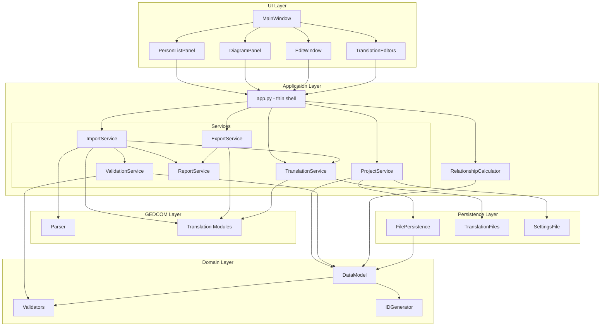

# Design Document: Släktbusken Genealogy Application

## Overview

Släktbusken is a desktop genealogy application built in Python with PySide6, designed for Swedish genealogical research. The application stores all data in a gzipped JSON format (.json.gz), supports GEDCOM 5.5.1 import/export with translation layers, manages DNA match data, calculates relationships between persons, and provides interactive diagram views (Family, Ancestry, Descendants).

The architecture separates concerns into distinct layers: a core data model, a persistence layer, import/export modules, a relationship calculation engine, and a PySide6-based UI. This separation enables a future read-only web application to share the same data format and project folder structure without requiring the desktop application to be running.

### Key Design Decisions

1. **Gzipped JSON over SQLite**: The data format is a single gzipped JSON file rather than a database. This makes the file portable, easily versionable, and directly usable by a future web app without a database server. Trade-off: large trees (>50k persons) may have slower load/save times, but atomicity is maintained via temp-file writes.

2. **Translation files for GEDCOM round-tripping**: Rather than storing GEDCOM IDs inside the main data, separate translation files map between GEDCOM identifiers and App_JSON IDs. This keeps the core data format clean and enables re-imports from updated GEDCOM files without data loss.

3. **QGraphicsView for diagrams**: PySide6's QGraphicsView framework provides hardware-accelerated 2D rendering with built-in zoom, pan, and item selection—ideal for interactive genealogy diagrams with potentially thousands of person boxes.

4. **BFS-based relationship calculator**: Breadth-first search from both persons simultaneously (bidirectional BFS) finds common ancestors efficiently, supporting the 30-generation depth limit while keeping computation fast for typical trees.

5. **Entity-first DNA model**: DNA companies, profiles, matches, segments, clusters, and triangulations are all first-class entities with their own IDs, enabling flexible many-to-many relationships without deep nesting.

6. **Qt Designer .ui files with pyside6-uic compilation**: Form-based UI layouts (editors, dialogs, panels) are designed in Qt Designer and stored as .ui files. These are compiled to Python via `pyside6-uic` and committed to the repository. Custom graphics items (PersonBoxItem, PlaceholderBox, connection lines) and diagram views remain programmatic since they use QGraphicsView and don't benefit from form-based design. This gives visual layout editing, full type safety from generated code, and no runtime build dependency.

### Coding Standards

1. **Full docstrings on all public API**: Every module, class (including dataclasses), method, and function SHALL have a complete docstring. Docstrings follow Google style and include a summary line, parameter descriptions (with types where not obvious from annotations), return value description, and raised exceptions where applicable. Private helper functions (prefixed with `_`) should have at least a one-line summary docstring.

## Architecture



### Layer Responsibilities

| Layer | Responsibility |
|-------|---------------|
| **UI Layer** | PySide6 widgets, user interaction, rendering diagrams, edit forms |
| **Application Layer** | Service layer orchestrating multi-step workflows: project lifecycle (`ProjectService`), import/export pipelines (`ImportService`, `ExportService`), cross-entity validation (`ValidationService`), translation management (`TranslationService`), and reporting (`ReportService`). `app.py` is a thin wiring shell connecting services to the UI. `RelationshipCalculator` remains a standalone algorithmic component. |
| **Domain Layer** | Data classes (dataclasses), validation rules, ID generation |
| **GEDCOM Layer** | Low-level GEDCOM parsing and entity-mapping logic (parser, translation modules) |
| **Persistence Layer** | Gzip JSON read/write, translation file I/O, settings file I/O |

### Module Structure

```
slaktbusken/
├── __init__.py
├── __main__.py              # Entry point: python -m slaktbusken
├── model/
│   ├── __init__.py
│   ├── person.py            # Person, Name dataclasses
│   ├── family.py            # Family dataclass
│   ├── event.py             # Event, Date, Participant dataclasses
│   ├── place.py             # Place dataclass
│   ├── source.py            # Source, Repository, SourceRef dataclasses
│   ├── media.py             # MediaItem, LinkedEntity dataclasses
│   ├── dna.py               # DnaCompany, DnaProfile, DnaMatch, DnaSegment, DnaCluster, DnaTriangulation
│   ├── project.py           # ProjectMetadata, ProjectData (root container)
│   ├── research_note.py     # ResearchNote dataclass
│   ├── validators.py        # Validation logic for all entities
│   └── id_generator.py      # Stable ID generation with type prefixes
├── persistence/
│   ├── __init__.py
│   ├── file_io.py           # Gzip JSON read/write with atomic save
│   ├── migration.py         # MigrationManager: version detection, sequential upgrades, backup
│   ├── serialization.py     # JSON serialization/deserialization
│   ├── translation_io.py    # Translation file read/write
│   └── settings_io.py       # Project settings read/write
├── services/
│   ├── __init__.py
│   ├── project_service.py       # Project create/open/save/close lifecycle, folder structure setup
│   ├── import_service.py        # Orchestrates GEDCOM import: parse → translate → validate → merge
│   ├── export_service.py        # Orchestrates GEDCOM export: resolve IDs → build output → report omissions
│   ├── validation_service.py    # Cross-entity referential integrity checks, pre-save validation
│   ├── translation_service.py   # Translation file lifecycle: load/save/update, coordinates with gedcom/translation/
│   └── report_service.py        # Generates summary messages (import results, export omissions, error reports)
├── gedcom/
│   ├── __init__.py
│   ├── importer.py          # GEDCOM → App_JSON conversion
│   ├── exporter.py          # App_JSON → GEDCOM conversion
│   ├── parser.py            # GEDCOM line-level parser
│   └── translation/
│       ├── __init__.py          # Package init, exposes TranslationManager facade
│       ├── place_translation.py     # GEDCOM place string → hierarchical Place mapping
│       ├── source_translation.py    # GEDCOM source ID → structured Source mapping
│       ├── citation_translation.py  # Building citation text from structured references
│       ├── person_mapping.py        # GEDCOM INDI/FAM → person/family ID mapping
│       ├── matcher.py              # Fuzzy/exact matching logic for finding existing entities during re-import
│       └── models.py               # Shared dataclasses for translation entries
├── relationship/
│   ├── __init__.py
│   ├── calculator.py        # BFS-based relationship path finder
│   ├── kinship_terms.py     # Swedish kinship term mapping
│   └── graph_builder.py     # Relationship graph visualization data
├── ui/
│   ├── __init__.py
│   ├── main_window.py       # QMainWindow setup, loads generated UI
│   ├── person_list_panel.py # Left panel: filterable person list
│   ├── diagram_panel.py     # Right panel: QGraphicsView container
│   ├── forms/                   # Qt Designer .ui source files (checked into git)
│   │   ├── main_window.ui
│   │   ├── person_editor.ui
│   │   ├── event_editor.ui
│   │   ├── source_editor.ui
│   │   ├── place_editor.ui
│   │   ├── media_editor.ui
│   │   ├── dna_editor.ui
│   │   ├── repository_editor.ui
│   │   ├── translation_editor.ui
│   │   ├── new_project_dialog.ui
│   │   ├── relationship_dialog.ui
│   │   ├── settings_dialog.ui
│   │   └── person_list_panel.ui
│   ├── generated/               # Python generated from .ui via pyside6-uic (committed to git)
│   │   ├── __init__.py
│   │   ├── ui_main_window.py
│   │   ├── ui_person_editor.py
│   │   ├── ui_event_editor.py
│   │   ├── ui_source_editor.py
│   │   ├── ui_place_editor.py
│   │   ├── ui_media_editor.py
│   │   ├── ui_dna_editor.py
│   │   ├── ui_repository_editor.py
│   │   ├── ui_translation_editor.py
│   │   ├── ui_new_project_dialog.py
│   │   ├── ui_relationship_dialog.py
│   │   ├── ui_settings_dialog.py
│   │   └── ui_person_list_panel.py
│   ├── resources/               # .qrc resource files (icons, stylesheets)
│   │   ├── resources.qrc
│   │   ├── icons/
│   │   └── styles/
│   ├── views/
│   │   ├── __init__.py
│   │   ├── family_view.py       # Family diagram logic (programmatic QGraphicsView)
│   │   ├── ancestry_view.py     # Ancestry diagram logic (programmatic QGraphicsView)
│   │   └── descendants_view.py  # Descendants diagram logic (programmatic QGraphicsView)
│   ├── widgets/
│   │   ├── __init__.py
│   │   ├── person_box.py       # QGraphicsItem for person box (programmatic)
│   │   ├── placeholder_box.py  # Placeholder for missing relatives (programmatic)
│   │   └── connection_line.py  # Lines connecting person boxes (programmatic)
│   ├── editors/
│   │   ├── __init__.py
│   │   ├── person_editor.py    # Edit person window - uses generated/ui_person_editor.py
│   │   ├── event_editor.py     # Event editor - uses generated/ui_event_editor.py
│   │   ├── source_editor.py    # Source editor - uses generated/ui_source_editor.py
│   │   ├── place_editor.py     # Place editor - uses generated/ui_place_editor.py
│   │   ├── media_editor.py     # Media editor - uses generated/ui_media_editor.py
│   │   ├── dna_editor.py       # DNA editor - uses generated/ui_dna_editor.py
│   │   ├── translation_editor.py  # Translation editor - uses generated/ui_translation_editor.py
│   │   └── repository_editor.py   # Repository editor - uses generated/ui_repository_editor.py
│   └── dialogs/
│       ├── __init__.py
│       ├── new_project_dialog.py   # Uses generated/ui_new_project_dialog.py
│       ├── relationship_dialog.py  # Uses generated/ui_relationship_dialog.py
│       └── settings_dialog.py      # Uses generated/ui_settings_dialog.py
├── scripts/
│   └── compile_ui.py           # Compiles .ui and .qrc files to Python
└── app.py                   # Thin wiring shell: instantiates services, connects them to UI
```

## UI Build Tooling

### Qt Designer Workflow

Form-based layouts are designed in Qt Designer and compiled to Python modules. The generated files are committed to git so running the app requires no build step.

**Compilation commands:**
```bash
# Compile all .ui files to Python
pyside6-uic ui/forms/main_window.ui -o ui/generated/ui_main_window.py
pyside6-uic ui/forms/person_editor.ui -o ui/generated/ui_person_editor.py
# ... (one command per .ui file)

# Compile resource file
pyside6-rcc ui/resources/resources.qrc -o ui/generated/resources_rc.py
```

**Build script** (`scripts/compile_ui.py`):
```python
"""Compile all .ui and .qrc files to Python modules."""
import subprocess
from pathlib import Path

FORMS_DIR = Path("slaktbusken/ui/forms")
GENERATED_DIR = Path("slaktbusken/ui/generated")
RESOURCES_DIR = Path("slaktbusken/ui/resources")

def compile_ui_files():
    for ui_file in FORMS_DIR.glob("*.ui"):
        output = GENERATED_DIR / f"ui_{ui_file.stem}.py"
        subprocess.run(["pyside6-uic", str(ui_file), "-o", str(output)], check=True)
        print(f"Compiled: {ui_file.name} → {output.name}")

def compile_resources():
    for qrc_file in RESOURCES_DIR.glob("*.qrc"):
        output = GENERATED_DIR / f"{qrc_file.stem}_rc.py"
        subprocess.run(["pyside6-rcc", str(qrc_file), "-o", str(output)], check=True)
        print(f"Compiled: {qrc_file.name} → {output.name}")

if __name__ == "__main__":
    GENERATED_DIR.mkdir(parents=True, exist_ok=True)
    compile_ui_files()
    compile_resources()
```

**Usage in editor classes:**
```python
from slaktbusken.ui.generated.ui_person_editor import Ui_PersonEditor

class PersonEditor(QWidget):
    def __init__(self, parent=None):
        super().__init__(parent)
        self.ui = Ui_PersonEditor()
        self.ui.setupUi(self)
        # Connect signals, add custom logic...
```

### What uses .ui files vs programmatic code

| Component | Approach | Reason |
|-----------|----------|--------|
| Editors (person, event, source, place, media, DNA, repository, translation) | .ui files | Complex form layouts benefit from visual design |
| Dialogs (new project, relationship, settings) | .ui files | Standard dialog layouts |
| Person List Panel | .ui file | Filter form + list layout |
| Main Window | .ui file | Menu bar, toolbar, panel arrangement |
| Diagram views (family, ancestry, descendants) | Programmatic | QGraphicsView with dynamic item placement |
| Custom widgets (PersonBoxItem, PlaceholderBox, ConnectionLine) | Programmatic | QGraphicsItem subclasses, not form-based |

## Components and Interfaces

### ProjectService (formerly ProjectManager)

The services layer is the main orchestration point. `app.py` acts as a thin wiring shell that connects services to the UI—it holds service instances and forwards UI events to the appropriate service. Actual business logic lives in the services.

```python
class ProjectService:
    """Manages project lifecycle: create, open, save, close.
    Delegates import/export/validation to specialized services."""

    def __init__(
        self,
        import_service: "ImportService",
        export_service: "ExportService",
        validation_service: "ValidationService",
    ) -> None:
        self._project_data: ProjectData | None = None
        self._project_path: Path | None = None
        self._settings: ProjectSettings | None = None
        self._dirty: bool = False
        self._import_service = import_service
        self._export_service = export_service
        self._validation_service = validation_service

    def create_project(self, name: str, location: Path) -> ProjectData:
        """Create new project folder structure and empty data file."""
        ...

    def open_project(self, path: Path) -> ProjectData:
        """Open existing project from .json.gz file."""
        ...

    def save_project(self) -> None:
        """Validate via ValidationService, then atomic save."""
        ...

    def close_project(self) -> None:
        """Close current project, prompting save if dirty."""
        ...

    def import_gedcom(self, gedcom_path: Path) -> ImportResult:
        """Delegates to ImportService."""
        return self._import_service.run(self._project_data, gedcom_path, self._project_path)

    def export_gedcom(self, output_path: Path) -> ExportResult:
        """Delegates to ExportService."""
        return self._export_service.run(self._project_data, output_path, self._project_path)

    @property
    def data(self) -> ProjectData:
        """Access the current project data."""
        ...

    def add_person(self, person: Person) -> Person:
        """Validate then add a person to the project."""
        ...

    def add_family(self, family: Family) -> Family:
        """Validate then add a family to the project."""
        ...

    # ... similar methods for all entity types
```

### ImportService

```python
class ImportService:
    """Orchestrates GEDCOM import: parse → translate → validate → merge."""

    def __init__(
        self,
        translation_service: "TranslationService",
        validation_service: "ValidationService",
        report_service: "ReportService",
    ) -> None:
        self._translation_service = translation_service
        self._validation_service = validation_service
        self._report_service = report_service

    def run(self, project_data: ProjectData, gedcom_path: Path, project_path: Path) -> ImportResult:
        """
        1. Parse GEDCOM via gedcom.parser
        2. Load translations via TranslationService
        3. Map records to App_JSON entities using gedcom.translation modules
        4. Validate new entities via ValidationService
        5. Merge into project data
        6. Persist updated translations
        7. Generate report via ReportService
        """
        ...
```

### ExportService

```python
class ExportService:
    """Orchestrates GEDCOM export: resolve IDs → build output → report omissions."""

    def __init__(
        self,
        translation_service: "TranslationService",
        report_service: "ReportService",
    ) -> None:
        self._translation_service = translation_service
        self._report_service = report_service

    def run(self, data: ProjectData, output_path: Path, project_path: Path) -> ExportResult:
        """
        1. Resolve App_JSON IDs → GEDCOM IDs (deterministic)
        2. Build GEDCOM output using gedcom.exporter logic
        3. Collect omissions (data that cannot be represented in GEDCOM 5.5.1)
        4. Generate export report via ReportService
        """
        ...
```

### ValidationService

```python
class ValidationService:
    """Cross-entity referential integrity checks, pre-save validation."""

    def validate_entity(self, entity: Any, project_data: ProjectData) -> list[ValidationError]:
        """Validate a single entity in the context of the full project."""
        ...

    def validate_project(self, project_data: ProjectData) -> list[ValidationError]:
        """Run all validators across the entire project before save."""
        ...
```

### TranslationService

```python
class TranslationService:
    """Translation file lifecycle: load/save/update.

    NOTE: This service orchestrates the *workflow* of translation—loading
    translation files from disk, coordinating updates, and persisting
    changes. The actual GEDCOM↔App_JSON mapping *logic* (how a GEDCOM
    place string maps to a hierarchical Place, how a source ID maps to
    a structured Source, etc.) lives in the gedcom/translation/ package.
    """

    def load_translations(self, project_path: Path) -> TranslationData:
        """Load all translation files for the project."""
        ...

    def save_translations(self, data: TranslationData, project_path: Path) -> None:
        """Persist updated translation data back to disk."""
        ...

    def update_mappings(self, new_mappings: list[TranslationEntry]) -> None:
        """Register new GEDCOM↔App_JSON mappings discovered during import."""
        ...
```

### ReportService

```python
class ReportService:
    """Generates summary messages (import results, export omissions, error reports)."""

    def format_import_result(self, result: ImportResult) -> str:
        """Swedish-language summary of import operation."""
        ...

    def format_export_result(self, result: ExportResult) -> str:
        """Swedish-language summary including omitted elements."""
        ...

    def format_validation_errors(self, errors: list[ValidationError]) -> str:
        """Swedish-language error report for user display."""
        ...
```

### Boundary: `translation_service.py` vs `gedcom/translation/`

> **`services/translation_service.py`** handles the *workflow*: loading translation files from disk, coordinating when to persist updates, and providing a unified interface to other services.
>
> **`gedcom/translation/`** (the package) contains the low-level *mapping logic*: how to convert a GEDCOM place string into a hierarchical Place structure, how to match a GEDCOM source ID to a structured Source, fuzzy/exact matching heuristics for re-imports, and the data models for translation entries.
>
> The service calls into `gedcom/translation/` modules for the actual mapping work but owns the file lifecycle and orchestration concerns.

### FilePersistence

Handles atomic gzip JSON read/write operations.

```python
class FilePersistence:
    """Atomic read/write of gzipped JSON project files."""

    @staticmethod
    def save(data: ProjectData, path: Path) -> None:
        """
        1. Serialize ProjectData to JSON (UTF-8) with format_version as first key
        2. Write to a temp file in the same directory
        3. Atomically replace the target file (os.replace)
        """
        ...

    @staticmethod
    def load(path: Path) -> ProjectData:
        """
        1. Read and decompress .json.gz
        2. Extract format_version from the first key
        3. If version < CURRENT_VERSION: run MigrationManager.migrate()
        4. If version > CURRENT_VERSION: raise UnsupportedVersionError
        5. Parse and validate full JSON
        6. Deserialize into ProjectData
        Raises: CorruptedFileError, UnsupportedVersionError
        """
        ...
```

### MigrationManager

Handles sequential data format upgrades from older versions to current.

```python
class MigrationManager:
    """Manages sequential migrations between App_JSON format versions."""

    CURRENT_VERSION: str = "0.1"

    # Registry: maps source version → (target version, migration function)
    _migrations: dict[str, tuple[str, Callable[[dict], dict]]] = {}

    @classmethod
    def register(cls, from_version: str, to_version: str) -> Callable:
        """Decorator to register a migration function."""
        ...

    @classmethod
    def migrate(cls, data: dict, from_version: str) -> dict:
        """
        Apply sequential migrations from from_version to CURRENT_VERSION.
        1. Look up migration for from_version
        2. Apply it, producing data at the next version
        3. Repeat until data is at CURRENT_VERSION
        Raises: MigrationError if no migration path exists
        """
        ...

    @classmethod
    def needs_migration(cls, version: str) -> bool:
        """True if version < CURRENT_VERSION."""
        ...

    @classmethod
    def is_too_new(cls, version: str) -> bool:
        """True if version > CURRENT_VERSION."""
        ...

    @staticmethod
    def create_backup(path: Path, old_version: str) -> Path:
        """Create a backup copy with version suffix before migrating.
        E.g., 'project.json.gz' → 'project_v0.1.json.gz'
        """
        ...


# Example migration registration:
@MigrationManager.register("0.1", "0.2")
def _migrate_0_1_to_0_2(data: dict) -> dict:
    """Example: add a new top-level section introduced in v0.2."""
    data["new_section"] = []
    data["format_version"] = "0.2"
    return data
```

### GEDCOMImporter (low-level, used by ImportService)

Parses GEDCOM 5.5.1 files and maps them to App_JSON entities using translation modules.

```python
class GEDCOMImporter:
    """Imports GEDCOM files into App_JSON format."""

    def __init__(self, project_data: ProjectData, translation_dir: Path) -> None:
        self._data = project_data
        self._translations = TranslationManager(translation_dir)  # from gedcom.translation

    def import_file(self, gedcom_path: Path) -> ImportResult:
        """
        1. Parse GEDCOM into line-level structure
        2. Load or create translation files
        3. Map INDI records → Person + Events
        4. Map FAM records → Family + Events
        5. Map SOUR records → Source (detect ArkivDigital pattern and link Repository)
        6. Map place strings → Place (hierarchical)
        7. Update translation files with new mappings
        Returns: ImportResult with counts and warnings
        
        ArkivDigital detection: When a source citation begins with "ArkivDigital:"
        or matches the ArkivDigital structured pattern (parish (county_code) series:volume
        (years) Bild: N Sida: N), the importer creates or reuses an "ArkivDigital"
        Repository of type 'digital_archive' and attaches it via repository_ref.
        """
        ...

@dataclass
class ImportResult:
    persons_added: int
    persons_updated: int
    families_added: int
    events_added: int
    sources_added: int
    places_added: int
    warnings: list[str]  # Swedish-language warnings for skipped records
```

### GEDCOMExporter (low-level, used by ExportService)

Exports App_JSON data to GEDCOM 5.5.1 format with stable IDs.

```python
class GEDCOMExporter:
    """Exports App_JSON data to GEDCOM 5.5.1 format."""

    def export(self, data: ProjectData, output_path: Path) -> ExportResult:
        """
        1. Generate stable GEDCOM IDs from App_JSON IDs
        2. Write HEAD record
        3. Write INDI records for all persons
        4. Write FAM records for all families
        5. Write SOUR records for all sources
        6. Write TRLR record
        Returns: ExportResult with counts and omitted elements
        """
        ...

    def _to_gedcom_id(self, app_id: str) -> str:
        """Deterministic GEDCOM ID from App_JSON ID.
        E.g., 'person_1' → '@I1@', 'family_42' → '@F42@'
        Uses numeric suffix extraction for stable mapping.
        """
        ...

    def _resolve_place_hierarchy(self, place_id: str) -> str:
        """Walk up parent_place_id chain, return comma-separated string.
        E.g., 'Ljusdals kyrka, Ljusdal, Gävleborgs län, Sverige'
        """
        ...
```

### RelationshipCalculator

Computes genealogical and legal relationships between two persons.

```python
class RelationshipCalculator:
    """Bidirectional BFS-based relationship finder."""

    def __init__(self, data: ProjectData) -> None:
        self._data = data
        self._kinship = SwedishKinshipTerms()

    def find_relationships(
        self,
        person_a_id: str,
        person_b_id: str,
        include_legal: bool = True,
        closest_only: bool = True,
        blood_priority: bool = True,
        max_generations: int = 30,
        max_paths: int = 50,
    ) -> list[RelationshipPath]:
        """
        1. Build adjacency graph (parent→child, child→parent, partner edges)
        2. BFS from person_a collecting ancestors with generation counts
        3. BFS from person_b collecting ancestors with generation counts
        4. Find common ancestors
        5. Construct paths through common ancestors
        6. Classify each path with Swedish kinship terms
        7. Sort by generational distance (closest first)
        8. Limit to max_paths

        If blood_priority is True (default):
          - First collect all blood (genealogical) paths.
          - If at least one blood path exists, return only blood paths.
          - If NO blood path exists, fall back to returning only the
            single closest non-blood path (spouse/adoption/foster).
          - If no path of any kind exists, return an empty list.
        If blood_priority is False, use include_legal/closest_only as before.
        """
        ...

    def describe_relationship(self, path: RelationshipPath) -> str:
        """Return Swedish-language description.
        E.g., 'far', 'morbror', 'kusin', 'tremänning', 'svåger'
        """
        ...

@dataclass
class RelationshipPath:
    person_a_id: str
    person_b_id: str
    common_ancestor_ids: list[str]
    path_nodes: list[str]      # Ordered list of person IDs in the path
    path_edges: list[str]      # Edge types: 'parent', 'child', 'partner'
    generations_a: int         # Steps from A to common ancestor
    generations_b: int         # Steps from B to common ancestor
    relationship_type: str     # 'blood', 'legal', 'adoption'
    swedish_term: str          # e.g., 'kusin', 'morbror'
```

### DiagramPanel and Views

```python
class DiagramPanel(QWidget):
    """Container for the QGraphicsView-based diagram views."""

    def __init__(self, project_manager: ProjectManager) -> None:
        self._scene = QGraphicsScene()
        self._view = ZoomableGraphicsView(self._scene)
        self._active_person_id: str | None = None
        self._current_view: DiagramView | None = None

    def set_active_person(self, person_id: str) -> None:
        """Set active person and refresh current view."""
        ...

    def switch_view(self, view_type: ViewType) -> None:
        """Switch between Family, Ancestry, Descendants views."""
        ...

class ZoomableGraphicsView(QGraphicsView):
    """QGraphicsView with mouse wheel zoom (25%–400%)."""

    def wheelEvent(self, event: QWheelEvent) -> None:
        """Scale view on wheel, clamped to 0.25–4.0 factor."""
        ...

class PersonBoxItem(QGraphicsItem):
    """Renders a person box with configurable content fields."""

    def __init__(self, person: Person, config: PersonBoxConfig) -> None:
        ...

    def paint(self, painter: QPainter, option, widget) -> None:
        """Draw box with enabled fields: name, dates, places, photo, DNA info."""
        ...
```

### IDGenerator

```python
class IDGenerator:
    """Generates stable, unique, type-prefixed IDs."""

    _PREFIXES = {
        'person': 'person_',
        'family': 'family_',
        'event': 'event_',
        'place': 'place_',
        'source': 'source_',
        'media': 'media_',
        'dna_company': 'dna_company_',
        'dna_profile': 'dna_profile_',
        'dna_match': 'dna_match_',
        'dna_segment': 'dna_segment_',
        'dna_cluster': 'dna_cluster_',
        'dna_triangulation': 'dna_triangulation_',
        'repository': 'repo_',
        'research_note': 'note_',
    }

    def __init__(self, existing_ids: set[str]) -> None:
        self._used_ids = set(existing_ids)

    def generate(self, entity_type: str, hint: str = '') -> str:
        """Generate next available ID for the given entity type.
        Uses monotonically increasing numeric suffix.
        Never reuses IDs (tracks all ever-generated IDs).
        """
        ...
```

## Data Models

### Core Entity Dataclasses

```python
from dataclasses import dataclass, field
from typing import Optional

@dataclass
class ProjectMetadata:
    title: str                       # Max 200 chars
    main_person_id: Optional[str] = None
    created_by: str = "Släktbuske"
    language: str = "sv-SE"

@dataclass
class Name:
    type: str          # 'birth', 'married', 'adopted', 'other'
    given: str         # Max 100 chars
    surname: str       # Max 100 chars
    event_id: Optional[str] = None  # Links to event that caused this name (marriage, name_change, etc.)

@dataclass
class Person:
    id: str
    sex: str           # 'M', 'F', 'X', 'U'
    names: list[Name]  # At least one required
    profile_media_id: Optional[str] = None
    notes: str = ""
    title: Optional[str] = None        # Max 100 chars, e.g., 'Fil.Dr'
    occupation: Optional[str] = None   # Max 100 chars, e.g., 'Lektor'

@dataclass
class FamilyPartner:
    person_id: str
    role: str          # 'father', 'mother', 'husband', 'wife', 'partner'

@dataclass
class ParentChildLink:
    child_id: str
    parent_id: str | None     # None when parentage_type is 'unknown_donor'
    parentage_type: str       # 'biological', 'legal', 'adoptive', 'foster', 'step', 'unknown_donor'

@dataclass
class Family:
    id: str
    partners: list[FamilyPartner]
    children: list[str]                    # Ordered list of child person_ids (preserves add order)
    parent_child_links: list[ParentChildLink] = field(default_factory=list)  # Per-parent-child relationship types
    event_ids: list[str] = field(default_factory=list)

@dataclass
class SourceRef:
    source_id: str
    quality: str              # 'primary', 'secondary', 'tertiary'
    note: str = ""

@dataclass
class DateValue:
    value: str                # ISO 8601: YYYY-MM-DD, YYYY-MM, or YYYY
    precision: str            # 'day', 'month', 'year', 'approximate'
    source_refs: list[SourceRef] = field(default_factory=list)

@dataclass
class PlaceRef:
    place_id: str
    source_refs: list[SourceRef] = field(default_factory=list)

@dataclass
class Participant:
    person_id: str
    role: str                 # 'child', 'spouse', 'deceased', etc.

@dataclass
class Event:
    id: str
    type: str                 # See Requirement 9 for valid types
    participants: list[Participant]  # At least one required
    date: Optional[DateValue] = None
    place: Optional[PlaceRef] = None
    media_ids: list[str] = field(default_factory=list)
    custom_type_name: Optional[str] = None  # For custom_*_event types
    cause_of_death: Optional[str] = None    # For death events

@dataclass
class Place:
    id: str
    type: str                 # 'country', 'county', 'parish', 'church', 'cemetery'
    name: str                 # 1–200 chars
    parent_place_id: Optional[str] = None
    latitude: Optional[float] = None   # -90 to 90
    longitude: Optional[float] = None  # -180 to 180
    notes: str = ""

@dataclass
class StructuredReference:
    """Type-specific fields stored as a dict for flexibility.
    
    For church_book sources, the expected fields are:
      - parish: str (e.g., "Ljusdal")
      - county_code: str (e.g., "X" for Gävleborg)
      - series: str (free text church book series code, e.g., "AI" for Husförhörslängd,
        "CI" for Födelseboken, "FI" for Död- och begravningsbok, "B" for Inflyttningslängd,
        "C" for Utflyttningslängd, "E" for Lysnings- och vigselbok, "D" for Konfirmationsbok)
      - volume: str (e.g., "23d")
      - years: str (e.g., "1883-1887")
      - image: int or str (image number)
      - page: int or str (page number)
    
    Example full reference_text: "Ljusdal (X) AI:23d (1883-1887) Bild: 23 Sida: 915"
    Example provider_ref: "v136004.b88"
    """
    fields: dict[str, Optional[str | int]] = field(default_factory=dict)

@dataclass
class RepositoryRef:
    repository_id: str
    call_number: str = ""
    source_type: str = ""
    image_number: Optional[int] = None
    page_number: Optional[int] = None
    media_type: str = ""
    media_name: str = ""
    notes: str = ""

@dataclass
class Source:
    id: str
    provider: str
    source_type: str          # 'church_book', 'database', 'death_notice', 'newspaper', 'photograph', 'census', 'other'
    title: str
    reference_text: str = ""
    provider_ref: str = ""
    short_note: str = ""
    free_note: str = ""
    structured_reference: StructuredReference = field(default_factory=StructuredReference)
    media_ids: list[str] = field(default_factory=list)
    repository_refs: list[RepositoryRef] = field(default_factory=list)

@dataclass
class Repository:
    id: str
    name: str
    type: str                 # 'archive', 'digital_archive', 'library', 'museum', 'other'
    address: Optional[str] = None
    phone: list[str] = field(default_factory=list)
    email: list[str] = field(default_factory=list)
    web: list[str] = field(default_factory=list)
    notes: str = ""
    external_ids: list[str] = field(default_factory=list)

@dataclass
class LinkedEntity:
    entity_type: str          # 'person', 'event', 'source', 'place'
    entity_id: str
    role: str = ""            # 'portrait', 'source_scan', 'evidence', 'subject', 'grave', 'location'

@dataclass
class MediaItem:
    id: str
    type: str                 # 'photo', 'source_image', 'death_notice', 'obituary', 'funeral_program', 'grave_photo', 'map', 'logo', 'document'
    file: str                 # Relative path from project root, forward slashes
    title: str
    linked_entities: list[LinkedEntity] = field(default_factory=list)
    # Type-specific optional fields
    publication: Optional[dict] = None        # For death_notice: newspaper, date, page
    transcription: Optional[str] = None
    mentioned_person_ids: list[str] = field(default_factory=list)

@dataclass
class DnaCompany:
    id: str
    name: str                 # Max 200 chars
    logo_media_id: Optional[str] = None
    description: str = ""

@dataclass
class DnaProfile:
    id: str
    person_id: str
    company_id: str
    test_type: str            # 'autosomal', 'y-dna', 'mtdna'
    kit_name: str = ""        # Max 200 chars
    kit_id: str = ""          # Max 100 chars
    admin_person_id: Optional[str] = None
    admin_status: str = ""    # 'self', 'managed_by_user', 'self_managed'
    notes: str = ""

@dataclass
class DnaMatch:
    id: str
    profile1_id: str
    profile2_id: str
    shared_cm: float = 0.0          # 0.0–7400.0
    shared_percentage: float = 0.0  # 0.00–100.00
    segment_count: int = 0          # 0–10000
    largest_segment_cm: float = 0.0 # 0.0–300.0
    match_source: str = "internal"  # 'internal' or 'external'
    notes: str = ""

@dataclass
class DnaSegment:
    id: str
    match_id: str
    chromosome: str           # '1'–'22', 'X', 'Y'
    start_position: int
    end_position: int         # Must be > start_position
    cm: float                 # > 0
    snp_count: int = 0        # >= 0

@dataclass
class DnaCluster:
    id: str
    name: str                 # 1–200 chars
    notes: str = ""
    company_ids: list[str] = field(default_factory=list)
    person_ids: list[str] = field(default_factory=list)
    dna_match_ids: list[str] = field(default_factory=list)
    color: Optional[str] = None  # Display color, e.g., '#88aaee'

@dataclass
class DnaTriangulation:
    id: str
    company_id: str
    chromosome: str
    overlap_start: int
    overlap_end: int
    segment_ids: list[str]    # At least 2
    profile_ids: list[str]    # At least 3
    cluster_id: Optional[str] = None
    notes: str = ""

@dataclass
class ResearchNote:
    id: str
    title: str
    text: str
    linked_entities: list[LinkedEntity] = field(default_factory=list)

@dataclass
class ProjectData:
    """Root container for all project data."""
    format: str = "släktbuske-file"
    version: str = "0.1"
    project: ProjectMetadata = field(default_factory=lambda: ProjectMetadata(title=""))
    persons: list[Person] = field(default_factory=list)
    families: list[Family] = field(default_factory=list)
    events: list[Event] = field(default_factory=list)
    places: list[Place] = field(default_factory=list)
    sources: list[Source] = field(default_factory=list)
    media: list[MediaItem] = field(default_factory=list)
    repositories: list[Repository] = field(default_factory=list)
    dna_companies: list[DnaCompany] = field(default_factory=list)
    dna_profiles: list[DnaProfile] = field(default_factory=list)
    dna_matches: list[DnaMatch] = field(default_factory=list)
    dna_segments: list[DnaSegment] = field(default_factory=list)
    dna_clusters: list[DnaCluster] = field(default_factory=list)
    dna_triangulations: list[DnaTriangulation] = field(default_factory=list)
    research_notes: list[ResearchNote] = field(default_factory=list)
```

### Project Folder Structure

```
{project-name}/
├── {project-name}.json.gz          # Main data file (gzipped JSON)
├── {project-name}-settings.json    # UI settings, person box config, diagram prefs
├── translation/
│   ├── sources.json                # GEDCOM source ID → App_JSON source ID
│   ├── places.json                 # GEDCOM place string → App_JSON place ID
│   └── persons.json                # GEDCOM INDI/FAM ID → App_JSON person/family ID
└── media/
    ├── source-image/
    ├── photos/
    ├── death-notice/
    ├── obituary/
    ├── funeral-program/
    ├── grave-photo/
    ├── map/
    ├── logo/
    └── document/
```

### Translation File Format

```json
// sources.json
{
  "mappings": [
    {
      "gedcom_id": "@S1@",
      "gedcom_title": "Birth Records 1940-1950",
      "app_json_id": "source_birth_005"
    }
  ]
}

// places.json
{
  "mappings": [
    {
      "gedcom_place_string": "Ljusdal, Gävleborgs län, Sverige",
      "app_json_id": "place_ljusdal_parish"
    }
  ]
}

// persons.json
{
  "mappings": [
    {
      "gedcom_id": "@I1@",
      "app_json_id": "person_1",
      "entity_type": "person"
    },
    {
      "gedcom_id": "@F1@",
      "app_json_id": "family_001",
      "entity_type": "family"
    }
  ]
}
```

### Settings File Format

```json
{
  "person_box_config": {
    "show_name": true,
    "show_birth_date": true,
    "show_death_date": true,
    "show_birth_place": false,
    "show_death_place": false,
    "show_occupation": false,
    "show_age_at_death": false,
    "show_cause_of_death": false,
    "show_profile_photo": false,
    "show_dna_clusters": false,
    "show_dna_matches": false
  },
  "diagram_settings": {
    "ancestry_depth": 4,
    "descendants_depth": 4,
    "default_view": "family"
  },
  "ui_state": {
    "window_geometry": null,
    "panel_sizes": null,
    "last_active_person_id": null
  }
}
```


## Correctness Properties

*A property is a characteristic or behavior that should hold true across all valid executions of a system—essentially, a formal statement about what the system should do. Properties serve as the bridge between human-readable specifications and machine-verifiable correctness guarantees.*

### Property 1: Serialization Round-Trip

*For any* valid ProjectData instance (containing arbitrary combinations of persons, families, events, places, sources, media, repositories, DNA entities, and research notes with valid field values), serializing to JSON and then deserializing back SHALL produce a ProjectData instance that is equal to the original.

**Validates: Requirements 2.1, 2.2, 2.3, 2.4, 2.5, 2.6, 2.7, 2.8, 2.9, 2.10, 2.11, 2.12, 3.1, 3.3, 23.1, 23.2**

### Property 2: Gzip Persistence Round-Trip

*For any* valid ProjectData instance, writing it to a gzip-compressed .json.gz file and reading it back SHALL produce a ProjectData instance equal to the original, and the intermediate JSON bytes (before gzip) SHALL be identical across save/load cycles.

**Validates: Requirements 3.1, 3.3, 22.2**

### Property 3: ID Generation Uniqueness and Non-Reuse

*For any* sequence of ID generation calls across all entity types, and any set of previously used IDs (including IDs of deleted entities), every newly generated ID SHALL be unique (not equal to any previously generated ID) and SHALL carry the correct type-specific prefix.

**Validates: Requirements 24.1, 24.2, 24.3**

### Property 4: Deterministic GEDCOM ID Generation

*For any* valid App_JSON entity ID string, the function that derives a GEDCOM ID SHALL always produce the same output for the same input (deterministic/idempotent), and different App_JSON IDs SHALL map to different GEDCOM IDs (injective).

**Validates: Requirements 5.2, 24.4**

### Property 5: Place Hierarchy Resolution

*For any* valid place hierarchy (a chain of places connected by parent_place_id from most specific to country level), resolving the hierarchy to a comma-separated string SHALL produce the places ordered from most specific to least specific, containing exactly the names of all places in the chain.

**Validates: Requirements 5.3**

### Property 6: Entity Validation Rejects Invalid Data

*For any* entity with invalid field values (Person with no names, Person with sex not in {M,F,X,U}, Family with non-existent person_id references, Family with duplicate child, Event with no participants, Date not matching ISO 8601, Place with invalid parent type, DnaSegment with start_position >= end_position, DnaMatch with shared_cm outside 0–7400, DnaTriangulation with fewer than 2 segments or 3 profiles), the validator SHALL reject the entity and report the specific validation error.

**Validates: Requirements 7.5, 7.6, 8.5, 8.6, 9.4, 9.7, 10.1, 10.3, 13.4, 13.6, 14.1, 14.4, 14.6**

### Property 7: Entity Validation Accepts Valid Data

*For any* entity with all fields set to values within their specified valid ranges and all references pointing to existing entities, the validator SHALL accept the entity without errors.

**Validates: Requirements 7.5, 8.5, 9.4, 13.4, 14.1**

### Property 8: Relationship Path Finding Correctness

*For any* two persons in a family tree connected by parent-child links within 30 generations, the RelationshipCalculator SHALL find at least one path between them, and every returned path SHALL consist of valid parent-child or partner edges where each adjacent pair in the path are directly related in the project data.

**Validates: Requirements 15.1, 15.2, 15.4**

### Property 9: Swedish Kinship Term Assignment

*For any* valid RelationshipPath with known generation counts (generations_a and generations_b from the common ancestor), the kinship term assignment SHALL produce the correct Swedish term according to the standard kinship classification (e.g., generations_a=1, generations_b=0 → "far"/"mor"; generations_a=1, generations_b=1 → "syskon"; generations_a=2, generations_b=1 → "farbror"/"morbror"/"faster"/"moster").

**Validates: Requirements 15.5**

### Property 10: Person List Filtering

*For any* set of persons and any filter criteria (text substring, birth year, death year, parish), the filtered result SHALL contain exactly those persons whose data matches ALL active filter criteria simultaneously, using case-insensitive substring matching for text and exact matching for year/parish values.

**Validates: Requirements 16.3, 16.4**

### Property 11: Place Hierarchy Event Filtering

*For any* set of events with associated places in a hierarchy, filtering events by a parish-level place SHALL return all events whose place_id is either the parish itself or any descendant place (church, cemetery) of that parish.

**Validates: Requirements 10.2**

### Property 12: Ancestry Collection Completeness

*For any* person in a family tree and any configured depth N (1–10), the ancestry collection SHALL return exactly the set of ancestors reachable within N generations via parent-child links, with no duplicates and no persons beyond depth N.

**Validates: Requirements 18.1, 18.2**

### Property 13: Descendants Collection Completeness

*For any* person in a family tree and any configured depth N (1–10), the descendants collection SHALL return exactly the set of descendants reachable within N generations via parent-child links (through families where the person is a partner), with no duplicates and no persons beyond depth N.

**Validates: Requirements 19.1, 19.2**

### Property 14: Media File Paths Use Forward Slashes

*For any* MediaItem stored in the project data, the file path field SHALL use forward-slash separators exclusively (no backslashes) and SHALL be a relative path (not starting with a drive letter or root slash).

**Validates: Requirements 25.2, 25.4**

## Error Handling

### Error Categories and Strategy

| Category | Strategy | User-Facing |
|----------|----------|-------------|
| File system errors (permissions, disk full) | Catch `OSError`, display Swedish error dialog, preserve existing data | Yes - Swedish error message |
| Corrupted data file (invalid gzip, bad JSON) | Catch specific exceptions, report problem type, preserve backup | Yes - Swedish error with details |
| Invalid GEDCOM input | Parse errors caught per-record, accumulate warnings, continue processing valid records | Yes - Swedish warnings list |
| Reference integrity violations | Validate before save, reject operation with specific error message | Yes - Swedish validation error |
| Missing media files | Display placeholder indicator, retain metadata record | Yes - visual indicator |
| Relationship calculation failure (no path) | Return empty result with message | Yes - Swedish "no relationship" message |

### Atomic Save Pattern

```python
def save(data: ProjectData, target_path: Path) -> None:
    """Atomic save to prevent data loss on crash."""
    temp_path = target_path.with_suffix('.tmp')
    try:
        json_bytes = serialize_to_json(data)
        with gzip.open(temp_path, 'wb') as f:
            f.write(json_bytes)
        # Atomic replace (works on same filesystem)
        os.replace(temp_path, target_path)
    except Exception:
        # Clean up temp file if it exists
        if temp_path.exists():
            temp_path.unlink()
        raise
```

### Validation Error Reporting

All validation errors use a structured `ValidationError` class containing:
- `entity_type`: Which entity type failed
- `entity_id`: Which specific entity (if applicable)
- `field`: Which field has the problem
- `message_sv`: Swedish-language error message
- `code`: Machine-readable error code for testing

```python
@dataclass
class ValidationError:
    entity_type: str
    entity_id: str
    field: str
    message_sv: str
    code: str  # e.g., 'PERSON_NO_NAMES', 'FAMILY_DUPLICATE_CHILD'
```

### GEDCOM Import Error Handling

The importer uses a "best effort" strategy:
1. Parse the entire GEDCOM file into a line-level structure
2. Process each record independently
3. If a record fails to parse or contains unsupported tags, log a warning (with line number and tag) and continue
4. If the file itself is unreadable (not valid GEDCOM at all), abort immediately with an error
5. Return all warnings as part of `ImportResult` for user review

### File Corruption Recovery

When opening a project file fails:
1. Attempt to identify the specific corruption type (gzip header, JSON syntax, missing sections)
2. Check for a `.json.gz.bak` backup file
3. Report the error with the specific problem in Swedish
4. If a backup exists, offer to open the backup instead
5. Never overwrite or delete the backup file during error recovery

## Testing Strategy

### Framework and Configuration

- **Test framework**: pytest (as specified in Requirement 22)
- **Property-based testing**: [Hypothesis](https://hypothesis.readthedocs.io/) for Python property-based tests
- **Test structure**: Mirrors source module structure (`tests/test_model/`, `tests/test_persistence/`, etc.)
- **Minimum property test iterations**: 100 per property (Hypothesis default is 100, configurable via `@settings(max_examples=200)`)

### Test Organization

```
tests/
├── conftest.py                    # Shared fixtures, Hypothesis strategies
├── test_model/
│   ├── test_person.py
│   ├── test_family.py
│   ├── test_event.py
│   ├── test_place.py
│   ├── test_source.py
│   ├── test_media.py
│   ├── test_dna.py
│   ├── test_validators.py        # Property tests for validation
│   └── test_id_generator.py      # Property tests for ID uniqueness
├── test_persistence/
│   ├── test_serialization.py     # Property tests for round-trip
│   ├── test_file_io.py           # Integration tests for gzip I/O
│   └── test_translation_io.py
├── test_services/
│   ├── test_project_service.py   # Integration tests for project lifecycle
│   ├── test_import_service.py    # Integration tests for import pipeline
│   ├── test_export_service.py    # Integration tests for export pipeline
│   ├── test_validation_service.py # Integration tests for cross-entity validation
│   └── test_translation_service.py # Tests for translation file lifecycle
├── test_gedcom/
│   ├── test_importer.py          # Integration + property tests
│   ├── test_exporter.py          # Property tests for ID determinism, place resolution
│   └── test_parser.py
├── test_relationship/
│   ├── test_calculator.py        # Property tests for path finding
│   └── test_kinship_terms.py     # Property tests for term assignment
└── test_ui/
    ├── test_person_list_filter.py # Property tests for filtering logic
    ├── test_family_view_data.py   # Property tests for view data gathering
    ├── test_ancestry_view_data.py
    └── test_descendants_view_data.py
```

### Property-Based Test Strategy

Each correctness property maps to one or more Hypothesis-based property tests:

| Property | Test Location | Key Hypothesis Strategy |
|----------|--------------|------------------------|
| 1: Serialization round-trip | `test_serialization.py` | `st.builds(ProjectData, ...)` with nested entity strategies |
| 2: Gzip persistence round-trip | `test_file_io.py` | Reuse ProjectData strategy, write/read temp files |
| 3: ID uniqueness | `test_id_generator.py` | `st.lists(st.sampled_from(entity_types))` for generation sequences |
| 4: GEDCOM ID determinism | `test_exporter.py` | `st.text(min_size=1)` for App_JSON IDs |
| 5: Place hierarchy resolution | `test_exporter.py` | `st.lists(st.builds(Place, ...))` forming valid chains |
| 6-7: Validation | `test_validators.py` | Strategies for both valid and invalid entities |
| 8-9: Relationship finding | `test_calculator.py` | Generated family trees with known structure |
| 10: Person list filtering | `test_person_list_filter.py` | `st.lists(st.builds(Person, ...))` + filter criteria |
| 11: Place hierarchy filtering | `test_person_list_filter.py` | Events with hierarchical places |
| 12-13: Ancestry/Descendants | `test_ancestry_view_data.py` | Generated trees with known depth |
| 14: Media paths | `test_serialization.py` | `st.builds(MediaItem, ...)` |

### Hypothesis Custom Strategies (conftest.py)

```python
from hypothesis import strategies as st

# Reusable strategies for entity generation
valid_sex = st.sampled_from(['M', 'F', 'X', 'U'])
valid_name_type = st.sampled_from(['birth', 'married', 'adopted', 'other'])
valid_source_quality = st.sampled_from(['primary', 'secondary', 'tertiary'])
valid_place_type = st.sampled_from(['country', 'county', 'parish', 'church', 'cemetery'])
valid_chromosome = st.sampled_from([str(i) for i in range(1, 23)] + ['X', 'Y'])

name_strategy = st.builds(
    Name,
    type=valid_name_type,
    given=st.text(min_size=1, max_size=100, alphabet=st.characters(categories=('L', 'Zs'))),
    surname=st.text(min_size=1, max_size=100, alphabet=st.characters(categories=('L', 'Zs'))),
)

person_strategy = st.builds(
    Person,
    id=st.text(min_size=1, max_size=50).map(lambda s: f"person_{s}"),
    sex=valid_sex,
    names=st.lists(name_strategy, min_size=1, max_size=5),
    profile_media_id=st.none() | st.text(min_size=1).map(lambda s: f"media_{s}"),
    notes=st.text(max_size=500),
)
```

### Unit Test Strategy

Unit tests complement property tests for:
- **Specific examples**: Known GEDCOM files with expected outputs
- **Edge cases**: Empty projects, single-person trees, maximum depth trees
- **Error conditions**: Corrupted files, invalid references, permission errors
- **Integration points**: Full import/export pipeline with sample files
- **UI behavior**: Widget state after user actions (using pytest-qt)

### Test Tagging Convention

Each property-based test includes a comment referencing its design property:

```python
# Feature: slaktbusken-genealogy-app, Property 1: Serialization round-trip
@given(project_data=project_data_strategy)
@settings(max_examples=200)
def test_serialization_round_trip(project_data: ProjectData):
    """For any valid ProjectData, serialize then deserialize produces equal data."""
    json_str = serialize(project_data)
    result = deserialize(json_str)
    assert result == project_data
```

### Dependencies

```toml
[project]
name = "slaktbusken"
requires-python = ">=3.11"
dependencies = [
    "PySide6>=6.6.0",
    # Note: pyside6-uic and pyside6-rcc are included in the PySide6 package.
    # No extra dependency is needed for .ui/.qrc compilation.
]

[project.optional-dependencies]
dev = [
    "pytest>=7.4.0",
    "pytest-qt>=4.2.0",
    "hypothesis>=6.90.0",
    "pytest-cov>=4.1.0",
]
```
