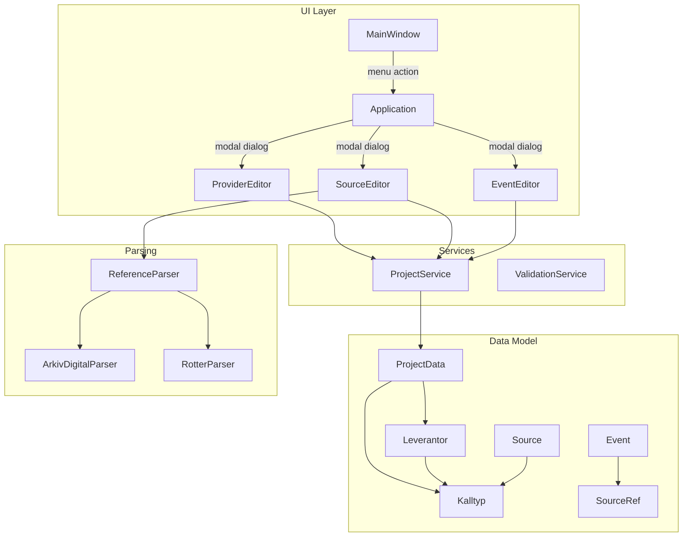

# Design Document: Source Management

## Overview

This design extends Släktbusken's source management with a structured provider/type system (Leverantör/Källtyp), improved media attachment and title formatting workflows, usage statistics in the source list, reference parsing for Swedish genealogy archives (Arkiv Digital and Rötter.se), event-source aspect linking, and direct link generation from source records.

The feature integrates into the existing editor/dialog architecture, data model, and persistence layer. New UI components follow the established split-panel editor pattern with Swedish labels, while new data entities extend ProjectData alongside existing Source, Event, and MediaItem structures.

## Architecture



### Integration Points

1. **Menu**: New "Käll-leverantörer" action in Redigera menu, after "Källöversättningar"
2. **ProviderEditor**: New modal dialog following the existing QDialog wrapper pattern
3. **SourceEditor**: Extended with media attachment file chooser, title formatting, usage statistics, and direct link generation
4. **EventEditor**: Extended with aspect checkboxes and "Öppna källa" button
5. **ReferenceParser**: New module consolidating Arkiv Digital and Rötter.se parsing
6. **ProjectService**: Extended with default Leverantör/Källtyp initialization on project creation
7. **Persistence**: Leverantör and Källtyp serialized as new arrays in ProjectData

## Components and Interfaces

### 1. Data Model Extensions (`model/source.py`)

```python
@dataclass
class Leverantor:
    """A source provider (e.g., Arkiv Digital, Rötter.se)."""
    id: str
    name: str
    comment: str = ""

@dataclass
class Kalltyp:
    """A source type belonging to a specific Leverantör."""
    id: str
    leverantor_id: str
    name: str
    comment: str = ""
    root_url: str = ""
```

Extension to `Source`:
```python
@dataclass
class Source:
    # ... existing fields ...
    leverantor_id: str = ""      # FK to Leverantor.id
    kalltyp_id: str = ""         # FK to Kalltyp.id
    arkivreferens: str = ""      # Archive reference for direct link generation
```

Extension to `SourceRef` (in `model/event.py`):
```python
@dataclass
class SourceRef:
    source_id: str
    quality: str
    note: str = ""
    aspects: list[str] = field(default_factory=list)  # e.g. ["date", "place", "parents"]
```

### 2. ProjectData Extension (`model/project.py`)

```python
@dataclass
class ProjectData:
    # ... existing fields ...
    leverantorer: list[Leverantor] = field(default_factory=list)
    kalltyper: list[Kalltyp] = field(default_factory=list)
```

### 3. ProviderEditor (`ui/editors/provider_editor.py`)

New editor widget following the established pattern:

```python
class ProviderEditor(QWidget):
    save_requested = Signal()
    cancel_requested = Signal()

    def __init__(self, project_data: ProjectData, parent=None): ...
```

**Layout**: Split-panel with Leverantör list (top-left) and Källtyp sub-list (bottom-left), edit form (right). Buttons: "Lägg till", "Ta bort", "Redigera" for both levels.

**Validation**:
- Name: required, 1–100 characters, stripped of leading/trailing whitespace
- Comment: optional, 0–500 characters
- Root_URL: optional, 0–2048 characters
- Källtyp name uniqueness within same Leverantör

**Delete constraints**:
- Leverantör with referenced Sources: "Ta bort" disabled, message shown
- Leverantör with unreferenced Källtyper: confirmation prompt before cascade delete
- Källtyp with referenced Sources: "Ta bort" disabled, message shown

### 4. Reference Parser (`parsing/reference_parser.py`)

New module consolidating all reference parsing logic:

```python
@dataclass
class ParsedReference:
    """Result of parsing a reference string."""
    leverantor_name: str
    kalltyp_name: str
    title: str
    reference_text: str
    structured_fields: dict[str, Optional[str | int]]
    arkivreferens: str = ""

def parse_reference(text: str) -> Optional[ParsedReference]:
    """Attempt to parse a reference string against all known patterns."""

def parse_arkiv_digital(text: str) -> Optional[ParsedReference]:
    """Parse Arkiv Digital reference patterns."""

def parse_rotter(text: str) -> Optional[ParsedReference]:
    """Parse Rötter.se reference patterns."""

def format_source_title(structured_ref: StructuredReference) -> str:
    """Format a title from structured reference fields."""
```

**Arkiv Digital Patterns**:
1. Full pattern: `{parish} ({county_code}) {series}:{volume} ({years}) Bild {image} / sid {page} (AID: {aid_ref}, NAD: {nad_ref})`
2. Short pattern: `{description} ({year}) Bild {image} / sid {page} (AID: {aid_ref})`
3. Census pattern: `rX.pXXXXX` (one or more digits after r and p)

**Rötter.se Patterns**:
1. Contains "Sveriges dödbok webb" (case-insensitive)
2. Pattern: `Sveriges dödbok webb - {record_id}`
3. Pattern: `SDB{digit}_{digits}` (e.g., "SDB7_12345")
4. Multi-line: each line parsed independently

### 5. Source Title Formatting

When a source is created from a search result with structured reference fields:
```
Format: "{parish} {series}:{volume} Sida: {page}"
- If page is empty: "{parish} {series}:{volume}"
- Missing fields: omit segment and separator
- Post-process: trim + collapse multiple spaces to single space
```

### 6. Source List Usage Statistics

The source list in SourceEditor displays inline counts:
```
"Ljusdal AI:17 Sida: 32 (3 pers, 5 händ)"
```

Calculation:
- Iterate all events, check `date.source_refs` and `place.source_refs`
- Event count: total events referencing this source
- Person count: distinct `participant.person_id` across those events

### 7. Event Source Aspect Linking

Aspect sets per event type:
```python
EVENT_SOURCE_ASPECTS: dict[str, list[str]] = {
    "birth": ["date", "place", "parents", "witnesses"],
    "death": ["date", "place", "cause_of_death"],
    "marriage": ["date", "place", "spouse"],
    "_default": ["date", "place"],
}
```

Swedish labels for checkboxes:
```python
ASPECT_LABELS: dict[str, str] = {
    "date": "Datum",
    "place": "Plats",
    "parents": "Föräldrar",
    "witnesses": "Vittnen",
    "cause_of_death": "Dödsorsak",
    "spouse": "Make/maka",
}
```

### 8. Direct Link Generation

In SourceEditor, when a source has:
- A `kalltyp_id` pointing to a Källtyp with a non-empty `root_url`
- A non-empty `arkivreferens`

Display: clickable QLabel with `root_url + arkivreferens` as href, opened via `QDesktopServices.openUrl()`.

### 9. Standard Leverantörer Initialization

On `ProjectService.create_project()`, populate `leverantorer` and `kalltyper` with the predefined set. The initialization data is defined as a constant in the project service or a dedicated constants module.

### 10. Menu Integration

In `MainWindow._setup_actions()`:
```python
self.action_provider_editor = QAction("Käll-leverantörer...", self)
self.action_provider_editor.setToolTip("Hantera käll-leverantörer och källtyper")
self.action_provider_editor.triggered.connect(self._app.show_provider_editor)
```

Positioned in `_setup_menu_bar()` after `action_source_translation_editor`, enabled only when a project is open.

## Data Models

### Leverantor

| Field   | Type   | Constraints            |
|---------|--------|------------------------|
| id      | str    | UUID, unique           |
| name    | str    | Required, 1–100 chars  |
| comment | str    | Optional, 0–500 chars  |

### Kalltyp

| Field          | Type   | Constraints             |
|----------------|--------|-------------------------|
| id             | str    | UUID, unique            |
| leverantor_id  | str    | FK → Leverantor.id      |
| name           | str    | Required, 1–100 chars, unique per Leverantör |
| comment        | str    | Optional, 0–500 chars   |
| root_url       | str    | Optional, 0–2048 chars  |

### Source Extensions

| Field          | Type   | Constraints             |
|----------------|--------|-------------------------|
| leverantor_id  | str    | Optional FK → Leverantor.id |
| kalltyp_id     | str    | Optional FK → Kalltyp.id    |
| arkivreferens  | str    | Optional archive ref         |

### SourceRef Extension

| Field   | Type       | Constraints                          |
|---------|------------|--------------------------------------|
| aspects | list[str]  | Subset of event-type-specific aspects |

### ParsedReference (internal, not persisted)

| Field             | Type                              | Description                     |
|-------------------|-----------------------------------|---------------------------------|
| leverantor_name   | str                               | Matched provider name           |
| kalltyp_name      | str                               | Matched source type name        |
| title             | str                               | Formatted title                 |
| reference_text    | str                               | Full original pasted string     |
| structured_fields | dict[str, Optional[str \| int]]   | Parsed structured reference     |
| arkivreferens     | str                               | Archive reference identifier    |

### Standard Leverantörer Data (initialization constant)

```python
STANDARD_PROVIDERS = [
    {
        "name": "Arkiv Digital",
        "kalltyper": [
            "Husförhörslängd", "Församlingsbok", "Mantalslängd", "Folkräkning",
            "Inflyttningslängd", "Utflyttningslängd", "In- och Utflyttningslängd",
            "Födelse- och dopbok", "Lysnings- och vigselbok",
            "Död- och begravningsbok", "Generalmönstringsrullor",
            "Bouppteckningar", "Konfirmationsbok", "Övrigt",
        ],
    },
    {
        "name": "Nationell arkivdatabas",
        "kalltyper": [...]  # Same list as Arkiv Digital
    },
    {
        "name": "Rötter.se",
        "kalltyper": [
            {"name": "Sveriges Dödbok Webb", "root_url": "https://www.rotter.se/abonnemang/sveriges-dodbok-webb/post/"},
            {"name": "Sveriges Dödbok (sticka/dvd)"},
            {"name": "Övrigt"},
        ],
    },
    {
        "name": "Skatteverket",
        "kalltyper": ["Personbild (6401)", "Övrigt"],
    },
    {
        "name": "Övrigt",
        "kalltyper": ["Dödsannons", "Tidningsartikel", "Övrig databas", "Övrigt"],
    },
]
```


## Correctness Properties

*A property is a characteristic or behavior that should hold true across all valid executions of a system—essentially, a formal statement about what the system should do. Properties serve as the bridge between human-readable specifications and machine-verifiable correctness guarantees.*

### Property 1: Name validation for Leverantör and Källtyp

*For any* string input as a Leverantör or Källtyp name, the validation function SHALL accept it if and only if it contains at least one non-whitespace character and has at most 100 characters after trimming; all other inputs (empty, whitespace-only, or exceeding 100 chars) SHALL be rejected.

**Validates: Requirements 1.2, 1.3, 2.2**

### Property 2: Referenced entities cannot be deleted

*For any* project state where a Leverantör or Källtyp is referenced by one or more Sources (via `leverantor_id` or `kalltyp_id`), attempting to delete that entity SHALL fail and the entity SHALL remain in the project data unchanged.

**Validates: Requirements 1.6, 2.5**

### Property 3: Cascade delete removes all associated Källtyper

*For any* Leverantör that is not referenced by any Source but has N associated Källtyper (also not referenced by any Source), deleting the Leverantör SHALL remove the Leverantör and all N associated Källtyper from the project data, and the resulting project data SHALL contain no Källtyper with that Leverantör's ID.

**Validates: Requirements 1.8**

### Property 4: Källtyp filtering by Leverantör

*For any* project data containing multiple Leverantörer each with different sets of Källtyper, querying Källtyper for a specific Leverantör SHALL return exactly the Källtyper whose `leverantor_id` matches that Leverantör's ID, and no others.

**Validates: Requirements 2.1**

### Property 5: Källtyp name uniqueness within Leverantör

*For any* Leverantör that already contains a Källtyp with name N, attempting to create or rename another Källtyp within the same Leverantör to name N (case-sensitive) SHALL be rejected.

**Validates: Requirements 2.7**

### Property 6: Filename conflict resolution

*For any* target filename and set of existing filenames in the media directory, the conflict resolution function SHALL produce a filename that does not exist in the directory, follows the pattern `{stem}_{n}{ext}` where n is the smallest positive integer producing a unique name, and preserves the original file extension.

**Validates: Requirements 4.3**

### Property 7: Source title formatting from structured reference

*For any* combination of parish, series, volume, and page values (each optionally empty), the title formatting function SHALL produce a title that: includes "{parish} {series}:{volume} Sida: {page}" when all are present; omits "Sida: {page}" when page is empty; omits any missing segment and its separator; and the final string has no leading/trailing whitespace and no consecutive spaces.

**Validates: Requirements 5.1, 5.2, 5.3, 5.4**

### Property 8: Usage statistics calculation

*For any* project data with events containing source_refs (in date and/or place), the usage count function for a given source SHALL return an event count equal to the number of events referencing that source, and a person count equal to the number of distinct participant person_ids across those events.

**Validates: Requirements 6.1**

### Property 9: Arkiv Digital church book reference parsing round-trip

*For any* valid parish name, county code, series, volume, years range, image number, page number, AID reference, and optional NAD reference, formatting them into the Arkiv Digital pattern and then parsing the result SHALL extract the same field values, set leverantor_name to "Arkiv Digital", derive källtyp_name from the series via CHURCH_BOOK_SERIES_LABELS, and set the title to "{parish} {series}:{volume} Sida: {page}".

**Validates: Requirements 7.1, 7.2**

### Property 10: Arkiv Digital census reference parsing

*For any* string matching the pattern "r{digits}.p{digits}" (where each digit group is 1+ characters), the parser SHALL produce a source with leverantor_name "Arkiv Digital", källtyp_name "Folkräkning", and store the full matched string as arkivreferens.

**Validates: Requirements 7.3**

### Property 11: Non-matching strings produce no source

*For any* string that does not match any defined Arkiv Digital or Rötter.se reference pattern, the parse_reference function SHALL return None (no source created).

**Validates: Requirements 7.5, 8.5**

### Property 12: Rötter.se Sveriges Dödbok reference parsing

*For any* string matching "Sveriges dödbok webb - {record_id}" (case-insensitive on the prefix), the parser SHALL produce a source with leverantor_name "Rötter.se", kalltyp_name "Sveriges Dödbok Webb", and arkivreferens set to the trimmed record_id portion.

**Validates: Requirements 8.1, 8.2**

### Property 13: Rötter.se SDB identifier parsing

*For any* string matching "SDB{single_digit}_{one_or_more_digits}", the parser SHALL produce a source with leverantor_name "Rötter.se", kalltyp_name "Sveriges Dödbok Webb", and arkivreferens set to the full matched identifier.

**Validates: Requirements 8.3**

### Property 14: Multi-line reference parsing creates separate sources

*For any* multi-line text where M lines contain a valid Sveriges Dödbok reference and K lines do not, the parser SHALL produce exactly M ParsedReference results, one per valid line.

**Validates: Requirements 8.4**

### Property 15: Event-type-specific aspect mapping

*For any* event type, the aspect set function SHALL return ["date", "place", "parents", "witnesses"] for birth, ["date", "place", "cause_of_death"] for death, ["date", "place", "spouse"] for marriage, and ["date", "place"] for all other types.

**Validates: Requirements 9.1**

### Property 16: Aspect persistence round-trip

*For any* SourceRef with an arbitrary subset of valid aspects selected, serializing and then deserializing the SourceRef SHALL produce an identical aspects list.

**Validates: Requirements 9.3**

### Property 17: Direct link generation correctness

*For any* source with a kalltyp_id pointing to a Källtyp with non-empty root_url, and a non-empty arkivreferens, the generated link SHALL equal root_url concatenated with arkivreferens. *For any* source missing one or more of these conditions (no kalltyp_id, empty root_url, or empty arkivreferens), no link SHALL be generated.

**Validates: Requirements 10.1, 10.3**

## Error Handling

### Validation Errors

| Scenario | Behavior | Message (Swedish) |
|----------|----------|-------------------|
| Empty/whitespace Leverantör name | Reject, show inline error | "Namn krävs." |
| Leverantör name > 100 chars | Reject, show inline error | "Namn får vara högst 100 tecken." |
| Comment > 500 chars | Reject, show inline error | "Kommentar får vara högst 500 tecken." |
| Root_URL > 2048 chars | Reject, show inline error | "URL får vara högst 2048 tecken." |
| Duplicate Källtyp name | Reject, show inline error | "En källtyp med detta namn finns redan." |
| Delete referenced Leverantör | Disable button | "Kan inte ta bort — leverantören används av en eller flera källor." |
| Delete referenced Källtyp | Disable button | "Kan inte ta bort — källtypen används av en eller flera källor." |

### File Operations

| Scenario | Behavior | Message |
|----------|----------|---------|
| Media file copy fails | Show QMessageBox.warning | "Kunde inte kopiera filen: {reason}" |
| Target directory missing | Auto-create media directory | (silent) |
| Disk full | Show QMessageBox.critical | "Diskutrymmet är slut." |

### Reference Parsing

| Scenario | Behavior |
|----------|----------|
| Unrecognized pattern | Return None, no side effects |
| Partial match (almost valid) | Return None, strict pattern matching |
| Invalid characters in AID/NAD | Return None, pattern does not match |

### Link Generation

| Scenario | Behavior |
|----------|----------|
| Malformed URL after concatenation | Show error indicator placeholder |
| Browser launch fails | Swallow exception, log warning |

## Testing Strategy

### Property-Based Testing

**Library**: [Hypothesis](https://hypothesis.readthedocs.io/) (already in use — `.hypothesis/` directory exists in project root)

**Configuration**: Minimum 100 examples per property test via `@settings(max_examples=100)`.

**Tag format**: Each property test includes a comment referencing:
```python
# Feature: source-management, Property N: {property_text}
```

**Property tests target the pure logic layer:**
- `parsing/reference_parser.py` — all parsing functions
- Title formatting function
- Usage statistics calculation function
- Name validation function
- Filename conflict resolution function
- Aspect mapping function
- Link generation function
- Cascade delete logic (on data model, no UI)
- Källtyp filtering logic
- SourceRef serialization round-trip

### Unit Tests (Example-Based)

| Area | Tests |
|------|-------|
| Standard initialization | Verify exact provider/type lists after project creation |
| Menu integration | Verify action position, enable/disable state |
| Provider editor UI | Dialog opens, buttons present, edit/cancel workflow |
| Event editor aspects | Checkboxes appear, initial unselected state, "Öppna källa" button |
| Media attachment | File chooser filter types, cancel behavior |
| Usage detail dialog | Opens with correct person/event grouping |

### Integration Tests

| Area | Tests |
|------|-------|
| GEDCOM import with ArkivDigital sources | End-to-end import → parse → Source creation |
| Persistence round-trip | Save/load project with new Leverantör/Källtyp entities |
| Browser launch | QDesktopServices.openUrl called with correct URL (mocked) |

### Testing Balance

- **Property tests** handle the combinatorial explosion of valid/invalid inputs for parsing, validation, and formatting functions
- **Unit tests** cover specific UI interactions, initialization constants, and integration points
- **Integration tests** verify the full pipeline from GEDCOM import through to persisted data
