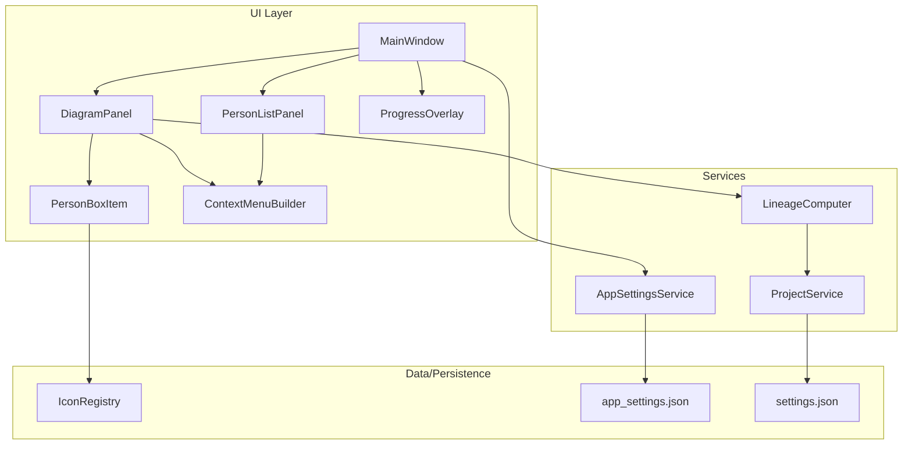

# Design Document: UI Enhancements

## Overview

This design covers nine UI enhancements to the Släktbusken genealogy application. The enhancements span visual indicators (event icons, gender icons, lineage border marking), navigation improvements (recent projects, default project auto-open, context menus), user feedback (progress overlays), and data management (DNA cluster membership from person editor).

All changes integrate with the existing PySide6/QGraphicsScene architecture. The design prioritizes non-breaking changes — each enhancement adds capability without modifying the existing data model or persistence format, except for a new application-level settings file.

### Key Design Decisions

1. **SVG icons via QSvgRenderer**: Event and gender icons use SVG files for crisp rendering at any zoom level. A centralized `IconRegistry` provides icon lookup by event type or sex value.

2. **Lineage computed lazily per diagram refresh**: Direct ancestor/descendant sets are computed when the diagram refreshes (i.e., when `main_person_id` changes or the view is rebuilt). Results are cached until the next refresh rather than recomputed per-paint.

3. **Application-level settings file**: A new `~/.slaktbusken/app_settings.json` file stores cross-project state (recent projects list, default project path). This is separate from the project-level `settings.json`.

4. **Progress overlay as QWidget overlay**: A semi-transparent `QWidget` parented to `MainWindow` overlays all content during long operations. This is simpler than modal dialogs and prevents all interaction.

5. **Context menu via QMenu**: Right-click handling uses PySide6's standard `QMenu.exec()` pattern, added to both `DiagramPanel` and `PersonListPanel`.

## Architecture



### Component Interaction Flow

**Diagram rendering with icons and lineage marking:**
1. `DiagramPanel._refresh_diagram()` calls `LineageComputer.get_ancestors(main_person_id)` and `LineageComputer.get_descendants(main_person_id)`
2. For each person box, passes `is_ancestor` and `is_descendant` flags plus `sex` value
3. `PersonBoxItem.paint()` uses `IconRegistry` to render event/gender icons and applies colored border based on lineage flags

**Recent projects flow:**
1. `AppSettingsService` loads/saves `~/.slaktbusken/app_settings.json`
2. On project open/create, `Application` calls `AppSettingsService.add_recent_project(path)`
3. `MainWindow` builds a "Senaste projekt" submenu from `AppSettingsService.recent_projects`

**Progress overlay flow:**
1. Before a long operation, `Application` calls `ProgressOverlay.show_with_message("Laddar projekt...")`
2. The overlay disables input on `MainWindow`
3. On completion, `ProgressOverlay.hide()` re-enables input

## Components and Interfaces

### IconRegistry

```python
class IconRegistry:
    """Singleton providing icon lookup for event types and sex values."""

    def get_event_icon(self, event_type: str) -> QPixmap:
        """Return a QPixmap for the given event type.
        Falls back to a generic icon for unrecognized types."""

    def get_gender_icon(self, sex: str) -> QPixmap:
        """Return a QPixmap for sex value ('M', 'F', 'X', 'U')."""

    def get_event_icon_path(self, event_type: str) -> Path:
        """Return the file path to the SVG icon for the given event type."""

    def get_gender_icon_path(self, sex: str) -> Path:
        """Return the file path to the SVG icon for the given sex value."""
```

**Location**: `slaktbusken/ui/icons/icon_registry.py`

**Icon files**: `slaktbusken/ui/icons/events/` and `slaktbusken/ui/icons/gender/`

### LineageComputer

```python
class LineageComputer:
    """Computes direct ancestor and descendant sets for a given person."""

    def __init__(self, project_data: ProjectData) -> None: ...

    def get_ancestors(self, person_id: str) -> set[str]:
        """Return set of person IDs that are direct ancestors of person_id.
        Does NOT include person_id itself."""

    def get_descendants(self, person_id: str) -> set[str]:
        """Return set of person IDs that are direct descendants of person_id.
        Does NOT include person_id itself."""
```

**Location**: `slaktbusken/services/lineage_computer.py`

**Algorithm**: BFS traversal through `Family` objects. For ancestors, iterates families where the person appears in `children`, collects partner person_ids as parents, then recurses upward. For descendants, iterates families where the person appears in `partners`, collects children, then recurses downward. Cycle detection via visited set prevents infinite loops.

### AppSettingsService

```python
@dataclass
class AppSettings:
    """Application-level settings persisted across sessions."""
    recent_projects: list[str]  # File paths, most recent first, max 10
    default_project_path: Optional[str]  # Path or None

class AppSettingsService:
    """Manages reading/writing application-level settings."""

    SETTINGS_PATH = Path.home() / ".slaktbusken" / "app_settings.json"

    def __init__(self) -> None: ...
    def load(self) -> AppSettings: ...
    def save(self, settings: AppSettings) -> None: ...
    def add_recent_project(self, path: str) -> None: ...
    def set_default_project(self, path: Optional[str]) -> None: ...
    def get_recent_projects(self) -> list[str]: ...
    def get_default_project(self) -> Optional[str]: ...
```

**Location**: `slaktbusken/persistence/app_settings_io.py`

### ProgressOverlay

```python
class ProgressOverlay(QWidget):
    """Semi-transparent overlay with spinner and message text."""

    def __init__(self, parent: QWidget) -> None: ...
    def show_with_message(self, message: str) -> None: ...
    def hide(self) -> None: ...
```

**Location**: `slaktbusken/ui/widgets/progress_overlay.py`

**Behavior**: Parented to `MainWindow`, resizes with window via `resizeEvent`. Paints a semi-transparent dark backdrop, centered spinner animation (`QMovie` or custom `QPropertyAnimation`), and message text below. Blocks all mouse/keyboard events by being a top-level child that covers the entire window.

### ContextMenuBuilder

```python
class ContextMenuBuilder:
    """Builds the standard person context menu."""

    def build_person_menu(
        self,
        person_id: str,
        main_person_id: Optional[str],
        parent_widget: QWidget,
    ) -> QMenu:
        """Create a QMenu with standard person actions.
        Actions: Gör aktuell, Redigera person, Ny partner,
        Ny pappa, Ny mamma, Nytt barn, Visa släktskap med huvudpersonen."""
```

**Location**: `slaktbusken/ui/context_menu_builder.py`

### PersonBoxItem Changes

The existing `PersonBoxItem.paint()` method will be extended:

1. Accept additional constructor parameters: `sex: str`, `is_ancestor: bool`, `is_descendant: bool`
2. In `paint()`:
   - Draw gender icon in top-right corner (14×14 px) using `IconRegistry.get_gender_icon(sex)`
   - Draw event icons (12×12 px) adjacent to birth/death date lines using `IconRegistry.get_event_icon(type)`
   - Override border color: red (`#C0392B`, 2px) if `is_ancestor`, green (`#27AE60`, 2px) if `is_descendant`, normal otherwise. Ancestor takes precedence over descendant.

### DiagramPanel Changes

1. In `_refresh_diagram()`, compute ancestor/descendant sets before rendering
2. Pass lineage flags to each `PersonBoxItem` constructor
3. Add right-click handling via `contextMenuEvent` or viewport event filter to show `ContextMenuBuilder` menu

### MainWindow Changes

1. Add "Senaste projekt" submenu to `menu_file` (between save and close actions)
2. Populate submenu entries from `AppSettingsService`
3. On startup, check `AppSettingsService.get_default_project()` and auto-open

### PersonListPanel Changes

1. Display gender icon to the left of person name in the list item delegate
2. Add right-click handling to show context menu

### Settings Dialog Changes

1. Add "Standardprojekt" section with "Ange som standard" and "Rensa standard" buttons

## Data Models

### AppSettings (New)

```python
@dataclass
class AppSettings:
    recent_projects: list[str] = field(default_factory=list)
    default_project_path: Optional[str] = None
```

**Persistence format** (`~/.slaktbusken/app_settings.json`):
```json
{
  "recent_projects": [
    "C:/Users/user/projects/family1.json.gz",
    "C:/Users/user/projects/family2.json.gz"
  ],
  "default_project_path": "C:/Users/user/projects/family1.json.gz"
}
```

### PersonBoxItem Extended Data

The `display_data` dict passed to `PersonBoxItem` will be augmented with:
- `"sex"`: str — person's sex value
- `"is_ancestor"`: bool — whether this person is a direct ancestor of main person
- `"is_descendant"`: bool — whether this person is a direct descendant of main person

These are computed by `DiagramPanel` before constructing each box item.

### Event Type Icon Mapping

| Event Type | Icon File |
|---|---|
| birth | birth.svg |
| baptism | baptism.svg |
| death | death.svg |
| burial | burial.svg |
| cremation | cremation.svg |
| marriage | marriage.svg |
| divorce | divorce.svg |
| divorce_filed | divorce_filed.svg |
| engagement | engagement.svg |
| emigration | emigration.svg |
| immigration | immigration.svg |
| census | census.svg |
| confirmation | confirmation.svg |
| first_communion | first_communion.svg |
| adoption | adoption.svg |
| blessing | blessing.svg |
| graduation | graduation.svg |
| retirement | retirement.svg |
| will | will.svg |
| name_change | name_change.svg |
| gender_correction | gender_correction.svg |
| custom_individual_event | custom_event.svg |
| custom_family_event | custom_event.svg |
| (fallback) | generic_event.svg |

### Gender Icon Mapping

| Sex Value | Icon File | Color |
|---|---|---|
| M | male.svg | Blue (#2980B9) |
| F | female.svg | Red (#C0392B) |
| X | other.svg | Green (#27AE60) |
| U | unknown.svg | Yellow (#F39C12) |


## Correctness Properties

*A property is a characteristic or behavior that should hold true across all valid executions of a system — essentially, a formal statement about what the system should do. Properties serve as the bridge between human-readable specifications and machine-verifiable correctness guarantees.*

### Property 1: Event icon registry completeness

*For any* event type in the defined set {birth, baptism, death, burial, cremation, marriage, divorce, divorce_filed, engagement, emigration, immigration, census, confirmation, first_communion, adoption, blessing, graduation, retirement, will, name_change, gender_correction, custom_individual_event, custom_family_event}, the `IconRegistry.get_event_icon()` method SHALL return a valid, non-null icon that is distinct from the generic fallback icon.

**Validates: Requirements 1.1**

### Property 2: Event icon fallback for unrecognized types

*For any* string that is not in the recognized event type set, the `IconRegistry.get_event_icon()` method SHALL return the generic fallback icon (never null, never raise an exception).

**Validates: Requirements 1.5**

### Property 3: Ancestor computation correctness

*For any* valid family graph (set of Family objects with partners and children) and *for any* person P in that graph designated as the main person, the set returned by `LineageComputer.get_ancestors(P)` SHALL equal exactly the set of persons reachable from P by repeatedly following parent links upward through families (i.e., the transitive closure of the "is child of" relation, excluding P itself).

**Validates: Requirements 3.1, 3.4**

### Property 4: Descendant computation correctness

*For any* valid family graph and *for any* person P designated as the main person, the set returned by `LineageComputer.get_descendants(P)` SHALL equal exactly the set of persons reachable from P by repeatedly following child links downward through families (i.e., the transitive closure of the "is parent of" relation, excluding P itself).

**Validates: Requirements 4.1**

### Property 5: Main person excluded from lineage sets

*For any* valid family graph and *for any* person P, neither `get_ancestors(P)` nor `get_descendants(P)` SHALL contain P itself.

**Validates: Requirements 3.4**

### Property 6: Ancestor border precedence

*For any* PersonBoxItem where both `is_ancestor=True` and `is_descendant=True`, the rendered border color SHALL be the ancestor color (red), never the descendant color (green).

**Validates: Requirements 4.4**

### Property 7: Recent projects list invariants

*For any* sequence of `add_recent_project(path)` calls with arbitrary path strings, the resulting recent projects list SHALL satisfy all of the following:
- The most recently added path is at index 0
- No duplicate paths exist in the list
- The list length never exceeds 10

**Validates: Requirements 5.1, 5.6**

### Property 8: AppSettings serialization round-trip

*For any* valid `AppSettings` instance (with a list of 0–10 file path strings and an optional default project path), serializing to JSON and then deserializing SHALL produce an equivalent `AppSettings` instance.

**Validates: Requirements 5.2**

### Property 9: DNA cluster membership consistency

*For any* DnaCluster and *for any* person_id, after adding the person to the cluster, `person_id in cluster.person_ids` SHALL be True. After removing the person from the cluster, `person_id in cluster.person_ids` SHALL be False and the list length SHALL have decreased by exactly 1.

**Validates: Requirements 9.3, 9.4**

## Error Handling

| Scenario | Behavior |
|---|---|
| Unrecognized event type passed to IconRegistry | Return generic fallback icon; log warning |
| Invalid sex value (not M/F/X/U) passed to IconRegistry | Return 'U' (unknown) icon; log warning |
| Circular reference in family graph during lineage computation | Break cycle via visited-set; log warning with person IDs involved |
| Default project file missing at startup | Show Swedish notification, clear setting, continue to empty state |
| Recent project file missing when building menu | Display entry as disabled with tooltip "Filen hittades inte" |
| AppSettings file missing or corrupt | Create fresh defaults, log warning, continue normally |
| AppSettings file at `~/.slaktbusken/` not writable | Show warning in status bar, continue without persisting recent projects |
| Progress overlay shown but operation throws exception | Catch exception, hide overlay, re-enable input, show error dialog |
| DNA cluster add when person has no profiles | Button disabled; should not reach add logic |
| Context menu "Visa släktskap" when clicked person = main person | Show info message: "Vald person är redan huvudpersonen" |

## Testing Strategy

### Property-Based Tests (Hypothesis)

The project already uses Hypothesis (visible from `.hypothesis/` directory). Property-based tests will use the `hypothesis` library with `@given` decorators and custom strategies.

**Configuration**: Minimum 100 examples per property test via `@settings(max_examples=100)`.

**Tag format in docstrings**: `Feature: ui-enhancements, Property {N}: {title}`

Properties to implement:
1. **Property 1**: Generate random event type strings from the defined set → verify non-null distinct icon returned
2. **Property 2**: Generate arbitrary strings (text strategy) → verify fallback icon returned for non-recognized types
3. **Property 3**: Generate random family graphs (custom strategy: random persons, random family structures with parent/child links) → verify ancestor set matches naive recursive traversal
4. **Property 4**: Same graph generation → verify descendant set matches naive recursive traversal
5. **Property 5**: Same graph generation → verify main person not in either set
6. **Property 6**: Generate random boolean pairs (is_ancestor, is_descendant) → verify border color logic
7. **Property 7**: Generate random sequences of file paths → apply add_recent_project in sequence → verify invariants
8. **Property 8**: Generate random AppSettings instances → round-trip through JSON
9. **Property 9**: Generate random DnaCluster with random person_ids → add/remove operations → verify membership

### Unit Tests (pytest)

- **IconRegistry**: Verify all 23 event types return distinct icons; verify 4 gender icons are distinct
- **PersonBoxItem border colors**: Verify red for ancestor, green for descendant, normal otherwise
- **ContextMenuBuilder**: Verify menu action count and order for diagram and person list contexts
- **ProgressOverlay**: Verify show/hide state transitions and message text
- **AppSettingsService**: Verify file creation, read/write of specific known values
- **LineageComputer**: Specific hand-crafted trees (3-generation, sibling branches) to verify known ancestor/descendant sets

### Integration Tests

- **Recent projects workflow**: Open multiple projects in sequence, verify submenu updates
- **Default project auto-open**: Set default, restart Application instance, verify project loads
- **Context menu actions**: Right-click in diagram, select "Gör aktuell", verify active person changes
- **Progress overlay lifecycle**: Trigger import, verify overlay shown, verify hidden after completion
- **DNA cluster management**: Add profile to cluster via person editor, verify cluster.person_ids updated

### Performance Tests

- **Lineage computation**: Generate graph with 10,000 persons, verify ancestor/descendant computation completes in < 1 second

